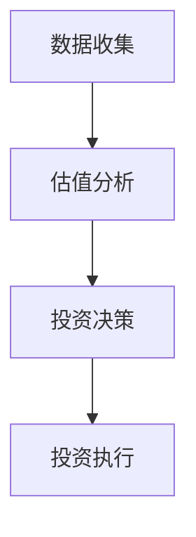
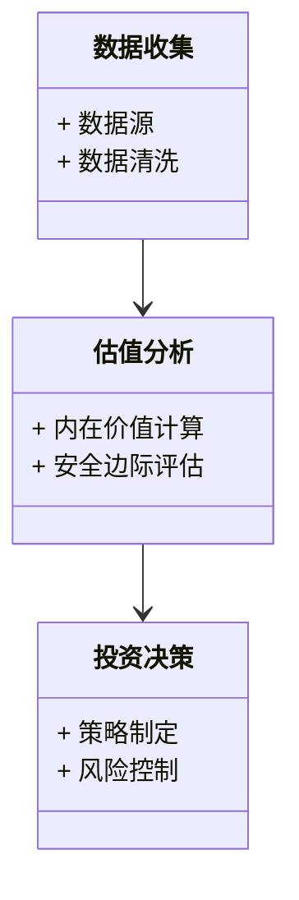

                 


# 塞斯·卡拉曼的特殊情况投资技巧

> 关键词：塞斯·卡拉曼，特殊情况投资，安全边际，逆向思维，价值投资，投资策略，投资系统，投资决策，投资模型

> 摘要：本文将深入探讨塞斯·卡拉曼的特殊情况投资技巧，分析其背后的理论基础、数学模型和系统架构。通过详细讲解安全边际、逆向思维等核心概念，结合实际案例和系统设计，为读者提供一套完整的投资方法论。

---

## 第一部分：特殊情况投资的背景与核心概念

### 第1章：特殊情况投资的起源与重要性

#### 1.1 价值投资与特殊情况投资的起源
- **价值投资的定义**：价值投资是一种以低于其内在价值的价格购买优质股票的投资策略，由本杰明·格雷厄姆和戴维·多德提出。
- **特殊情况投资的提出**：塞斯·卡拉曼在格雷厄姆的价值投资基础上，进一步发展了特殊情况投资技巧，强调在市场恐慌或特殊情况下寻找被低估的投资机会。
- **特殊情况投资的重要性**：在市场波动加剧的今天，特殊情况投资能够帮助投资者在危机中发现价值，实现超额收益。

#### 1.2 特殊情况投资的核心概念
- **安全边际**：安全边际是指投资标的市场价与内在价值之间的差距，是价值投资中控制风险的重要工具。
- **逆向思维**：在市场恐慌时买入，在市场狂热时卖出，逆向思维是特殊情况投资的核心策略。
- **市场情绪与投资者心理**：分析市场情绪和投资者心理，是判断市场是否处于特殊情况的重要依据。

#### 1.3 本书的核心目标与读者群体
- **核心目标**：通过系统化的方法，帮助投资者掌握塞斯·卡拉曼的特殊投资技巧，能够在市场波动中找到优质投资标的。
- **读者群体**：适合有一定投资经验，希望深入理解价值投资和特殊情况投资的投资者。
- **结构安排**：本文将从理论、模型、系统架构到实战案例，全面讲解特殊情况投资技巧。

---

### 第2章：特殊情况投资的核心原理

#### 2.1 投资的基本原理
- **投资的定义与分类**：投资是通过配置资金以获得收益的行为，分为股票、债券、房地产等多种形式。
- **资产定价的理论基础**：资产的内在价值是其未来现金流的现值，由市场参与者的预期和风险偏好决定。
- **投资风险与收益的平衡**：高收益通常伴随着高风险，投资者需要在收益与风险之间找到平衡点。

#### 2.2 塞斯·卡拉曼的特殊投资技巧
- **安全边际的数学模型**：安全边际 = 市场价 - 内在价值。
- **逆向思维的投资策略**：在市场底部买入，在市场顶部卖出。
- **特殊情况下的估值方法**：通过分析公司财务数据、行业地位和未来前景，评估其内在价值。

#### 2.3 特殊情况投资的数学模型
- **内在价值计算公式**：
  $$ V = \frac{CF}{r - g} $$
  其中，\( V \) 为内在价值，\( CF \) 为现金流，\( r \) 为折现率，\( g \) 为增长率。
- **安全边际计算公式**：
  $$ \text{Margin of Safety} = P_{\text{市场价}} - P_{\text{内在价值}} $$

---

### 第3章：特殊情况投资的系统架构

#### 3.1 投资决策系统的模块划分
- **数据收集模块**：收集市场数据、公司财务数据等。
- **估值分析模块**：计算内在价值、评估安全边际。
- **投资决策模块**：根据分析结果制定投资策略。

#### 3.2 系统架构的Mermaid图


#### 3.3 系统功能设计的Mermaid图


---

### 第4章：特殊情况投资的实战案例

#### 4.1 案例分析：XYZ公司的投资决策
- **案例背景介绍**：XYZ公司是一家处于困境中的企业，市场价远低于其内在价值。
- **数据收集与分析**：收集XYZ公司的财务数据，计算其内在价值和安全边际。
- **估值模型的应用**：通过内在价值公式计算XYZ公司的合理价格，评估其安全边际。
- **投资决策的执行**：基于分析结果，制定买入策略。

#### 4.2 投资决策系统的Python实现
- **环境安装与配置**：
  ```python
  import numpy as np
  import pandas as pd
  ```
- **核心代码实现**：
  ```python
  def calculate_intrinsic_value(cash_flow, required_return, growth_rate):
      return cash_flow / (required_return - growth_rate)
  ```

---

### 第5章：特殊情况投资的最佳实践

#### 5.1 投资策略的优化与调整
- **风险管理**：设置止损点，控制投资组合的风险。
- **持续学习**：关注市场动态，不断优化投资策略。

#### 5.2 小结与注意事项
- **小结**：塞斯·卡拉曼的特殊投资技巧是一种在市场波动中寻找价值的投资方法，强调安全边际和逆向思维。
- **注意事项**：投资者需具备扎实的财务分析能力，能够在市场恐慌时保持冷静。

#### 5.3 拓展阅读
- 推荐阅读《证券分析》（本杰明·格雷厄姆）、《投资的艺术》（塞斯·卡拉曼）。

---

## 作者：AI天才研究院 & 禅与计算机程序设计艺术

---

以上是《塞斯·卡拉曼的特殊情况投资技巧》的技术博客文章的完整内容。

