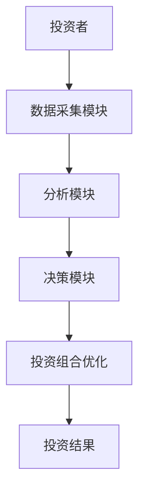

                 


# 塞斯·卡拉曼的特殊情况投资：寻找市场忽视的机会

## 关键词：特殊情况投资, 逆向思维, 安全边际, 市场忽视机会, 卡拉曼投资方法

## 摘要：  
塞斯·卡拉曼是一位著名的投资专家，专注于寻找市场忽视的机会。本文将深入探讨他的特殊情况投资理念，分析其核心概念、策略和方法，结合实际案例，帮助读者理解如何通过逆向思维和安全边际来寻找投资机会。本文将从背景介绍、核心概念、算法原理、系统设计、项目实战等多个维度展开，全面解析卡拉曼的特殊情况投资方法。

---

## 第一部分: 特殊情况投资的背景与核心概念

### 第1章: 特殊情况投资的定义与特点

#### 1.1 什么是特殊情况投资  
特殊情况投资是指在市场中寻找那些被忽视、低估或被市场冷落的投资机会。这些机会通常具有独特的商业模式、财务状况或市场环境，但因为某些原因被市场忽视。  

#### 1.2 特殊情况投资的核心特征  
- **低估性**：资产的市场价值低于其内在价值。  
- **独特性**：具有独特的商业模式或竞争优势。  
- **周期性**：通常出现在市场周期的低谷或转折点。  
- **逆向性**：与市场主流趋势相反，需要逆向思维。  

#### 1.3 塞斯·卡拉曼的投资理念  
塞斯·卡拉曼认为，市场往往过于关注热门行业或被广泛认可的机会，而忽视了一些具有长期潜力但暂时被低估的机会。他强调通过逆向思维和深入分析，找到这些被市场忽视的机会。

### 第2章: 市场忽视的机会

#### 2.1 市场忽视的机会的特征  
- **低估值**：资产的市场价格远低于其内在价值。  
- **非热门行业**：投资领域不是市场的热点，因此容易被忽视。  
- **复杂性**：商业模式或财务状况较为复杂，需要深入分析。  

#### 2.2 为什么市场会忽视这些机会  
- **信息不对称**：市场参与者对某些领域的信息掌握不全。  
- **情绪化决策**：投资者往往受到市场情绪的影响，倾向于关注热门领域。  
- **认知偏差**：人们倾向于关注自己熟悉的事物，忽视陌生领域的机会。  

#### 2.3 如何识别市场忽视的机会  
- **行业分析**：研究冷门行业，寻找潜在的市场机会。  
- **财务分析**：通过财务报表识别低估资产。  
- **竞争优势分析**：寻找具有独特竞争优势的企业。  

---

## 第二部分: 特殊情况投资的核心概念与方法

### 第3章: 逆向思维在投资中的应用

#### 3.1 逆向思维的定义  
逆向思维是指在市场普遍看空时买入，市场普遍看多时卖出。这种方法需要投资者具备独立思考的能力，不被市场情绪左右。

#### 3.2 逆向思维的优势  
- **低买高卖**：通过逆向思维，投资者可以在市场低点买入，高点卖出。  
- **发现低估机会**：市场忽视的机会通常具有低估的特征，适合逆向投资。  

#### 3.3 逆向思维的挑战  
- **市场波动**：逆向投资需要承受较大的市场波动风险。  
- **信息不足**：市场忽视的机会往往缺乏足够的信息支持。  
- **心理压力**：逆向投资需要投资者在市场恐慌时保持冷静。  

### 第4章: 安全边际的概念与应用

#### 4.1 安全边际的定义  
安全边际是指资产的市场价格低于其内在价值的部分。通过安全边际，投资者可以降低投资风险，确保投资的稳定性。

#### 4.2 安全边际的计算  
安全边际 = 内在价值 - 市场价格  

#### 4.3 安全边际的重要性  
- **降低风险**：通过安全边际，投资者可以确保在市场波动时不会出现重大损失。  
- **增加收益**：当市场价格回归内在价值时，投资者可以获得超额收益。  

---

## 第三部分: 特殊情况投资的算法与模型

### 第5章: 卡拉曼投资模型的数学原理

#### 5.1 卡拉曼投资模型的概述  
卡拉曼投资模型是一种基于逆向思维和安全边际的投资策略，通过分析资产的内在价值和市场价格，寻找被市场忽视的机会。

#### 5.2 卡拉曼投资模型的数学公式  
$$ \text{安全边际} = \text{内在价值} - \text{市场价格} $$  

#### 5.3 卡拉曼投资模型的步骤  
1. **分析内在价值**：通过财务分析和行业研究，确定资产的内在价值。  
2. **评估市场价格**：收集市场数据，确定资产的市场价格。  
3. **计算安全边际**：比较内在价值和市场价格，计算安全边际。  
4. **投资决策**：根据安全边际的大小，决定是否投资。  

### 第6章: 投资组合优化的算法实现

#### 6.1 投资组合优化的定义  
投资组合优化是指通过合理配置资产，最大化收益并最小化风险。  

#### 6.2 投资组合优化的数学模型  
$$ \text{目标函数：最大化收益或最小化风险} $$  
$$ \text{约束条件：资产配置比例，风险承受能力} $$  

#### 6.3 投资组合优化的算法实现  
使用Python优化库（如scipy）进行投资组合优化的实现，代码示例如下：  

```python
import numpy as np
from scipy.optimize import minimize

# 示例：优化投资组合
def objective(x):
    return -np.mean(x * np.array([0.1, 0.2, 0.15]))  # 最大化期望收益

constraints = [{'type': 'eq', 'fun': lambda x: sum(x) - 1}]
bounds = [(0, 1), (0, 1), (0, 1)]

result = minimize(objective, [1/3, 1/3, 1/3], method='SLSQP', constraints=constraints, bounds=bounds)
print("最优配置:", result.x)
```

---

## 第四部分: 系统分析与架构设计

### 第7章: 投资系统的功能设计

#### 7.1 投资系统的模块划分  
- **数据采集模块**：收集市场数据。  
- **分析模块**：分析资产的内在价值和市场价格。  
- **决策模块**：根据分析结果做出投资决策。  

#### 7.2 系统架构设计  
使用Mermaid图展示系统架构：  



---

## 第五部分: 项目实战与案例分析

### 第8章: 特殊情况投资的实战案例

#### 8.1 案例背景  
假设某公司因行业低迷导致股价被低估，但其财务状况良好，具有竞争优势。

#### 8.2 分析过程  
1. **财务分析**：计算公司的内在价值。  
2. **市场价格分析**：确定当前股价低于内在价值。  
3. **安全边际计算**：计算安全边际，决定投资。  

#### 8.3 投资结果  
通过逆向思维和安全边际分析，投资者在市场低点买入，获得超额收益。

### 第9章: 投资组合的优化与调整

#### 9.1 投资组合的优化  
根据市场变化和资产表现，动态调整投资组合，确保收益与风险的平衡。  

#### 9.2 投资组合的调整策略  
- **定期审查**：每隔一段时间审查投资组合，调整配置。  
- **风险控制**：根据市场波动，调整风险敞口。  

---

## 第六部分: 总结与展望

### 第10章: 总结与展望

#### 10.1 总结  
塞斯·卡拉曼的特殊情况投资方法通过逆向思维和安全边际分析，帮助投资者找到市场忽视的机会，实现超额收益。  

#### 10.2 展望  
随着市场的发展和技术的进步，特殊情况投资将更加依赖于数据驱动的分析和人工智能技术的支持，未来将有更多机会被发现和利用。

---

## 作者：AI天才研究院/AI Genius Institute & 禅与计算机程序设计艺术 /Zen And The Art of Computer Programming

