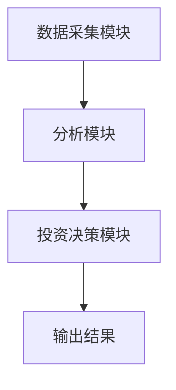
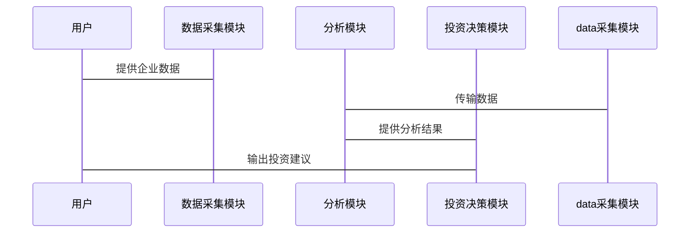

                 


# 塞斯·卡拉曼的破产重组投资策略

> 关键词：破产重组，投资策略，塞斯·卡拉曼，安全边际，价值投资，风险管理

> 摘要：本文详细探讨了塞斯·卡拉曼的破产重组投资策略，从其核心理念、数学模型到系统架构和项目实战，全面解析其成功的关键因素。文章通过逐步分析，帮助读者理解如何在复杂的金融市场中运用这些策略，实现稳健的投资回报。

---

## 第一部分: 破产重组投资策略的背景与基础

### 第1章: 破产重组的基本概念

#### 1.1 企业破产的定义与类型
企业破产是指企业无法偿还债务，法院根据相关法律程序对其进行清算或重组的过程。破产通常分为两种类型：自愿破产和非自愿破产。自愿破产是由企业主动申请，而非自愿破产则是由债权人申请。

#### 1.2 破产重组的定义与目的
破产重组是指在企业破产的情况下，通过调整债务结构、优化资产配置和改善经营状况，使企业能够恢复偿债能力的过程。其目的是避免企业破产清算，保护债权人和股东的权益，同时为企业的重生创造条件。

#### 1.3 破产重组与破产清算的区别
- **破产清算**：将企业资产变现，按照法定顺序分配给债权人，企业终止经营。
- **破产重组**：通过债务调整和资产重组，使企业恢复经营能力，避免终止。

### 第2章: 塞斯·卡拉曼的投资哲学

#### 2.1 卡拉曼投资策略的核心理念
塞斯·卡拉曼是20世纪著名的投资家，以破产重组投资闻名。他的核心理念包括：
- **安全边际**：通过购买被市场低估的资产，确保投资的安全性。
- **三重过滤法**：通过财务状况、行业地位和管理层质量三个维度筛选投资标的。
- **长期视角**：关注企业的长期价值，而非短期波动。

#### 2.2 投资哲学的形成背景
卡拉曼的投资哲学形成于20世纪美国经济动荡时期，他通过研究破产法和企业重组案例，总结出一套独特的方法，帮助投资者在危机中寻找机会。

#### 2.3 破产重组投资的独特性
- 破产重组投资通常涉及复杂的企业结构和法律程序。
- 需要深入分析企业的财务状况和市场环境。
- 投资回报率高，但风险也较大。

---

## 第二部分: 破产重组投资的核心要素

### 第3章: 破产重组中的关键因素

#### 3.1 财务状况分析
- **流动比率**：衡量企业的短期偿债能力。
- **资产负债率**：评估企业的债务负担。
- **息税折旧及摊销前利润（EBITDA）**：反映企业的经营效率。

#### 3.2 债务结构优化
- **债务重组**：调整债务期限和利率，减轻企业的财务压力。
- **债转股**：将债务转化为股权，改善企业的资本结构。

#### 3.3 股东权益保护
- **股东权益比率**：衡量股东在企业资产中的份额。
- **股东价值最大化**：通过重组实现股东权益的最大化。

### 第4章: 投资策略的实施步骤

#### 4.1 策略制定
- **目标设定**：明确投资目标和风险承受能力。
- **市场分析**：研究市场趋势和企业状况。
- **资产配置**：根据目标分配资产。

#### 4.2 资产评估
- **资产价值评估**：使用DCF模型等方法评估企业价值。
- **风险评估**：识别潜在风险并制定应对策略。

#### 4.3 投资组合管理
- **分散投资**：降低投资风险。
- **定期调整**：根据市场变化优化投资组合。

---

## 第三部分: 破产重组投资的数学模型与分析

### 第5章: 破产重组的数学模型

#### 5.1 破产概率的计算公式
$$
\text{破产概率} = \frac{\text{债务总额}}{\text{资产净值}}
$$

#### 5.2 资产价值的评估公式
$$
\text{资产价值} = \text{未来现金流的现值}
$$

#### 5.3 投资回报率的计算
$$
\text{投资回报率} = \frac{\text{净收益}}{\text{初始投资}} \times 100\%
$$

### 第6章: 投资组合优化的数学分析

#### 6.1 现代投资组合理论简介
现代投资组合理论强调通过分散投资降低风险，实现收益最大化。

#### 6.2 破产重组投资的风险评估
使用VaR（在险价值）模型评估投资组合的风险。

#### 6.3 投资组合的优化策略
通过均值-方差优化模型，找到最优资产配置。

---

## 第四部分: 破产重组投资的系统架构与实现

### 第7章: 系统架构设计

#### 7.1 系统功能模块划分
- 数据采集模块：收集企业财务数据。
- 分析模块：进行财务分析和风险评估。
- 投资决策模块：制定投资策略。

#### 7.2 系统架构图（Mermaid）


### 第8章: 系统接口设计

#### 8.1 数据接口定义
- 输入接口：接收企业财务数据。
- 输出接口：输出分析结果和投资建议。

#### 8.2 系统交互流程（Mermaid）


---

## 第五部分: 项目实战

### 第9章: 环境安装与核心代码实现

#### 9.1 环境安装
安装Python和必要的库（如Pandas、NumPy）。

#### 9.2 核心代码实现
```python
import pandas as pd
import numpy as np

def calculate_bankruptcy_probability(debt, assets):
    return debt / assets

data = pd.DataFrame({
    '公司': ['A', 'B', 'C'],
    '债务': [100, 200, 150],
    '资产': [150, 250, 200]
})

data['破产概率'] = data.apply(lambda x: calculate_bankruptcy_probability(x['债务'], x['资产']), axis=1)
print(data)
```

#### 9.3 代码解读与分析
- 使用Pandas处理数据，计算破产概率。
- 通过数据可视化工具（如Matplotlib）进一步分析结果。

### 第10章: 实际案例分析

#### 10.1 案例背景
某制造企业因债务过高面临破产，通过重组优化债务结构，恢复经营。

#### 10.2 案例分析
- 财务状况分析：流动比率低，资产负债率高。
- 重组措施：债务重组和债转股。
- 投资回报：重组后企业价值提升，投资者获得超额收益。

---

## 第六部分: 最佳实践与总结

### 第11章: 最佳实践

#### 11.1 小结
破产重组投资需要深入分析企业的财务状况和市场环境，结合安全边际和长期视角制定策略。

#### 11.2 注意事项
- 风险控制：避免过度杠杆和集中投资。
- 法律合规：确保投资行为符合相关法律法规。

#### 11.3 拓展阅读
推荐阅读卡拉曼的经典著作《安全边际》和破产法相关书籍。

---

## 作者：AI天才研究院/AI Genius Institute & 禅与计算机程序设计艺术 /Zen And The Art of Computer Programming

