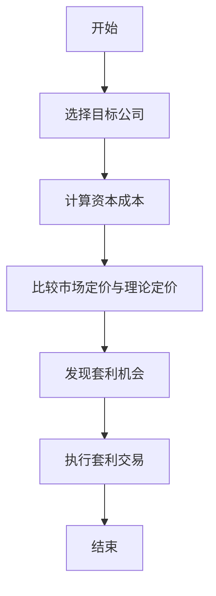
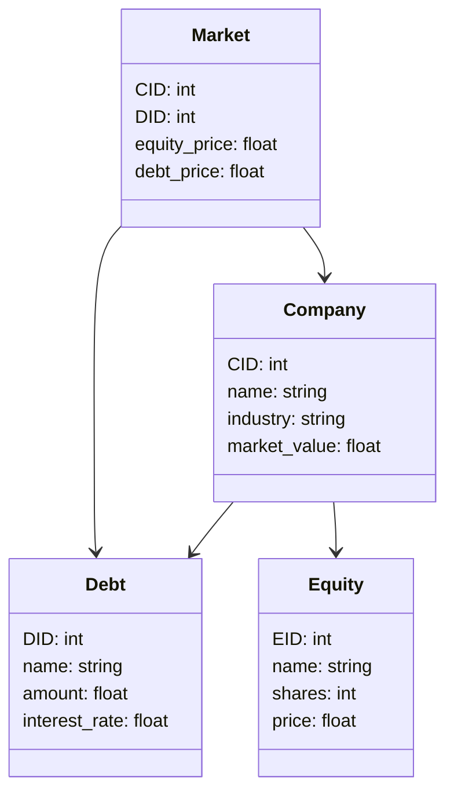

                 


# 塞斯·卡拉曼的资本结构套利策略

> **关键词**：资本结构套利、塞斯·卡拉曼、金融套利、风险管理、投资策略、数学模型  
> **摘要**：本文详细探讨了塞斯·卡拉曼的资本结构套利策略，从背景介绍、核心概念、算法原理、数学模型到系统设计、项目实战及最佳实践，结合实际案例分析，深入剖析了该策略的原理与应用。

---

## 第一部分：资本结构套利的背景与基础

### 第1章：资本结构套利的背景与问题背景

#### 1.1 资本结构套利的背景

**1.1.1 什么是资本结构套利**  
资本结构套利是一种利用公司资本结构差异进行投资的策略。通过分析不同公司或同一公司不同债务和股权比例的变化，寻找市场定价错误的机会，从而获利。

**1.1.2 资本结构套利的起源与发展**  
资本结构套利起源于20世纪60年代的资本资产定价模型（CAPM），并在20世纪80年代随着期权定价模型的发展而逐步成熟。近年来，随着金融市场的发展，资本结构套利已成为机构投资者的重要策略之一。

**1.1.3 当前资本市场的套利机会**  
当前市场中，由于信息不对称、市场效率不足或公司管理问题，资本结构套利仍存在大量机会。例如，当一家公司债务过高或过低时，套利者可以通过调整债务和股权比例来获利。

#### 1.2 问题背景与问题描述

**1.2.1 资本结构优化的必要性**  
资本结构优化是公司财务管理的核心问题之一。合理的资本结构可以降低资本成本，提高公司价值。

**1.2.2 套利机会的识别与捕捉**  
套利者需要识别市场中资本结构定价错误的机会，并及时介入以获取利润。

**1.2.3 资本结构套利中的常见问题**  
资本结构套利面临的主要问题包括信息不对称、市场流动性不足、交易成本高昂等。

#### 1.3 问题解决与边界条件

**1.3.1 资本结构套利的核心目标**  
通过调整资本结构，利用市场定价错误，实现超额收益。

**1.3.2 解决方案的边界与限制**  
套利方案的边界包括市场流动性、交易成本、法律法规限制等。

**1.3.3 相关概念的外延与内涵**  
资本结构套利与资本资产定价模型（CAPM）、期权定价模型等密切相关。

---

## 第二部分：资本结构套利的核心概念与联系

### 第2章：资本结构套利的核心原理

#### 2.1 核心原理分析

**2.1.1 资本结构套利的基本原理**  
套利者通过分析公司资本结构，寻找市场定价错误，利用套利机会获利。

**2.1.2 套利机会的数学模型**  
套利机会可以通过数学模型进行量化分析。例如，利用CAPM模型计算资本成本，比较市场定价与理论定价的差异。

**2.1.3 资本结构优化的数学模型**  
资本结构优化可以通过动态规划或非线性优化模型进行求解。

#### 2.2 核心概念对比

**2.2.1 不同资本结构套利方法的对比**  
包括杠杆套利、股权套利、债券套利等方法的对比。

**2.2.2 套利与投机的对比**  
套利是基于市场定价错误的无风险或低风险投资，而投机是基于市场趋势的高风险投资。

**2.2.3 长期与短期套利策略的对比**  
长期套利注重资本结构的长期优化，短期套利则关注短期市场波动。

#### 2.3 ER实体关系图

通过ER图分析资本结构套利中的实体关系，包括公司、债务、股权、市场等核心实体及其关系。

```mermaid
er
  company(CID, name, industry, market_value)
  debt(DID, name, amount, interest_rate)
  equity(EID, name, shares, price)
  market(CID, DID, equity_price, debt_price)
```

---

## 第三部分：资本结构套利的算法原理

### 第3章：资本结构套利的算法流程

#### 3.1 算法流程图



#### 3.2 算法实现代码

```python
def calculate_capital_cost(company_data):
    # 输入：公司数据，包括债务和股权信息
    # 输出：资本成本
    return company_data['debt_cost'] * (1 - company_data['tax_rate']) + company_data['equity_cost']

def arbitrage_strategy(company_list):
    for company in company_list:
        theoretical_cost = calculate_capital_cost(company)
        market_cost = company['market_cost']
        if theoretical_cost < market_cost:
            return company
    return None
```

---

## 第四部分：资本结构套利的数学模型与公式

### 第4章：资本结构套利的数学模型

#### 4.1 基本公式

资本资产定价模型（CAPM）：
$$ E(r_i) = r_f + \beta_i (E(r_m) - r_f) $$

其中：
- \( E(r_i) \)：资产 \( i \) 的期望收益率
- \( r_f \)：无风险利率
- \( \beta_i \)：资产 \( i \) 的贝塔系数
- \( E(r_m) \)：市场期望收益率

---

## 第五部分：系统分析与架构设计方案

### 第5章：系统功能设计

#### 5.1 问题场景介绍

套利系统需要实时监控市场数据，分析公司资本结构，识别套利机会。

#### 5.2 系统功能设计



---

## 第六部分：项目实战

### 第6章：环境安装与核心代码实现

#### 6.1 环境安装

需要安装Python、Pandas、NumPy等库。

#### 6.2 核心代码实现

```python
import pandas as pd
import numpy as np

def calculate_arbitrage_opportunity(dataframe):
    # 计算理论资本成本
    theoretical_cost = dataframe['debt_cost'] * (1 - dataframe['tax_rate']) + dataframe['equity_cost']
    # 比较理论成本与市场成本
    dataframe['arbitrage_opportunity'] = theoretical_cost < dataframe['market_cost']
    return dataframe

# 示例数据
data = {
    'company': ['A', 'B', 'C'],
    'debt_cost': [0.05, 0.06, 0.04],
    'tax_rate': [0.2, 0.25, 0.15],
    'equity_cost': [0.1, 0.15, 0.08],
    'market_cost': [0.07, 0.08, 0.06]
}
df = pd.DataFrame(data)
result = calculate_arbitrage_opportunity(df)
print(result)
```

---

## 第七部分：最佳实践与小结

### 第7章：总结与注意事项

#### 7.1 最佳实践

- 定期监控市场数据，及时调整套利策略。
- 注意市场流动性风险，避免大额交易导致的价格冲击。
- 合规操作，遵守相关法律法规。

#### 7.2 小结

资本结构套利是一种有效的投资策略，但需要结合市场实际情况，灵活调整策略。

#### 7.3 注意事项

- 风险管理是套利策略的核心。
- 选择合适的套利工具和市场环境。

#### 7.4 拓展阅读

推荐阅读塞斯·卡拉曼的《投资学》和相关金融数学教材。

---

**作者：AI天才研究院/AI Genius Institute & 禅与计算机程序设计艺术 /Zen And The Art of Computer Programming**

