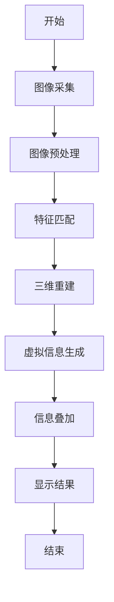
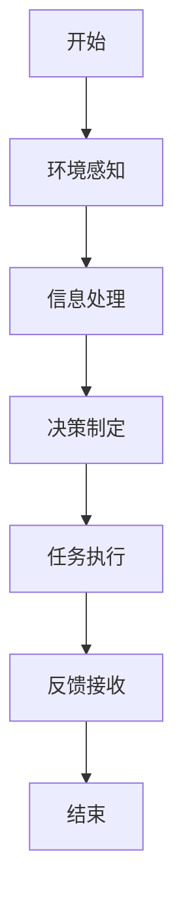
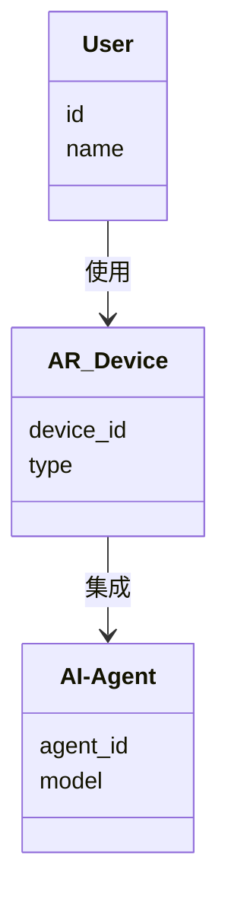
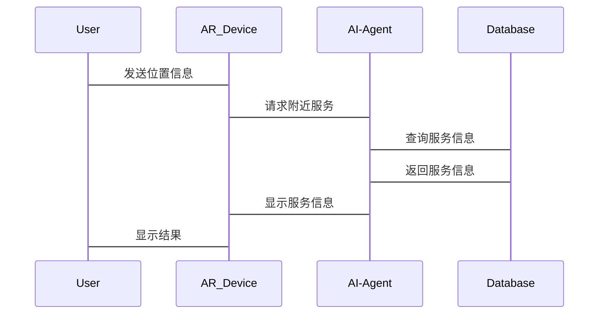

                 


# 增强现实技术与AI Agent的结合

## 关键词
- 增强现实（AR）
- AI Agent
- 技术结合
- 系统设计
- 实际应用

## 摘要
本文探讨了增强现实（AR）与人工智能代理（AI Agent）的结合，分析了两者的概念、原理、算法和技术架构。通过实际案例分析，展示了如何将AR与AI Agent结合，设计了一个基于位置的智能助手系统。本文适合对AR和AI Agent感兴趣的开发者和研究人员阅读。

---

## 第一部分: 增强现实技术与AI Agent的背景介绍

### 第1章: 增强现实技术与AI Agent的背景介绍

#### 1.1 增强现实技术的核心概念
- **定义与特点**：增强现实是一种通过计算机生成的数字信息叠加在真实世界中的技术，具有实时性、交互性和沉浸性的特点。
- **关键技术**：包括图像识别、定位追踪、三维重建和用户交互技术。
- **应用场景**：广泛应用于游戏、教育、医疗和工业等领域。

#### 1.2 AI Agent的核心概念
- **定义与特点**：AI Agent是一种能够感知环境、自主决策并执行任务的智能体，具有自主性、反应性和目标性。
- **分类与功能**：分为简单反射型、基于模型推理型、目标驱动型和实用驱动型，功能包括信息处理、决策制定和任务执行。
- **应用领域**：广泛应用于自动驾驶、智能助手和机器人控制等领域。

#### 1.3 增强现实与AI Agent的结合背景
- **结合意义**：通过结合AR和AI Agent，可以实现更智能的交互和更高效的决策，提升用户体验。
- **技术发展趋势**：随着深度学习和计算机视觉的发展，AR与AI Agent的结合越来越紧密。
- **创新机会**：在教育、医疗和工业等领域，AR与AI Agent的结合为用户提供更智能化的服务。

---

## 第二部分: 增强现实与AI Agent的核心概念与联系

### 第2章: 增强现实与AI Agent的核心概念与联系

#### 2.1 核心概念原理
- **增强现实的实现原理**：通过摄像头捕捉环境，利用计算机视觉技术进行图像识别和三维重建，将虚拟信息叠加在真实环境中。
- **AI Agent的工作原理**：通过感知环境信息，利用算法进行分析和决策，执行相应的任务。
- **协同机制**：AI Agent负责处理环境信息和决策，AR技术负责将决策结果以视觉形式呈现。

#### 2.2 概念属性特征对比
| 特性         | 增强现实（AR）           | AI Agent            |
|--------------|--------------------------|----------------------|
| 定义         | 数字信息叠加在真实环境   | 能感知环境的智能体   |
| 核心技术     | 图像识别、三维重建       | 机器学习、决策算法 |
| 应用场景     | 游戏、教育、医疗         | 自动驾驶、智能助手 |

#### 2.3 ER实体关系图架构
```mermaid
erDiagram
    user {
        id : integer
        name : string
    }
    ar_device {
        device_id : integer
        type : string
    }
    ai_agent {
        agent_id : integer
        model : string
    }
    user -> ar_device : 使用
    ar_device -> ai_agent : 集成
```

---

## 第三部分: 增强现实与AI Agent的算法原理讲解

### 第3章: 增强现实与AI Agent的算法原理讲解

#### 3.1 增强现实算法流程


#### 3.2 AI Agent算法流程


#### 3.3 数学公式
- 图像识别中的特征匹配：使用SIFT算法，特征点坐标为$(x_i, y_i)$。
- 三维重建中的点云表示：使用点云数据$P = \{p_1, p_2, ..., p_n\}$，其中$p_i = (x_i, y_i, z_i)$。

---

## 第四部分: 系统分析与架构设计方案

### 第4章: 系统分析与架构设计方案

#### 4.1 问题场景介绍
- **项目介绍**：设计一个基于位置的智能助手系统，利用AR技术显示附近的服务信息，并通过AI Agent进行信息检索和决策。

#### 4.2 系统功能设计


#### 4.3 系统架构设计


#### 4.4 系统接口设计
- **用户接口**：通过手机应用程序发送位置信息。
- **系统接口**：AR设备与AI Agent之间的通信接口。

#### 4.5 系统交互流程


---

## 第五部分: 项目实战

### 第5章: 项目实战

#### 5.1 环境安装
- 安装Python和相关库（如OpenCV、TensorFlow）。
- 安装AR开发框架（如ARKit、ARCore）。

#### 5.2 系统核心实现源代码
```python
# AR部分
import cv2
def ar_process(image):
    # 图像预处理
    gray = cv2.cvtColor(image, cv2.COLOR_BGR2GRAY)
    # 特征匹配
    sift = cv2.SIFT_create()
    kp, des = sift.detectAndCompute(gray, None)
    return kp, des

# AI Agent部分
import tensorflow as tf
def ai_agent_decision(input_data):
    model = tf.keras.Sequential()
    model.add(tf.keras.layers.Dense(128, activation='relu', input_dim=64))
    model.add(tf.keras.layers.Dense(10, activation='softmax'))
    model.compile(optimizer='adam', loss='sparse_categorical_crossentropy', metrics=['accuracy'])
    return model.predict(input_data)
```

#### 5.3 代码应用解读与分析
- AR部分使用SIFT算法进行特征匹配，AI Agent部分使用深度学习模型进行分类决策。
- 系统通过API接口进行通信，实现数据的传递和处理。

#### 5.4 实际案例分析
- **案例分析**：用户在特定位置使用AR设备，AI Agent根据位置信息检索附近的服务，并通过AR技术显示给用户。

#### 5.5 项目小结
- 通过实际项目，展示了AR与AI Agent结合的实现过程和技术细节。

---

## 第六部分: 总结

### 第6章: 总结

#### 6.1 最佳实践 Tips
- 在开发过程中，注意数据的实时性和准确性。
- 合理选择算法和框架，确保系统的性能和稳定性。

#### 6.2 小结
- 本文详细讲解了AR与AI Agent的结合，从概念到实现，全面分析了技术细节和实际应用。

#### 6.3 注意事项
- 确保系统的安全性和隐私保护。
- 在实际应用中，考虑硬件设备的兼容性和用户体验。

#### 6.4 拓展阅读
- 推荐阅读《增强现实技术与应用》和《人工智能代理设计与实现》。

---

## 作者

作者：AI天才研究院/AI Genius Institute & 禅与计算机程序设计艺术 /Zen And The Art of Computer Programming

--- 

希望这篇文章能为您提供有价值的信息和启发！

