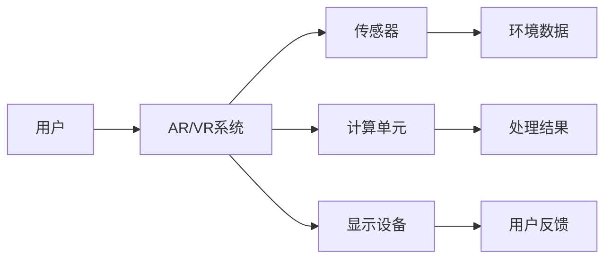
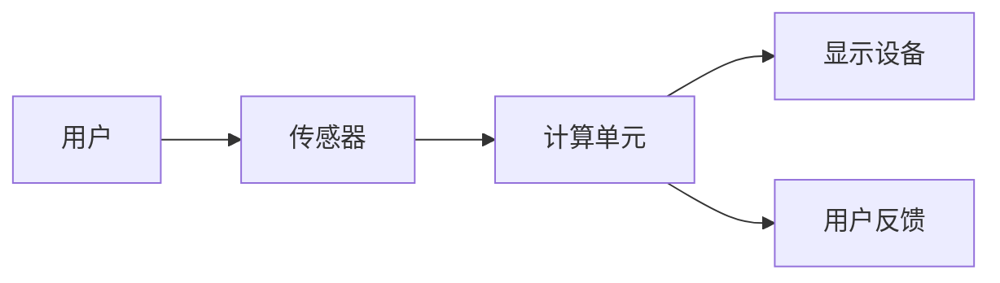

                 


# 增强现实（AR）和虚拟现实（VR）技术的商业化与投资前景

## 关键词：增强现实，虚拟现实，商业化，投资前景，技术应用，市场分析

## 摘要

本文深入探讨了增强现实（AR）和虚拟现实（VR）技术的商业化应用及其投资前景。通过分析AR和VR技术的核心概念、算法原理、系统架构和典型应用场景，结合当前市场趋势和未来预测，为读者提供了全面的行业洞察。文章还总结了投资策略和最佳实践，帮助投资者把握AR和VR技术的商业机会。

---

# 第一部分: 增强现实（AR）和虚拟现实（VR）技术的商业化与投资前景概述

## 第1章: 增强现实（AR）和虚拟现实（VR）技术的背景介绍

### 1.1 增强现实（AR）和虚拟现实（VR）的定义与区别

#### 1.1.1 增强现实（AR）的定义

增强现实（AR）是一种将虚拟信息叠加到真实环境中的技术，通过计算机视觉、传感器和显示技术，将数字信息与物理世界结合，提供沉浸式的体验。例如，手机上的AR游戏或购物应用中的虚拟试衣功能。

#### 1.1.2 虚拟现实（VR）的定义

虚拟现实（VR）是一种通过计算机生成的模拟环境，用户通过佩戴头显设备，完全沉浸在一个虚拟的世界中，与之交互。例如，VR游戏和虚拟培训系统。

#### 1.1.3 AR与VR的核心区别

| **特性**       | **AR**                  | **VR**                  |
|-----------------|-------------------------|-------------------------|
| 体验类型         | 混合现实，部分虚拟元素叠加在真实环境中 | 完全虚拟环境，与现实无直接关联 |
| 用户感知         | 用户仍感知真实环境       | 用户完全沉浸在虚拟环境中 |
| 应用场景         | 教育、购物、导航、游戏等 | 游戏、培训、虚拟会议等 |

---

### 1.2 AR和VR技术的发展历程

#### 1.2.1 AR技术的发展历史

AR技术起源于20世纪60年代，早期主要用于军事和科研领域。随着计算机图形学和传感器技术的进步，AR逐渐应用于民用领域，如教育、医疗和游戏。

#### 1.2.2 VR技术的发展历史

VR技术的历史可以追溯到20世纪60年代，但直到近年来随着Oculus等公司的崛起，VR技术才得以广泛应用。VR技术在游戏、教育和虚拟现实培训中的应用日益广泛。

#### 1.2.3 AR和VR技术的融合趋势

随着技术的进步，AR和VR正在逐步融合，产生混合现实（MR）技术，进一步扩展了应用场景，如工业设计和远程协作。

---

### 1.3 AR和VR技术的商业化现状

#### 1.3.1 当前AR和VR技术的主要应用场景

- **教育领域**：AR和VR技术用于虚拟实验室、虚拟课堂等。
- **娱乐领域**：AR游戏（如《Pokemon Go》）和VR游戏。
- **医疗领域**：AR辅助手术规划，VR用于医学培训。
- **零售领域**：AR虚拟试衣、VR虚拟购物体验。
- **工业领域**：AR用于设备维护，VR用于产品设计和培训。

#### 1.3.2 AR和VR技术的商业化模式

- **硬件销售**：销售AR和VR设备，如 Oculus 头显、Microsoft HoloLens 等。
- **软件服务**：提供AR和VR应用开发服务，如教育、培训和游戏内容。
- **广告与营销**：利用AR和VR技术进行品牌推广和产品展示。

#### 1.3.3 AR和VR技术的市场现状与未来趋势

当前，AR和VR市场增长迅速，预计未来几年将保持高速发展的趋势。随着技术成熟和成本降低，AR和VR将更加普及，应用领域也将进一步扩展。

---

### 1.4 AR和VR技术的市场分析

#### 1.4.1 全球AR和VR市场的规模与增长

根据市场研究机构的数据，2023年全球AR和VR市场规模约为 $X 亿美元，预计未来几年将以年均 $X% 的速度增长。

#### 1.4.2 主要国家和地区市场的特点

- **美国**：技术创新和市场需求旺盛，拥有许多领先的AR和VR公司。
- **中国**：市场增长迅速，政府支持和政策鼓励推动行业发展。
- **欧洲**：注重工业应用和教育培训领域的应用。

#### 1.4.3 AR和VR技术的未来市场潜力

随着技术的进步和应用场景的扩展，AR和VR市场将呈现指数级增长。特别是在教育、医疗和工业领域，AR和VR技术将发挥更大的作用。

---

## 第2章: AR和VR技术的核心概念与原理

### 2.1 AR和VR技术的核心概念

#### 2.1.1 AR的核心概念

AR通过将数字信息叠加到物理世界中，提供增强的用户体验。其核心技术包括计算机视觉、传感器技术和实时渲染。

#### 2.1.2 VR的核心概念

VR通过创建一个完全虚拟的环境，使用户沉浸其中并与之交互。其核心技术包括头显设备、图形渲染和交互技术。

#### 2.1.3 AR和VR技术的共同点与差异点

| **特性**       | **AR**                  | **VR**                  |
|-----------------|-------------------------|-------------------------|
| 用户界面         | 结合真实环境             | 完全虚拟环境             |
| 交互方式         | 支持真实环境中的交互     | 支持虚拟环境中的交互     |
| 技术要求         | 高精度传感器和计算机视觉技术 | 高性能图形渲染和交互技术 |

---

### 2.2 AR和VR技术的主要技术特征

#### 2.2.1 AR技术的特征

- **实时性**：AR需要实时处理和渲染，以提供流畅的用户体验。
- **准确性**：AR依赖高精度的传感器和计算机视觉算法，以确保虚拟内容与真实环境的准确对齐。
- **交互性**：AR支持用户与虚拟内容的交互，如手势识别和语音控制。

#### 2.2.2 VR技术的特征

- **沉浸性**：VR通过封闭的头显设备，提供完全沉浸的虚拟体验。
- **实时渲染**：VR需要高性能的图形渲染技术，以提供流畅的画面。
- **交互性**：VR支持多种交互方式，如手柄、手套和眼动追踪。

#### 2.2.3 AR和VR技术的对比分析

AR和VR技术在用户体验、技术要求和应用场景上有显著差异，但它们都依赖于计算机视觉、图形渲染和交互技术，这些技术的进步推动了AR和VR的发展。

---

### 2.3 AR和VR技术的实体关系图



---

## 第3章: AR和VR技术的算法原理

### 3.1 AR和VR技术中的关键算法

#### 3.1.1 AR中的SLAM算法

SLAM（Simultaneous Localization and Mapping）是一种实时定位与地图构建算法，用于AR中将虚拟内容与真实环境对齐。

#### 3.1.2 AR中的计算机视觉算法

计算机视觉算法用于检测和识别真实环境中的特征，如边缘检测和物体识别。

---

### 3.2 AR中的SLAM算法流程


---

### 3.3 AR中的SLAM算法实现

以下是Python代码示例：

```python
import numpy as np
import cv2

# 初始化
def init_slam():
    pass

# 特征提取
def extract_features(image):
    pass

# 定位与地图更新
def localize_and_map(features):
    pass

# 虚拟内容渲染
def render_virtual_content(position):
    pass

# 主函数
def main():
    init_slam()
    image = capture_image()
    features = extract_features(image)
    position = localize_and_map(features)
    render_virtual_content(position)
    show_image(image)

if __name__ == "__main__":
    main()
```

---

### 3.4 VR中的图形渲染算法

图形渲染是VR技术的核心，通过高性能的GPU实现实时渲染，提供流畅的虚拟画面。

---

### 3.5 VR中的图形渲染流程


---

## 第4章: AR和VR技术的系统架构设计

### 4.1 AR和VR系统的组成

- **传感器**：用于采集环境数据，如摄像头、IMU等。
- **计算单元**：用于处理数据和运行算法，如GPU、CPU等。
- **显示设备**：用于呈现最终的用户体验，如头显、手机屏幕等。

---

### 4.2 AR和VR系统的架构图



---

### 4.3 AR和VR系统的交互设计

交互设计是AR和VR系统的重要部分，支持用户与虚拟内容的自然交互，如手势识别和语音控制。

---

## 第5章: AR和VR技术的投资分析与商业策略

### 5.1 AR和VR技术的投资价值

- **技术成熟度**：AR和VR技术逐渐成熟，应用场景广泛。
- **市场需求**：用户对沉浸式体验的需求不断增加。
- **行业趋势**：AR和VR技术在教育、医疗和工业领域的应用潜力巨大。

---

### 5.2 AR和VR技术的投资策略

- **关注技术创新**：投资具有核心技术优势的公司。
- **关注应用场景**：选择有明确市场需求的应用领域。
- **关注行业整合**：关注行业内的并购和整合机会。

---

### 5.3 AR和VR技术的未来趋势

- **技术融合**：AR和VR技术将更加融合，产生更多创新的应用场景。
- **行业扩展**：AR和VR技术将扩展到更多领域，如教育、医疗和工业。
- **成本下降**：随着技术的进步，AR和VR设备的成本将逐渐下降，普及率将提高。

---

## 作者简介

作者：AI天才研究院/AI Genius Institute & 禅与计算机程序设计艺术 /Zen And The Art of Computer Programming

---

以上是《增强现实（AR）和虚拟现实（VR）技术的商业化与投资前景》的技术博客文章的完整目录大纲和详细内容。如需进一步调整或补充，请随时告知！

