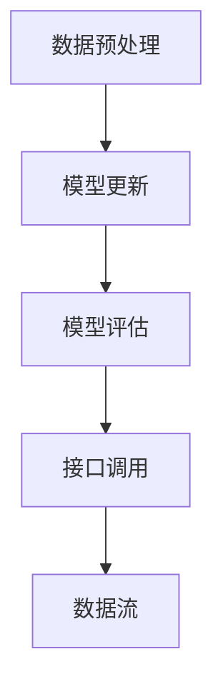
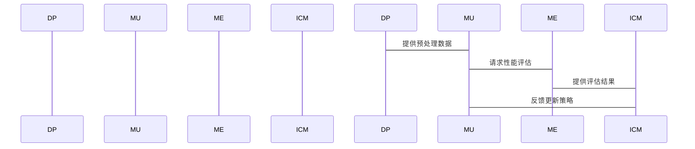

                 


# 增量学习：持续更新AI Agent的知识库

> 关键词：增量学习、AI Agent、知识库更新、机器学习、在线学习、任务增量学习

> 摘要：本文详细探讨了增量学习在AI Agent知识库更新中的应用，从核心概念、算法原理到系统架构和项目实战，全面解析增量学习的优势和实现方法，为AI Agent的持续进化提供理论支持和实践指导。

---

## 第一章: 增量学习的基本概念与背景

### 1.1 增量学习的定义与特点

#### 1.1.1 增量学习的定义
增量学习是一种机器学习范式，允许模型在部署后逐步接收新的数据样本，并在不重新训练整个模型的前提下更新其知识库。这种学习方式特别适用于数据流环境，能够实时适应新信息。

#### 1.1.2 增量学习的核心特点
- **在线性**：模型在数据流中实时更新，无需等待全部数据收集完成。
- **高效性**：每次仅处理部分数据，减少计算资源消耗。
- **适应性**：能够适应数据分布的变化，保持模型性能。

#### 1.1.3 增量学习与传统机器学习的区别
| 特性        | 增量学习              | 传统机器学习            |
|-------------|-----------------------|-------------------------|
| 数据处理方式 | 逐步接收新样本        | 批处理所有样本          |
| 训练效率     | 资源消耗低            | 资源消耗高              |
| 适应性       | 能够实时更新          | 无法实时更新            |

### 1.2 AI Agent的知识库更新需求

#### 1.2.1 AI Agent的定义与应用场景
AI Agent是一种智能实体，能够感知环境、执行任务并做出决策。其知识库是其理解和推理的基础，涵盖从常识到特定任务的知识。

#### 1.2.2 知识库在AI Agent中的重要性
知识库是AI Agent的核心，直接影响其推理和决策能力。知识库的及时更新确保AI Agent能够适应环境变化，保持高效运作。

#### 1.2.3 增量学习在AI Agent知识库更新中的作用
增量学习使AI Agent能够在实时数据流中逐步更新知识库，避免离线更新的延迟和资源消耗。

### 1.3 增量学习的背景与问题背景

#### 1.3.1 当前AI Agent知识库更新的挑战
- 数据流的实时性要求高，传统批量更新难以满足。
- 知识库的动态变化需要模型具备快速适应能力。
- 更新过程中需保持模型的稳定性和准确性。

#### 1.3.2 增量学习的必要性与优势
- 实时更新，适应动态环境。
- 节省资源，提高效率。
- 增强模型的泛化能力和适应性。

#### 1.3.3 增量学习的应用场景与边界
应用场景包括实时推荐系统、动态环境监控等。边界在于处理增量数据时的模型稳定性和性能损失问题。

---

## 第二章: 增量学习的核心概念与原理

### 2.1 增量学习的核心概念

#### 2.1.1 数据流与模型更新机制
数据流是增量学习的核心，模型通过处理数据流中的数据逐步更新。

#### 2.1.2 知识库的增量更新策略
包括参数更新、模型重训练等策略，确保知识库的准确性和完整性。

#### 2.1.3 增量学习的稳定性与泛化能力
平衡模型更新的稳定性与泛化能力，避免过拟合和模型漂移。

### 2.2 增量学习的核心原理

#### 2.2.1 在线学习与离线学习的对比
在线学习实时更新模型，适用于数据流环境；离线学习批量处理数据，适用于数据积累场景。

#### 2.2.2 增量学习的数学模型与公式
模型更新公式：
$$\theta_{t+1} = \theta_t + \eta (y_t - f(\theta_t, x_t))$$
其中，$\theta$为模型参数，$\eta$为学习率，$y_t$为目标值，$f$为模型预测函数。

#### 2.2.3 增量学习的算法流程
1. 接收新数据样本。
2. 使用当前模型预测输出。
3. 计算预测误差。
4. 更新模型参数。
5. 重复直到收敛。

### 2.3 增量学习与AI Agent的结合

#### 2.3.1 AI Agent知识库的动态更新
通过增量学习实时更新知识库，确保AI Agent能够适应环境变化。

#### 2.3.2 增量学习在AI Agent中的具体应用
应用于实时对话系统、动态推荐系统等领域。

#### 2.3.3 增量学习对AI Agent性能提升的作用
提高响应速度和准确性，增强用户体验。

---

## 第三章: 增量学习的算法原理与实现

### 3.1 增量学习的主要算法

#### 3.1.1 在线增量学习算法
- **数学模型**：使用在线梯度下降法，逐步更新参数。
- **流程**：接收样本，计算梯度，更新参数。

#### 3.1.2 Episodic 离线增量学习算法
- **数学模型**：将数据分为多个 episodic，逐步更新模型。
- **流程**：离线处理 episodic 数据，更新模型参数。

#### 3.1.3 任务增量学习算法
- **数学模型**：使用迁移学习方法，适应新任务。
- **流程**：在新任务上微调模型。

### 3.2 增量学习算法的数学模型

#### 在线增量学习的数学模型
$$\theta_{t+1} = \theta_t + \eta (y_t - f(\theta_t, x_t))$$

#### 任务增量学习的数学模型
$$\theta_{new} = \theta_{old} + \Delta\theta$$

### 3.3 增量学习算法的实现步骤

#### 在线增量学习实现
1. 初始化模型参数。
2. 接收数据样本。
3. 预测输出，计算误差。
4. 更新参数。
5. 重复步骤。

#### Python代码示例
```python
def online_incremental_learning(X, y, theta, eta):
    for x, y_true in zip(X, y):
        y_pred = model.predict(theta, x)
        error = y_true - y_pred
        theta += eta * error * model.gradient(theta, x)
    return theta
```

---

## 第四章: 增量学习的系统分析与架构设计

### 4.1 增量学习的系统架构设计

#### 4.1.1 系统架构图


#### 4.1.2 功能模块设计
- 数据预处理模块：处理数据流，提取特征。
- 模型更新模块：执行增量学习算法，更新模型参数。
- 模型评估模块：监控模型性能，调整更新策略。
- 接口调用模块：与AI Agent交互，提供实时更新服务。

### 4.2 增量学习的系统交互设计

#### 4.2.1 系统交互流程
1. 数据预处理模块接收数据流。
2. 模型更新模块执行增量学习。
3. 模型评估模块监控性能。
4. 接口调用模块反馈更新结果。

#### 4.2.2 系统交互图


---

## 第五章: 增量学习的项目实战

### 5.1 项目环境安装与配置

#### 5.1.1 环境安装
- 安装Python和相关库：numpy、scikit-learn、tensorflow。
- 配置开发环境，如PyCharm或Jupyter Notebook。

#### 5.1.2 数据集准备
使用公开数据集，如MNIST，进行增量学习实验。

### 5.2 项目核心代码实现

#### 5.2.1 在线增量学习代码
```python
import numpy as np

def online_incremental_learning(X, y, theta, eta):
    for x, y_true in zip(X, y):
        y_pred = np.dot(theta, x)
        error = y_true - y_pred
        theta += eta * error * x
    return theta

# 示例数据
X = np.array([[1, 2], [3, 4]])
y = np.array([5, 6])
theta = np.array([0, 0])
eta = 0.1

theta_updated = online_incremental_learning(X, y, theta, eta)
print(theta_updated)
```

#### 5.2.2 离线增量学习代码
```python
from sklearn.linear_model import SGDClassifier

def incremental_sgd(X, y, n_epochs):
    model = SGDClassifier(max_iter=1)
    for _ in range(n_epochs):
        model.partial_fit(X, y)
    return model

# 示例数据
X = np.array([[1, 2], [3, 4]])
y = np.array([5, 6])

model = incremental_sgd(X, y, 2)
print(model.coef_)
```

### 5.3 实际案例分析与解读

#### 5.3.1 案例背景
在实时推荐系统中，用户行为数据流不断更新，需要实时调整推荐模型。

#### 5.3.2 案例实现
使用增量学习算法，实时更新推荐模型，提升推荐准确率。

#### 5.3.3 实验结果分析
分析模型更新后的准确率和召回率，验证增量学习的有效性。

### 5.4 项目小结

---

## 第六章: 增量学习的最佳实践与注意事项

### 6.1 最佳实践

#### 6.1.1 增量学习的策略选择
根据应用场景选择合适的学习算法，如在线或离线增量学习。

#### 6.1.2 模型评估与监控
定期评估模型性能，及时调整学习策略。

#### 6.1.3 系统优化技巧
优化数据预处理和模型更新效率，减少计算资源消耗。

### 6.2 小结

### 6.3 注意事项

#### 6.3.1 模型稳定性
防止模型更新导致性能下降，保持模型稳定性。

#### 6.3.2 数据质量
确保数据流的质量，避免噪声干扰模型更新。

#### 6.3.3 资源管理
合理分配计算资源，避免资源耗尽。

### 6.4 拓展阅读

---

## 第七章: 总结与展望

### 7.1 总结
增量学习为AI Agent的知识库更新提供了高效、实时的解决方案，能够在动态环境中保持模型性能。

### 7.2 展望
未来，增量学习将与分布式计算、边缘计算结合，进一步提升AI Agent的智能性和适应性。

---

## 作者信息

作者：AI天才研究院/AI Genius Institute  
联系邮箱：[contact@ai-genius.com](mailto:contact@ai-genius.com)  
GitHub链接：[https://github.com/ai-genius](https://github.com/ai-genius)  
个人简介：专注于人工智能领域的研究与实践，致力于推动AI技术的创新与发展。

