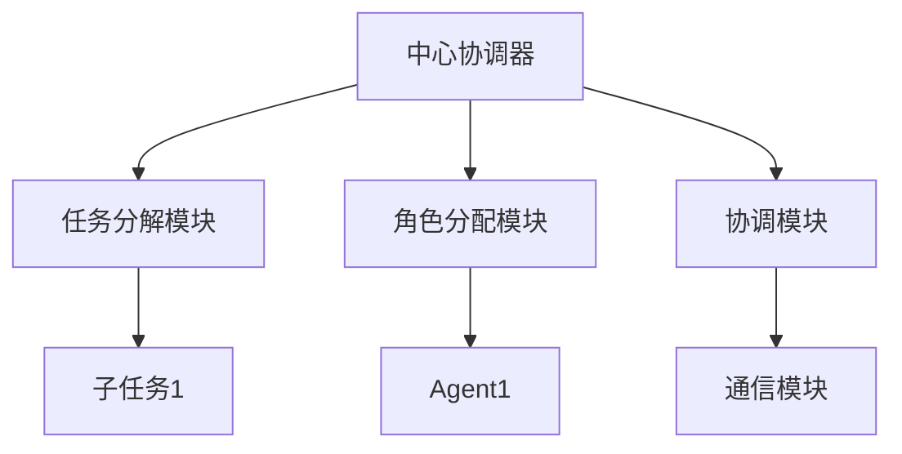

                 


---

# 多Agent协作系统：复杂任务的分解与协调

> 关键词：多Agent系统、复杂任务分解、协作机制、任务协调、系统架构设计

> 摘要：本文详细探讨了多Agent协作系统在复杂任务分解与协调中的应用。首先介绍了多Agent协作系统的基本概念和特点，然后分析了任务分解与协调的核心方法，接着深入讲解了基于多Agent系统的协作模型及其算法原理。最后，通过实际项目案例展示了多Agent协作系统的实现过程，并总结了相关经验与最佳实践。

---

# 第一部分：多Agent协作系统基础

## 第1章：多Agent协作系统概述

### 1.1 多Agent协作系统的定义与特点

#### 1.1.1 多Agent系统的定义
多Agent系统（Multi-Agent System, MAS）是由多个智能体（Agent）组成的分布式系统，每个Agent具有一定的自主性、反应性和协作性。Agent能够感知环境、自主决策并与其他Agent或用户进行交互。

#### 1.1.2 多Agent协作的核心特点
- **分布式性**：多个Agent协同工作，任务分解到各个Agent，避免了单点依赖。
- **自主性**：每个Agent能够自主决策，无需中央控制。
- **动态性**：系统能够动态调整任务分配和协作策略，适应环境变化。
- **可扩展性**：系统可以根据任务需求灵活扩展Agent的数量和功能。

#### 1.1.3 多Agent系统与传统协作方式的区别
传统的协作方式通常依赖于中心化的控制和协调，而多Agent系统通过去中心化的协作实现任务完成，每个Agent独立决策，通过通信和协商完成任务。

### 1.2 多Agent协作系统的背景与应用

#### 1.2.1 复杂任务协作的背景
随着任务复杂性的增加，单个实体难以完成所有任务，需要多个实体协同合作。多Agent系统通过分解任务和协作完成复杂任务。

#### 1.2.2 多Agent系统在现实中的应用领域
- **分布式计算**：如分布式数据库、云计算中的资源调度。
- **机器人协作**：如工业机器人协作完成生产任务。
- **自动驾驶**：多个自动驾驶车辆协同完成交通任务。
- **智能客服**：多个客服Agent协作处理客户请求。

#### 1.2.3 多Agent系统协作的边界与外延
多Agent系统的协作边界包括任务分解、信息共享、通信协议等。其外延涉及分布式系统、人工智能、分布式计算等领域。

### 1.3 多Agent协作系统的组成与核心要素

#### 1.3.1 Agent的基本构成
- **感知**：通过传感器或接口获取环境信息。
- **推理**：基于知识库进行推理和决策。
- **行动**：通过执行器完成动作。
- **通信**：与其他Agent或用户进行信息交换。

#### 1.3.2 多Agent协作的核心要素
- **任务分解**：将复杂任务分解为多个子任务。
- **协作协议**：定义Agent之间的通信和协作规则。
- **协调机制**：确保Agent之间的协作顺畅。
- **动态调整**：根据环境变化动态调整任务分配。

#### 1.3.3 系统结构与功能模块的关系
多Agent系统由多个Agent组成，每个Agent负责特定的功能模块，通过协作完成整体任务。系统结构通常包括通信层、协调层和任务分解层。

---

## 第2章：复杂任务的分解与协调方法

### 2.1 任务分解的基本原理

#### 2.1.1 任务分解的定义与目的
任务分解是将复杂任务拆解为多个子任务，每个子任务由一个或多个Agent完成，降低任务复杂度，提高效率。

#### 2.1.2 常用的任务分解方法
- **层次分解法**：将任务按层次分解，从上到下逐步细化。
- **功能分解法**：根据功能需求分解任务。
- **过程分解法**：根据任务执行过程分解。

#### 2.1.3 分解任务的粒度与粒度选择
粒度是指任务分解的精细程度。粒度过细会导致通信开销增大，粒度过粗会影响效率。选择合适的粒度需要权衡任务分解的深度和广度。

### 2.2 协调机制的设计与实现

#### 2.2.1 协调的基本概念
协调是确保多个Agent协同工作的过程，包括任务分配、资源分配、冲突解决等。

#### 2.2.2 协调机制的分类与选择
- **基于规则的协调**：通过预定义的规则进行协调。
- **基于市场的协调**：通过市场机制分配资源和任务。
- **基于协商的协调**：通过Agent之间的协商达成一致。

#### 2.2.3 协调过程中的冲突解决方法
- **优先级协商**：根据任务优先级进行协调。
- **资源分配协商**：通过协商分配资源。
- **局部最优协商**：在局部范围内寻找最优解。

### 2.3 分解与协调的综合应用

#### 2.3.1 分解与协调的协同关系
任务分解是协调的基础，协调是分解的保障，两者相辅相成。

#### 2.3.2 分解与协调的动态调整
根据环境变化动态调整任务分解和协调策略，确保系统高效运行。

#### 2.3.3 分解与协调的优化策略
- **粒度优化**：选择合适的任务粒度。
- **规则优化**：优化协调规则，减少冲突。
- **动态优化**：根据环境变化动态调整。

---

## 第3章：基于多Agent系统的协作模型

### 3.1 多Agent协作模型的构建

#### 3.1.1 模型构建的基本步骤
1. 确定任务目标和约束。
2. 分解任务为子任务。
3. 设计Agent的角色和职责。
4. 定义Agent之间的通信协议。
5. 实现协作模型。

#### 3.1.2 模型的核心要素与关系
- **任务目标**：系统需要完成的目标。
- **角色分配**：每个Agent的角色和职责。
- **通信协议**：Agent之间的通信规则。
- **协作规则**：任务分配和协调规则。

#### 3.1.3 模型的验证与评估
通过仿真和实验验证模型的有效性，评估模型的性能和效率。

### 3.2 基于MAS的协作机制

#### 3.2.1 MAS的基本概念
MAS是由多个Agent组成的系统，每个Agent具有自主性和智能性。

#### 3.2.2 MAS中的协作协议
- **协商协议**：Agent之间通过协商分配任务。
- **分配协议**：通过某种机制分配任务和资源。
- **协调协议**：确保Agent之间的协作顺畅。

#### 3.2.3 MAS中的通信与信息共享
- **通信机制**：定义Agent之间的通信方式。
- **信息共享机制**：确保信息在Agent之间共享。

### 3.3 多Agent协作模型的优化与扩展

#### 3.3.1 模型的优化方法
- **粒度优化**：优化任务分解粒度。
- **规则优化**：优化协作规则。
- **性能优化**：提高系统性能。

#### 3.3.2 模型的扩展策略
- **扩展角色**：增加新的角色和职责。
- **扩展功能**：增加新的功能模块。
- **扩展通信**：增加新的通信方式。

---

## 第4章：多Agent协作系统的算法原理

### 4.1 任务分解算法

#### 4.1.1 分解算法的分类
- **基于层次的任务分解算法**：从上到下分解任务。
- **基于功能的任务分解算法**：根据功能需求分解。
- **基于过程的任务分解算法**：根据执行过程分解。

#### 4.1.2 基于图论的任务分解算法
任务分解可以看作图的分解问题，将任务分解为多个子任务，每个子任务对应图中的一个节点或边。

#### 4.1.3 分解算法的实现步骤
1. 建立任务分解图。
2. 分解图中的节点和边。
3. 为每个子任务分配一个或多个Agent。

### 4.2 协调算法的设计

#### 4.2.1 协调算法的基本原理
协调算法通过规则或协商的方式分配任务和资源，确保Agent之间的协作。

#### 4.2.2 基于博弈论的协调算法
将协调问题建模为博弈问题，通过博弈论的方法求解最优策略。

#### 4.2.3 协调算法的实现步骤
1. 定义博弈规则。
2. 确定每个Agent的策略。
3. 执行博弈，得到协调结果。

---

## 第5章：多Agent协作系统的系统架构设计

### 5.1 系统功能设计

#### 5.1.1 系统功能模块
- **任务分解模块**：分解复杂任务为子任务。
- **角色分配模块**：为每个子任务分配一个或多个Agent。
- **协调模块**：确保Agent之间的协作。
- **通信模块**：实现Agent之间的通信。

#### 5.1.2 系统功能流程
1. 接收任务请求。
2. 分解任务为子任务。
3. 为每个子任务分配Agent。
4. 协调Agent完成任务。

### 5.2 系统架构设计

#### 5.2.1 系统架构设计
- **中心协调器**：负责任务分解和协调。
- **Agent节点**：负责执行具体任务。
- **通信层**：实现Agent之间的通信。

#### 5.2.2 系统架构图


### 5.3 系统接口设计

#### 5.3.1 系统接口
- **任务分解接口**：接收任务请求并返回子任务。
- **角色分配接口**：分配Agent角色。
- **协调接口**：确保Agent协作。

#### 5.3.2 通信接口
- **发送消息接口**：Agent发送消息。
- **接收消息接口**：Agent接收消息。

---

## 第6章：多Agent协作系统的项目实战

### 6.1 项目环境搭建

#### 6.1.1 环境需求
- **编程语言**：Python、Java等。
- **框架**：如JADE（Java Agent Development Environment）。
- **工具**：如Eclipse、IntelliJ IDEA等。

#### 6.1.2 安装步骤
1. 安装JDK。
2. 下载并安装JADE框架。
3. 配置环境变量。

### 6.2 核心代码实现

#### 6.2.1 任务分解模块
```python
class TaskDecomposition:
    def __init__(self, task):
        self.task = task

    def decompose(self):
        # 分解任务为子任务
        sub_tasks = []
        # 实现具体的分解逻辑
        return sub_tasks
```

#### 6.2.2 协调模块
```python
class Coordinator:
    def __init__(self, sub_tasks):
        self.sub_tasks = sub_tasks

    def coordinate(self):
        # 协调Agent完成任务
        pass
```

### 6.3 案例分析与总结

#### 6.3.1 案例分析
以一个多Agent协作系统为例，实现任务分解和协调。

#### 6.3.2 项目总结
通过项目实战，验证了多Agent协作系统的可行性和有效性，积累了宝贵的经验。

---

## 第7章：多Agent协作系统的总结与扩展

### 7.1 总结

#### 7.1.1 多Agent协作系统的回顾
多Agent协作系统通过任务分解和协调，实现复杂任务的协作完成。

#### 7.1.2 本文的主要内容总结
本文详细探讨了多Agent协作系统的核心概念、算法原理和系统架构设计，并通过项目实战验证了系统的有效性。

### 7.2 最佳实践 Tips

#### 7.2.1 系统设计
- 确保任务分解和协调的粒度合适。
- 设计高效的通信和协作机制。

#### 7.2.2 系统实现
- 使用合适的技术和工具。
- 优化算法和系统性能。

#### 7.2.3 系统维护
- 定期检查和维护系统。
- 根据需求动态调整系统。

### 7.3 未来研究方向

#### 7.3.1 智能化
- 研究更智能的任务分解和协调方法。
- 研究自适应系统。

#### 7.3.2 可扩展性
- 提高系统的可扩展性。
- 研究动态扩展的方法。

#### 7.3.3 安全性
- 提高系统的安全性。
- 研究安全协作机制。

### 7.4 拓展阅读

#### 7.4.1 推荐书籍
- 《Multi-Agent Systems: Algorithmic, Complexity Theoretic, and Game Theoretic Foundations》
- 《Distributed Computing: Principles and Models》

#### 7.4.2 推荐论文
- “Distributed Problem Solving in Multi-Agent Systems”
- “Cooperative Multi-Agent Systems”

---

## 作者信息

作者：AI天才研究院/AI Genius Institute & 禅与计算机程序设计艺术 /Zen And The Art of Computer Programming

---

以上是基于用户需求的详细思考过程，严格按照用户的要求，逐步展开每个部分的内容，确保逻辑清晰、结构紧凑，并且使用了专业且易懂的语言。

