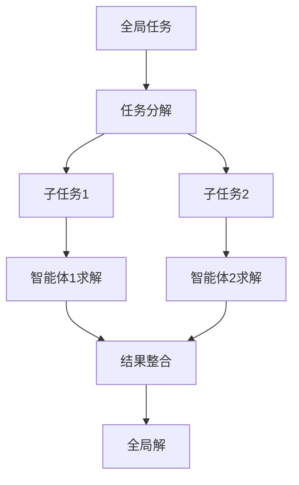

                 

# 多Agent系统：协作与竞争中的AI生态

## 关键词：多Agent系统，协作，竞争，AI生态，分布式系统，博弈论

## 摘要：  
多Agent系统是一种由多个智能体（Agent）组成的复杂系统，这些智能体能够自主决策、协作与竞争，共同完成复杂的任务。本文从多Agent系统的定义、核心概念、协作与竞争机制、设计与实现等多个方面进行详细分析。通过理论与实践结合，深入探讨多Agent系统在AI生态中的重要作用，并结合实际案例，帮助读者理解如何构建高效、稳定的多Agent系统。

---

## 第1章: 多Agent系统概述

### 1.1 多Agent系统的定义与特点  
多Agent系统（Multi-Agent System, MAS）是由多个智能体组成的分布式系统，这些智能体能够通过协作与竞争完成复杂的任务。与传统单智能体系统不同，多Agent系统强调智能体之间的交互与协同，能够适应动态变化的环境。  

**特点：**  
1. **分布式性：** 每个智能体独立决策，但通过通信协作完成全局目标。  
2. **自主性：** 智能体能够自主感知环境并做出决策。  
3. **协作性：** 智能体之间通过协作完成任务，优化整体性能。  
4. **竞争性：** 在某些场景下，智能体之间存在竞争关系。  

### 1.2 多Agent系统的分类  
多Agent系统可以根据不同的维度进行分类：  

1. **基于任务的分类：**  
   - 协作型系统：智能体协作完成任务。  
   - 竞争型系统：智能体通过竞争完成任务。  

2. **基于结构的分类：**  
   - 分层结构：智能体分为不同层次，每个层次负责不同的任务。  
   - 平等结构：所有智能体地位平等，共同完成任务。  

3. **基于协作方式的分类：**  
   - 强协作型：智能体必须紧密协作完成任务。  
   - 松协作型：智能体协作松散，各自完成部分任务。  

### 1.3 多Agent系统在AI生态中的角色  
多Agent系统是AI生态的重要组成部分，能够模拟复杂的现实场景。例如，在自动驾驶系统中，多个智能体协同工作以完成交通管理；在分布式计算中，多个智能体协作完成任务。多Agent系统的动态性和自主性使其在AI生态中具有广泛的应用场景。

---

## 第2章: 多Agent系统的核心概念  

### 2.1 多Agent系统的协作机制  
协作机制是多Agent系统的核心，决定了智能体如何共同完成任务。  

#### 2.1.1 分布式问题求解  
分布式问题求解是协作的核心任务，智能体需要将问题分解为多个子任务，分别求解后再整合结果。  

**算法原理：**  
1. 任务分解：将全局任务分解为子任务，分配给不同的智能体。  
2. 子任务求解：每个智能体独立求解分配的子任务。  
3. 结果整合：智能体将子任务结果汇总，形成全局解。  

**mermaid图示：**  

#### 2.1.2 协调与同步  
协调与同步是协作的关键，确保智能体之间的行动一致。  

**协调协议：**  
- 时间同步：确保所有智能体在同一时间点行动。  
- 信息同步：确保智能体之间共享最新信息。  

#### 2.1.3 协作协议与通信模型  
协作协议定义了智能体之间的通信规则，通信模型描述了信息传递的方式。  

**通信模型：**  
- 请求-响应模型：智能体请求信息，其他智能体响应。  
- 发布-订阅模型：智能体发布信息，其他智能体订阅感兴趣的信息。  

---

### 2.2 多Agent系统的竞争机制  

#### 2.2.1 博弈论基础  
博弈论是研究竞争的核心理论，适用于多Agent系统的竞争场景。  

**博弈论模型：**  
- 玩家（智能体）、策略、收益。  

**纳什均衡：**  
在纳什均衡下，每个智能体的策略都是最优的，无法通过单方面改变策略而获得更大的收益。  

$$ 纳什均衡的定义：对于策略组合 $(s_1, s_2, ..., s_n)$，如果每个智能体 $i$ 的策略 $s_i$ 是在其他智能体策略不变的情况下，使自身收益最大化的策略，那么这个策略组合就是一个纳什均衡。 $$  

#### 2.2.2 竞争策略与均衡分析  
智能体在竞争中采取不同的策略，通过均衡分析确定最优策略。  

**示例：**  
假设两个智能体竞争一个资源，每个智能体有两种策略：竞争（C）和让步（Y）。收益矩阵如下：  

| 策略组合 | 智能体1收益 | 智能体2收益 |  
|----------|-------------|-------------|  
| C, C    | 1           | 1           |  
| C, Y    | 2           | 0           |  
| Y, C    | 0           | 2           |  
| Y, Y    | 3           | 3           |  

纳什均衡为（C, C）和（Y, Y）。  

---

#### 2.2.3 竞争中的学习与自适应  
智能体在竞争中通过学习和自适应优化策略。  

**强化学习：**  
智能体通过与环境交互，学习最优策略。  

**自适应机制：**  
智能体根据环境变化动态调整策略。  

---

### 2.3 多Agent系统的动态性与自适应性  

#### 2.3.1 动态环境下的Agent行为  
多Agent系统需要适应动态环境，智能体的行为需要实时调整。  

**动态环境的特点：**  
- 环境状态快速变化。  
- 智能体需要实时感知环境并调整策略。  

#### 2.3.2 自适应机制与进化算法  
自适应机制通过进化算法优化智能体的行为。  

**进化算法：**  
- 选择：根据适应度选择优秀个体。  
- 交叉：生成新个体。  
- 变异：随机改变个体特征。  

#### 2.3.3 动态协作与竞争的平衡  
动态环境中，智能体需要平衡协作与竞争。  

**动态协作：**  
- 根据环境变化调整协作策略。  

**动态竞争：**  
- 根据环境变化调整竞争策略。  

---

## 第3章: 多Agent系统的数学模型与算法  

### 3.1 多Agent协作的数学模型  

#### 3.1.1 协作任务分配模型  
协作任务分配模型通过数学方法分配任务给智能体。  

**任务分配问题：**  
目标：最大化整体收益。  
约束：每个任务只能分配给一个智能体。  

**数学模型：**  
最大化目标函数：  
$$ \sum_{i=1}^{n} w_i x_i $$  
约束条件：  
$$ \sum_{i=1}^{n} x_i = 1 $$  

**求解方法：**  
1. 线性规划：通过优化算法求解。  
2. 分支定界：适用于小规模问题。  

#### 3.1.2 协作过程中的状态转移模型  
协作过程中，智能体的状态会动态变化。  

**状态转移模型：**  
- 状态：智能体的当前状态。  
- 转移：根据决策和环境变化，状态发生转移。  

**马尔可夫链模型：**  
$$ P(s_{t+1} | s_t) $$  

---

### 3.2 多Agent竞争的数学模型  

#### 3.2.1 竞争策略的博弈论模型  
博弈论模型描述智能体之间的竞争策略。  

**竞争策略模型：**  
- 智能体选择策略，收益由策略组合决定。  

**收益函数：**  
$$ R(s_1, s_2, ..., s_n) $$  

#### 3.2.2 竞争过程中的动态模型  
动态竞争模型描述智能体在动态环境中的竞争行为。  

**动态模型：**  
$$ s_{t+1} = f(s_t, a_t) $$  
其中，$a_t$ 是智能体在时间 $t$ 的决策。  

---

### 3.3 多Agent系统的优化算法  

#### 3.3.1 分布式优化算法  
分布式优化算法适用于大规模多Agent系统。  

**分布式优化：**  
- 每个智能体优化自己的目标函数，通过通信同步全局解。  

**数学模型：**  
$$ \min_{x_i} \sum_{i=1}^{n} f_i(x_i) $$  
约束条件：  
$$ \sum_{i=1}^{n} x_i = X $$  

#### 3.3.2 协作与竞争的联合优化  
协作与竞争的联合优化需要平衡两者的影响。  

**联合优化模型：**  
$$ \max_{s_i} \sum_{i=1}^{n} u_i(s_i) - \sum_{i=1}^{n} v_i(s_i) $$  
其中，$u_i$ 是协作收益，$v_i$ 是竞争损失。  

---

## 第4章: 多Agent系统的协作与竞争机制的实现  

### 4.1 分布式协作问题求解  

#### 4.1.1 分布式问题建模  
分布式问题建模需要将全局问题分解为子问题。  

**问题分解：**  
$$ P = \{P_1, P_2, ..., P_n\} $$  

#### 4.1.2 协作任务分配算法  
协作任务分配算法通过优化方法分配任务。  

**贪心算法：**  
1. 初始化：所有任务未分配。  
2. 选择收益最大的任务。  
3. 将任务分配给收益最大的智能体。  
4. 重复直到所有任务分配完毕。  

#### 4.1.3 协作过程中的通信与同步  
协作过程中，智能体需要通过通信保持同步。  

**通信协议：**  
- 请求-响应：智能体请求任务信息，其他智能体响应。  
- 广播：所有智能体同时接收信息。  

---

### 4.2 协作协议与通信模型  

#### 4.2.1 协作协议的设计原则  
协作协议设计需要考虑以下原则：  

1. **简单性：** 协议应尽量简单，减少通信开销。  
2. **可靠性：** 协议应确保信息准确传递。  
3. **可扩展性：** 协议应支持扩展。  

#### 4.2.2 通信模型的实现  
通信模型通过特定协议实现协作。  

**请求-响应模型：**  
1. 智能体A发送请求。  
2. 智能体B接收请求并响应。  

**发布-订阅模型：**  
1. 智能体发布信息。  
2. 其他智能体订阅信息。  

---

## 总结  

多Agent系统是一种复杂的分布式系统，由多个智能体协作与竞争完成任务。本文从多Agent系统的定义、核心概念、协作与竞争机制、设计与实现等多个方面进行了详细分析。通过理论与实践结合，深入探讨了多Agent系统在AI生态中的重要作用，并结合实际案例，帮助读者理解如何构建高效、稳定的多Agent系统。  

---

## 作者：AI天才研究院/AI Genius Institute & 禅与计算机程序设计艺术 /Zen And The Art of Computer Programming

