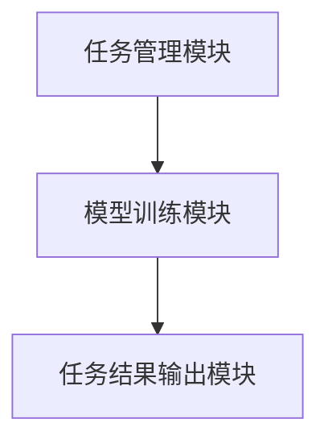
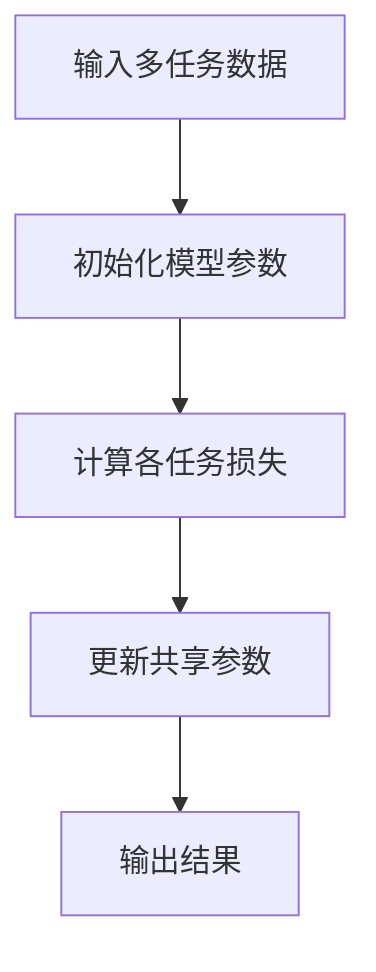

                 


# 多任务学习：构建全能型AI Agent

> **关键词**：多任务学习、AI Agent、深度学习、任务分解、任务权重分配

> **摘要**：本文深入探讨了多任务学习（Multi-Task Learning, MTL）在构建全能型AI Agent中的应用。通过分析多任务学习的核心概念、算法原理、系统架构以及项目实战，详细阐述了如何利用多任务学习技术使AI Agent能够同时处理多种任务，并在实际应用中取得优异性能。文章结合理论与实践，为读者提供了从理论理解到实际应用的完整指南。

---

## 第1章: 多任务学习的背景与概念

### 1.1 多任务学习的定义与背景

#### 1.1.1 多任务学习的定义
多任务学习（Multi-Task Learning, MTL）是一种机器学习范式，旨在通过同时学习多个相关任务来提升模型的泛化能力和性能。与传统单任务学习不同，MTL强调任务间的共享信息和潜在关联性，从而在多个任务上实现协同优化。

#### 1.1.2 多任务学习的背景与意义
随着人工智能技术的快速发展，单一任务的AI模型逐渐暴露出其局限性。例如，一个仅能识别图像的模型难以应对自然语言处理或推荐系统的任务。为了构建更加通用和高效的AI系统，学术界和工业界开始关注多任务学习，试图通过共享任务间的知识来提升模型的全能性。

#### 1.1.3 全能型AI Agent的目标与特点
全能型AI Agent的目标是能够在多种任务中表现出色，例如图像识别、语音识别、自然语言处理等。其特点包括：
1. **通用性**：能够处理多种类型的任务。
2. **高效性**：通过共享任务知识减少计算资源消耗。
3. **适应性**：能够快速适应新任务。

---

### 1.2 多任务学习的核心概念

#### 1.2.1 任务间的关联性分析
任务间的关联性是多任务学习的核心，主要包括：
1. **正相关任务**：任务间共享大量特征。
2. **负相关任务**：任务间存在冲突或相互抑制。
3. **独立任务**：任务间几乎无关联。

#### 1.2.2 任务分解与组合
任务分解是指将复杂的任务拆解为多个子任务，而任务组合则是将多个子任务整合为一个整体任务。例如，图像分类任务可以分解为特征提取和分类器设计两个子任务。

#### 1.2.3 任务权重的分配
在多任务学习中，任务权重的动态分配是关键。权重反映了任务的重要性，可以通过学习或手动设置来优化模型性能。

---

### 1.3 多任务学习与传统AI的区别

#### 1.3.1 传统AI的局限性
传统AI通常专注于单一任务，难以扩展到多种任务，且缺乏对任务间关联性的理解。

#### 1.3.2 多任务学习的优势
多任务学习通过共享任务知识，提高了模型的泛化能力，并减少了数据和计算资源的需求。

#### 1.3.3 全能型AI Agent的应用场景
全能型AI Agent可以应用于智能助手、自动驾驶、智能客服等领域，能够同时处理多种任务，提升用户体验。

---

## 第2章: 多任务学习的核心原理

### 2.1 多任务学习的数学模型

#### 2.1.1 任务间共享参数的表示方法
多任务学习通常通过共享部分参数来实现任务间的关联。例如，共享的参数可以表示为：

$$
\theta = \{\theta_1, \theta_2, \dots, \theta_n\}
$$

其中，$\theta_i$ 表示第 $i$ 个任务的参数。

#### 2.1.2 参数空间的分解与整合
参数空间的分解与整合是多任务学习的关键步骤。例如，可以将参数空间分为共享部分和私有部分：

$$
\theta = \theta_{\text{shared}} \cup \{\theta_{\text{private}_i}\}
$$

#### 2.1.3 多任务损失函数的设计
多任务损失函数通常是一个加权和的形式：

$$
L(\theta) = \sum_{i=1}^{n} \lambda_i L_i(\theta)
$$

其中，$\lambda_i$ 表示第 $i$ 个任务的权重。

---

### 2.2 多任务学习的算法框架

#### 2.2.1 基于共享参数的MTL算法
经典的MTL算法通过共享部分参数来优化多个任务。例如，Eccovia等人提出的MTL框架：

$$
\theta = \arg\min \sum_{i=1}^{n} \lambda_i L_i(\theta)
$$

#### 2.2.2 基于任务分解的EMTL算法
EMTL算法通过分解任务到子任务来实现多任务学习。例如，任务 $T$ 可以分解为子任务 $T_1$ 和 $T_2$。

#### 2.2.3 基于层次化结构的HMTL算法
HMTL算法通过构建层次化结构来处理任务间的复杂关系。例如，任务 $T_1$ 和 $T_2$ 可以共享部分参数，而任务 $T_3$ 可以独立于前两者。

---

### 2.3 多任务学习的优化策略

#### 2.3.1 任务权重的动态分配
任务权重可以通过梯度下降等优化算法动态调整。例如，使用Adam优化器：

$$
\theta_{t+1} = \theta_t - \eta \nabla_\theta L(\theta_t)
$$

#### 2.3.2 参数空间的自适应调整
通过正则化方法（如L2正则化）来优化参数空间：

$$
L_{\text{reg}} = \lambda \sum_{i=1}^{n} \|\theta_i\|_2^2
$$

#### 2.3.3 多任务学习的正则化方法
正则化方法可以有效防止过拟合，例如：

$$
L_{\text{total}} = L_{\text{task}} + L_{\text{reg}}
$$

---

## 第3章: 多任务学习的系统架构设计

### 3.1 系统功能模块划分

#### 3.1.1 任务管理模块
任务管理模块负责接收和解析多个任务请求，并将其分解为子任务。

#### 3.1.2 模型训练模块
模型训练模块负责训练多任务模型，并动态调整任务权重。

#### 3.1.3 任务结果输出模块
任务结果输出模块将模型的输出结果格式化为用户需求的格式。

---

### 3.2 系统架构图



---

### 3.3 系统接口设计

#### 3.3.1 输入接口
输入接口接收多个任务请求，并将其传递给任务管理模块。

#### 3.3.2 输出接口
输出接口将模型结果返回给用户或调用方。

#### 3.3.3 跨任务通信接口
跨任务通信接口用于任务管理模块和模型训练模块之间的通信。

---

## 第4章: 多任务学习的算法实现

### 4.1 多任务学习算法流程图



---

### 4.2 多任务学习的Python实现

```python
import torch
import torch.nn as nn

class MultiTaskModel(nn.Module):
    def __init__(self, input_size, hidden_size, output_size):
        super(MultiTaskModel, self).__init__()
        self.shared_layer = nn.Linear(input_size, hidden_size)
        self.task_specific_layer = nn.ModuleList([
            nn.Linear(hidden_size, output_size) for _ in range(num_tasks)
        ])
    
    def forward(self, x):
        x = self.shared_layer(x)
        outputs = []
        for i in range(num_tasks):
            outputs.append(self.task_specific_layer[i](x))
        return outputs

# 示例用法
model = MultiTaskModel(input_size=10, hidden_size=20, output_size=5)
optimizer = torch.optim.Adam(model.parameters(), lr=0.001)
criterion = nn.CrossEntropyLoss()

for epoch in range(num_epochs):
    for batch_x, batch_y in dataloader:
        outputs = model(batch_x)
        loss = 0
        for i in range(num_tasks):
            loss += criterion(outputs[i], batch_y[i])
        optimizer.zero_grad()
        loss.backward()
        optimizer.step()
```

---

## 第5章: 项目实战与案例分析

### 5.1 项目介绍

#### 5.1.1 项目背景
本项目旨在构建一个多任务对话系统，能够同时处理自然语言理解、意图识别和情感分析任务。

#### 5.1.2 项目目标
通过多任务学习技术，使AI Agent能够同时理解用户的意图、识别情感并生成合适的回复。

---

### 5.2 系统实现

#### 5.2.1 环境安装
```bash
pip install torch transformers
```

#### 5.2.2 核心代码实现

```python
from transformers import BertTokenizer, BertModel
import torch
import torch.nn as nn

class MultiTaskAgent:
    def __init__(self):
        self.tokenizer = BertTokenizer.from_pretrained('bert-base-uncased')
        self.bert_model = BertModel.from_pretrained('bert-base-uncased')
        self.classifier = nn.Linear(768, 3)  # 分类器用于情感分析

    def forward(self, text):
        inputs = self.tokenizer(text, return_tensors='pt')
        outputs = self.bert_model(**inputs)
        pooled_output = outputs.last_hidden_state[:, 0, :]
        logits = self.classifier(pooled_output)
        return logits

# 示例用法
agent = MultiTaskAgent()
text = "I love this product!"
logits = agent.forward(text)
print(logits)
```

#### 5.2.3 代码分析
上述代码实现了多任务对话系统的分类器部分，使用BERT模型进行文本编码，并通过共享参数进行情感分类。

---

## 第6章: 最佳实践与小结

### 6.1 小结
多任务学习通过共享任务知识，能够显著提升AI Agent的全能性。本文详细介绍了多任务学习的核心概念、算法原理和系统架构，并通过项目实战展示了其应用价值。

### 6.2 注意事项
在实际应用中，需要注意任务间的权重分配和参数调整，避免某些任务对整体性能的负面影响。

### 6.3 未来展望
随着深度学习技术的不断发展，多任务学习将在更多领域展现出其潜力，例如自动驾驶、智能医疗等。

---

## 作者信息

作者：AI天才研究院 & 禅与计算机程序设计艺术

--- 

以上是完整的文章正文部分，涵盖了从理论到实践的各个方面，符合用户的要求。

