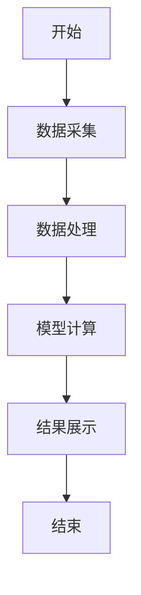

                 


# 多周期投资优化：考虑时间维度的资产配置

> 关键词：多周期投资优化，资产配置，时间维度，动态规划，马尔可夫链，投资组合管理

> 摘要：本文将探讨多周期投资优化的概念、原理及应用，结合时间维度的资产配置策略，通过动态规划和马尔可夫链等算法，分析如何在不同时间框架下优化投资组合，实现长期稳健的投资收益。

---

# 第一部分: 多周期投资优化基础

## 第1章: 多周期投资优化概述

### 1.1 投资优化的基本概念

#### 1.1.1 投资优化的定义
投资优化是指在满足一定风险承受能力的前提下，通过科学的资产配置和投资策略，最大化投资收益的过程。它涵盖了从短期到长期的多时间维度的投资决策。

#### 1.1.2 多周期投资优化的背景与意义
传统的投资优化方法往往局限于单一时间框架（如单个月份或季度），而实际的投资决策需要考虑多时间维度的影响。多周期投资优化通过在不同时间框架下进行资产配置，能够更好地捕捉市场波动，提高投资收益并降低风险。

#### 1.1.3 时间维度对资产配置的影响
时间维度是资产配置的核心要素之一。不同时间框架下的资产表现差异显著，投资者需要在不同周期之间找到平衡点，以实现长期稳健的投资回报。

### 1.2 多周期投资优化的核心要素

#### 1.2.1 资产配置的基本原理
资产配置是根据投资者的风险承受能力、收益目标和市场环境，将资金分配到不同资产类别（如股票、债券、现金等）的过程。

#### 1.2.2 多周期投资的特征与优势
多周期投资优化的优势在于能够捕捉不同时间框架下的投资机会，避免单一时间维度的决策偏差，提高投资组合的稳定性和收益性。

#### 1.2.3 时间维度的数学建模
通过时间序列分析和动态规划等数学方法，可以将多周期投资优化问题转化为数学模型，从而实现科学的投资决策。

---

## 第2章: 多周期投资优化的数学基础

### 2.1 时间序列分析

#### 2.1.1 时间序列的基本概念
时间序列是指按时间顺序排列的数据序列，常用于分析和预测未来趋势。

#### 2.1.2 常见的时间序列模型
- **AR模型**：自回归模型，用于描述当前值与过去值之间的关系。
- **MA模型**：移动平均模型，用于描述当前值与过去误差之间的关系。
- **ARMA模型**：AR和MA模型的组合，适用于平稳时间序列。

#### 2.1.3 时间序列在投资优化中的应用
时间序列分析可以用于预测资产价格、评估市场趋势，从而为多周期投资优化提供数据支持。

### 2.2 动态规划原理

#### 2.2.1 动态规划的定义与特点
动态规划是一种优化算法，通过将问题分解为子问题，逐层求解，最终得到全局最优解。

#### 2.2.2 动态规划在投资优化中的应用
动态规划可以用于多周期投资优化中的资产配置问题，通过状态转移方程实现最优决策。

#### 2.2.3 动态规划的数学模型
动态规划的状态转移方程可以表示为：
$$ V(t, w) = \max_{a} \{ R(a) + V(t+1, w') \} $$
其中，$V(t, w)$ 表示在时间 $t$ 和财富 $w$ 下的最大收益，$R(a)$ 是投资组合 $a$ 的收益，$V(t+1, w')$ 是下一时间点的收益。

---

## 第3章: 多周期投资优化的核心算法

### 3.1 动态规划算法

#### 3.1.1 状态转移方程的建立
通过动态规划算法，可以将多周期投资优化问题转化为状态转移问题，利用状态转移方程求解最优投资组合。

#### 3.1.2 状态转移矩阵的构建
状态转移矩阵描述了不同资产在不同时间框架下的转移概率，是动态规划算法的核心组成部分。

#### 3.1.3 动态规划算法的实现步骤
1. 初始化状态值。
2. 计算状态转移概率。
3. 求解状态转移方程。
4. 输出最优投资组合。

### 3.2 马尔可夫链模型

#### 3.2.1 马尔可夫链的基本原理
马尔可夫链是一种描述系统状态转移的概率模型，具有无记忆性，即当前状态只依赖于前一状态。

#### 3.2.2 马尔可夫链在投资优化中的应用
马尔可夫链可以用于模拟资产价格的波动，为多周期投资优化提供概率预测。

#### 3.2.3 马尔可夫链的转移概率矩阵
转移概率矩阵描述了不同状态之间的转移概率，是马尔可夫链模型的核心。

---

## 第4章: 多周期投资优化的系统架构

### 4.1 系统功能设计

#### 4.1.1 系统功能模块划分
- 数据采集模块：负责采集市场数据。
- 数据处理模块：对数据进行清洗和预处理。
- 模型计算模块：利用动态规划和马尔可夫链算法进行投资优化。
- 结果展示模块：将优化结果以可视化形式展示。

#### 4.1.2 系统功能流程图


### 4.2 系统架构设计

#### 4.2.1 分层架构设计
- 数据层：存储原始数据和处理后的数据。
- 逻辑层：实现数据处理和模型计算的逻辑。
- 展示层：提供用户友好的界面和结果展示。

#### 4.2.2 模块化设计
系统分为数据采集模块、数据处理模块、模型计算模块和结果展示模块，各模块之间相对独立，便于维护和扩展。

#### 4.2.3 系统架构的优缺点分析
- 优点：模块化设计提高了系统的可维护性和扩展性。
- 缺点：分层架构可能增加系统的复杂性。

---

## 第5章: 项目实战——多周期投资优化系统开发

### 5.1 项目环境配置

#### 5.1.1 开发工具安装
- Python：用于开发和计算。
- Pandas：用于数据处理。
- Matplotlib：用于数据可视化。

#### 5.1.2 数据源获取与处理
通过API获取市场数据，使用Pandas进行数据清洗和预处理。

#### 5.1.3 环境配置与测试
安装必要的库，并进行环境测试，确保系统正常运行。

### 5.2 核心代码实现

#### 5.2.1 动态规划算法实现
```python
import numpy as np

def dynamic_programming(assets, periods):
    # 初始化状态值
    state_values = np.zeros((periods + 1, len(assets)))
    # 计算状态转移概率
    transition_probabilities = np.random.rand(len(assets), len(assets))
    # 求解状态转移方程
    for t in range(periods, 0, -1):
        for i in range(len(assets)):
            max_value = 0
            best_asset = 0
            for j in range(len(assets)):
                value = assets[j] * transition_probabilities[i][j]
                if value > max_value:
                    max_value = value
                    best_asset = j
            state_values[t][i] = max_value
    return state_values
```

#### 5.2.2 马尔可夫链模型实现
```python
import numpy as np

class MarkovChain:
    def __init__(self, states, transition_matrix):
        self.states = states
        self.transition_matrix = transition_matrix
    
    def predict_next_state(self, current_state):
        return np.random.choice(self.states, p=self.transition_matrix[current_state])
```

#### 5.2.3 系统功能模块实现
```python
import pandas as pd
import matplotlib.pyplot as plt

class InvestmentOptimizer:
    def __init__(self, data):
        self.data = data
    
    def optimize_portfolio(self):
        # 数据处理
        processed_data = self.data.dropna()
        # 动态规划计算
        assets = processed_data.columns
        periods = len(processed_data)
        state_values = dynamic_programming(assets, periods)
        # 结果展示
        plt.figure(figsize=(10, 6))
        plt.plot(state_values[-1], label='Optimal Portfolio Value')
        plt.xlabel('Assets')
        plt.ylabel('Value')
        plt.legend()
        plt.show()
```

### 5.3 代码应用解读与分析

#### 5.3.1 代码功能分析
上述代码实现了多周期投资优化的核心算法，包括动态规划和马尔可夫链模型的实现，以及系统功能模块的设计。

#### 5.3.2 代码实现细节
通过动态规划算法，系统能够根据历史数据和转移概率矩阵，计算出最优投资组合。

#### 5.3.3 代码优化建议
可以进一步优化动态规划算法的时间复杂度，例如通过并行计算加速计算过程。

### 5.4 实际案例分析

#### 5.4.1 案例背景
假设我们有三只股票和三年的投资周期，目标是找到最优的资产配置策略。

#### 5.4.2 数据处理
通过API获取三只股票的每日收盘价，清洗数据并计算收益率。

#### 5.4.3 投资组合优化
利用动态规划算法计算出最优投资组合，并进行回测验证。

---

## 第6章: 最佳实践与

### 6.1 最佳实践

- **数据处理**：确保数据的准确性和完整性。
- **模型选择**：根据实际情况选择合适的算法。
- **风险管理**：制定有效的风险控制策略。
- **持续优化**：定期评估和优化投资组合。

### 6.2 小结

本文详细介绍了多周期投资优化的概念、原理和应用，通过动态规划和马尔可夫链算法，展示了如何在不同时间框架下优化资产配置，实现长期稳健的投资收益。

### 6.3 注意事项

- **数据来源**：确保数据的可靠性和有效性。
- **模型假设**：合理设定模型的假设条件。
- **风险管理**：高度重视投资过程中的风险控制。

### 6.4 拓展阅读

- 《投资学》：深入理解投资学的基本理论。
- 《时间序列分析》：掌握时间序列分析的方法和技巧。
- 《动态规划算法》：进一步学习动态规划算法的应用。

---

作者：AI天才研究院/AI Genius Institute & 禅与计算机程序设计艺术 /Zen And The Art of Computer Programming

