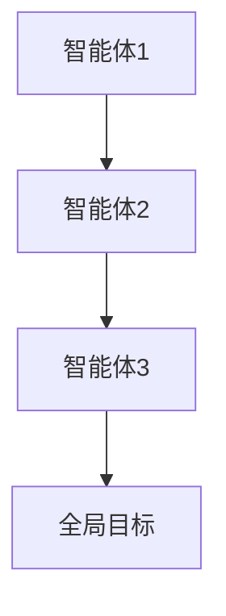
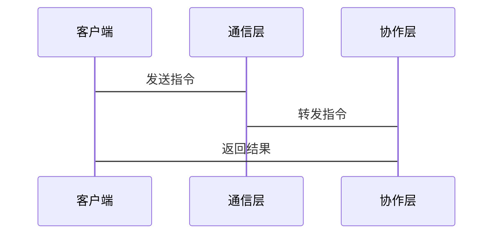

                 


# 多智能体 AI Agent：LLM 驱动的协作与竞争系统

## 关键词：
多智能体系统, AI Agent, LLM, 协作与竞争, 分布式强化学习, 纳什均衡, 系统架构设计

## 摘要：
本文深入探讨了多智能体AI Agent系统，重点分析了LLM驱动下的协作与竞争机制。文章从背景介绍、核心概念、算法原理、系统架构设计、项目实战到最佳实践，全面阐述了多智能体系统的构建与应用，帮助读者理解其原理和实现方法。

---

# 第一部分: 多智能体 AI Agent 的背景与基础

## 第1章: 多智能体 AI Agent 的基本概念

### 1.1 多智能体系统概述

#### 1.1.1 多智能体系统的定义
多智能体系统（Multi-Agent System, MAS）是由多个智能体（Agent）组成的分布式系统，这些智能体能够通过协作和竞争完成复杂的任务。

#### 1.1.2 多智能体系统的特征
- **自主性**：智能体能够自主决策。
- **反应性**：能够感知环境并实时响应。
- **协作性**：通过协作完成共同目标。
- **竞争性**：在竞争中优化自身策略。

#### 1.1.3 多智能体系统的分类
- **协作型系统**：智能体协同完成任务。
- **竞争型系统**：智能体之间存在竞争关系。
- **混合型系统**：结合协作与竞争。

### 1.2 AI Agent 的基本概念

#### 1.2.1 AI Agent 的定义
AI Agent 是一个能够感知环境并采取行动以实现目标的实体。

#### 1.2.2 AI Agent 的核心要素
- **感知**：通过传感器获取环境信息。
- **决策**：基于感知信息做出决策。
- **行动**：执行决策动作。

#### 1.2.3 AI Agent 的分类与特点
- **简单反射型Agent**：基于当前感知做出反应。
- **基于模型的反射型Agent**：使用内部模型进行推理。
- **目标驱动型Agent**：基于目标驱动行为。
- **效用驱动型Agent**：基于效用函数优化决策。

### 1.3 多智能体协作与竞争的背景

#### 1.3.1 多智能体协作的背景
协作可以提高系统整体效率，但需要解决通信与协调问题。

#### 1.3.2 多智能体竞争的背景
竞争可以促进系统优化，但需防止恶性竞争。

#### 1.3.3 协作与竞争的平衡
在实际应用中，协作与竞争需要动态平衡。

---

## 第2章: 多智能体 AI Agent 的核心概念

### 2.1 多智能体系统的概念结构

#### 2.1.1 多智能体系统的组成要素
- **智能体**：核心单元。
- **环境**：智能体所处环境。
- **通信机制**：智能体之间信息交换的渠道。
- **协调机制**：管理协作与竞争的规则。

#### 2.1.2 系统的边界与外延
- **边界**：系统与外部环境的接口。
- **外延**：系统扩展的部分，如数据源和用户界面。

#### 2.1.3 核心概念之间的关系
通过ER实体关系图展示各实体之间的关系，如下：

```mermaid
er
  actor
  entity: Agent
  entity: Environment
  entity: Communication_Channel
  entity: Task
  actor -|> Agent: Controls
  Agent -|> Environment: Interacts_with
  Agent -|> Communication_Channel: Uses
  Agent -|> Task: Performs
```

### 2.2 LLM 在多智能体系统中的作用

#### 2.2.1 LLM 的定义与特点
- **LLM**：大语言模型，具备强大的自然语言处理能力。
- **特点**：理解力强、生成能力强。

#### 2.2.2 LLM 在多智能体协作中的应用
- **信息共享**：通过LLM进行信息交流。
- **决策支持**：利用LLM辅助决策。

#### 2.2.3 LLM 在多智能体竞争中的应用
- **策略生成**：通过LLM生成竞争策略。
- **对抗训练**：利用LLM进行对抗训练。

---

# 第二部分: 多智能体 AI Agent 的算法原理

## 第3章: 多智能体协作的算法原理

### 3.1 分布式强化学习算法

#### 3.1.1 分布式强化学习的定义
分布式强化学习（Distributed Reinforcement Learning, DRL）是多智能体协作的核心算法。

#### 3.1.2 分布式强化学习的数学模型
数学模型如下：
$$ V_i(s_i) = \max_{a_i} \left[ r_i + \sum_{j \neq i} V_j(s_j) \right] $$
其中，$V_i$ 表示智能体i的价值函数，$s_i$ 是智能体i的状态。

#### 3.1.3 分布式强化学习的实现流程
如下流程图展示：



---

## 第4章: 多智能体竞争的算法原理

### 4.1 纳什均衡

#### 4.1.1 纳什均衡的定义
纳什均衡是指在竞争中，每个智能体的策略都是最优反应。

#### 4.1.2 纳什均衡的数学模型
数学模型如下：
$$ (s_1^*, s_2^*, ..., s_n^*) \text{是纳什均衡} \iff \forall i, s_i^* \text{是最佳反应} $$

#### 4.1.3 纳什均衡的应用
通过竞争案例分析，展示纳什均衡在多智能体系统中的应用。

---

## 第5章: 系统分析与架构设计方案

### 5.1 问题场景介绍

#### 5.1.1 项目介绍
一个基于多智能体的协作与竞争系统。

#### 5.1.2 系统功能设计
系统功能包括信息共享、协作决策、竞争优化。

### 5.2 系统架构设计

#### 5.2.1 系统架构图


### 5.3 系统接口设计

#### 5.3.1 接口设计
- **输入接口**：接收环境信息。
- **输出接口**：执行决策动作。

#### 5.3.2 交互序列图


---

## 第6章: 项目实战

### 6.1 环境安装

#### 6.1.1 安装步骤
1. 安装Python。
2. 安装相关库（如numpy、pandas）。
3. 安装LLM模型。

### 6.2 核心代码实现

#### 6.2.1 分布式强化学习代码
```python
import numpy as np

class Agent:
    def __init__(self, state_space, action_space):
        self.state_space = state_space
        self.action_space = action_space
        self.value_function = np.zeros(state_space)

    def act(self, state):
        return np.argmax(self.value_function[state])
```

---

## 第7章: 最佳实践

### 7.1 小结

### 7.2 注意事项

### 7.3 拓展阅读

---

# 作者：AI天才研究院/AI Genius Institute & 禅与计算机程序设计艺术 /Zen And The Art of Computer Programming

