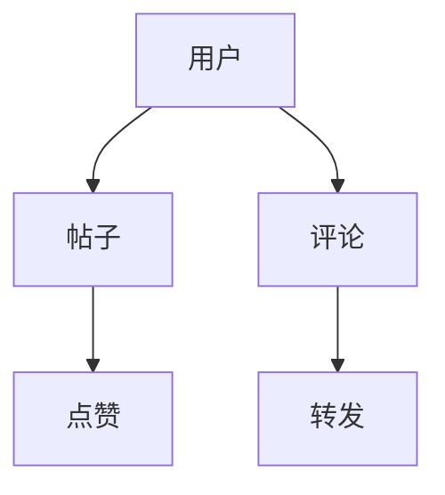
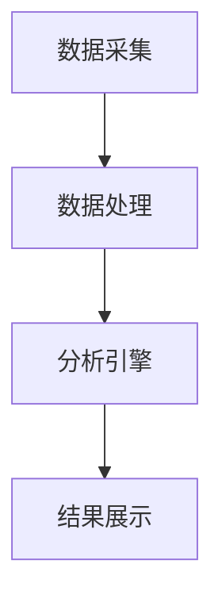
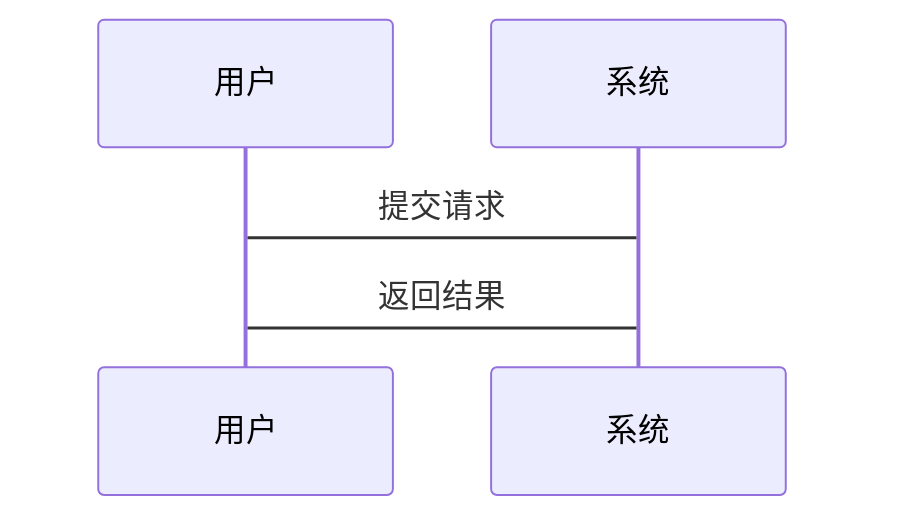

                 


# 多智能体AI如何优化社交媒体影响力分析

**关键词：多智能体AI, 社交媒体影响力, 算法优化, 系统架构, 项目实战**

**摘要：本文深入探讨了多智能体AI在社交媒体影响力分析中的应用，通过系统分析、算法优化和实战案例，展示了如何利用多智能体技术提升社交媒体影响力分析的效率和准确性。文章从基础概念到算法实现，再到系统架构设计，全面解析了多智能体AI的优势和应用场景，为读者提供了丰富的理论和实践指导。**

---

## 第一部分：多智能体AI与社交媒体影响力分析基础

### 第1章：多智能体AI与社交媒体影响力分析概述

#### 1.1 多智能体AI的定义与特点
- **1.1.1 多智能体AI的定义**：多智能体AI是指由多个独立但相互协作的智能体组成的系统，每个智能体都能感知环境、自主决策并与其他智能体协同工作。
- **1.1.2 多智能体AI的核心特点**：
  - 分布式计算
  - 协作性
  - 自适应性
- **1.1.3 多智能体AI与传统AI的区别**：传统AI依赖中心化决策，而多智能体AI通过去中心化协作完成任务。

#### 1.2 社交媒体影响力分析的背景与意义
- **1.2.1 社交媒体的快速发展**：社交媒体成为信息传播的主要渠道，影响力分析需求激增。
- **1.2.2 社交媒体影响力分析的重要性**：帮助企业品牌推广、舆论监控和用户行为预测。
- **1.2.3 多智能体AI在社交媒体中的应用前景**：通过分布式协作提升分析效率和准确性。

#### 1.3 本章小结

### 第2章：多智能体AI的核心概念与联系

#### 2.1 多智能体系统的基本原理
- **2.1.1 多智能体系统的组成**：包括多个智能体、通信机制和协作协议。
- **2.1.2 多智能体系统的通信机制**：通过消息传递实现智能体间的信息共享。
- **2.1.3 多智能体系统的协作与协调**：通过任务分配和冲突解决实现高效协作。

#### 2.2 多智能体AI与社交媒体影响力分析的关系
- **2.2.1 多智能体AI在社交媒体中的应用场景**：包括信息传播预测和用户行为分析。
- **2.2.2 多智能体AI如何提升社交媒体影响力分析的效率**：通过分布式计算和协作优化分析速度。
- **2.2.3 多智能体AI与社交媒体影响力分析的结合点**：利用多智能体的协作特性，实现对海量数据的高效处理。

#### 2.3 核心概念对比分析
- **2.3.1 多智能体AI与单智能体AI的对比**：多智能体AI在分布式计算和协作性方面更具优势。
- **2.3.2 社交媒体影响力分析与其他影响力分析方法的对比**：多智能体AI结合了分布式计算和协作优化，分析效果更优。

#### 2.4 ER实体关系图架构


#### 2.5 本章小结

### 第3章：多智能体AI优化社交媒体影响力分析的算法原理

#### 3.1 多智能体AI优化算法的基本原理
- **3.1.1 多智能体协作的基本流程**：信息采集、智能体协作、结果整合。
- **3.1.2 多智能体AI优化的数学模型**：
  - $$ f(x) = \sum_{i=1}^{n} w_i x_i $$
  - $$ \lim_{n \to \infty} f(x) = C $$

#### 3.2 多智能体AI优化算法的实现步骤
- **3.2.1 算法初始化**：设置初始参数和智能体状态。
- **3.2.2 算法迭代过程**：智能体间通信、协作优化、更新状态。
- **3.2.3 算法收敛条件**：达到预设精度或迭代次数。

#### 3.3 算法原理的数学模型与公式
- **3.3.1 多智能体协作的数学模型**：
  $$ f(x) = \sum_{i=1}^{n} w_i x_i $$
- **3.3.2 算法收敛的数学证明**：
  $$ \lim_{n \to \infty} f(x) = C $$

#### 3.4 算法实现的代码示例
```python
def multi_agent_algorithm():
    agents = initialize_agents()
    while not converged:
        for agent in agents:
            update_agent_state(agent)
    return optimal_solution
```

#### 3.5 本章小结

### 第4章：多智能体AI优化社交媒体影响力分析的系统分析与架构设计

#### 4.1 系统分析
- **4.1.1 问题场景介绍**：社交媒体数据量大、复杂，需要高效分析工具。
- **4.1.2 系统功能需求**：包括数据采集、分析和结果展示。
- **4.1.3 系统性能指标**：处理速度、准确率和资源消耗。

#### 4.2 系统架构设计
- **4.2.1 系统架构的模块划分**：
  - 数据采集模块
  - 数据处理模块
  - 分析引擎模块
  - 结果展示模块
- **4.2.2 系统架构的mermaid图**：

- **4.2.3 系统接口设计**：定义清晰的数据接口和通信协议。
- **4.2.4 系统交互的mermaid序列图**：


#### 4.3 本章小结

## 第二部分：多智能体AI优化社交媒体影响力分析的实战应用

### 第5章：项目实战

#### 5.1 环境安装与配置
- **5.1.1 环境需求**：安装Python、相关库（如numpy、pandas）。
- **5.1.2 系统安装步骤**：
  ```bash
  pip install numpy pandas matplotlib
  ```

#### 5.2 系统核心代码实现
- **5.2.1 数据采集模块**：从社交媒体API获取数据。
- **5.2.2 数据处理模块**：清洗和预处理数据。
- **5.2.3 分析引擎模块**：实现多智能体协作算法。
- **5.2.4 结果展示模块**：可视化分析结果。

#### 5.3 项目实战案例分析
- **5.3.1 案例背景**：某社交媒体平台用户行为分析。
- **5.3.2 数据分析过程**：利用多智能体AI优化分析效率。
- **5.3.3 实验结果与分析**：对比传统方法和多智能体方法的效率和准确率。

#### 5.4 项目总结
- **5.4.1 项目成果**：成功实现了高效的社交媒体影响力分析系统。
- **5.4.2 经验与教训**：协作机制设计的重要性，资源分配的优化。

### 第6章：最佳实践与注意事项

#### 6.1 最佳实践
- **6.1.1 系统设计建议**：模块化设计，便于维护和扩展。
- **6.1.2 算法优化建议**：结合具体场景调整参数，提升性能。
- **6.1.3 代码实现建议**：使用高效的编程语言和库，优化代码结构。

#### 6.2 注意事项
- **6.2.1 数据隐私问题**：确保数据处理符合隐私保护法规。
- **6.2.2 系统性能问题**：优化算法和架构，提升处理速度。
- **6.2.3 系统维护问题**：定期更新和维护系统，确保稳定运行。

### 第7章：小结与展望

#### 7.1 小结
- 本文系统地介绍了多智能体AI在社交媒体影响力分析中的应用，从理论到实践，全面解析了其优势和实现方法。

#### 7.2 展望
- 未来，多智能体AI在社交媒体分析中的应用将更加广泛，技术也将更加成熟，为更多领域带来创新和变革。

## 作者

**作者：AI天才研究院/AI Genius Institute & 禅与计算机程序设计艺术 /Zen And The Art of Computer Programming**

