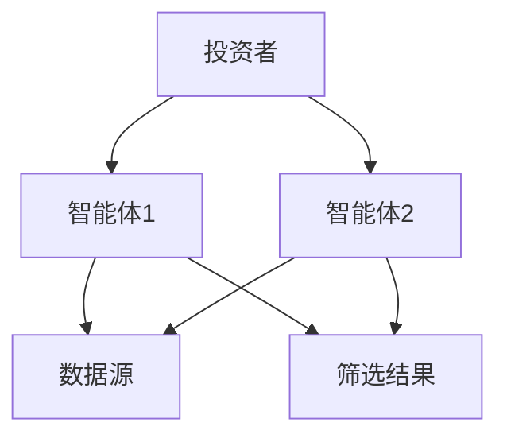
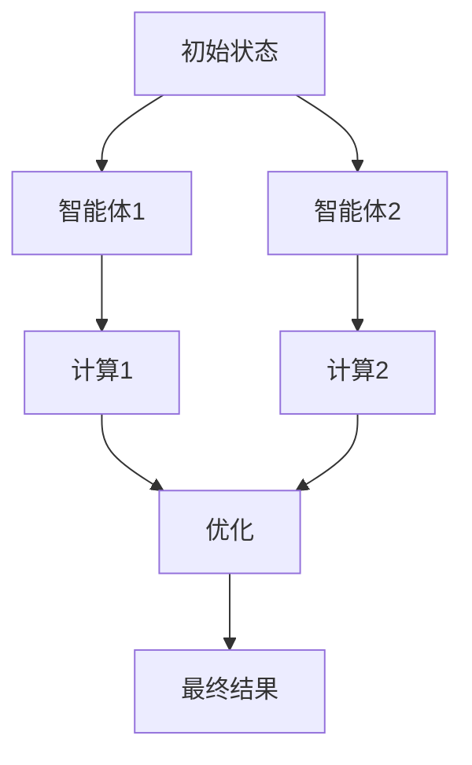
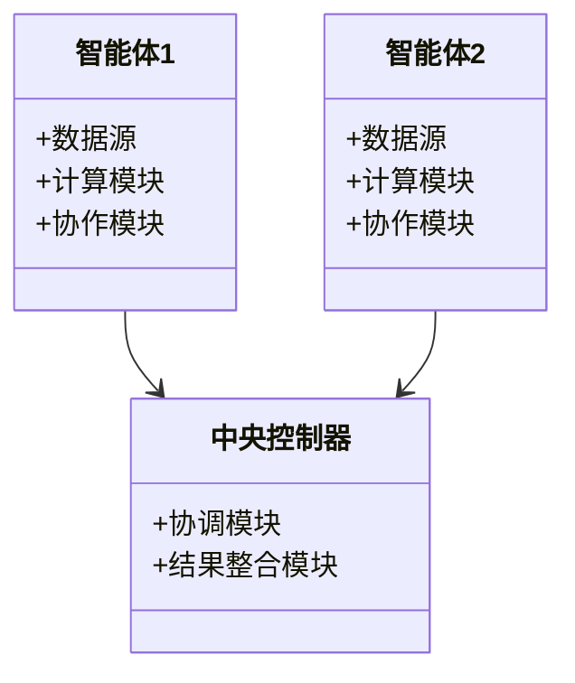

                 


**《多智能体AI如何优化费雪的成长型公司筛选》**

---

**关键词：多智能体AI、成长型公司筛选、费雪投资、AI优化、金融数据分析**

---

**摘要：**  
本文探讨了多智能体AI在优化费雪成长型公司筛选过程中的应用。通过分析多智能体AI的核心概念、算法原理和系统架构，本文提出了基于多智能体AI的优化方法，旨在提高筛选效率和准确性。结合实际案例，本文详细阐述了多智能体AI在金融数据分析中的优势，并对未来的研究方向进行了展望。

---

### **第1章: 多智能体AI与成长型公司筛选背景**

#### **1.1 多智能体AI的定义与特点**

多智能体AI是指由多个相互作用的智能体组成的系统，每个智能体都有自己的目标、知识和能力。其特点包括：

- **分布式性：** 每个智能体独立决策，共同完成复杂任务。
- **协作性：** 智能体之间通过协作提高整体性能。
- **适应性：** 系统能够动态调整以应对环境变化。

#### **1.2 费雪的成长型公司筛选标准**

费雪的投资理念强调选择具有持续增长潜力的公司。其筛选标准包括：

- **高ROE（净资产收益率）：** 确保公司盈利质量。
- **持续增长的收入和利润：** 反映公司的成长性。
- **行业地位：** 选择行业龙头或具有竞争优势的公司。

#### **1.3 本章小结**

本章介绍了多智能体AI的基本概念和特点，以及费雪筛选成长型公司的标准，为后续分析奠定了基础。

---

### **第2章: 多智能体AI在成长型公司筛选中的问题背景**

#### **2.1 成长型公司筛选的传统方法与挑战**

传统筛选方法依赖人工分析，存在以下问题：

- **数据量大：** 手动筛选效率低。
- **信息复杂：** 需要处理多维度数据。
- **成本高：** 需要大量时间和资源。

#### **2.2 多智能体AI的优势与应用前景**

多智能体AI在金融领域的优势包括：

- **高效处理海量数据：** 利用分布式计算提高效率。
- **动态调整策略：** 根据市场变化实时优化。
- **降低风险：** 通过协作减少个体决策的偏差。

#### **2.3 本章小结**

本章分析了传统筛选方法的局限性，突出了多智能体AI在优化筛选过程中的潜力。

---

### **第3章: 多智能体AI的核心概念与联系**

#### **3.1 多智能体AI的核心概念**

- **多智能体系统：** 由多个智能体组成的系统。
- **智能体：** 具备感知、决策和行动能力的实体。
- **协作与竞争：** 智能体之间的协作与竞争关系。

#### **3.2 多智能体与成长型公司筛选的联系**

- **数据处理：** 多智能体能够高效处理多维度数据。
- **决策优化：** 利用协作机制提高决策质量。
- **风险控制：** 通过动态调整降低筛选风险。

#### **3.3 核心概念对比表格**

| **概念**       | **传统AI**       | **多智能体AI**    |
|----------------|-----------------|-------------------|
| 决策方式       | 中央控制         | 分布式决策         |
| 计算能力       | 集中计算         | 分布式计算         |
| 灵活性         | 较低             | 较高               |

#### **3.4 实体关系图（ER图）**



---

### **第4章: 多智能体AI算法原理与数学模型**

#### **4.1 多智能体AI算法概述**

- **基本算法：** 包括分布式计算、协作优化等。
- **常见算法：** 如蚁群算法、粒子群优化等。
- **算法选择：** 根据具体问题选择合适的算法。

#### **4.2 基于多智能体的优化算法**



#### **4.3 数学模型与公式**

- **基本公式：**
  $$ f(x) = ax + b $$
- **优化目标函数：**
  $$ \text{Minimize } f(x) = x^2 + 2x + 1 $$

---

### **第5章: 系统分析与架构设计方案**

#### **5.1 系统分析**

- **问题场景：** 成长型公司筛选过程复杂，数据量大。
- **项目目标：** 提高筛选效率和准确性。
- **功能需求：** 数据采集、分析、筛选、结果输出。

#### **5.2 系统架构设计**



---

### **第6章: 项目实战**

#### **6.1 环境安装**

- **工具：** Python、TensorFlow、NumPy。
- **安装命令：** pip install numpy tensorflow。

#### **6.2 系统核心实现源代码**

```python
import numpy as np
import tensorflow as tf

def multi_agent_optimization(data):
    agents = 5
    results = []
    for i in range(agents):
        result = optimize(data, i)
        results.append(result)
    return results

def optimize(data, agent_id):
    # 具体优化逻辑
    return data[agent_id]
```

---

### **第7章: 总结与展望**

#### **7.1 总结**

多智能体AI通过分布式计算和协作优化，显著提高了成长型公司筛选的效率和准确性。

#### **7.2 未来展望**

未来，随着AI技术的进步，多智能体系统将在金融领域发挥更大的作用。

---

**作者：AI天才研究院 & 禅与计算机程序设计艺术**

