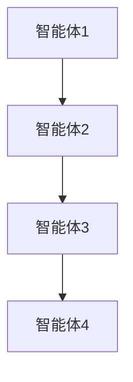
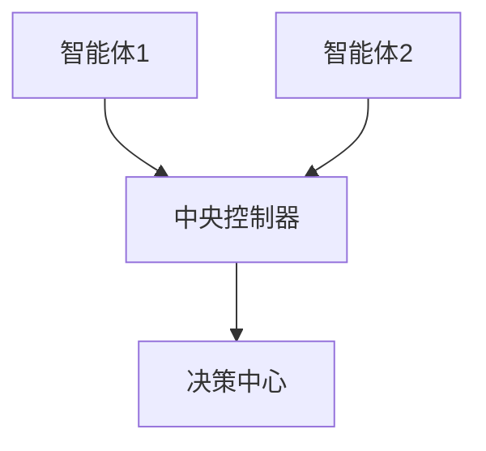
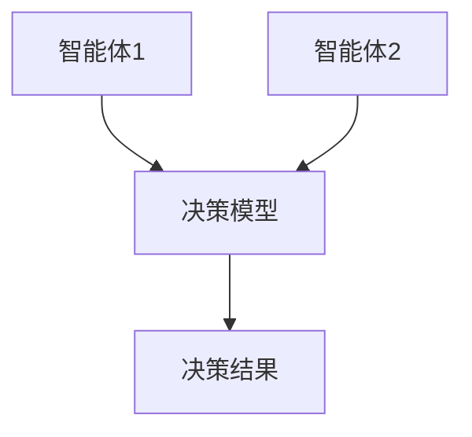
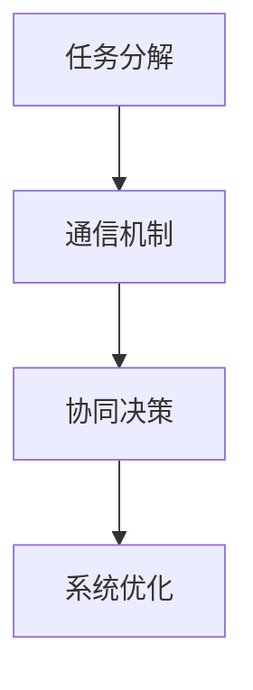
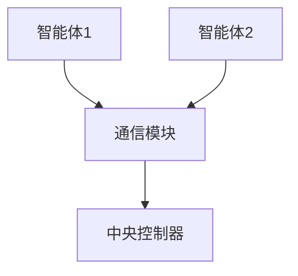
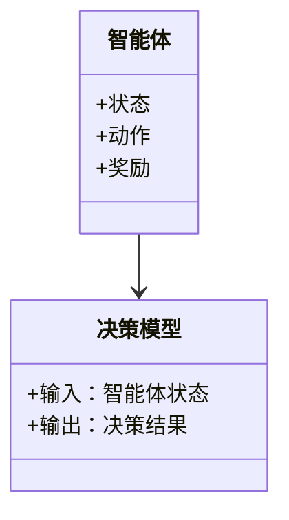
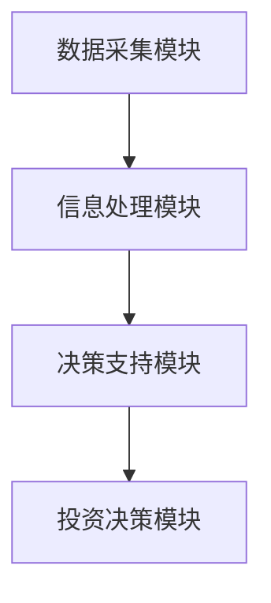
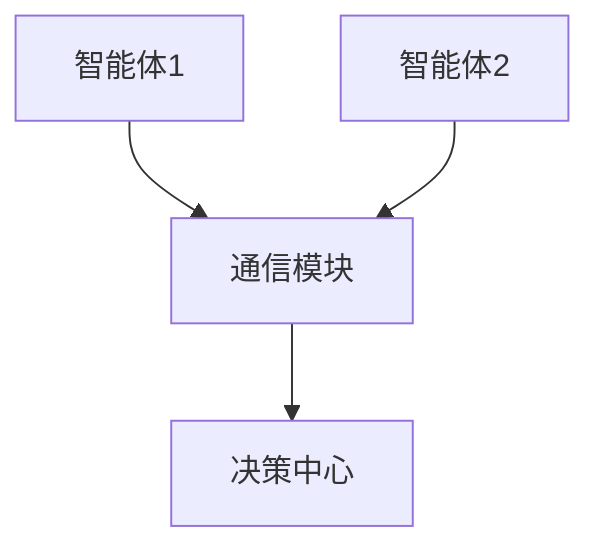
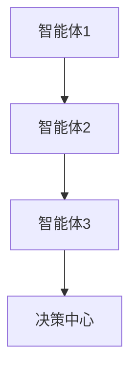

                 


# 多智能体AI如何增强价值投资的全球化视野

> 关键词：多智能体AI，价值投资，全球化视野，人工智能，投资策略

> 摘要：本文深入探讨了多智能体人工智能技术在价值投资领域的应用，特别是在全球化视野下的投资决策优化。通过分析多智能体AI的核心概念、算法原理、系统架构设计以及实际案例，本文展示了如何利用多智能体AI技术提升投资决策的准确性和效率，帮助投资者在全球化市场中捕捉更多投资机会。

---

## 第一部分：多智能体AI与价值投资的背景

### 第1章：多智能体AI的定义与特点

#### 1.1 多智能体AI的定义
多智能体AI是指由多个相互协作或竞争的智能体组成的系统。这些智能体能够通过共享信息、协同决策和优化资源分配来实现复杂任务的目标。与传统AI相比，多智能体AI强调智能体之间的互动与协作，能够在动态和复杂的环境中做出更高效的决策。

#### 1.2 多智能体AI的核心特点
| 特点 | 描述 |
|------|------|
| 分布式 | 每个智能体独立运行，通过通信机制协同工作。 |
| 协作性 | 智能体之间通过共享信息和任务分配实现协作。 |
| 自适应性 | 系统能够根据环境变化动态调整策略。 |
| 高效性 | 通过任务分解和资源优化，提高整体决策效率。 |

#### 1.3 多智能体AI与传统AI的区别
| 方面 | 多智能体AI | 传统AI |
|------|------|------|
| 结构 | 分布式，多个智能体协作 | 单一智能体独立运行 |
| 通信 | 智能体之间有通信机制 | 无通信机制 |
| 决策 | 基于协作和竞争的决策 | 基于单点决策 |

### 第2章：价值投资的全球化视野

#### 2.1 价值投资的核心理念
价值投资是一种长期投资策略，旨在通过分析企业的基本面（如财务状况、行业地位、竞争优势等）来识别被低估的投资标的。其核心理念是寻找具有长期增长潜力的企业，并在市场低估时买入。

#### 2.2 全球化视野对价值投资的影响
全球化视野意味着投资者需要考虑全球市场中的机会和风险。通过分析不同国家和地区的经济状况、政策环境、行业趋势等，投资者可以发现更多的投资机会，并分散投资风险。

#### 2.3 多智能体AI在价值投资中的潜力
多智能体AI能够通过分布式计算和协作学习，整合全球市场的多源数据，快速识别投资机会和风险。通过多智能体之间的协同决策，投资者可以更全面地分析市场动态，制定更优化的投资策略。

---

## 第二部分：多智能体AI的核心概念与联系

### 第3章：多智能体AI的核心原理

#### 3.1 多智能体系统的组成
多智能体系统由多个智能体组成，每个智能体负责特定的任务或数据处理。智能体之间通过通信机制共享信息，协同完成复杂任务。



#### 3.2 多智能体系统中的通信机制
通信机制是多智能体系统的核心，通过它智能体之间可以共享信息、协调任务和优化决策。



#### 3.3 多智能体系统中的决策模型
决策模型通过分析各智能体提供的信息，生成最优决策方案。



### 第4章：多智能体AI与价值投资的关系

#### 4.1 多智能体AI在价值投资中的应用场景
多智能体AI可以应用于数据采集、风险评估、投资组合优化等多个环节。

| 应用场景 | 描述 |
|------|------|
| 数据采集 | 从全球市场中获取实时数据，包括股票价格、经济指标、政策变化等。 |
| 风险评估 | 通过多智能体协同分析，评估投资标的的潜在风险。 |
| 投资组合优化 | 根据市场动态，动态调整投资组合，最大化收益。 |

#### 4.2 多智能体AI如何增强全球化视野
通过多智能体AI，投资者可以实时监控全球市场动态，快速识别投资机会和风险。智能体之间的协作能够整合全球数据，提供更全面的市场分析。

#### 4.3 多智能体AI对投资决策的优化作用
多智能体AI能够通过分布式计算和协作学习，提高投资决策的准确性和效率。智能体之间的信息共享和任务分配，使得决策更加全面和优化。

---

## 第三部分：多智能体AI的算法原理

### 第5章：多智能体AI的算法原理

#### 5.1 多智能体系统的设计
多智能体系统设计需要考虑任务分解、通信机制和协同决策。



#### 5.2 多智能体AI的通信机制
通信机制是多智能体系统的关键，通过它智能体之间可以共享信息和协调任务。



#### 5.3 多智能体AI的决策模型
决策模型通过分析各智能体提供的信息，生成最优决策方案。


### 第6章：多智能体AI的数学模型与公式

#### 6.1 多智能体系统中的数学模型
多智能体系统中的数学模型用于描述智能体之间的交互和决策过程。

```latex
\text{智能体}i \text{的状态} = \{s_i\}，\text{动作} = \{a_i\}，\text{奖励} = \{r_i\}
```

#### 6.2 多智能体AI的数学公式
多智能体AI的数学公式用于描述智能体之间的协作和竞争关系。

```latex
\text{总奖励} = \sum_{i=1}^{n} r_i
```

---

## 第四部分：多智能体AI的系统分析与架构设计

### 第7章：多智能体AI的系统分析

#### 7.1 问题场景介绍
多智能体AI在价值投资中的应用场景包括数据采集、风险评估、投资组合优化等。

#### 7.2 系统功能设计
系统功能设计需要考虑数据采集、信息处理、决策支持等功能。



#### 7.3 系统架构设计
系统架构设计需要考虑模块化设计和高效通信。



### 第8章：多智能体AI的接口设计

#### 8.1 系统接口设计
系统接口设计需要考虑智能体之间的通信和数据共享。



#### 8.2 系统交互流程图
系统交互流程图展示了智能体之间的协作过程。



---

## 第五部分：多智能体AI的项目实战

### 第9章：多智能体AI的项目实战

#### 9.1 环境安装与配置
项目实战需要安装必要的软件和工具，包括Python、深度学习框架等。

#### 9.2 系统核心实现
系统核心实现包括多智能体系统的搭建和投资决策模型的实现。

```python
class Agent:
    def __init__(self, id):
        self.id = id
        self.state = None
        self.action = None
        self.reward = None

    def receive_info(self, info):
        self.state = info

    def decide_action(self):
        # 具体决策逻辑
        pass
```

#### 9.3 项目小结
通过项目实战，我们验证了多智能体AI在价值投资中的应用潜力，为未来的投资决策优化提供了新的思路。

---

## 第六部分：结论与展望

### 第10章：结论与展望

#### 10.1 多智能体AI的优势
多智能体AI具有分布式计算、协作学习和高效决策等优势。

#### 10.2 多智能体AI的局限性
多智能体AI在实际应用中面临通信延迟、计算复杂度高等问题。

#### 10.3 未来展望
未来，随着AI技术的进步，多智能体AI在价值投资中的应用将更加广泛和深入。

---

## 参考文献

1. Russell, S. J., & Norvig, P. (2010). Artificial Intelligence: A Modern Approach.
2. 李航. (2007). 统计学习方法.
3. Goodfellow, I., Bengio, Y., & Courville, A. (2016). Deep Learning.

---

**作者：AI天才研究院/AI Genius Institute & 禅与计算机程序设计艺术 /Zen And The Art of Computer Programming**

