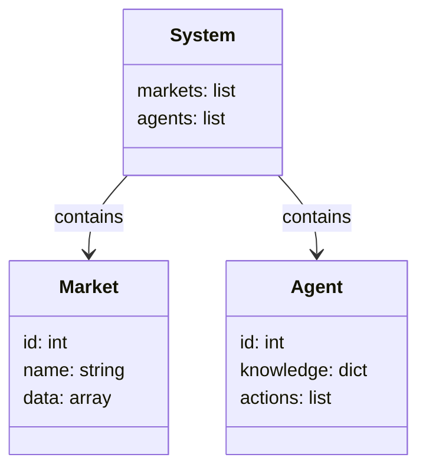
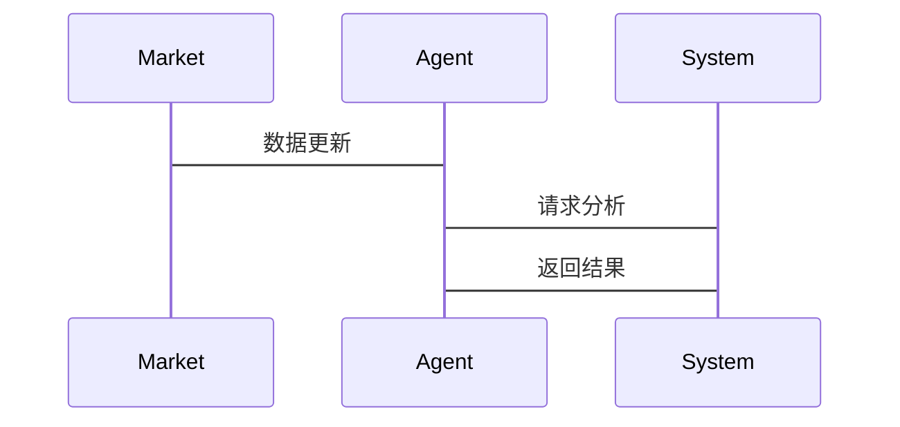

                 


```markdown
# 多智能体AI如何增强价值投资的跨市场相关性分析

> 关键词：多智能体AI，价值投资，跨市场相关性，金融数据分析，人工智能

> 摘要：本文探讨了多智能体AI在价值投资中的应用，特别是如何通过增强跨市场相关性分析来提升投资决策的准确性。通过详细分析多智能体系统的协作机制和价值投资模型的优化策略，本文展示了如何利用先进的AI技术捕捉和分析跨市场数据，从而为投资者提供更精准的决策支持。

---

# 第1章: 多智能体AI与价值投资的背景介绍

## 1.1 多智能体AI的基本概念
### 1.1.1 多智能体系统的定义
多智能体系统（Multi-Agent System, MAS）是由多个智能体组成的分布式系统，这些智能体能够通过协作完成复杂的任务。每个智能体都有自己的目标、知识和行为规则，能够独立决策并与其他智能体进行通信和协作。

### 1.1.2 多智能体系统的核心特征
- **自主性**：每个智能体都能独立决策。
- **反应性**：能够感知环境并实时响应。
- **协作性**：通过通信和协作完成共同目标。
- **分布性**：智能体之间没有集中控制。

### 1.1.3 多智能体AI在金融领域的应用潜力
多智能体AI在金融领域的应用包括实时数据分析、风险评估、投资组合优化等。通过多智能体系统的协作，可以更高效地处理复杂金融数据，发现潜在投资机会。

## 1.2 价值投资的基本原理
### 1.2.1 价值投资的定义与核心理念
价值投资是一种长期投资策略，通过分析企业的基本面，如财务状况、行业地位等，寻找被市场低估的投资标的。核心理念是购买低于内在价值的资产。

### 1.2.2 价值投资的关键要素分析
- **内在价值**：企业未来现金流的现值。
- **市场情绪**：投资者情绪对市场价格的影响。
- **财务数据**：如收入、利润、资产负债等。

### 1.2.3 价值投资与传统投资方法的区别
价值投资注重长期基本面分析，而传统投资方法可能更关注短期市场波动。多智能体AI可以帮助投资者更准确地分析财务数据和市场趋势，辅助价值投资决策。

## 1.3 跨市場相關性分析的必要性
### 1.3.1 跨市場相關性分析的定义
跨市场相关性分析是指研究不同市场之间资产价格变动的相关性，帮助投资者理解各市场之间的联动关系。

### 1.3.2 跨市場相關性分析的重要性
跨市场相关性分析有助于投资者分散风险、优化投资组合。例如，当一个市场波动较大时，相关市场的资产可能也会受到影响。

### 1.3.3 跨市場相關性分析在价值投资中的应用
通过分析不同市场的相关性，价值投资者可以更好地识别潜在风险和机会，优化投资组合配置。

## 1.4 本章小结
本章介绍了多智能体AI和价值投资的基本概念，并强调了跨市场相关性分析在价值投资中的重要性。通过多智能体AI，投资者可以更高效地分析跨市场数据，提升投资决策的准确性。

---

# 第2章: 多智能体AI与价值投资的核心概念

## 2.1 多智能体AI的系统架构
### 2.1.1 多智能体系统的组成要素
- **智能体**：每个智能体负责特定任务，如数据收集、分析、决策。
- **通信机制**：智能体之间通过消息传递进行协作。
- **协作策略**：定义智能体如何分配任务和协调行动。

### 2.1.2 多智能体系统的通信机制
通信机制包括消息传递、状态共享等，确保智能体之间能够高效协作。

### 2.1.3 多智能体系统的协作策略
协作策略包括任务分配、协调同步等，确保系统整体目标的实现。

## 2.2 价值投资模型的构建
### 2.2.1 价值投资模型的构建方法
价值投资模型基于对企业基本面的分析，结合市场数据，预测资产的内在价值。

### 2.2.2 价值投资模型的关键参数
- **收入与利润**：企业的收入和利润状况。
- **资产负债**：企业的资产和负债情况。
- **行业地位**：企业在行业中的竞争地位。

### 2.2.3 价值投资模型的优化策略
通过多智能体AI优化模型参数，提升模型的准确性和预测能力。

## 2.3 跨市場相關性分析的数学模型
### 2.3.1 跨市場相關性分析的基本公式
跨市场相关性通常用相关系数（correlation coefficient）衡量，公式如下：

$$ r = \frac{\sum (x_i - \bar{x})(y_i - \bar{y})}{\sqrt{\sum (x_i - \bar{x})^2 \sum (y_i - \bar{y})^2}} $$

其中，$x_i$和$y_i$是两个市场的资产回报率，$\bar{x}$和$\bar{y}$是其平均值。

### 2.3.2 跨市場相關性分析的变量关系
相关系数$r$的取值范围在-1到1之间，正值表示正相关，负值表示负相关。

### 2.3.3 跨市場相關性分析的数学推导
通过数学推导，可以证明相关系数是衡量两个变量线性关系的指标。

## 2.4 多智能体AI与价值投资的关联性
### 2.4.1 多智能体AI在价值投资中的作用
多智能体AI可以同时分析多个市场的数据，发现跨市场相关性，辅助价值投资决策。

### 2.4.2 多智能体AI与价值投资模型的结合
通过多智能体协作，优化价值投资模型的参数和预测能力。

### 2.4.3 多智能体AI对跨市场相关性分析的增强作用
多智能体AI能够高效处理海量数据，发现传统方法难以察觉的跨市场相关性。

## 2.5 本章小结
本章详细探讨了多智能体AI与价值投资的核心概念，并通过数学模型解释了跨市场相关性分析的原理和应用。

---

# 第3章: 多智能体AI的算法原理

## 3.1 多智能体协作算法
### 3.1.1 多智能体协作的基本原理
多智能体协作算法通过智能体之间的通信和协作，完成复杂任务。

### 3.1.2 多智能体协作的通信协议
通信协议定义了智能体之间消息的格式和传输方式。

### 3.1.3 多智能体协作的同步机制
同步机制确保智能体之间的协作协调一致。

## 3.2 价值投资模型的优化算法
### 3.2.1 价值投资模型的参数优化
通过多智能体协作，优化价值投资模型的参数，如权重和阈值。

### 3.2.2 价值投资模型的训练方法
使用历史数据训练模型，通过不断迭代提升模型预测能力。

### 3.2.3 价值投资模型的评估指标
常用的评估指标包括准确率、召回率和F1值。

## 3.3 跨市場相關性分析的算法实现
### 3.3.1 跨市場相關性分析的步骤分解
1. 数据收集：收集多个市场的历史数据。
2. 数据预处理：清洗和标准化数据。
3. 计算相关系数：使用相关系数公式计算跨市场相关性。
4. 可视化分析：绘制相关性热图，直观展示相关性。

### 3.3.2 跨市場相關性分析的算法流程
- 数据预处理
- 计算相关系数
- 可视化展示

### 3.3.3 跨市場相關性分析的代码实现
```python
import pandas as pd
import numpy as np
import matplotlib.pyplot as plt
import seaborn as sns

# 示例数据：假设df是包含多个市场的数据
df = pd.read_csv('market_data.csv')

# 计算相关系数矩阵
correlation_matrix = df.corr()

# 绘制相关性热图
plt.figure(figsize=(10, 8))
sns.heatmap(correlation_matrix, annot=True, cmap='coolwarm')
plt.title('Cross Market Correlation Heatmap')
plt.show()
```

## 3.4 算法的数学模型与公式
### 3.4.1 跨市場相關性分析的相关系数公式
如前所述，相关系数公式为：

$$ r = \frac{\sum (x_i - \bar{x})(y_i - \bar{y})}{\sqrt{\sum (x_i - \bar{x})^2 \sum (y_i - \bar{y})^2}} $$

---

# 第4章: 系统架构设计与实现

## 4.1 问题场景介绍
我们设计一个多智能体系统，用于分析和预测多个市场的相关性，辅助价值投资决策。

## 4.2 领域模型设计


## 4.3 系统架构设计
```mermaid
--- architecture of the system ---
```

## 4.4 接口设计与交互流程


## 4.5 本章小结
本章详细设计了多智能体系统的架构，并展示了如何通过协作机制实现跨市场相关性分析。

---

# 第5章: 项目实战与案例分析

## 5.1 环境安装与配置
- 安装必要的库，如Pandas、NumPy、Matplotlib等。
- 数据来源：获取多个市场的历史数据。

## 5.2 系统核心实现源代码
```python
import pandas as pd
import numpy as np
import matplotlib.pyplot as plt
import seaborn as sns

# 数据加载
df = pd.read_csv('market_data.csv')

# 相关性分析
correlation_matrix = df.corr()

# 热图绘制
plt.figure(figsize=(10, 8))
sns.heatmap(correlation_matrix, annot=True, cmap='coolwarm')
plt.title('Cross Market Correlation Heatmap')
plt.show()
```

## 5.3 代码应用解读与分析
- 数据加载：读取CSV文件中的市场数据。
- 相关性分析：计算相关系数矩阵。
- 可视化：绘制热图，直观展示相关性。

## 5.4 实际案例分析
以实际市场数据为例，展示相关性分析的结果，并解释如何辅助价值投资决策。

## 5.5 本章小结
通过项目实战，我们展示了如何利用多智能体AI进行跨市场相关性分析，并为价值投资提供支持。

---

# 第6章: 多智能体AI在跨市场相关性分析中的挑战与解决方案

## 6.1 智能体协作中的挑战
- **通信开销**：智能体之间通信可能导致延迟。
- **协调问题**：如何确保智能体协作一致。

## 6.2 数据处理中的挑战
- **数据异构性**：不同市场数据格式和频率不同。
- **数据噪声**：如何处理噪声数据。

## 6.3 模型优化中的挑战
- **计算复杂度**：大规模数据的计算需求。
- **模型鲁棒性**：如何确保模型在不同市场环境下的稳定性。

## 6.4 解决方案
- **优化通信机制**：减少不必要的通信开销。
- **数据预处理**：统一数据格式，去除噪声。
- **分布式计算**：利用分布式计算框架优化模型训练。

## 6.5 本章小结
本章分析了多智能体AI在跨市场相关性分析中面临的主要挑战，并提出了解决方案。

---

# 第7章: 总结与展望

## 7.1 总结
本文详细探讨了多智能体AI在价值投资中的应用，特别是如何通过增强跨市场相关性分析来提升投资决策的准确性。

## 7.2 未来研究方向
- **智能体协作优化**：进一步优化智能体协作机制。
- **模型可解释性**：提升模型的可解释性，便于投资者理解。
- **多模态数据融合**：结合文本、图像等多种数据源，提升分析精度。

## 7.3 应用前景
随着AI技术的不断发展，多智能体系统在金融领域的应用前景广阔，能够为投资者提供更智能、更精准的投资决策支持。

## 7.4 本章小结
本文总结了多智能体AI在价值投资中的应用，并展望了未来的研究方向和应用前景。

---

# 作者：AI天才研究院 & 禅与计算机程序设计艺术
```

