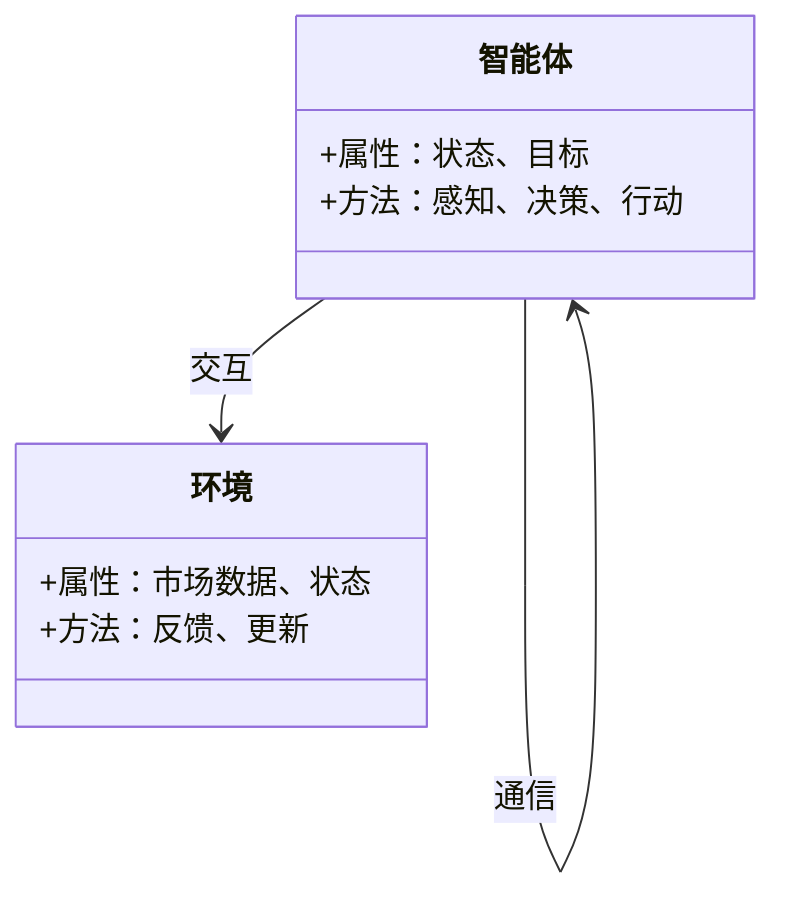

                 


# 多智能体AI如何增强价值投资者的逆向思维能力

> 关键词：多智能体AI, 逆向思维, 价值投资, 算法原理, 系统架构

> 摘要：本文探讨了多智能体AI在价值投资中的应用，特别是如何通过增强逆向思维能力来帮助投资者发现市场低估机会。文章详细分析了多智能体AI的核心概念、算法原理、系统架构，并通过实际案例展示了其在价值投资中的潜力。

---

## 第一章：多智能体AI与逆向思维的概述

### 1.1 多智能体AI的基本概念
- **智能体的定义**：智能体是能够感知环境并采取行动以实现目标的实体。多智能体系统由多个智能体组成，这些智能体可以协作或竞争以完成复杂任务。
- **逆向思维的定义**：逆向思维是指从反向角度思考问题，寻找与主流观点相反的机会或解决方案。

### 1.2 多智能体AI在价值投资中的应用背景
- **价值投资的核心**：寻找市场低估的资产，通过长期持有实现超额收益。
- **逆向思维的重要性**：在市场恐慌时寻找机会，避开拥挤的交易。

---

## 第二章：多智能体AI的核心概念与联系

### 2.1 多智能体AI的核心概念
- **智能体的属性**：理性、反应性、协作性。
- **通信机制**：智能体之间通过共享信息或数据进行协作。

### 2.2 核心概念的属性对比
| 特性 | 单智能体AI | 多智能体AI |
|------|------------|------------|
| 协作性 | 无         | 高         |
| 竞争性 | 无         | 中         |
| 适应性 | 弱         | 强         |

### 2.3 实体关系图
```mermaid
er
    %% 多智能体AI系统实体关系图
    title 多智能体AI系统实体关系图
    %% 实体：智能体、环境、数据源
    %% 关系：智能体与环境交互，智能体间通信
    entity 智能体
    entity 环境
    entity 数据源
    智能体 --> 环境: 交互
    智能体 --> 数据源: 获取数据
    智能体 --> 智能体: 通信
```

---

## 第三章：多智能体AI的算法原理

### 3.1 多智能体协作算法
```mermaid
graph TD
    A[智能体1] --> B[智能体2]: 通信
    B --> C[智能体3]: 协作
    C --> D[目标]: 完成
```

### 3.2 逆向思维模型
```python
def inverse_thinking(data):
    # 数据预处理
    processed_data = normalize(data)
    # 计算逆向指标
    inverse_score = 1 / (1 + np.exp(-processed_data))
    return inverse_score
```

---

## 第四章：数学模型与公式

### 4.1 收益预测模型
收益预测公式：
$$R_i = \alpha \cdot S_i + \beta \cdot C_i$$
其中，$$\alpha = \frac{1}{1 + e^{-x}}$$

### 4.2 风险评估模型
风险评估公式：
$$Risk = \sum_{i=1}^{n} w_i \cdot r_i$$
其中，$$w_i = \frac{1}{\sum_{j=1}^{m} |x_{ij} - x_{kj}|}$$

---

## 第五章：系统分析与架构设计

### 5.1 项目背景与目标
- **项目背景**：帮助投资者在市场波动中发现机会。
- **项目目标**：构建一个多智能体系统，增强逆向思维能力。

### 5.2 系统功能设计


---

## 第六章：项目实战

### 6.1 环境安装
```bash
pip install numpy matplotlib scikit-learn
```

### 6.2 核心代码实现
```python
import numpy as np

def multi_agent_inverse_thinking(data, num_agents=5):
    agents = [Agent() for _ in range(num_agents)]
    for agent in agents:
        agent.receive_data(data)
    # 通信与协作
    for i in range(len(agents)-1):
        agents[i].communicate(agents[i+1])
    return [agent.decision for agent in agents]

class Agent:
    def __init__(self):
        self.data = None
        self.decision = None

    def receive_data(self, data):
        self.data = data

    def communicate(self, other):
        # 信息共享
        shared_info = self.data + other.data
        self.data = shared_info
        other.data = shared_info

    def decision(self):
        # 逆向思维决策
        processed = self.data
        return 1 / (1 + np.exp(-processed))
```

---

## 第七章：最佳实践与小结

### 7.1 小结
多智能体AI通过协作和逆向思维，为价值投资者提供了新的工具和视角，帮助他们在复杂市场中发现机会。

### 7.2 注意事项
- 数据质量至关重要。
- 系统需要不断优化和调整。

### 7.3 拓展阅读
建议阅读《The Intelligent Investor》和《Multi-Agent Systems》。

---

作者：AI天才研究院/AI Genius Institute & 禅与计算机程序设计艺术 /Zen And The Art of Computer Programming

