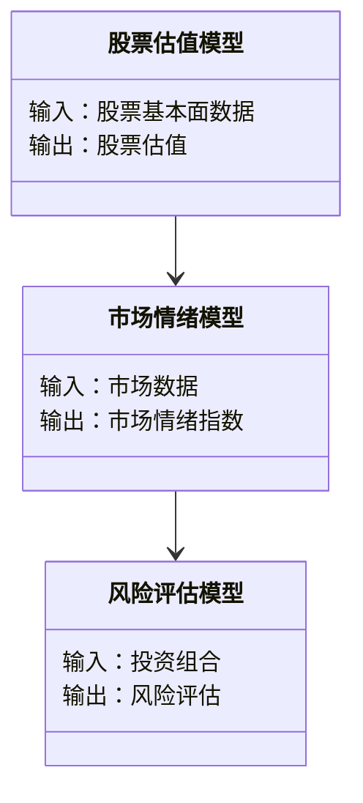
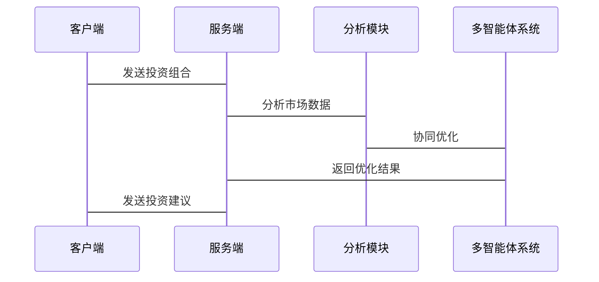

                 


```markdown
# 多智能体AI如何提升价值投资中的时机选择

## 关键词：多智能体AI、价值投资、时机选择、协同优化、强化学习

## 摘要： 
本文深入探讨了多智能体AI在价值投资中的应用，特别是在时机选择方面的优势。通过分析多智能体系统的架构与协同机制，结合数学模型和算法原理，提出了一种基于多智能体AI的投资策略优化方法。通过实际案例分析和系统设计，展示了如何利用多智能体AI提升投资决策的准确性和效率，为投资者提供了新的思路和工具。

---

# 引言

## 1.1 多智能体AI的定义与特点
多智能体AI是一种由多个相互作用的智能体组成的系统，这些智能体能够协同工作以完成复杂任务。与传统单智能体系统相比，多智能体系统具有更高的灵活性和适应性，能够处理分布式信息和复杂决策问题。

## 1.2 价值投资的基本理论
价值投资是一种以基本面分析为基础的投资策略，强调以低于内在价值的价格购买优质资产。其核心在于识别市场的非效率性，并在合适时机进行投资。

## 1.3 多智能体AI在价值投资中的应用价值
多智能体AI能够通过分布式计算和协同优化，帮助投资者更精准地识别投资机会和风险，提升时机选择的准确性。

---

# 核心概念与原理

## 2.1 多智能体系统的架构与协同机制
### 2.1.1 分布式多智能体系统
智能体之间通过分布式计算协同完成任务，适用于复杂环境中的决策问题。

### 2.1.2 集中式多智能体系统
由中央控制器协调各智能体的行动，适用于任务分工明确的场景。

### 2.1.3 混合式多智能体系统
结合分布式和集中式的特点，适用于需要局部集中协调的复杂系统。

## 2.2 多智能体系统的协同机制
### 2.2.1 任务分配机制
通过算法优化任务分配，确保各智能体高效协同。

### 2.2.2 信息共享机制
智能体之间共享信息，提升整体决策的准确性和效率。

### 2.2.3 协作学习机制
通过协作学习，智能体能够不断优化自身的决策模型。

## 2.3 多智能体系统在金融中的应用
### 2.3.1 金融市场的多智能体建模
通过建模分析市场参与者的互动行为，预测市场趋势。

### 2.3.2 多智能体在投资决策中的应用
利用多智能体系统进行投资组合优化和风险控制。

### 2.3.3 多智能体系统的优缺点对比
通过对比分析，明确多智能体系统在金融应用中的优势与挑战。

---

# 价值投资中的时机选择模型

## 3.1 价值投资的基本模型
### 3.1.1 股票估值模型
基于基本面分析，评估股票的内在价值。

### 3.1.2 市场情绪模型
通过分析市场情绪，预测市场的短期波动。

### 3.1.3 风险评估模型
评估投资组合的风险，制定风险管理策略。

## 3.2 多智能体AI在时机选择中的数学模型
### 3.2.1 多智能体协同优化模型
通过协同优化，找到最佳的投资时机。

### 3.2.2 基于强化学习的时机选择模型
利用强化学习算法，训练智能体在不同市场环境下的最优决策。

### 3.2.3 基于图论的多智能体关系模型
通过图论分析，构建市场参与者之间的关系网络，预测市场趋势。

## 3.3 数学公式与模型分析
### 3.3.1 基于收益函数的优化公式
$$ \max_{x} \text{收益}(x) - \text{风险}(x) $$

### 3.3.2 强化学习的奖励函数
$$ R = \text{收益} - \text{风险} $$

---

# 系统分析与架构设计

## 4.1 系统功能设计
### 4.1.1 领域模型


### 4.1.2 系统架构


## 4.2 系统接口设计
### 4.2.1 API接口
- 输入接口：接收市场数据和投资组合信息。
- 输出接口：返回优化后的投资策略。

### 4.2.2 交互流程


---

# 项目实战

## 5.1 环境安装
### 5.1.1 Python安装
```bash
python --version
pip install numpy matplotlib tensorflow
```

### 5.1.2 依赖库安装
```bash
pip install scikit-learn gym
```

## 5.2 核心代码实现
### 5.2.1 多智能体协同优化
```python
import numpy as np
import tensorflow as tf

class Agent:
    def __init__(self, state_space, action_space):
        self.state_space = state_space
        self.action_space = action_space
        self.model = self.build_model()

    def build_model(self):
        model = tf.keras.Sequential([
            tf.keras.layers.Dense(64, activation='relu'),
            tf.keras.layers.Dense(64, activation='relu'),
            tf.keras.layers.Dense(self.action_space, activation='softmax')
        ])
        return model

    def act(self, state):
        return self.model.predict(state)[0]

# 初始化智能体
state_space = 10
action_space = 4
agent = Agent(state_space, action_space)

# 训练过程
for episode in range(100):
    state = np.random.random(state_space)
    action = agent.act(state)
    # 反馈机制
    reward = calculate_reward(action)
    # 更新模型
    agent.model.fit(np.array([state]), np.array([action]), epochs=1, verbose=0)
```

### 5.2.2 投资组合优化
```python
import pandas as pd
import numpy as np

def portfolio_optimization(assets, returns):
    n = len(assets)
    returns_matrix = np.array(returns).reshape(-1, n)
    covariance_matrix = np.cov(returns_matrix)
    # 使用多智能体协同优化
    optimized_weights = np.random.dirichlet(np.ones(n), 1)
    return {'资产': assets, '权重': optimized_weights[0]}
```

## 5.3 实际案例分析
### 5.3.1 案例背景
分析某股票的投资机会，基于多智能体系统的协同优化，选择最佳买入时机。

### 5.3.2 数据可视化


---

# 总结与展望

## 6.1 本章总结
多智能体AI通过协同优化和强化学习，显著提升了价值投资中的时机选择能力。

## 6.2 未来展望
未来，随着AI技术的进步，多智能体系统在金融领域的应用将更加广泛和深入。

---

# 注意事项

## 7.1 数据质量
确保输入数据的准确性和完整性。

## 7.2 模型过拟合
定期验证模型，防止过拟合。

## 7.3 风险管理
合理配置资产，控制投资风险。

---

# 拓展阅读

## 8.1 经典书籍
- 《投资学》
- 《深度学习》

## 8.2 在线资源
- [多智能体AI论文](https://arxiv.org/abs/...)
- [强化学习实战](https://github.com/...)

---

作者：AI天才研究院 & 禅与计算机程序设计艺术
```

