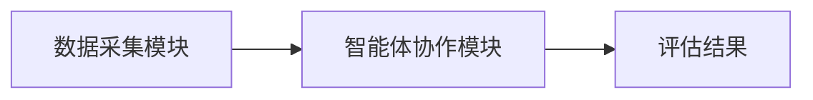
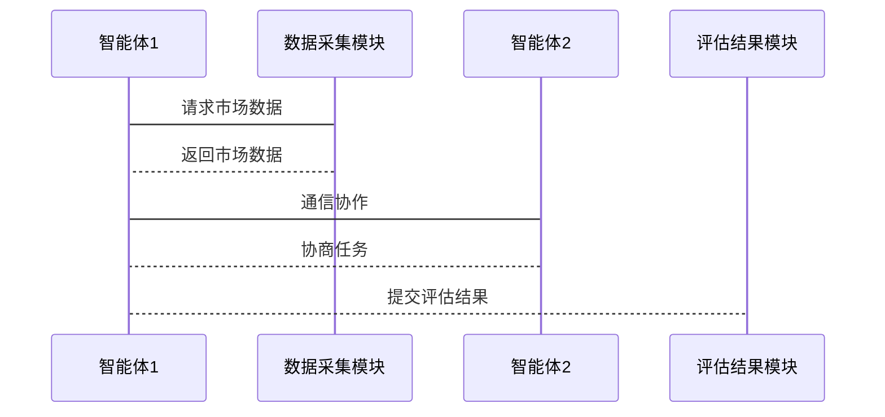

                 


# 多智能体AI如何改进巴菲特的经济护城河评估方法

> 关键词：多智能体AI，经济护城河，巴菲特投资策略，AI投资分析，企业竞争优势

> 摘要：本文探讨了多智能体AI在改进巴菲特经济护城河评估方法中的应用。通过分析多智能体AI的核心原理、算法模型和系统架构，展示了如何利用多智能体AI技术优化企业竞争优势评估，提升投资决策的准确性和效率。

---

## 第1章 多智能体AI与巴菲特经济护城河概述

### 1.1 多智能体AI的定义与特点

#### 1.1.1 多智能体AI的定义
多智能体AI（Multi-Agent AI）是指由多个具有自主决策能力的智能体（Agent）组成的系统，这些智能体能够通过协作完成复杂的任务。与传统的单智能体AI不同，多智能体AI强调智能体之间的互动和协作，能够处理动态、复杂和分布式的问题。

#### 1.1.2 多智能体AI的核心特点
1. **自主性**：每个智能体都能自主决策，无需外部干预。
2. **协作性**：智能体之间通过通信和协调完成任务。
3. **分布式计算**：问题被分解为多个子问题，由不同的智能体分别处理。
4. **适应性**：系统能够动态调整以应对环境变化。

#### 1.1.3 多智能体AI与传统AI的区别
| 特性         | 单智能体AI         | 多智能体AI       |
|--------------|-------------------|------------------|
| 决策主体     | 单一主体           | 多个主体         |
| 问题规模     | 简单或中等规模     | 复杂或大规模     |
| 协作能力     | 无或有限           | 强             |

### 1.2 巴菲特经济护城河理论

#### 1.2.1 经济护城河的定义
经济护城河是指企业在市场上建立的竞争优势，使其能够长期抵御竞争对手的侵蚀。巴菲特认为，拥有深厚经济护城河的企业能够在长期为股东创造超额收益。

#### 1.2.2 经济护城河的核心要素
1. **市场地位**：企业在市场中的主导地位。
2. **资源优势**：独特的资源或技术。
3. **运营效率**：高于行业的运营效率。
4. **财务状况**：健康的财务状况和现金流。

#### 1.2.3 巴菲特投资策略与经济护城河的关系
巴菲特的投资策略注重寻找具有深厚经济护城河的企业，因为这些企业能够在长期保持竞争优势，为投资者带来稳定的收益。

### 1.3 多智能体AI在经济护城河评估中的应用前景

#### 1.3.1 多智能体AI在经济护城河评估中的优势
1. **分布式计算能力**：能够处理大规模、复杂的数据。
2. **协作能力**：多个智能体可以分别分析不同的经济指标。
3. **动态适应性**：能够实时调整评估策略以应对市场变化。

#### 1.3.2 多智能体AI与巴菲特投资策略的结合
通过多智能体AI，可以更高效地分析企业的市场地位、资源优势等经济护城河要素，从而优化巴菲特的投资决策。

#### 1.3.3 多智能体AI在投资决策中的潜在价值
1. 提高评估效率。
2. 增强评估的准确性。
3. 动态调整评估策略。

---

## 第2章 多智能体AI的核心概念与联系

### 2.1 多智能体AI的核心原理

#### 2.1.1 多智能体系统的定义
多智能体系统由多个智能体组成，每个智能体都有自己的目标和行为，通过协作完成复杂的任务。

#### 2.1.2 多智能体系统的协作机制
1. **通信机制**：智能体之间通过消息传递进行通信。
2. **协调机制**：通过协商分配任务。
3. **决策机制**：基于局部信息做出决策。

#### 2.1.3 多智能体系统的通信与协调
智能体之间需要通过通信协议进行信息交换，并通过协调算法实现任务分配。

### 2.2 经济护城河评估的核心要素

#### 2.2.1 市场地位
企业在市场中的份额和竞争力。

#### 2.2.2 资源优势
企业拥有的独特资源和技术。

#### 2.2.3 运营效率
企业运营的效率和成本控制能力。

#### 2.2.4 财务状况
企业的财务健康状况和现金流情况。

### 2.3 多智能体AI与经济护城河评估的联系

#### 2.3.1 多智能体AI在经济护城河评估中的角色
1. **数据采集**：智能体负责收集企业的市场数据。
2. **分析评估**：多个智能体分别评估不同的经济指标。
3. **综合决策**：智能体协作生成最终的评估报告。

#### 2.3.2 多智能体AI如何优化经济护城河评估过程
通过分布式计算和协作，多智能体AI能够更高效地完成评估任务，提高评估的准确性和效率。

#### 2.3.3 多智能体AI在经济护城河评估中的具体应用场景
1. 实时监测企业的市场地位。
2. 分析企业的资源优势。
3. 评估企业的运营效率和财务状况。

---

## 第3章 多智能体AI算法原理与数学模型

### 3.1 多智能体AI的核心算法

#### 3.1.1 强化学习算法
强化学习是一种通过试错方式来优化决策的算法，适用于动态环境中的决策问题。

#### 3.1.2 博弈论模型
博弈论模型用于分析多个智能体之间的互动和决策。

#### 3.1.3 分布式计算与协作算法
分布式计算算法用于多智能体之间的任务分配和协作。

### 3.2 多智能体AI的数学模型

#### 3.2.1 Q-learning算法公式
$$ Q(s, a) = (1-\alpha)Q(s, a) + \alpha[r + \max_{a'} Q(s', a')] $$
其中，$Q(s, a)$表示在状态$s$下采取动作$a$的期望奖励值，$\alpha$是学习率，$r$是即时奖励，$s'$是下一个状态。

#### 3.2.2 多智能体协作模型
$$ V(s) = \max_{a} \sum_{i=1}^{n} Q_i(s, a_i) $$
其中，$n$是智能体的数量，$Q_i$是第$i$个智能体的Q值函数。

### 3.3 经济护城河评估的数学模型

#### 3.3.1 经济护城河评分公式
$$ \text{护城河评分} = \sum_{i=1}^{4} w_i \cdot f_i(x_i) $$
其中，$w_i$是第$i$个经济指标的权重，$f_i(x_i)$是第$i$个经济指标的评估函数。

---

## 第4章 多智能体AI系统架构设计

### 4.1 系统功能设计

#### 4.1.1 数据采集模块
负责收集企业的市场数据、财务数据等。

#### 4.1.2 智能体协作模块
负责多个智能体之间的通信和协作。

### 4.2 系统架构设计

#### 4.2.1 系统架构图


#### 4.2.2 系统交互流程图


### 4.3 系统接口设计

#### 4.3.1 系统接口
1. 数据采集接口：用于获取企业的市场数据。
2. 智能体协作接口：用于智能体之间的通信和协作。

### 4.4 系统实现与优化

#### 4.4.1 系统实现
1. 数据采集模块的实现。
2. 智能体协作模块的实现。
3. 评估结果模块的实现。

#### 4.4.2 系统优化
1. 提高数据采集的效率。
2. 优化智能体协作算法。
3. 提高系统的可扩展性。

---

## 第5章 项目实战：基于多智能体AI的经济护城河评估系统

### 5.1 项目背景与目标
通过多智能体AI技术，构建一个高效的经济护城河评估系统，用于辅助投资者做出更明智的投资决策。

### 5.2 环境安装与配置
1. 安装Python和相关库（如TensorFlow、Keras）。
2. 配置多智能体协作框架（如Multi-Agent Framework）。

### 5.3 系统核心实现

#### 5.3.1 数据采集模块
```python
def collect_data():
    # 数据采集逻辑
    pass
```

#### 5.3.2 智能体协作模块
```python
def agent_collaboration():
    # 协作逻辑
    pass
```

#### 5.3.3 评估结果模块
```python
def evaluate护城河():
    # 评估逻辑
    pass
```

### 5.4 实际案例分析与结果解读
通过实际案例分析，展示多智能体AI在经济护城河评估中的应用效果。

### 5.5 系统优化与改进建议
1. 提高系统的实时性。
2. 增强系统的鲁棒性。
3. 提供更多的评估指标。

---

## 第6章 总结与展望

### 6.1 总结
通过多智能体AI技术，可以显著提高经济护城河评估的效率和准确性，为投资者提供更可靠的决策支持。

### 6.2 未来展望
随着多智能体AI技术的不断发展，其在经济护城河评估中的应用前景将更加广阔，未来可能会出现更多创新性的应用。

---

## 作者：AI天才研究院/AI Genius Institute & 禅与计算机程序设计艺术/Zen And The Art of Computer Programming

