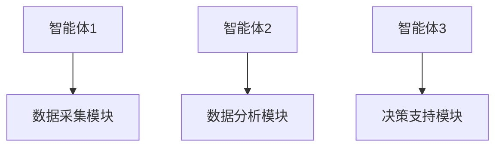
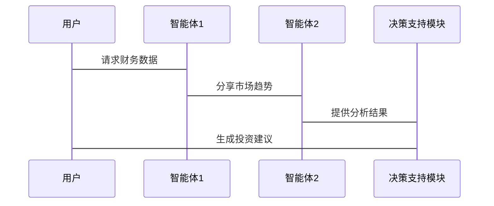

                 


# 多智能体AI如何改进巴菲特的财报分析方法

## 关键词
多智能体AI，巴菲特，财报分析，投资策略，人工智能

## 摘要
本文探讨了如何利用多智能体人工智能技术来改进巴菲特的经典财报分析方法。通过分析多智能体AI的核心原理、算法设计和系统架构，结合实际项目案例，展示了如何利用多智能体协作机制提升财报分析的准确性和效率。文章还详细介绍了系统的实现过程，包括环境配置、数据处理、模型训练和结果解读，并总结了多智能体AI在投资分析中的优势和未来发展方向。

---

# 第1章: 多智能体AI的基本概念与背景

## 1.1 多智能体AI的定义与特点
### 1.1.1 多智能体AI的定义
多智能体AI是一种由多个相互作用的智能体组成的系统，每个智能体都有自己的目标、知识和能力，通过协作完成复杂的任务。

### 1.1.2 多智能体AI的核心特点
- **分布性**：多个智能体协同工作，避免单点依赖。
- **协作性**：智能体之间共享信息，共同完成任务。
- **适应性**：能够根据环境变化动态调整策略。

### 1.1.3 多智能体AI与传统AI的区别
- 传统AI依赖中心化控制，多智能体AI强调去中心化协作。
- 传统AI处理单一任务，多智能体AI适用于复杂场景。

## 1.2 巴菲特的财报分析方法
### 1.2.1 巴菲特的投资理念
巴菲特以价值投资闻名，注重分析企业的基本面，包括财务状况、管理层能力和行业地位。

### 1.2.2 巴菲特财报分析的核心要素
- 财务比率分析：如ROE、毛利率等。
- 财务风险评估：如负债率、现金流状况。
- 行业趋势分析：企业所处行业的增长潜力。

### 1.2.3 巴菲特分析方法的局限性
- 依赖个人经验，主观性较强。
- 分析过程耗时长，难以快速应对市场变化。

## 1.3 多智能体AI与巴菲特分析方法的结合
### 1.3.1 多智能体AI的优势
- **高效性**：多个智能体同时分析不同数据源。
- **准确性**：智能体协作提升分析结果的全面性。
- **适应性**：快速响应市场变化。

### 1.3.2 巴菲特分析方法的改进方向
- **数据处理**：引入多维度数据，如社交媒体情绪分析。
- **决策支持**：通过智能体协作提供更精准的决策建议。
- **效率提升**：缩短分析周期，提高实时性。

---

# 第2章: 多智能体AI的核心概念与联系

## 2.1 多智能体AI的核心原理
### 2.1.1 多智能体系统的组成
- **智能体**：负责特定任务，如数据收集、分析、预测。
- **通信机制**：智能体之间共享信息的方式。
- **协作协议**：定义智能体之间的任务分配和结果整合。

### 2.1.2 多智能体AI与财报分析的关联
- **数据源多样化**：多智能体可以同时处理财务报表、市场新闻、行业报告等多源数据。
- **任务分解**：每个智能体负责不同的分析任务，如利润表分析、资产负债表分析。

## 2.2 多智能体AI与财报分析的关联
### 2.2.1 多智能体AI在财报分析中的应用场景
- **实时监控**：实时分析企业的财务健康状况。
- **风险评估**：通过多维度数据预测企业的财务风险。
- **投资决策支持**：为巴菲特的投资决策提供数据支持。

### 2.2.2 多智能体AI如何提升财报分析的准确性
- **信息整合**：多个智能体从不同角度分析数据，避免单一视角的偏差。
- **动态调整**：根据市场变化实时更新分析结果。

---

# 第3章: 多智能体AI在财报分析中的算法原理

## 3.1 多智能体协作算法
### 3.1.1 分布式计算框架
- **任务分配**：使用负载均衡算法将任务分配给不同的智能体。
- **通信机制**：通过消息队列或事件总线实现智能体之间的信息共享。

### 3.1.2 多智能体任务分配算法
- **基于角色的分配**：根据智能体的能力分配任务。
- **基于优先级的分配**：根据任务的重要性动态调整智能体的工作优先级。

### 3.1.3 多智能体信息共享机制
- **发布-订阅模式**：智能体发布信息，其他智能体订阅感兴趣的信息。
- **区块链技术**：用于保证信息共享的安全性和透明性。

## 3.2 多智能体AI的数学模型
### 3.2.1 多智能体协作的数学表达
$$
\text{Task Allocation} = \arg \max_{i} \text{Utility}(i, t)
$$
其中，$i$表示智能体，$t$表示任务，$\text{Utility}(i, t)$表示智能体$i$完成任务$t$的效用值。

### 3.2.2 多智能体决策模型
$$
\text{Decision} = \sum_{i=1}^{n} \text{Weight}_i \times \text{智能体}_i.\text{Decision}
$$
其中，$\text{Weight}_i$表示智能体$i$的决策权重。

---

# 第4章: 多智能体AI系统的架构设计

## 4.1 系统架构概述
### 4.1.1 系统整体架构


### 4.1.2 各智能体的功能模块划分
- 智能体1：负责从财务报表中提取关键数据。
- 智能体2：分析市场趋势和行业动态。
- 智能体3：整合分析结果，提供投资建议。

### 4.1.3 系统的可扩展性设计
- 支持新增智能体，扩展分析能力。
- 支持动态调整任务分配策略。

## 4.2 系统功能设计
### 4.2.1 数据采集模块
- 从财务报表、新闻网站等多源数据中采集相关信息。
- 使用爬虫技术获取实时数据。

### 4.2.2 数据分析模块
- 对采集到的数据进行清洗、转换和建模分析。
- 使用机器学习算法预测财务指标。

### 4.2.3 决策支持模块
- 整合多个智能体的分析结果，提供投资决策建议。
- 生成可视化报告，方便用户理解。

## 4.3 系统接口与交互设计
### 4.3.1 智能体之间的接口定义
- 使用RESTful API进行通信。
- 定义统一的消息格式，如JSON。

### 4.3.2 用户界面设计
- 提供友好的用户界面，方便用户查看分析结果。
- 支持定制化报告生成。

### 4.3.3 系统的交互流程


---

# 第5章: 多智能体AI在财报分析中的项目实战

## 5.1 项目环境安装与配置
### 5.1.1 开发环境搭建
- 使用Python 3.8及以上版本。
- 安装必要的库：numpy、pandas、scikit-learn、flask。

### 5.1.2 依赖库安装
```bash
pip install numpy pandas scikit-learn flask
```

### 5.1.3 数据集准备
- 数据来源：公开的财务报表、新闻网站。
- 数据格式：结构化数据，如CSV格式。

## 5.2 核心算法实现
### 5.2.1 多智能体协作算法的实现
```python
from flask import Flask, request, jsonify
import json

app = Flask(__name__)

@app.route('/allocate_task', methods=['POST'])
def allocate_task():
    data = json.loads(request.data)
    # 根据效用函数分配任务
    max_utility = -1
    selected_agent = ""
    for agent in data['agents']:
        utility = agent['utility']
        if utility > max_utility:
            max_utility = utility
            selected_agent = agent['name']
    return jsonify({'selected_agent': selected_agent})

if __name__ == '__main__':
    app.run(debug=True)
```

### 5.2.2 数据分析模块的实现
```python
import pandas as pd
from sklearn import linear_model

def analyze_finance(data):
    # 数据清洗
    data = data.dropna()
    # 数据建模
    model = linear_model.LinearRegression()
    model.fit(data[['revenue', 'expenses']], data['profit'])
    return model.coef_
```

### 5.2.3 决策支持模块的实现
```python
import json

def generate_recommendation(data):
    recommendation = {
        'buy': data['buy_signal'],
        'hold': data['hold_signal'],
        'sell': data['sell_signal']
    }
    return json.dumps(recommendation)
```

## 5.3 项目小结
### 5.3.1 系统实现的关键点
- 使用Flask框架实现智能体之间的通信。
- 使用机器学习算法进行数据分析和预测。
- 通过RESTful API实现系统的可扩展性。

### 5.3.2 系统的性能优化
- 使用分布式计算提升处理速度。
- 优化消息队列减少通信延迟。

---

# 第6章: 结论与展望

## 6.1 小结
本文详细探讨了多智能体AI在改进巴菲特财报分析方法中的应用，从理论到实践，展示了如何通过多智能体协作提升分析的准确性和效率。

## 6.2 注意事项
- 数据质量和完整性对分析结果有重要影响。
- 系统的安全性和稳定性需要高度重视。

## 6.3 未来展望
- 结合区块链技术提升系统的透明性和安全性。
- 研究更先进的协作算法，如强化学习和图神经网络。

---

作者：AI天才研究院/AI Genius Institute & 禅与计算机程序设计艺术 /Zen And The Art of Computer Programming

