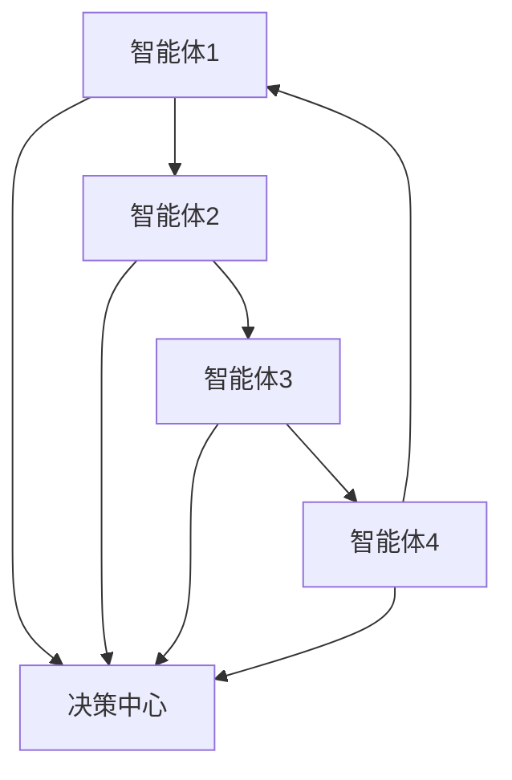
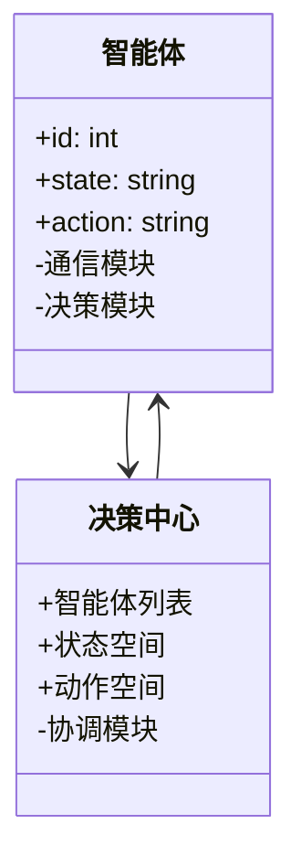
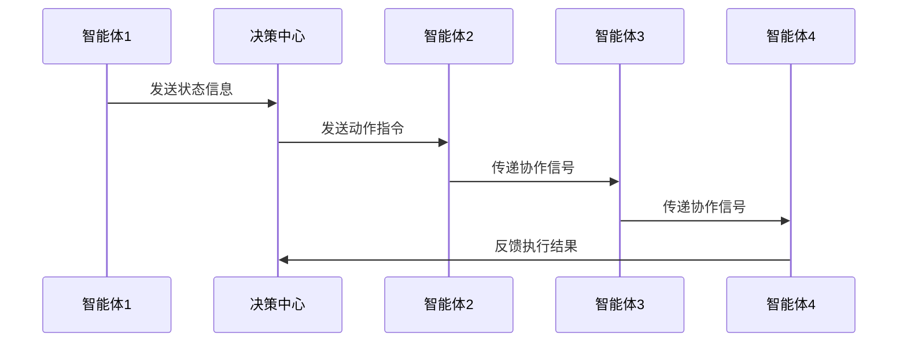

                 


# 多智能体AI如何改进格雷厄姆的工作资本分析

> 关键词：多智能体AI，资本分析，投资策略，格雷厄姆，人工智能

> 摘要：本文探讨了如何利用多智能体人工智能技术改进格雷厄姆的工作资本分析方法，通过结合多智能体系统的分布式计算能力和格雷厄姆分析法的深度洞察，提出了一种更高效、更精准的资本分析框架。文章详细介绍了多智能体AI的核心概念、算法原理、系统架构设计，以及在实际项目中的应用案例，展示了如何利用多智能体AI提升资本分析的效率和准确性。

---

## 第一章：多智能体AI与资本分析概述

### 1.1 多智能体AI的定义与特点
多智能体AI（Multi-Agent AI）是一种由多个相互作用的智能体组成的系统，每个智能体都有自己的目标、决策能力和行为方式。这些智能体通过通信和协作完成复杂的任务，具有以下特点：
- **分布式计算**：智能体之间通过分布式计算协同工作，避免了单点故障。
- **自主性**：每个智能体都能独立决策，适应环境变化。
- **协作性**：智能体之间通过通信和协作完成共同目标。
- **动态性**：系统能够实时响应环境变化，动态调整策略。

### 1.2 格雷厄姆的工作资本分析
格雷厄姆的价值投资理论强调通过分析企业的内在价值来判断投资机会。其工作资本分析方法包括以下几个关键步骤：
- **基本面分析**：对企业财务报表进行详细分析，包括收入、利润、资产和负债等。
- **内在价值计算**：通过DCF（现金流折现法）等方法估算企业的内在价值。
- **安全边际分析**：确定投资标的的市场价格与内在价值之间的差异，作为投资的安全边际。

### 1.3 多智能体AI在资本分析中的应用前景
多智能体AI在资本分析中的应用前景广阔，尤其是在以下几个方面：
- **数据处理与分析**：多智能体系统可以高效地处理海量数据，提取关键信息。
- **实时监控**：通过分布式计算，多智能体系统能够实时监控市场动态，及时调整分析策略。
- **风险控制**：多智能体系统可以通过协作机制降低投资风险，提高决策的准确性。

---

## 第二章：多智能体AI的核心概念与算法原理

### 2.1 多智能体系统的架构
多智能体系统的架构可以分为以下几个层次：
- **感知层**：智能体通过传感器或其他数据源获取环境信息。
- **决策层**：智能体基于感知信息做出决策。
- **执行层**：智能体根据决策结果执行动作。
- **通信层**：智能体之间通过通信协议进行信息交换。

### 2.2 多智能体AI的算法原理
多智能体AI的核心算法包括分布式计算、强化学习和协作优化。以下是其实现流程的mermaid图：



### 2.3 多智能体AI的数学模型
多智能体系统的数学模型通常包括状态空间、动作空间和奖励函数。以下是具体的数学表达：

$$
\text{状态空间} = S \\
\text{动作空间} = A \\
\text{奖励函数} = R(s, a)
$$

其中，$s$ 表示当前状态，$a$ 表示智能体采取的动作，$R(s, a)$ 表示采取该动作后的奖励值。

---

## 第三章：多智能体AI在格雷厄姆分析中的应用

### 3.1 格雷厄姆分析法的数学模型
格雷厄姆的内在价值计算公式如下：

$$
\text{内在价值} = \sum_{t=1}^{n} \frac{CF_t}{(1 + r)^t}
$$

其中，$CF_t$ 表示第 $t$ 年的现金流，$r$ 表示折现率。

### 3.2 多智能体AI对格雷厄姆分析的改进
多智能体AI可以通过以下方式改进格雷厄姆的分析方法：
- **数据处理**：利用分布式计算能力快速处理大量数据。
- **模型优化**：通过协作学习优化内在价值的计算模型。
- **实时调整**：根据市场变化动态调整分析参数。

### 3.3 应用案例分析
以下是多智能体AI在格雷厄姆分析中的一个应用案例：


通过上述流程，多智能体AI可以高效地完成格雷厄姆分析的各个步骤。

---

## 第四章：系统架构与实现

### 4.1 系统架构设计
以下是系统的类图：



### 4.2 接口设计与实现
以下是接口设计的mermaid图：



### 4.3 项目实战
以下是项目的核心代码实现：

```python
class Agent:
    def __init__(self, id):
        self.id = id
        self.state = None
        self.action = None
        self.communication = []
    
    def receive_message(self, message):
        self.communication.append(message)
    
    def decide_action(self):
        # 具体决策逻辑根据状态和通信信息实现
        pass

class DecisionCenter:
    def __init__(self):
        self.agents = []
    
    def register_agent(self, agent):
        self.agents.append(agent)
    
    def send_instructions(self):
        for agent in self.agents:
            agent.receive_message("Execute task")
```

---

## 第五章：案例分析与优化

### 5.1 案例分析
以下是多智能体AI在格雷厄姆分析中的实际案例：


### 5.2 优化建议
为了进一步优化系统性能，可以采取以下措施：
- **增强通信机制**：优化智能体之间的通信协议，减少数据传输延迟。
- **改进决策算法**：引入更高效的强化学习算法，提升决策的准确性。
- **增加容错机制**：通过冗余设计提高系统的容错能力，确保系统的稳定性。

---

## 结论

通过本文的探讨，我们可以看到，多智能体AI在格雷厄姆的工作资本分析中具有巨大的潜力。通过结合多智能体系统的分布式计算能力和格雷厄姆分析法的深度洞察，我们可以实现更高效、更精准的资本分析。未来，随着多智能体AI技术的不断发展，其在资本分析中的应用前景将更加广阔。

---

## 附录

### 参考文献
1. Graham, Benjamin. *The Intelligent Investor*. 
2. Russell, Stuart. *Artificial Intelligence: A Modern Approach*.

### 工具推荐
- **Python**：用于实现多智能体系统的编程语言。
- **TensorFlow**：用于实现强化学习算法的深度学习框架。

### 代码仓库
- [Multi-Agent AI for Capital Analysis](https://github.com/yourusername/multi-agent-capital-analysis)

---

作者：AI天才研究院 & 禅与计算机程序设计艺术

