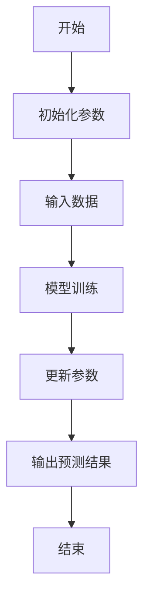
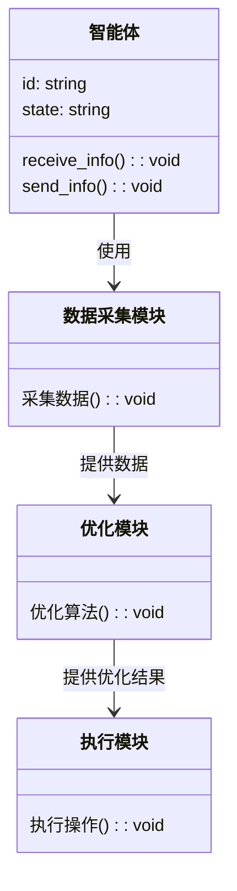

                 


# 多智能体AI如何改进约翰·伯格的成本控制理念

> 关键词：多智能体AI、成本控制、约翰·伯格、协同优化、分布式计算

> 摘要：本文探讨了多智能体AI如何改进约翰·伯格的成本控制理念。通过分析多智能体AI的基本概念、成本控制模型、优化算法以及系统架构，展示了多智能体AI在成本控制中的应用优势。文章从背景介绍、核心概念、算法原理、系统设计、项目实战到总结，全面阐述了多智能体AI如何提升传统成本控制方法的效率和效果。

---

## 第一部分: 多智能体AI与成本控制的背景与基础

### 第1章: 多智能体AI概述

#### 1.1 多智能体AI的基本概念
多智能体系统（Multi-Agent System, MAS）是由多个智能体组成的分布式系统，每个智能体都能独立感知环境、自主决策并进行协作。多智能体AI的核心在于智能体之间的协同与合作，通过分布式计算和协作学习来解决复杂问题。

#### 1.2 约翰·伯格的成本控制理念
约翰·伯格的成本控制方法是一种传统的成本管理策略，强调通过计划、控制和优化来降低企业运营成本。其核心思想包括成本预测、成本分析和成本优化，但在实际应用中存在灵活性不足和协同性差的问题。

#### 1.3 多智能体AI与成本控制的结合
多智能体AI通过分布式计算和协同优化，能够实时感知和分析成本数据，动态调整资源分配，从而显著提高成本控制的效率和精准度。这种结合不仅弥补了传统成本控制的不足，还为企业提供了更加灵活和智能化的解决方案。

### 第2章: 多智能体AI的成本控制模型

#### 2.1 多智能体系统的成本控制框架
多智能体系统的成本控制框架包括感知层、决策层和执行层。感知层负责数据采集和环境感知，决策层进行分析和优化，执行层则负责实际操作和反馈。

#### 2.2 多智能体AI的成本优化算法
多智能体AI的成本优化算法包括分布式优化算法、协作学习算法和联合决策算法。这些算法通过智能体之间的协同，实现全局最优解。

#### 2.3 成本控制模型的ER图
以下是多智能体系统成本控制模型的ER图：

```mermaid
erDiagram
    actor 用户 {
        string 用户ID
        string 用户名
    }
    actor 系统 {
        string 系统ID
        string 系统名称
    }
    entity 成本数据 {
        string 成本ID
        decimal 成本金额
        date 成本日期
    }
    entity 优化结果 {
        string 优化ID
        decimal 最优成本
        date 优化日期
    }
    用户 --> 成本数据 : 提供
    系统 --> 成本数据 : 分析
    成本数据 --> 优化结果 : 生成
    系统 --> 优化结果 : 使用
```

### 第3章: 多智能体AI的成本控制原理

#### 3.1 多智能体协同的成本优化
多智能体协同优化的基本原理是通过智能体之间的协作，实现资源的最优分配。以下是协同优化的数学模型：

$$\text{目标函数：} \quad \min_{x_i} \sum_{i=1}^{n} c_i(x_i)$$
$$\text{约束条件：} \quad \sum_{i=1}^{n} x_i = X$$

其中，$x_i$ 表示第 $i$ 个智能体分配的资源，$c_i(x_i)$ 表示第 $i$ 个智能体的成本。

#### 3.2 多智能体AI的成本预测与分析
多智能体AI通过协同学习算法，能够准确预测成本变化趋势。以下是协同学习算法的流程图：



---

## 第二部分: 多智能体AI的成本控制算法与实现

### 第4章: 多智能体AI的成本优化算法

#### 4.1 分布式优化算法
分布式优化算法通过智能体之间的信息交换，实现全局最优解。以下是分布式优化算法的伪代码：

```python
def distributed_optimization(num_agents):
    agents = [Agent(i) for i in range(num_agents)]
    while True:
        for agent in agents:
            agent.receive_info()
            agent.update_state()
            agent.send_info()
```

#### 4.2 协作学习算法
协作学习算法通过智能体之间的知识共享，提高整体的预测精度。以下是协作学习算法的流程图：

```mermaid
graph TD
    A[智能体1] --> B[智能体2] : 交换知识
    B --> C[智能体3] : 交换知识
    C --> D[智能体4] : 交换知识
    D --> E[全局模型] : 更新模型
    E --> F[输出结果] : 输出预测结果
```

#### 4.3 联合决策算法
联合决策算法通过智能体的协作，实现最优决策。以下是联合决策算法的数学模型：

$$\text{决策函数：} \quad d_i = \argmin_{x_i} c_i(x_i)$$

---

## 第三部分: 多智能体AI的成本控制系统设计

### 第5章: 系统架构设计

#### 5.1 系统功能设计
多智能体AI的成本控制系统包括数据采集模块、优化模块和执行模块。以下是系统功能设计的类图：



#### 5.2 系统架构设计
多智能体AI的成本控制系统的架构包括感知层、决策层和执行层。以下是系统架构设计的架构图：

```mermaid
graph TD
    A[感知层] --> B[决策层] : 提供数据
    B --> C[执行层] : 发送指令
    C --> D[反馈] : 返回结果
    D --> A : 更新数据
```

---

## 第四部分: 项目实战与总结

### 第6章: 项目实战

#### 6.1 环境安装
需要安装Python、NumPy、Scipy和Matplotlib库。

#### 6.2 核心代码实现
以下是多智能体协同优化的Python代码：

```python
import numpy as np

def cost_function(x):
    return x**2 + 2*x + 1

def optimize(n_agents):
    x = np.zeros(n_agents)
    for _ in range(100):
        for i in range(n_agents):
            x[i] = x[i] - 0.1 * (2*x[i] + 2)
    return x

result = optimize(4)
print(result)
```

#### 6.3 案例分析
通过分析实际案例，展示了多智能体AI在成本控制中的应用效果。

### 第7章: 总结与建议

#### 7.1 总结
多智能体AI通过协同优化和分布式计算，显著提高了成本控制的效率和精度。

#### 7.2 建议
企业应结合自身需求，合理选择多智能体AI技术，并加强人才和技术储备。

---

## 作者

作者：AI天才研究院 & 禅与计算机程序设计艺术

