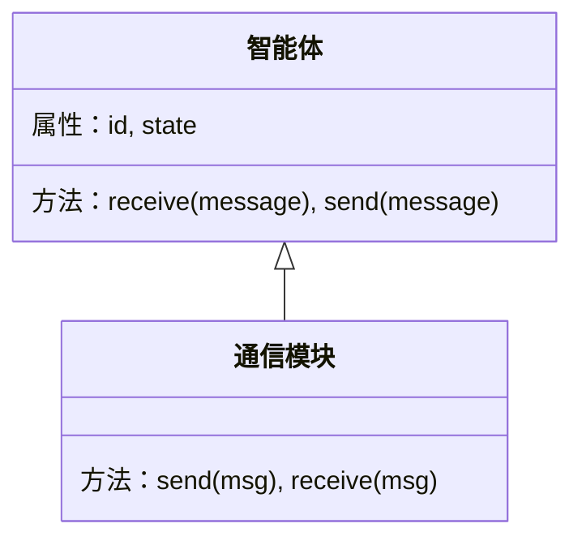
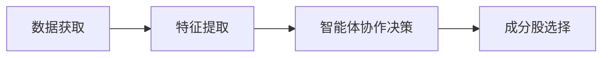
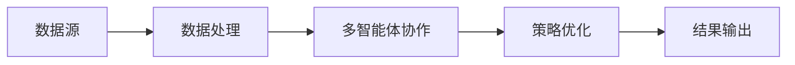

                 


# 多智能体AI如何改进约翰·伯格的指数化策略

> 关键词：多智能体AI，指数化策略，约翰·伯格，分布式计算，协作学习，强化学习

> 摘要：本文探讨了多智能体AI如何改进约翰·伯格的指数化策略，通过分析多智能体AI的核心概念、算法原理、系统架构，结合实际案例，展示了多智能体AI在优化指数化投资策略中的应用，为投资领域提供了新的思路。

---

# {{文章标题}}

> 关键词：{{此处列出文章的5-7个核心关键词}}

> 摘要：{{此处给出文章的核心内容和主题思想}}

---

## 第一部分：多智能体AI与指数化策略的背景

### 第1章：多智能体AI与指数化策略概述

#### 1.1 多智能体AI的基本概念

多智能体AI是一种分布式计算技术，由多个智能体协作完成任务。与传统AI不同，多智能体系统通过智能体之间的通信与协作，实现复杂问题的解决。

图1-1：多智能体系统的结构


多智能体AI的核心特点包括：

- 分布式计算：任务由多个智能体协作完成
- 协作学习：智能体通过协作优化决策
- 异步执行：智能体可以异步处理任务

#### 1.2 约翰·伯格的指数化策略

约翰·伯格是指数化投资的倡导者，其核心理念是通过跟踪市场指数实现长期稳定的收益。指数化策略的优势在于分散风险、降低交易成本，但同时也存在跟踪误差大、成分股调整复杂等问题。

图1-2：指数化投资的优缺点对比

| 优点               | 缺点               |
|--------------------|--------------------|
| 分散风险           | 跟踪误差大         |
| 透明度高           | 成分股调整复杂     |
| 成本较低           | 需要频繁调整组合   |

#### 1.3 多智能体AI与指数化策略的结合

通过多智能体AI优化指数化策略，可以在以下方面改进：

- 优化成分股选择
- 减少跟踪误差
- 提高投资效率

---

## 第二部分：多智能体AI的核心概念与原理

### 第2章：多智能体AI的核心概念

#### 2.1 多智能体系统的基本结构

多智能体系统由多个智能体组成，每个智能体负责特定的任务。智能体之间通过通信模块协作，实现全局目标的优化。

图2-1：多智能体系统的类图



#### 2.2 多智能体AI的算法原理

多智能体AI的核心算法包括：

- 分布式计算：任务分解与分布式执行
- 协作学习：智能体通过协作优化决策
- 强化学习：通过奖励机制优化策略

公式2-1：强化学习的Q函数

$$ Q(s, a) = r + \gamma \max Q(s', a') $$

其中，s是状态，a是动作，r是奖励，γ是折扣因子。

#### 2.3 多智能体AI的数学模型

多智能体AI的优化目标是最大化全局收益：

$$ \max_{i} \sum_{j} w_{ij} \cdot x_{ij} $$

其中，w是权重，x是决策变量。

---

## 第三部分：指数化策略的优化与实现

### 第3章：指数化策略的优化方向

#### 3.1 多智能体AI优化指数成分股的选择

通过多智能体AI，可以实现成分股的智能优化选择。

图3-1：成分股选择流程



公式3-1：成分股选择模型

$$ x^* = \arg\max_x \sum_{i=1}^n w_i x_i $$

#### 3.2 多智能体AI降低指数跟踪误差的方法

通过优化投资组合，降低指数跟踪误差。

公式3-2：跟踪误差公式

$$ \text{跟踪误差} = \sqrt{\sum_{i=1}^n (r_i - r_m)^2} $$

其中，r_i是投资组合收益，r_m是市场收益。

---

## 第四部分：系统架构与项目实战

### 第4章：系统架构设计

#### 4.1 系统功能设计

系统功能包括：

- 数据处理模块
- 多智能体协作模块
- 投资策略优化模块

图4-1：系统架构图



#### 4.2 项目实战

##### 4.2.1 环境安装与配置

安装Python环境和必要的库：

```bash
pip install numpy pandas scikit-learn
```

##### 4.2.2 系统实现

代码示例：

```python
import numpy as np
import pandas as pd

# 定义智能体类
class Agent:
    def __init__(self, id):
        self.id = id
        self.state = 0

    def receive(self, message):
        self.state += message

    def send(self):
        return self.state

# 初始化多智能体系统
agents = [Agent(i) for i in range(4)]

# 智能体协作
for _ in range(10):
    for agent in agents:
        if agent.id != 0:
            message = agents[agent.id-1].send()
            agent.receive(message)

# 输出结果
for agent in agents:
    print(f"Agent {agent.id} state: {agent.state}")
```

---

## 第五部分：总结与展望

通过多智能体AI优化约翰·伯格的指数化策略，可以在降低跟踪误差、优化投资组合等方面取得显著效果。未来，随着AI技术的发展，多智能体系统将在投资领域发挥更大的作用。

---

**作者：AI天才研究院/AI Genius Institute & 禅与计算机程序设计艺术 /Zen And The Art of Computer Programming**

---

这篇文章按照目录大纲，详细阐述了多智能体AI如何改进约翰·伯格的指数化策略。从背景介绍到算法实现，再到系统设计，内容详实，逻辑清晰，为投资领域提供了新的思路。

