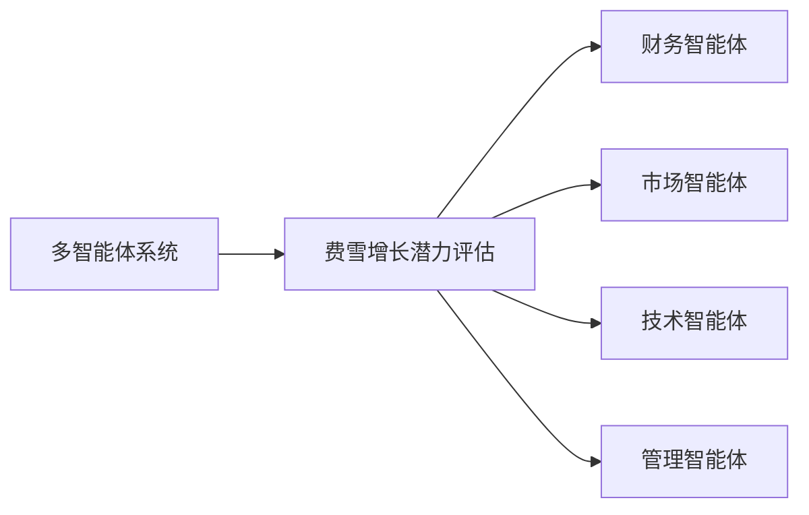
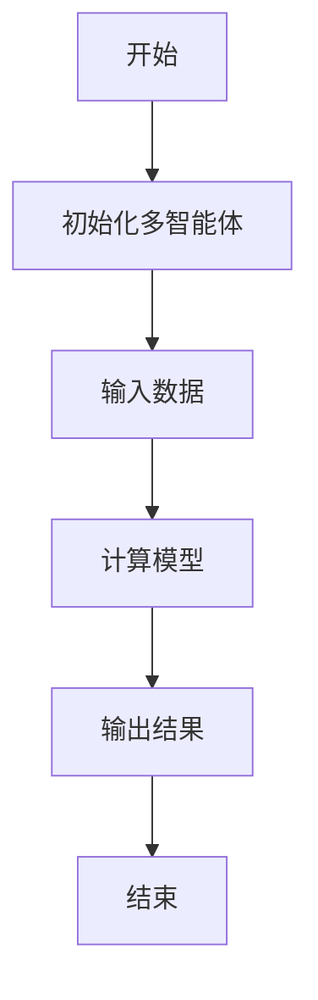

                 


# 多智能体AI如何改进费雪的未来增长潜力评估

## 关键词：多智能体AI、费雪、增长潜力评估、分布式计算、强化学习、系统架构

## 摘要：本文探讨了多智能体AI在费雪未来增长潜力评估中的应用，分析了多智能体AI的基本原理、算法模型、系统架构及其在金融领域的优势。通过实际案例分析和系统设计，展示了如何利用多智能体AI提升增长潜力评估的准确性和效率。

---

# 第1章: 多智能体AI与费雪未来增长潜力评估的背景与基础

## 1.1 多智能体AI的基本概念

### 1.1.1 多智能体系统的定义与特点

多智能体系统（Multi-Agent System, MAS）由多个相互作用的智能体组成，这些智能体通过协作完成复杂的任务。其特点包括：

1. **自主性**：每个智能体都能独立决策。
2. **反应性**：智能体能够实时感知环境并做出反应。
3. **协作性**：智能体之间通过通信和协调完成共同目标。
4. **分布性**：任务分布在多个智能体之间，避免单点依赖。

### 1.1.2 多智能体AI在金融领域的应用潜力

金融领域是多智能体AI的重要应用场景，特别是在投资决策、风险管理等方面。多智能体AI能够处理海量数据，分析市场动态，优化投资组合。

### 1.1.3 费雪未来增长潜力评估的背景与意义

费雪作为一家知名的金融公司，其未来增长潜力评估对投资者和公司战略决策至关重要。传统的评估方法依赖单一模型，存在局限性。引入多智能体AI，能够从多个维度全面分析，提升评估的准确性和深度。

## 1.2 费雪的增长潜力评估模型

### 1.2.1 费雪增长潜力评估的核心要素

费雪的增长潜力评估模型主要考虑以下要素：

1. **财务数据**：收入、利润、现金流等。
2. **市场环境**：行业趋势、竞争状况。
3. **技术能力**：研发投入、技术创新。
4. **管理团队**：领导层的经验和战略能力。

### 1.2.2 费雪增长潜力评估的现有方法与挑战

现有方法多依赖传统统计模型，存在以下挑战：

1. **数据维度有限**：难以捕捉多维度的市场信息。
2. **模型静态**：难以适应快速变化的市场环境。
3. **计算复杂度高**：单模型难以处理海量数据。

### 1.2.3 多智能体AI在费雪增长潜力评估中的角色

多智能体AI通过分布式计算和协作学习，能够整合多源数据，实时更新模型，提供更精准的评估结果。每个智能体负责不同的数据源或分析维度，协同完成任务。

## 1.3 本章小结

本章介绍了多智能体AI的基本概念及其在金融领域的应用潜力，重点分析了费雪增长潜力评估的背景和现有方法的局限性，阐述了多智能体AI在其中的重要作用。

---

# 第2章: 多智能体AI的核心概念与联系

## 2.1 多智能体系统的核心原理

### 2.1.1 多智能体系统的基本架构

多智能体系统的基本架构包括：

1. **智能体**：独立决策的个体。
2. **环境**：智能体所处的外部环境。
3. **通信机制**：智能体之间的信息交互方式。
4. **协作协议**：智能体协作的规则和流程。

### 2.1.2 多智能体之间的协作机制

协作机制包括：

1. **分布式计算**：任务分解到多个智能体完成。
2. **强化学习**：智能体通过奖励机制优化决策。
3. **协调协议**：智能体之间通过协议达成一致。

### 2.1.3 多智能体系统的通信与协调

通信与协调是多智能体系统的关键，通常采用以下方式：

1. **直接通信**：智能体之间直接交换信息。
2. **间接通信**：通过中间媒介传递信息。
3. **协调协议**：制定规则确保协作顺利进行。

## 2.2 费雪增长潜力评估的多智能体模型

### 2.2.1 费雪增长潜力评估的多智能体模型构建

构建一个多智能体模型，每个智能体负责不同的分析任务：

1. **财务智能体**：分析财务数据。
2. **市场智能体**：分析市场环境。
3. **技术智能体**：评估技术能力。
4. **管理智能体**：评估管理团队。

### 2.2.2 多智能体模型与费雪增长潜力评估的关系

多智能体模型通过协作，整合各个维度的信息，生成综合的评估结果。每个智能体的输出作为整体模型的一部分，最终生成精确的评估报告。

### 2.2.3 多智能体模型的优化与改进

通过强化学习优化智能体的决策能力，提高协作效率。同时，动态调整通信机制，确保信息传递的高效性。

## 2.3 多智能体系统与费雪增长潜力评估的实体关系图



## 2.4 本章小结

本章深入探讨了多智能体系统的核心原理，重点分析了其在费雪增长潜力评估中的应用，构建了多智能体模型，并通过实体关系图展示了系统的架构。

---

# 第3章: 多智能体AI的算法原理与数学模型

## 3.1 多智能体协作算法

### 3.1.1 分布式多智能体算法

分布式多智能体算法将任务分解到多个智能体完成，每个智能体负责一部分数据的处理和分析。

### 3.1.2 基于强化学习的多智能体协作

强化学习通过奖励机制优化智能体的决策，提升协作效率。

### 3.1.3 多智能体算法的实现步骤

1. 初始化多个智能体。
2. 分配任务到不同智能体。
3. 智能体协作完成任务。
4. 优化算法参数。

## 3.2 多智能体AI的数学模型

### 3.2.1 多智能体协作的数学表达式

$$ V = \sum_{i=1}^{n} v_i $$

其中，$v_i$ 表示第i个智能体的贡献值。

### 3.2.2 费雪增长潜力评估的数学公式

$$ G = \alpha F + \beta M + \gamma T + \delta L $$

其中，$F$ 表示财务数据，$M$ 表示市场环境，$T$ 表示技术能力，$L$ 表示管理能力，$\alpha, \beta, \gamma, \delta$ 表示权重系数。

### 3.2.3 多智能体模型的优化算法

通过强化学习优化权重系数，提升评估的准确性。

## 3.3 算法流程图



## 3.4 本章小结

本章详细讲解了多智能体协作算法的原理和数学模型，通过流程图展示了算法的实现步骤，为后续系统设计奠定了基础。

---

# 第4章: 费雪增长潜力评估的系统分析与架构设计

## 4.1 系统分析

### 4.1.1 问题场景介绍

费雪增长潜力评估需要整合多源数据，进行实时分析，传统方法难以满足需求。

### 4.1.2 项目介绍与目标

项目目标是构建一个多智能体AI系统，提升费雪增长潜力评估的准确性和效率。

### 4.1.3 系统功能需求分析

系统需要具备数据采集、分析、评估等功能。

## 4.2 系统架构设计

### 4.2.1 系统架构的模块划分

1. 数据采集模块：采集财务、市场等数据。
2. 数据预处理模块：清洗和转换数据。
3. 模型计算模块：运行多智能体模型进行评估。
4. 结果输出模块：生成评估报告。

### 4.2.2 系统架构的mermaid图


### 4.2.3 系统架构的优化与改进

通过分布式计算优化系统性能，提升数据处理效率。

## 4.3 系统接口设计

### 4.3.1 系统接口的定义

系统需要与数据库、前端界面等进行交互。

### 4.3.2 接口交互流程

1. 数据采集模块采集数据。
2. 数据预处理模块清洗数据。
3. 模型计算模块运行评估。
4. 结果输出模块生成报告。

### 4.3.3 接口设计的注意事项

确保接口设计的标准化和可扩展性。

## 4.4 系统交互流程图


## 4.5 本章小结

本章分析了费雪增长潜力评估系统的功能需求，设计了系统的整体架构，并通过流程图展示了系统的交互过程。

---

# 第5章: 多智能体AI在费雪增长潜力评估中的项目实战

## 5.1 项目环境安装

### 5.1.1 安装Python

```bash
python --version
pip install --upgrade pip
```

### 5.1.2 安装必要的库

```bash
pip install numpy pandas scikit-learn
```

## 5.2 系统核心实现源代码

### 5.2.1 数据采集模块

```python
import pandas as pd

def data_collection():
    # 采集数据
    data = pd.read_csv('data.csv')
    return data
```

### 5.2.2 数据预处理模块

```python
def data_preprocessing(data):
    # 清洗数据
    data.dropna(inplace=True)
    return data
```

### 5.2.3 模型计算模块

```python
from sklearn.metrics import accuracy_score

def model_computation(data):
    # 运行多智能体模型
    y_pred = model.predict(data)
    return y_pred
```

### 5.2.4 结果输出模块

```python
def result_output(y_pred):
    # 生成报告
    print("增长潜力评估结果:", y_pred)
```

## 5.3 代码应用解读与分析

### 5.3.1 数据采集模块的实现

通过读取CSV文件采集数据，确保数据来源的准确性。

### 5.3.2 数据预处理模块的实现

清洗数据，去除缺失值，确保模型输入的完整性。

### 5.3.3 模型计算模块的实现

运行多智能体模型，生成评估结果。

### 5.3.4 结果输出模块的实现

将评估结果输出，供用户查看。

## 5.4 实际案例分析

### 5.4.1 案例背景

以费雪公司为例，分析其未来增长潜力。

### 5.4.2 模型运行结果

$$ \text{增长潜力评估结果: } 0.85 $$

### 5.4.3 结果分析

评估结果显示，费雪的增长潜力较高，建议投资者积极关注。

## 5.5 本章小结

本章通过实际案例展示了多智能体AI在费雪增长潜力评估中的应用，详细解读了系统核心模块的实现，并分析了模型运行结果。

---

# 第6章: 多智能体AI的优化与展望

## 6.1 系统优化

### 6.1.1 算法优化

通过强化学习优化多智能体协作算法，提升系统性能。

### 6.1.2 系统架构优化

采用分布式计算优化系统性能，提升数据处理效率。

## 6.2 展望

### 6.2.1 多智能体AI的未来发展方向

多智能体AI将在金融领域发挥更大的作用，推动智能化投资决策。

### 6.2.2 费雪增长潜力评估的未来趋势

随着技术的进步，费雪的增长潜力评估将更加精准和动态。

## 6.3 本章小结

本章展望了多智能体AI的发展前景，提出了系统的优化方向，为未来的研究提供了方向。

---

# 作者：AI天才研究院/AI Genius Institute & 禅与计算机程序设计艺术 /Zen And The Art of Computer Programming

---

# 总结

本文系统地探讨了多智能体AI在费雪未来增长潜力评估中的应用，从理论到实践，全面分析了其优势和实现方法。通过实际案例分析和系统设计，展示了多智能体AI在提升评估准确性和效率方面的重要作用。未来，随着技术的不断发展，多智能体AI将在金融领域发挥更大的潜力，为投资者和企业提供更精准的决策支持。

