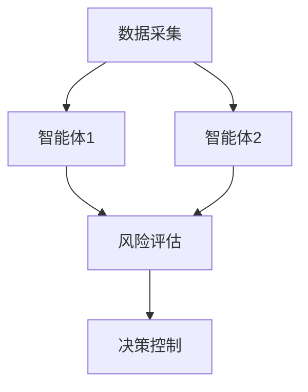

                 


# 多智能体AI系统在价值投资中的风险管理应用

> **关键词**：多智能体AI系统、价值投资、风险管理、分布式智能、强化学习、金融建模  
> **摘要**：本文探讨多智能体AI系统在价值投资中的风险管理应用，通过分析传统风险管理的局限性，提出基于多智能体的解决方案，涵盖系统设计、算法实现和实际案例，展示其在风险识别、评估和控制中的优势。

---

# 第一部分：引言

## 第1章：多智能体AI系统与价值投资风险管理概述

### 1.1 多智能体AI系统的基本概念

#### 1.1.1 多智能体系统定义
多智能体系统（Multi-Agent System, MAS）由多个智能体组成，每个智能体能够感知环境、自主决策并协作完成任务。智能体之间通过通信机制共享信息，实现复杂问题的分布式求解。

#### 1.1.2 多智能体在金融领域的应用
在金融领域，多智能体系统用于股票交易、市场预测、风险管理和投资组合优化。智能体可以分别负责市场数据监控、风险评估和策略制定，通过协作提供更全面的解决方案。

#### 1.1.3 价值投资中的风险管理需求
价值投资依赖于对资产内在价值的深入分析，但市场波动、信息不对称等因素增加了风险管理的难度。多智能体系统通过分布式决策和协作，能够更灵活地应对复杂风险。

### 1.2 问题背景与目标

#### 1.2.1 传统风险管理的局限性
传统方法通常基于单一模型，难以捕捉市场中的复杂动态。例如，VaR模型依赖历史数据，无法预测极端事件，而多智能体系统可以实时分析市场变化，识别潜在风险点。

#### 1.2.2 价值投资中的风险管理挑战
价值投资者需要应对市场波动、公司基本面变化和宏观经济因素。传统方法往往依赖经验判断，难以量化和实时调整风险敞口。

#### 1.2.3 多智能体AI系统的目标与优势
目标是通过分布式智能和协作机制，实现风险的实时识别、评估和控制。优势包括高灵活性、实时性和高效的风险应对能力。

---

# 第二部分：多智能体AI系统的原理与特点

## 第2章：多智能体AI系统的原理与特点

### 2.1 多智能体系统的核心原理

#### 2.1.1 分布式智能与协作机制
智能体独立决策，通过通信机制协作。例如，在风险管理中，一个智能体监控市场波动，另一个分析历史数据，第三个评估潜在损失。

#### 2.1.2 多智能体的通信与协调
使用消息传递机制（如通信协议）进行信息共享。通信机制设计影响系统性能，需确保高效性和准确性。

#### 2.1.3 自适应与学习能力
智能体通过强化学习和经验积累，提高风险识别和应对能力。例如，使用Q-learning算法优化决策策略。

### 2.2 多智能体系统的特点对比

#### 2.2.1 与传统AI系统的区别
传统系统依赖中心化模型，而多智能体系统分布式决策，具备更高的灵活性和容错性。

#### 2.2.2 与分布式系统的主要区别
分布式系统关注资源分配，而多智能体系统强调智能协作和信息共享，具备更强的智能性和适应性。

#### 2.2.3 与强化学习的对比分析
强化学习单智能体决策，而多智能体系统通过协作优化整体策略，适用于复杂环境下的风险管理。

### 2.3 多智能体系统的设计原则

#### 2.3.1 智能体的独立性与协作性
每个智能体独立决策，通过通信机制协作。例如，在市场监控中，多个智能体分别关注不同资产，协作识别系统性风险。

#### 2.3.2 系统的可扩展性与灵活性
设计模块化架构，便于扩展和调整。例如，新增一个智能体只需修改其接口，不影响整体系统。

#### 2.3.3 通信机制的高效性与可靠性
采用可靠的通信协议，确保信息及时传递。例如，使用gRPC实现低延迟、高吞吐量的通信。

---

# 第三部分：多智能体AI系统在风险管理中的应用

## 第3章：风险管理的理论基础

### 3.1 风险管理的基本概念

#### 3.1.1 风险的定义与分类
风险是未来结果的不确定性，可分为市场风险、信用风险和操作风险等。

#### 3.1.2 风险评估的方法
常用VaR和CVaR模型，但这些方法难以捕捉复杂市场动态。

#### 3.1.3 风险管理在投资决策中的作用
风险管理帮助投资者控制损失，优化投资组合。

### 3.2 价值投资中的风险管理

#### 3.2.1 价值投资的风险来源
市场波动、公司基本面变化、宏观经济因素等。

#### 3.2.2 风险管理在投资决策中的作用
通过分散投资、风险对冲等策略降低整体风险。

#### 3.2.3 风险与收益的平衡
在追求收益的同时，控制潜在风险，实现长期稳健回报。

## 第4章：多智能体AI系统在风险管理中的应用

### 4.1 多智能体系统在风险识别中的应用

#### 4.1.1 数据采集与特征提取
智能体实时采集市场数据，提取关键特征，如波动率、交易量和相关性。

#### 4.1.2 风险信号的识别
通过协同学习，智能体识别潜在风险信号，例如通过异常检测算法发现市场异动。

### 4.2 多智能体系统在风险评估中的应用

#### 4.2.1 风险评估模型的设计
基于多智能体的分布式评估模型，每个智能体评估特定风险因素。

#### 4.2.2 风险评估的优化
通过强化学习优化评估策略，提高准确性。

### 4.3 多智能体系统在风险控制中的应用

#### 4.3.1 风险对冲策略的制定
智能体协作制定对冲策略，如使用期货对冲市场风险。

#### 4.3.2 风险控制的实时调整
根据市场变化动态调整策略，例如实时监控并调整投资组合。

---

# 第四部分：算法原理与系统设计

## 第5章：算法原理

### 5.1 分布式强化学习算法

#### 5.1.1 算法描述
多个智能体通过强化学习协作，优化整体策略。例如，每个智能体负责不同任务，如数据采集和风险评估。

#### 5.1.2 数学模型
$$ V(s) = \max_{a} [ r + V(s') ] $$
其中，$s$是状态，$a$是动作，$s'$是下一个状态，$r$是奖励。

### 5.2 实现细节

#### 5.2.1 通信机制
使用gRPC实现低延迟通信，确保智能体之间高效协作。

#### 5.2.2 并行计算
利用多线程或分布式计算优化算法性能。

## 第6章：系统设计

### 6.1 系统架构设计

#### 6.1.1 功能模块
- 数据采集模块：实时采集市场数据。
- 智能体协作模块：协调各智能体的决策。
- 风险评估模块：评估当前风险状态。
- 决策控制模块：制定风险控制策略。

#### 6.1.2 系统架构图


### 6.2 接口设计

#### 6.2.1 智能体间接口
定义通信协议，如：
- `request_data()`: 请求市场数据。
- `send_alert()`: 发送风险警报。

#### 6.2.2 外部系统接口
与数据源（如Reuters API）集成，获取实时数据。

---

# 第五部分：项目实战与案例分析

## 第7章：项目实战

### 7.1 环境搭建

#### 7.1.1 开发工具
- Python 3.8+
- TensorFlow 2.0+
- gRPC-ProtoBuf

#### 7.1.2 代码结构
```python
# 智能体类
class Agent:
    def __init__(self, id):
        self.id = id
        self.state = ...
    
    def receive(self, message):
        # 处理消息
        pass
```

### 7.2 核心代码实现

#### 7.2.1 数据采集模块
```python
import pandas as pd
import requests

def get_market_data():
    # 请求实时数据
    response = requests.get('https://api.example.com/market-data')
    data = pd.DataFrame(response.json())
    return data
```

#### 7.2.2 风险评估模块
```python
from sklearn.ensemble import RandomForestClassifier

model = RandomForestClassifier()
model.fit(X_train, y_train)
```

### 7.3 案例分析

#### 7.3.1 案例介绍
构建一个系统，实时监控并管理投资组合的风险。例如，使用多个智能体分别监控不同资产类别，协作评估整体风险。

#### 7.3.2 实施步骤
1. 部署数据采集模块，实时获取市场数据。
2. 启动多个智能体，分别负责不同任务。
3. 实施风险评估和控制策略。

---

# 第六部分：总结与展望

## 第8章：总结与展望

### 8.1 总结

#### 8.1.1 系统优势
- 分布式智能，实时响应
- 高度协作，全面覆盖风险
- 强化学习，持续优化策略

### 8.1.2 实际应用中的注意事项
- 确保通信机制的高效性和可靠性
- 设计合理的激励机制，避免智能体间冲突
- 定期更新模型，适应市场变化

### 8.1.3 最佳实践 tips
- 使用模块化设计，便于扩展和维护
- 选择合适的通信协议，确保低延迟和高可靠性
- 定期监控系统性能，优化算法和架构

### 8.2 展望

#### 8.2.1 未来的研究方向
- 更复杂的智能体协作机制
- 结合区块链技术，提升系统安全性和透明度
- 在更多金融领域中的应用，如信用评分和欺诈检测

#### 8.2.2 挑战与解决方案
- 智能体间的协调问题：通过优化通信机制和协作算法提升效率。
- 系统安全问题：采用加密技术和访问控制，确保数据安全。

---

# 结语

多智能体AI系统为价值投资中的风险管理提供了全新的思路和解决方案。通过分布式智能和协作机制，系统能够实时识别、评估和控制风险，为投资者提供更稳健的投资决策支持。未来，随着技术的不断进步，多智能体系统在金融领域的应用将更加广泛和深入。

---

**作者：AI天才研究院/AI Genius Institute & 禅与计算机程序设计艺术 /Zen And The Art of Computer Programming**

