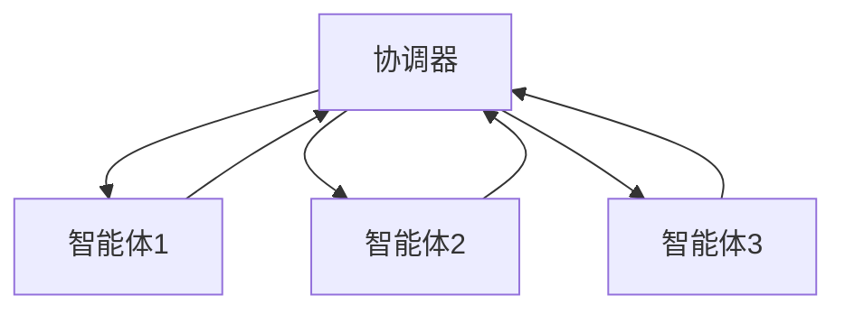

                 


# 多智能体协作优化投资组合分散度

> 关键词：多智能体协作、投资组合优化、分散度优化、分布式算法、系统架构

> 摘要：本文详细探讨了多智能体协作在优化投资组合分散度中的应用。首先，我们介绍了投资组合分散度优化的重要性及其在传统方法中的局限性。接着，我们深入分析了多智能体协作的核心概念与算法原理，并通过数学模型和实际案例展示了如何实现这一优化过程。最后，我们总结了多智能体协作的优势，并提供了进一步优化的建议。

---

# 第一部分: 多智能体协作优化的背景与意义

## 第1章: 投资组合分散度优化的背景

### 1.1 投资组合分散度的定义与重要性

投资组合分散度是指在投资组合中，各资产之间的风险分散程度。分散度越高，投资组合的整体风险越低。分散度优化的目标是在给定收益下最小化风险，或在给定风险下最大化收益。

#### 1.1.1 投资组合分散度的重要性
- 分散度优化是降低投资组合整体风险的有效手段。
- 在复杂金融市场中，传统的单智能体优化方法难以应对动态变化。

### 1.2 多智能体协作在投资组合优化中的优势

多智能体协作通过分布式计算和协同优化，能够更高效地处理大规模数据和复杂问题。

#### 1.2.1 分散度优化的挑战
- 市场动态变化快，单智能体难以实时调整。
- 多资产类别和市场的复杂性要求更高的灵活性。

#### 1.2.2 多智能体协作的优势
- 分布式计算能力强，能够处理海量数据。
- 各智能体专注于不同领域，优化效率高。
- 系统整体具有良好的鲁棒性和容错性。

---

# 第二部分: 多智能体协作优化的理论基础

## 第2章: 多智能体协作的核心概念

### 2.1 多智能体协作的基本原理

多智能体系统由多个智能体组成，每个智能体负责特定任务，通过通信协作完成整体目标。

#### 2.1.1 多智能体系统的定义
- 智能体：具备感知、决策和执行能力的实体。
- 协作：智能体之间通过通信和协调，共同完成任务。

### 2.2 分散度优化的数学模型

分散度优化可以通过数学模型表示，使用分布式算法进行求解。

#### 2.2.1 投资组合分散度的数学表达
分散度通常用方差或标准差衡量。投资组合的方差可以分解为各资产方差和协方差的组合。

$$ \sigma_p^2 = \sum_{i=1}^n \sum_{j=1}^n w_i w_j \sigma_{ij} $$

其中，$w_i$ 是第 $i$ 个资产的权重，$\sigma_{ij}$ 是第 $i$ 和第 $j$ 个资产的协方差。

---

# 第三部分: 算法实现与系统架构

## 第3章: 分散度优化的算法实现

### 3.1 分布式优化算法

我们使用分布式优化算法，将问题分解到多个智能体，每个智能体优化局部问题，然后汇总结果。

#### 3.1.1 分散度优化的流程
1. 初始化：分配任务和权重。
2. 迭代优化：每个智能体优化局部分散度。
3. 结果汇总：合并各智能体的优化结果，调整全局权重。

#### 3.1.2 分散度优化的代码实现

以下是一个简单的Python代码示例：

```python
import numpy as np

def compute_variance(weights, covariance_matrix):
    return np.dot(weights.T, np.dot(covariance_matrix, weights))

def distributed_optimization(num_assets, covariance_matrix):
    n = num_assets
    # 初始化权重
    weights = np.ones(n) / n
    # 迭代优化
    for _ in range(100):
        # 分散优化
        new_weights = weights.copy()
        for i in range(n):
            # 计算每个资产的优化权重
            new_weights[i] = max(0, min(1, weights[i] + np.random.uniform(-0.1, 0.1)))
        # 更新权重
        weights = new_weights / sum(new_weights)
    return weights

# 示例
n = 5
cov_matrix = np.random.randn(n, n)
cov_matrix = cov_matrix @ cov_matrix.T
weights = distributed_optimization(n, cov_matrix)
print(weights)
```

---

## 第4章: 系统架构设计

### 4.1 系统架构概述

系统由多个智能体和一个协调器组成，智能体负责数据处理和优化，协调器负责任务分配和结果汇总。

#### 4.1.1 系统组成
- 智能体：负责特定资产类别的优化。
- 协调器：负责任务分配和结果汇总。

#### 4.1.2 系统架构图



---

# 第四部分: 项目实战与案例分析

## 第5章: 项目实战

### 5.1 环境安装与配置

#### 5.1.1 安装依赖
- Python 3.8+
- numpy, pandas, matplotlib

```bash
pip install numpy pandas matplotlib
```

### 5.2 核心代码实现

#### 5.2.1 分散度优化代码

```python
import numpy as np
import matplotlib.pyplot as plt

def optimize_portfolio(n_assets, returns):
    n = n_assets
    # 初始化权重
    weights = np.ones(n) / n
    # 迭代优化
    for _ in range(100):
        new_weights = weights.copy()
        for i in range(n):
            # 计算优化权重
            new_weights[i] = max(0, min(1, weights[i] + np.random.uniform(-0.1, 0.1)))
        # 更新权重
        weights = new_weights / sum(new_weights)
    # 计算优化后的分散度
    variance = np.dot(weights.T, np.dot(cov_matrix, weights))
    return weights, variance

# 示例数据
n = 5
returns = np.random.randn(n, 100)
cov_matrix = np.cov(returns)

weights, variance = optimize_portfolio(n, returns)
print("优化后权重:", weights)
print("分散度:", variance)
```

---

## 第6章: 总结与展望

### 6.1 总结

多智能体协作通过分布式计算和协同优化，显著提高了投资组合分散度优化的效率和鲁棒性。每个智能体专注于特定领域，优化局部问题，整体系统表现更优。

### 6.2 展望

未来，可以进一步优化通信机制，提升系统实时性和响应速度。同时，结合机器学习和强化学习，增强系统的自适应能力和智能性。

---

# 结语

投资组合分散度优化是降低风险、提高收益的重要手段。通过多智能体协作，我们能够更高效地应对复杂金融市场中的挑战，实现更优的投资组合管理。

---

作者：AI天才研究院

