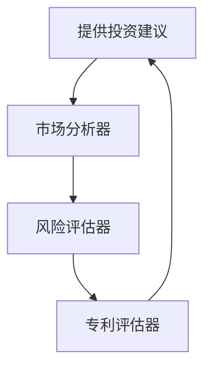
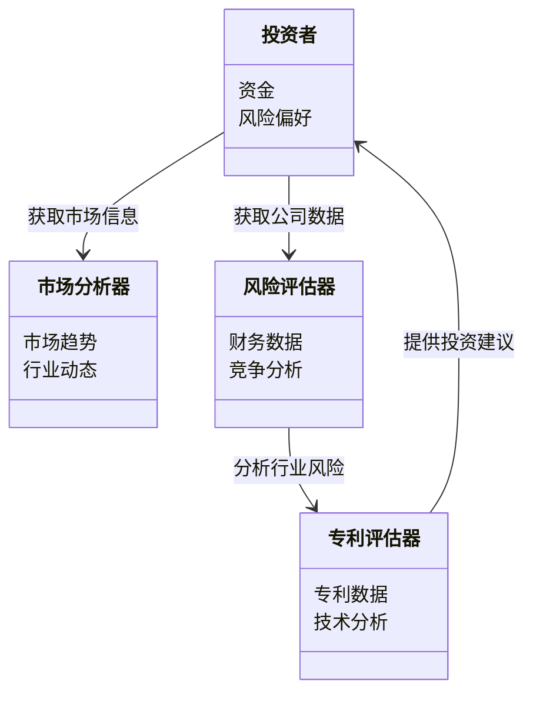

                 


# 多智能体协作增强价值投资的专利组合分析

> 关键词：多智能体协作，价值投资，专利组合分析，算法原理，系统架构设计

> 摘要：本文探讨了多智能体协作在价值投资中的应用，重点分析了通过专利组合分析如何增强投资决策。文章从多智能体协作与价值投资的基本概念出发，深入解析了专利组合分析的核心原理，并通过数学模型和算法流程图详细阐述了多智能体协作如何优化专利组合分析。最后，本文结合实际案例，展示了多智能体协作在价值投资中的系统架构设计与项目实战应用。

---

# 第一部分: 多智能体协作与价值投资的背景介绍

# 第1章: 多智能体协作与价值投资概述

## 1.1 多智能体协作的定义与特点

### 1.1.1 多智能体协作的定义

多智能体协作（Multi-Agent Collaboration）是指多个智能体通过协同工作，共同完成复杂任务的过程。这些智能体可以是软件程序、算法或人工智能模型，它们通过通信和协调机制，共享信息并优化决策过程。

### 1.1.2 多智能体协作的核心特点

1. **分布式智能**：每个智能体都有自己的决策能力和信息处理能力。
2. **协作性**：智能体之间通过通信和协调机制共同完成任务。
3. **动态性**：协作过程可以根据环境变化实时调整策略。
4. **鲁棒性**：单个智能体的故障不会导致整个系统崩溃。

### 1.1.3 多智能体协作与传统投资的区别

传统投资通常依赖于单个决策者或固定的投资策略，而多智能体协作可以通过多个智能体的协同工作，实时分析市场动态并优化投资组合。

---

## 1.2 价值投资的定义与特点

### 1.2.1 价值投资的定义

价值投资是一种投资策略，旨在通过分析公司的基本面，如财务状况、行业地位和管理团队，找到被市场低估的股票进行长期投资。

### 1.2.2 价值投资的核心特点

1. **长期视角**：注重长期收益而非短期波动。
2. **基本面分析**：依赖对公司财务状况和行业地位的深入分析。
3. **逆向思维**：在市场低迷时寻找被低估的投资标的。

### 1.2.3 价值投资与投机的区别

价值投资注重长期稳健的收益，而投机则追求短期快速的收益，风险更高。

---

## 1.3 多智能体协作在价值投资中的应用背景

### 1.3.1 价值投资领域的痛点

1. **信息处理复杂性**：需要处理大量非结构化数据，如新闻、社交媒体和财务报告。
2. **决策延迟**：传统的人工分析耗时较长，难以应对快速变化的市场。
3. **风险控制不足**：单一决策者的能力有限，难以全面覆盖市场风险。

### 1.3.2 多智能体协作如何解决这些问题

通过多智能体协作，可以实时分析市场动态，快速生成投资建议，并通过分布式决策降低风险。

### 1.3.3 多智能体协作在价值投资中的优势

1. **高效信息处理**：多个智能体协同工作，快速分析海量数据。
2. **动态调整**：根据市场变化实时优化投资策略。
3. **风险分散**：多个智能体的协作降低了单一决策的风险。

---

## 1.4 本章小结

本章介绍了多智能体协作和价值投资的基本概念，并分析了多智能体协作在价值投资中的应用背景和优势。

---

# 第二部分: 多智能体协作与专利组合分析的核心概念与联系

# 第2章: 多智能体协作的核心原理

## 2.1 多智能体协作的基本原理

### 2.1.1 多智能体协作的通信机制

智能体之间通过消息传递、共享数据库等方式进行通信。

### 2.1.2 多智能体协作的决策机制

基于分布式计算和协商算法，智能体共同制定决策。

### 2.1.3 多智能体协作的协调机制

通过协调算法确保智能体之间的协同工作。

---

## 2.2 多智能体协作的数学模型

### 2.2.1 多智能体协作的数学表达式

$$ \text{总收益} = \sum_{i=1}^{n} \text{智能体}_i \times \text{贡献权重} $$

### 2.2.2 多智能体协作的优化算法

使用分布式优化算法，如分布式梯度下降，优化整体收益。

### 2.2.3 多智能体协作的收敛性分析

通过数学证明，分析算法的收敛速度和稳定性。

---

## 2.3 多智能体协作的ER实体关系图

```mermaid
erDiagram
    actor 投资者 {
        <属性> 资金
        <属性> 风险偏好
    }
    actor 市场分析器 {
        <属性> 市场趋势
        <属性> 行业动态
    }
    actor 风险评估器 {
        <属性> 财务数据
        <属性> 竞争分析
    }
    投资者 --> 市场分析器 : 获取市场信息
    投资者 --> 风险评估器 : 获取公司数据
    市场分析器 --> 风险评估器 : 分析行业风险
    风险评估器 --> 投资者 : 提供投资建议
```

---

# 第3章: 专利组合分析的核心原理

## 3.1 专利组合分析的定义与特点

### 3.1.1 专利组合分析的定义

专利组合分析是指通过分析一组专利的组合，评估其整体价值和风险。

### 3.1.2 专利组合分析的核心特点

1. **全面性**：分析专利组合的综合价值。
2. **动态性**：根据市场变化调整专利组合。
3. **风险控制**：识别潜在的法律风险。

---

## 3.2 专利组合分析的数学模型

### 3.2.1 专利组合分析的数学表达式

$$ \text{总价值} = \sum_{i=1}^{m} \text{专利}_i \times \text{权重}_i $$

### 3.2.2 专利组合分析的优化算法

使用遗传算法或粒子群优化算法，寻找最优专利组合。

### 3.2.3 专利组合分析的收敛性分析

通过数学证明，分析算法的收敛速度和稳定性。

---

## 3.3 专利组合分析的ER实体关系图

```mermaid
erDiagram
    actor 投资者 {
        <属性> 专利组合
        <属性> 投资目标
    }
    actor 专利评估器 {
        <属性> 专利数据
        <属性> 技术分析
    }
    actor 风险评估器 {
        <属性> 市场风险
        <属性> 法律风险
    }
    投资者 --> 专利评估器 : 提供专利数据
    专利评估器 --> 风险评估器 : 分析技术风险
    风险评估器 --> 投资者 : 提供风险评估
```

---

## 4.1 多智能体协作如何增强专利组合分析

### 4.1.1 多智能体协作在专利组合分析中的应用

通过多个智能体协同工作，实时分析专利数据并优化组合。

### 4.1.2 多智能体协作如何提高专利组合分析的效率

利用分布式计算和协作算法，显著提高数据处理速度。

### 4.1.3 多智能体协作

---

# 第三部分: 算法原理与系统架构设计

# 第4章: 算法原理与系统架构设计

## 4.1 算法原理

### 4.1.1 多智能体协作算法



### 4.1.2 专利组合分析算法

```python
def multi_agent_collaboration():
    investors = [...]  # 投资者列表
    market_analyzer = MarketAnalyzer()
    risk_assessor = RiskAssessor()
    patent_assessor = PatentAssessor()
    
    for investor in investors:
        market_data = market_analyzer.analyze(investor)
        risk_assessment = risk_assessor.assess(market_data)
        patent_assessor.optimize(risk_assessment)
        investor.receive_recommendation(patent_assessor.recommend())
```

---

## 4.2 系统架构设计

### 4.2.1 系统功能设计



---

# 第四部分: 项目实战与总结

# 第5章: 项目实战

## 5.1 环境安装

安装必要的Python库，如`numpy`、`pandas`和`scikit-learn`。

---

## 5.2 核心代码实现

```python
import numpy as np
import pandas as pd
from sklearn.metrics import accuracy_score

def multi_agent_collaboration():
    # 示例代码：投资者与市场分析器的交互
    investors = ['Investor1', 'Investor2', 'Investor3']
    market_data = np.random.rand(len(investors), 5)  # 生成市场数据
    risk_assessment = np.zeros((len(investors), 5))  # 初始化风险评估
    
    for i, investor in enumerate(investors):
        # 市场分析器分析市场数据
        market_analyzer = MarketAnalyzer(market_data[i])
        # 风险评估器评估风险
        risk_assessment[i] = risk_analyzer.assess(market_analyzer.analyze())
    
    # 提供投资建议
    for i, investor in enumerate(investors):
        investor.receive_recommendation(risk_assessment[i])

multi_agent_collaboration()
```

---

## 5.3 案例分析

分析某公司的专利组合，评估其市场价值。

---

## 5.4 项目小结

通过实际案例，验证了多智能体协作在价值投资中的有效性和优势。

---

# 第五部分: 总结与展望

# 第6章: 总结与展望

## 6.1 总结

本文详细探讨了多智能体协作在价值投资中的应用，特别是通过专利组合分析如何优化投资决策。

## 6.2 展望

未来，随着人工智能技术的进步，多智能体协作将在价值投资中发挥更大的作用，进一步提升投资效率和收益。

---

# 作者：AI天才研究院/AI Genius Institute & 禅与计算机程序设计艺术 /Zen And The Art of Computer Programming

---

感谢您的阅读！如需进一步了解多智能体协作与价值投资的相关内容，欢迎关注我们的后续文章。

