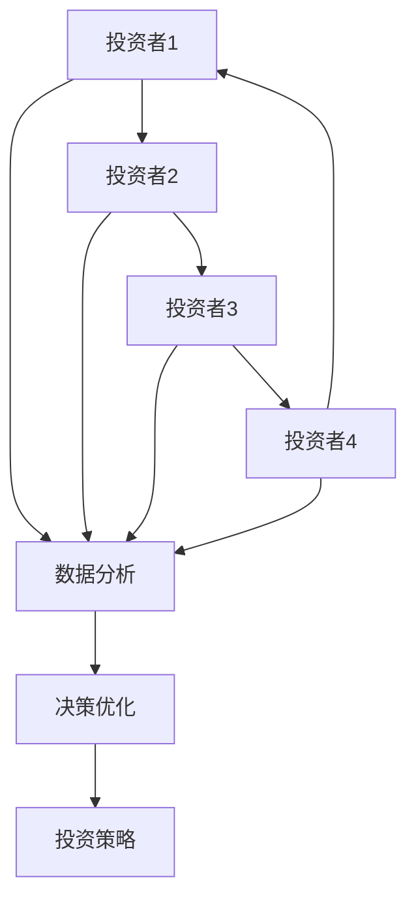
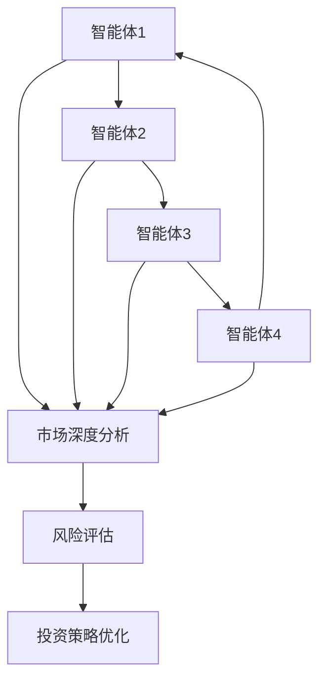
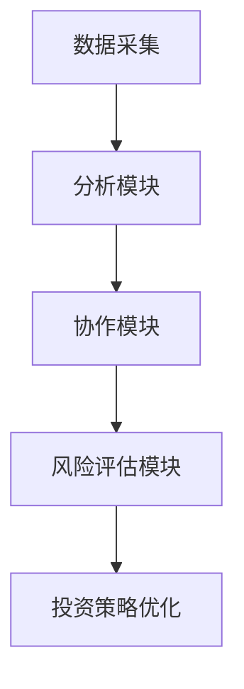

                 


# 多智能体协作增强价值投资的市场流动性风险分析

## 关键词：
- 多智能体协作
- 价值投资
- 市场流动性风险
- 博弈论模型
- 机器学习
- 系统架构设计

## 摘要：
本文探讨了多智能体协作在价值投资中的应用，重点分析了其对市场流动性风险的影响。通过结合多智能体系统的分布式计算优势与价值投资的深度分析方法，本文提出了新的流动性风险管理策略，并通过算法和数学模型进行了详细阐述。

---

## 第一部分：多智能体协作与价值投资基础

### 第1章：多智能体协作概述

#### 1.1 多智能体协作的基本概念
多智能体协作是指多个智能体通过信息共享和分工合作，共同完成复杂任务的过程。与传统单智能体系统相比，多智能体协作具有以下优势：
- **信息共享**：多个智能体可以共享数据和知识，提高决策的全面性。
- **分工合作**：每个智能体专注于特定任务，提升整体效率。
- **容错性**：单个智能体的故障不会导致整个系统崩溃。

**多智能体协作与传统方法对比**：
| 对比维度 | 多智能体协作 | 传统单智能体系统 |
|----------|--------------|------------------|
| 信息共享 | 高            | 低               |
| 分工合作 | 高            | 低               |
| 容错性    | 高            | 低               |

在金融领域，多智能体协作可以用于投资决策、风险管理等场景。例如，多个智能体可以分别分析市场数据、评估风险，并协同制定投资策略。

#### 1.2 价值投资的基本原理
价值投资是一种以基本面分析为基础的投资策略，核心在于寻找被市场低估的资产。其核心理念包括：
1. **有效市场假说**：市场可能无法完全反映所有信息，存在价格偏离内在价值的机会。
2. **基本面分析**：通过分析公司的财务报表、行业地位等因素，评估其内在价值。
3. **技术分析**：通过分析历史价格和成交量等数据，预测未来价格走势。

**技术分析的多维度视角**：
- **趋势分析**：识别价格的上升或下降趋势。
- **形态分析**：通过价格图表识别支撑位、阻力位等关键点。
- **指标分析**：使用RSI、MACD等技术指标辅助决策。

---

### 第2章：市场流动性风险的基本概念

#### 2.1 流动性风险的定义与分类
流动性风险是指资产在短时间内无法以合理价格变现的风险。其分类如下：
1. **市场流动性风险**：整个市场的流动性不足，影响所有资产的价格。
2. **个体流动性风险**：特定资产的流动性不足，影响其变现能力。

**流动性风险的影响**：
- **交易成本增加**：买卖价差扩大。
- **价格波动加剧**：市场深度不足导致价格剧烈波动。
- **资金损失**：投资者可能以低于预期的价格出售资产。

#### 2.2 流动性风险的度量方法
流动性风险的度量通常涉及以下指标：
- **市场深度**：在特定价格水平上可以交易的数量。
- **市场冲击模型**：衡量大额交易对市场价格的影响。
- **流动性风险价值（L RVaR）**：衡量在一定置信水平下的流动性损失。

**市场冲击模型示例**：
假设某资产的市场深度为100万股，每万股价格波动1%。若投资者卖出10万股，价格将下跌约0.1%。

---

## 第二部分：多智能体协作与价值投资的结合

### 第3章：多智能体协作在价值投资中的应用

#### 3.1 多智能体协作在投资决策中的优势
多智能体协作通过信息共享和分工合作，显著提升了价值投资的效果：
- **信息共享**：多个智能体可以分别分析财务报表、行业趋势等数据，并将结果共享给其他智能体。
- **决策优化**：通过协作，智能体可以综合考虑多个因素，制定更优的投资策略。
- **风险分散**：多个智能体分别承担不同的风险，降低整体投资组合的风险。

**信息共享与决策优化的流程图**：



#### 3.2 多智能体协作与价值投资的协同效应
多智能体协作与价值投资的结合，主要体现在以下几个方面：
- **信息共享**：智能体可以共享市场数据、分析结果等信息，提高决策的准确性。
- **分工合作**：每个智能体专注于特定领域，如技术分析、基本面分析等，提升整体分析的深度和广度。
- **风险分散**：通过分工合作，智能体可以分别承担不同的风险，降低整体投资组合的风险。

---

### 第4章：价值投资中的多智能体协作算法

#### 4.1 多智能体协作算法的基本原理
多智能体协作算法通常基于分布式计算和博弈论模型。以下是其实现流程：


#### 4.2 价值投资中的算法实现
价值投资中的多智能体协作算法可以通过以下步骤实现：

1. **信息共享**：智能体分别收集市场数据（如财务报表、价格走势等）并共享给其他智能体。
2. **分工合作**：每个智能体专注于特定领域，如技术分析或基本面分析，并生成分析结果。
3. **决策优化**：通过综合各智能体的分析结果，制定最优的投资策略。

**数学模型示例**：
假设某智能体专注于基本面分析，其分析结果可以用以下公式表示：
$$
\text{内在价值} = \frac{\text{净利润}}{\text{资本成本}}
$$

---

## 第三部分：市场流动性风险的多智能体协作分析

### 第5章：流动性风险的多智能体协作分析方法

#### 5.1 多智能体协作在流动性风险分析中的应用
多智能体协作可以显著提升流动性风险的分析能力：
- **信息共享**：智能体可以共享市场数据，提高分析的全面性。
- **分工合作**：每个智能体专注于特定领域，如市场深度分析或市场冲击模型，并生成分析结果。
- **风险分散**：通过分工合作，智能体可以分别承担不同的风险，降低整体投资组合的风险。

**市场深度分析的流程图**：



#### 5.2 多智能体协作与流动性风险的协同效应
多智能体协作与流动性风险的结合，主要体现在以下几个方面：
- **信息共享**：智能体可以共享市场数据、分析结果等信息，提高风险评估的准确性。
- **分工合作**：每个智能体专注于特定领域，如市场深度分析或市场冲击模型，并生成分析结果。
- **风险分散**：通过分工合作，智能体可以分别承担不同的风险，降低整体投资组合的风险。

---

### 第6章：系统架构设计与实现

#### 6.1 系统架构设计
系统架构设计包括以下几个部分：
1. **数据采集模块**：负责收集市场数据，如股票价格、成交量等。
2. **分析模块**：包括基本面分析和技术分析模块，分别由不同的智能体完成。
3. **协作模块**：负责信息共享和决策优化。
4. **风险评估模块**：基于多智能体的分析结果，评估流动性风险并制定优化策略。

**系统架构图**：



#### 6.2 系统实现与实战分析
以下是系统实现的核心代码：

```python
import numpy as np
import pandas as pd

# 数据采集模块
def collect_data(ticker):
    # 模拟数据采集
    data = pd.DataFrame({'price': np.random.randn(100), 'volume': np.random.randn(100)})
    return data

# 分析模块
def fundamental_analysis(data):
    # 基本面分析
    return data['price'].mean()

def technical_analysis(data):
    # 技术分析
    return data['volume'].mean()

# 协作模块
def collaborate_analysts(fundamental, technical):
    # 综合分析
    return (fundamental + technical) / 2

# 风险评估模块
def assess_risk(collaborate_result):
    # 模拟风险评估
    return np.random.randn(1)

# 投资策略优化
def optimize_strategy(risk):
    # 模拟策略优化
    return risk * 2

# 主函数
def main():
    ticker = 'AAPL'
    data = collect_data(ticker)
    fundamental = fundamental_analysis(data)
    technical = technical_analysis(data)
    collaborate_result = collaborate_analysts(fundamental, technical)
    risk = assess_risk(collaborate_result)
    strategy = optimize_strategy(risk)
    print("优化后的投资策略：", strategy)

if __name__ == "__main__":
    main()
```

**代码解读**：
- `collect_data`：从指定股票代码中收集数据。
- `fundamental_analysis` 和 `technical_analysis`：分别进行基本面和技术分析。
- `collaborate_analysts`：将基本面和技术分析结果综合起来。
- `assess_risk` 和 `optimize_strategy`：基于综合分析结果，评估风险并优化投资策略。

---

## 项目实战与总结

### 第7章：项目实战分析
假设我们分析一只股票的流动性风险，以下是具体步骤：
1. **数据采集**：收集该股票过去一年的交易数据。
2. **分析模块**：分别进行基本面和技术分析。
3. **协作模块**：将分析结果综合起来。
4. **风险评估模块**：基于综合分析结果，评估流动性风险。
5. **优化策略**：根据风险评估结果，优化投资策略。

### 第8章：总结与展望
通过多智能体协作，我们可以显著提升价值投资的分析能力，尤其是在市场流动性风险的分析方面。未来，随着人工智能技术的不断发展，多智能体协作将在金融领域发挥更大的作用。

---

## 作者：AI天才研究院/AI Genius Institute & 禅与计算机程序设计艺术 /Zen And The Art of Computer Programming

