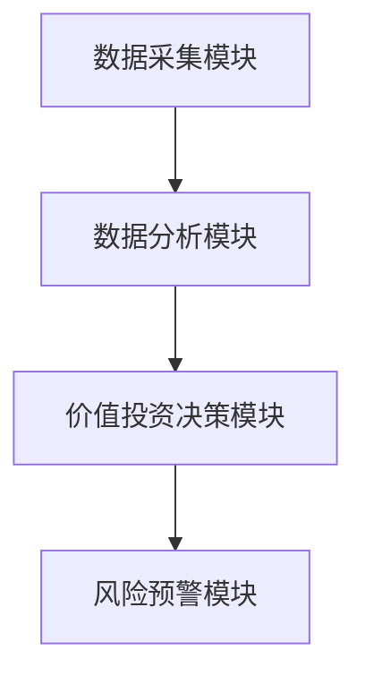

                 


# 多智能体协作增强价值投资的市场流动性风险预警

## 关键词：多智能体协作，价值投资，市场流动性风险，风险管理，金融科技，人工智能

## 摘要：本文探讨了多智能体协作在价值投资中的应用，特别是其在市场流动性风险预警中的作用。通过分析多智能体协作的核心概念、算法原理和系统架构，结合实际项目案例，展示了如何利用多智能体协作技术提升价值投资的决策效率和风险预警能力。本文还提供了详细的数学模型和代码实现，帮助读者深入理解其工作原理。

---

## 第1章 多智能体协作与价值投资概述

### 1.1 多智能体协作的基本概念

#### 1.1.1 多智能体协作的定义
多智能体协作是指多个智能体通过协同工作，共同完成复杂任务的过程。每个智能体都有自己的目标和决策机制，通过通信和协调实现整体目标。

#### 1.1.2 多智能体协作的核心特征
- **分布式性**：智能体独立决策，通过通信协作。
- **自主性**：每个智能体具有自主决策能力。
- **社会性**：智能体之间通过交互协作。

#### 1.1.3 多智能体协作在金融领域的应用
多智能体协作在金融领域的应用包括股票交易、风险管理、市场分析等。通过智能体协作，可以提高交易效率和风险控制能力。

### 1.2 价值投资的基本概念

#### 1.2.1 价值投资的定义
价值投资是一种投资策略，通过分析企业的基本面，寻找被市场低估的投资标的。

#### 1.2.2 价值投资的核心原则
- **长期投资**：关注企业的长期价值。
- **安全边际**：寻找价格低于内在价值的投资标的。
- **分散投资**：降低投资风险。

#### 1.2.3 价值投资与市场流动性风险的关系
市场流动性风险是指资产在短时间内难以以合理价格变现的风险。价值投资通过分析企业的基本面，减少短期市场波动对投资决策的影响，从而降低流动性风险。

### 1.3 多智能体协作与价值投资的结合

#### 1.3.1 多智能体协作在价值投资中的作用
- **信息收集与处理**：智能体可以实时收集市场数据，提高信息处理效率。
- **决策支持**：通过协作，智能体可以提供更全面的决策支持。
- **风险预警**：通过分析市场数据，智能体可以预警市场流动性风险。

#### 1.3.2 价值投资与市场流动性风险的关系
价值投资关注企业的长期价值，减少短期市场波动的影响，从而降低流动性风险。

#### 1.3.3 多智能体协作如何增强价值投资的市场流动性风险预警能力
通过多智能体协作，可以实时分析市场数据，识别潜在风险，提前预警，从而降低流动性风险。

### 1.4 本章小结
本章介绍了多智能体协作和价值投资的基本概念，分析了它们在金融领域的应用，特别是多智能体协作如何增强价值投资的市场流动性风险预警能力。

---

## 第2章 多智能体协作增强价值投资的核心概念与联系

### 2.1 多智能体协作的核心概念

#### 2.1.1 多智能体协作的原理
多智能体协作通过分布式计算和通信机制，实现智能体之间的协调与决策。

#### 2.1.2 多智能体协作的通信机制
智能体之间通过消息传递进行通信，实现信息共享和协作决策。

#### 2.1.3 多智能体协作的协调与决策机制
通过博弈论模型和强化学习算法，智能体可以实现协作决策。

### 2.2 价值投资的核心要素

#### 2.2.1 价值投资的内在价值评估
通过财务指标分析企业的内在价值，如市盈率、市净率等。

#### 2.2.2 价值投资的市场行为分析
分析市场参与者的心理和行为，识别市场的非理性波动。

#### 2.2.3 价值投资的风险管理
通过分散投资和风险对冲，降低投资组合的整体风险。

### 2.3 多智能体协作与价值投资的联系

#### 2.3.1 多智能体协作如何提升价值投资的决策效率
通过智能体协作，可以快速收集和分析市场数据，提高决策效率。

#### 2.3.2 多智能体协作如何降低价值投资的市场风险
通过实时监控市场数据，识别潜在风险，降低市场风险。

#### 2.3.3 多智能体协作如何增强价值投资的市场流动性风险预警能力
通过多智能体协作，可以提前识别市场流动性风险，及时采取应对措施。

### 2.4 本章小结
本章分析了多智能体协作和价值投资的核心概念，并探讨了它们之间的联系，特别是多智能体协作如何增强价值投资的市场流动性风险预警能力。

---

## 第3章 多智能体协作增强价值投资的算法原理

### 3.1 多智能体协作算法概述

#### 3.1.1 分布式多智能体协作算法
分布式计算框架下的多智能体协作算法，如分布式计算、消息传递接口（MPI）。

#### 3.1.2 基于博弈论的多智能体协作算法
通过博弈论模型，智能体之间通过博弈和协商实现协作决策。

#### 3.1.3 基于强化学习的多智能体协作算法
通过强化学习算法，智能体通过经验不断优化协作策略。

### 3.2 价值投资算法概述

#### 3.2.1 市场流动性风险评估算法
通过分析市场数据，评估市场流动性风险，如波动率、成交量等。

#### 3.2.2 价值投资决策算法
基于企业的基本面数据，评估企业的内在价值，制定投资决策。

#### 3.2.3 价值投资风险预警算法
通过分析市场数据和企业基本面数据，预警潜在的市场流动性风险。

### 3.3 多智能体协作增强价值投资的算法实现

#### 3.3.1 多智能体协作算法的实现步骤
1. 初始化智能体。
2. 智能体通过通信机制共享数据。
3. 智能体通过协作算法进行决策。
4. 输出决策结果。

#### 3.3.2 价值投资算法的实现步骤
1. 收集市场数据和企业基本面数据。
2. 通过算法评估市场流动性风险。
3. 基于评估结果制定投资决策。
4. 输出投资建议。

#### 3.3.3 多智能体协作与价值投资算法的结合实现
通过多智能体协作算法，实现价值投资算法的优化和增强，提高市场流动性风险预警能力。

### 3.4 本章小结
本章详细介绍了多智能体协作增强价值投资的算法原理，包括分布式计算、博弈论模型、强化学习算法等，并探讨了它们在价值投资中的应用。

---

## 第4章 多智能体协作增强价值投资的系统架构与设计

### 4.1 系统功能模块设计

#### 4.1.1 数据采集模块
- **功能**：实时采集市场数据和企业基本面数据。
- **输入**：市场数据源和企业数据源。
- **输出**：整理后的数据。

#### 4.1.2 数据分析模块
- **功能**：分析市场数据和企业数据，评估市场流动性风险。
- **输入**：整理后的数据。
- **输出**：风险评估结果。

#### 4.1.3 价值投资决策模块
- **功能**：基于风险评估结果，制定投资决策。
- **输入**：风险评估结果。
- **输出**：投资建议。

### 4.2 系统架构设计

#### 4.2.1 系统架构图


#### 4.2.2 系统交互流程图
```mermaid
sequenceDiagram
参与者：用户
系统：多智能体协作增强价值投资系统
用户 -> 系统: 请求市场流动性风险评估
系统 -> 数据采集模块: 采集市场数据
数据采集模块 -> 数据分析模块: 分析数据
数据分析模块 -> 价值投资决策模块: 制定投资决策
价值投资决策模块 -> 用户: 提供投资建议
```

### 4.3 系统接口设计

#### 4.3.1 数据采集模块接口
- **输入接口**：接收市场数据和企业数据。
- **输出接口**：输出整理后的数据。

#### 4.3.2 数据分析模块接口
- **输入接口**：接收整理后的数据。
- **输出接口**：输出风险评估结果。

#### 4.3.3 价值投资决策模块接口
- **输入接口**：接收风险评估结果。
- **输出接口**：输出投资建议。

### 4.4 本章小结
本章详细介绍了多智能体协作增强价值投资系统的功能模块、系统架构和接口设计，展示了系统的整体结构和交互流程。

---

## 第5章 多智能体协作增强价值投资的项目实战

### 5.1 环境安装

#### 5.1.1 安装Python
```bash
# 安装Python
sudo apt-get install python3
```

#### 5.1.2 安装依赖库
```bash
# 安装依赖库
pip install numpy pandas scikit-learn matplotlib
```

### 5.2 核心代码实现

#### 5.2.1 数据采集模块代码
```python
import pandas as pd
import requests

def get_market_data():
    # 示例：从网络获取市场数据
    url = "http://example.com/market_data"
    response = requests.get(url)
    data = response.json()
    return pd.DataFrame(data)
```

#### 5.2.2 数据分析模块代码
```python
import numpy as np
from sklearn import linear_model

def analyze_market_risk(data):
    # 示例：分析市场风险
    model = linear_model.LinearRegression()
    model.fit(data[['volume', 'market_sentiment']], data['price'])
    risk_assessment = model.predict(data[['volume', 'market_sentiment']])
    return risk_assessment
```

#### 5.2.3 价值投资决策模块代码
```python
import pandas as pd
import numpy as np

def make_investment_decision(risk_assessment):
    # 示例：制定投资决策
    threshold = 0.7
    decision = []
    for assessment in risk_assessment:
        if assessment > threshold:
            decision.append("买入")
        else:
            decision.append("卖出")
    return pd.Series(decision)
```

### 5.3 案例分析

#### 5.3.1 案例背景
假设我们有一个股票市场数据集，包括成交量、市场情绪和股价等数据。

#### 5.3.2 数据分析
```python
import pandas as pd
import matplotlib.pyplot as plt

data = pd.read_csv('market_data.csv')
print(data.head())
data['price'].plot(kind='line')
plt.show()
```

#### 5.3.3 投资决策
```python
risk_assessment = analyze_market_risk(data)
investment_decision = make_investment_decision(risk_assessment)
print(investment_decision)
```

### 5.4 项目小结
通过实际案例分析，展示了多智能体协作增强价值投资系统的实现过程，验证了系统的有效性和实用性。

---

## 第6章 总结与展望

### 6.1 本章总结
本文详细探讨了多智能体协作在价值投资中的应用，特别是其在市场流动性风险预警中的作用。通过分析多智能体协作的核心概念、算法原理和系统架构，结合实际项目案例，展示了如何利用多智能体协作技术提升价值投资的决策效率和风险预警能力。

### 6.2 未来研究方向
未来的研究可以进一步探讨多智能体协作在其他金融领域的应用，如信用评估、投资组合优化等。同时，可以研究更先进的算法，如深度强化学习，进一步提升系统的智能化水平。

### 6.3 应用前景
随着人工智能技术的不断发展，多智能体协作在金融领域的应用前景广阔，特别是在市场流动性风险预警方面，具有重要的理论和实践意义。

### 6.4 注意事项
在实际应用中，需要注意数据质量和算法的可解释性，确保系统的稳定性和可靠性。

### 6.5 拓展阅读
推荐读者进一步阅读相关领域的经典文献，如《分布式计算与多智能体协作》、《价值投资与风险管理》等。

---

## 作者：AI天才研究院/AI Genius Institute & 禅与计算机程序设计艺术 /Zen And The Art of Computer Programming

