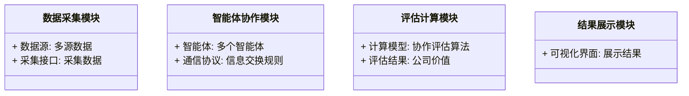
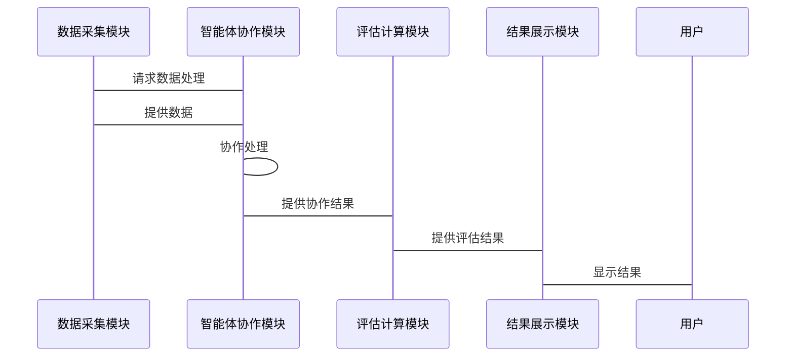

                 


# 多智能体协作实现全面的公司价值评估

> 关键词：多智能体协作，公司价值评估，分布式系统，人工智能，机器学习

> 摘要：本文探讨了多智能体协作在公司价值评估中的应用，分析了多智能体协作的基本概念、核心原理、算法实现、系统架构以及实际案例。通过系统化的分析和详细的技术实现，展示了多智能体协作如何帮助实现全面、精准的公司价值评估。

---

## 第1章: 多智能体协作概述

### 1.1 多智能体协作的基本概念
#### 1.1.1 多智能体系统的定义
多智能体系统（Multi-Agent System, MAS）是由多个智能体（Agent）组成的分布式系统，每个智能体都是一个能够感知环境、自主决策的实体。智能体之间通过协作完成复杂任务，实现整体目标。

#### 1.1.2 多智能体协作的特征
- **独立性**：每个智能体具有独立性，能够自主决策。
- **协作性**：智能体之间通过协作完成任务，实现整体目标。
- **分布式性**：系统中的智能体分布在网络的不同节点，协作完成任务。
- **动态性**：环境和任务需求可能动态变化，智能体需要实时调整策略。

#### 1.1.3 多智能体协作与单智能体系统的区别
| 特性 | 多智能体协作 | 单智能体系统 |
|------|-------------|-------------|
| 独立性 | 高           | 低           |
| 协作性 | 高           | 无           |
| 分布式 | 是           | 否           |
| 动态性 | 高           | 低           |

### 1.2 公司价值评估的定义与挑战
#### 1.2.1 公司价值评估的基本概念
公司价值评估是对公司整体价值的估算，通常包括财务价值、市场价值、品牌价值等多个维度。传统方法依赖于财务数据和人工分析，存在效率低、主观性强的问题。

#### 1.2.2 传统公司价值评估方法的局限性
- **数据量不足**：传统方法依赖财务报表，无法充分利用多源数据。
- **效率低下**：人工分析耗时长，难以实时更新。
- **主观性**：评估结果受分析师主观因素影响较大。

#### 1.2.3 多智能体协作在公司价值评估中的优势
- **数据处理能力**：多智能体协作能够处理海量数据，提供全面的评估。
- **实时性**：分布式系统能够实时更新数据，保证评估结果的及时性。
- **准确性**：通过多智能体协作，能够减少主观因素的影响，提高评估的准确性。

### 1.3 多智能体协作在公司价值评估中的应用前景
#### 1.3.1 多智能体协作的潜在应用场景
- **实时数据处理**：多智能体协作能够实时处理市场数据、财务数据等，提供动态的公司价值评估。
- **多维度分析**：智能体可以分别负责不同的评估维度，如财务、市场、品牌等，协作完成综合评估。
- **风险预警**：通过协作，智能体能够及时发现潜在风险，提供预警信息。

#### 1.3.2 企业采用多智能体协作的优势
- **提高效率**：多智能体协作能够快速处理大量数据，提高评估效率。
- **增强决策能力**：通过多维度分析，提供更全面的评估结果，增强决策的科学性。
- **降低成本**：分布式系统能够减少人工干预，降低评估成本。

#### 1.3.3 多智能体协作应用的挑战与机遇
- **挑战**：智能体之间的通信和协作需要高效的协议，系统设计复杂。此外，数据隐私和安全问题也需要解决。
- **机遇**：多智能体协作能够提升企业的数据分析能力，推动智能化转型。

### 1.4 本章小结
本章介绍了多智能体协作的基本概念，分析了公司价值评估的挑战与传统方法的局限性，探讨了多智能体协作在公司价值评估中的优势和应用前景。通过这些分析，为后续章节的深入探讨奠定了基础。

---

## 第2章: 多智能体协作的核心概念与联系

### 2.1 多智能体协作的核心原理
#### 2.1.1 多智能体协作的基本原理
多智能体协作的核心在于智能体之间的通信与协作。每个智能体根据自身感知的信息，通过协商和协作完成任务。协作过程包括信息交换、任务分配、协同决策等步骤。

#### 2.1.2 多智能体协作的通信机制
通信机制是多智能体协作的基础，包括信息传递、协议协商等。智能体之间的通信需要遵循一定的协议，确保信息的准确传递和处理。

#### 2.1.3 多智能体协作的决策机制
决策机制是智能体协作的核心，包括任务分配、决策制定等。智能体需要根据环境信息和协作需求，动态调整决策策略。

### 2.2 多智能体协作的核心概念对比
#### 2.2.1 多智能体协作的核心概念对比表格
| 概念     | 描述                                                                 |
|----------|----------------------------------------------------------------------|
| 智能体   | 具有感知和决策能力的实体，能够自主完成任务                           |
| 通信协议 | 智能体之间信息交换的规则，确保信息准确传递                           |
| 协作机制 | 智能体之间协同工作的规则，包括任务分配、决策制定等                   |

#### 2.2.2 多智能体协作的ER实体关系图
```mermaid
erDiagram
    智能体协作系统 {
        role 智能体
        role 通信协议
        role 协作机制
    }
    智能体协作系统 --> 智能体: 实现协作
    智能体协作系统 --> 通信协议: 信息交换
    智能体协作系统 --> 协作机制: 协同决策
```

### 2.3 多智能体协作的原理分析
#### 2.3.1 多智能体协作的流程图
```mermaid
graph TD
    A[智能体1] --> B[智能体2]: 信息交换
    B --> C[智能体3]: 协作决策
    C --> D[结果]: 评估结果
```

#### 2.3.2 多智能体协作的数学模型
多智能体协作的数学模型可以表示为：
$$ V = \sum_{i=1}^{n} v_i $$
其中，$V$ 表示公司整体价值，$v_i$ 表示各个智能体的评估结果。

### 2.4 本章小结
本章详细讲解了多智能体协作的核心原理，通过对比表格和ER图，清晰展示了多智能体协作的核心概念及其关系。这些内容为后续章节的算法实现和系统设计奠定了基础。

---

## 第3章: 多智能体协作的算法实现

### 3.1 算法原理
#### 3.1.1 算法选择
选择分布式机器学习算法作为多智能体协作的核心算法，每个智能体负责不同的数据处理任务，通过协作完成整体评估。

#### 3.1.2 算法流程图
```mermaid
graph TD
    A[智能体1] --> B[智能体2]: 信息同步
    B --> C[智能体3]: 协作学习
    C --> D[评估结果]: 输出结果
```

#### 3.1.3 算法实现
以下是算法实现的Python代码：
```python
def multi_agent_collaboration():
    # 初始化智能体
    agents = [Agent1(), Agent2(), Agent3()]
    # 信息同步
    for agent in agents:
        agent.sync_data()
    # 协作学习
    result = 0
    for agent in agents:
        result += agent.compute_value()
    return result
```

### 3.2 数学模型
#### 3.2.1 数学模型推导
多智能体协作的数学模型可以表示为：
$$ V = \sum_{i=1}^{n} v_i $$
其中，$V$ 是公司整体价值，$v_i$ 是第 $i$ 个智能体的评估结果。

#### 3.2.2 数学模型实现
通过Python代码实现数学模型：
```python
def compute_total_value():
    agents = [Agent1(), Agent2(), Agent3()]
    total_value = 0
    for agent in agents:
        total_value += agent.value
    return total_value
```

### 3.3 本章小结
本章详细讲解了多智能体协作的算法实现，通过流程图和代码示例，展示了如何通过分布式算法实现多智能体协作，为后续章节的系统设计奠定了基础。

---

## 第4章: 多智能体协作的系统架构设计

### 4.1 系统功能设计
#### 4.1.1 系统功能模块
- **数据采集模块**：负责采集公司相关的多源数据。
- **智能体协作模块**：实现智能体之间的协作和通信。
- **评估计算模块**：根据协作结果计算公司价值。
- **结果展示模块**：将评估结果以可视化形式展示。

#### 4.1.2 系统功能设计类图


### 4.2 系统架构设计
#### 4.2.1 系统架构图
```mermaid
graph TD
    数据采集模块 --> 智能体协作模块: 提供数据
    智能体协作模块 --> 评估计算模块: 提供协作结果
    评估计算模块 --> 结果展示模块: 提供评估结果
```

#### 4.2.2 系统交互流程图


### 4.3 本章小结
本章详细设计了多智能体协作的系统架构，通过类图和流程图展示了系统的各个模块及其交互关系，为实际应用提供了清晰的设计思路。

---

## 第5章: 多智能体协作的项目实战

### 5.1 项目环境安装
#### 5.1.1 环境要求
- Python 3.8+
- 相关库：numpy、pandas、matplotlib

#### 5.1.2 安装依赖
```bash
pip install numpy pandas matplotlib
```

### 5.2 项目核心实现
#### 5.2.1 智能体类
```python
class Agent:
    def __init__(self, id):
        self.id = id
        self.data = None
    def sync_data(self, data):
        self.data = data
    def compute_value(self):
        return self.data * self.id
```

#### 5.2.2 协作模块
```python
class CollaborationModule:
    def __init__(self, agents):
        self.agents = agents
    def collaborate(self):
        total_value = 0
        for agent in self.agents:
            total_value += agent.compute_value()
        return total_value
```

### 5.3 实际案例分析
#### 5.3.1 案例背景
假设我们有三个智能体，分别负责财务、市场和品牌价值的评估。

#### 5.3.2 实施步骤
1. 初始化智能体。
2. 同步数据。
3. 协作计算。
4. 输出结果。

#### 5.3.3 结果分析
计算结果为：
$$ V = v_1 + v_2 + v_3 $$
其中，$v_1$、$v_2$、$v_3$ 分别是财务、市场和品牌价值。

### 5.4 本章小结
本章通过具体的项目实战，展示了多智能体协作在公司价值评估中的实际应用，帮助读者理解理论与实践的结合。

---

## 第6章: 总结与展望

### 6.1 总结
本文详细探讨了多智能体协作在公司价值评估中的应用，从基本概念、算法实现到系统设计，全面分析了多智能体协作的优势和实现方法。

### 6.2 展望
未来，随着人工智能和分布式系统技术的发展，多智能体协作将在公司价值评估中发挥更大的作用。通过不断优化算法和系统架构，多智能体协作将能够提供更加精准、全面的评估结果。

### 6.3 最佳实践 tips
- **数据质量管理**：确保数据的准确性和完整性。
- **智能体协作协议设计**：制定高效的通信协议，确保智能体之间的协作效率。
- **系统安全性**：加强数据隐私保护，确保系统安全。

### 6.4 注意事项
- **系统复杂性**：多智能体协作系统的复杂性较高，需要精心设计和调试。
- **数据依赖性**：系统依赖于多源数据，数据质量直接影响评估结果。

### 6.5 拓展阅读
- 推荐阅读《Multi-Agent Systems: Complexity and Cognitive Perspectives》。
- 参考相关技术文档，深入学习多智能体协作的理论与应用。

---

## 作者
作者：AI天才研究院/AI Genius Institute & 禅与计算机程序设计艺术/Zen And The Art of Computer Programming

