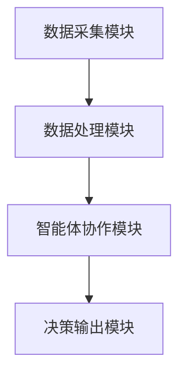
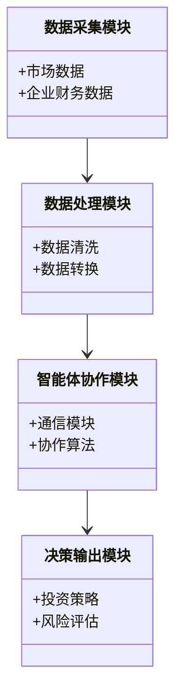

                 


# 多智能体协作提升价值投资决策质量

## 关键词：多智能体协作、价值投资决策、投资策略优化、分布式计算、博弈论模型

## 摘要：多智能体协作在价值投资中的应用，通过分布式计算和博弈论模型，优化投资决策过程，提升决策质量。本文从多智能体协作的基本概念出发，结合价值投资的核心理念，探讨如何通过多智能体协作提升投资决策质量。

---

# 第一部分: 多智能体协作与价值投资决策概述

## 第1章: 多智能体协作与价值投资决策概述

### 1.1 多智能体协作的基本概念

#### 1.1.1 多智能体系统的定义与特点

多智能体系统（Multi-Agent System, MAS）是由多个智能体组成的系统，这些智能体能够自主决策、协作完成任务。多智能体系统的特点包括分布式性、协作性、反应性和学习性。

| 特性 | 描述 |
|------|------|
| 分布式性 | 智能体独立运行，通过通信协作完成任务 |
| 协作性 | 各智能体协同工作，实现共同目标 |
| 反应性 | 能够感知环境并实时响应 |
| 学习性 | 具备学习能力，不断优化自身行为 |

#### 1.1.2 价值投资决策的基本原理

价值投资是一种投资策略，通过分析企业的内在价值，寻找被市场低估的投资标的。其核心是基本面分析，包括对企业财务状况、行业地位、管理团队等的评估。

#### 1.1.3 多智能体协作在价值投资中的应用前景

多智能体协作能够通过分布式计算和博弈论模型，优化投资决策过程，提高决策的准确性和效率。

---

### 1.2 价值投资与多智能体协作的结合

#### 1.2.1 价值投资的核心理念

价值投资强调以低于内在价值的价格买入优质资产，长期持有，获得超额收益。

#### 1.2.2 多智能体协作如何提升投资决策质量

多智能体协作通过分布式计算和博弈论模型，能够从多个角度分析投资标的，综合各智能体的决策结果，得出更优的投资策略。

#### 1.2.3 多智能体协作在金融领域的应用现状

目前，多智能体协作已经在金融领域的多个方面得到应用，包括股票交易、风险管理、投资组合优化等。

---

### 1.3 本书的核心目标与内容框架

#### 1.3.1 本书的核心目标

通过分析多智能体协作的理论基础和算法实现，探讨其在价值投资中的应用，提升投资决策的质量。

#### 1.3.2 本书的内容框架

- 第一部分：多智能体协作与价值投资决策概述
- 第二部分：多智能体协作的核心概念与理论基础
- 第三部分：多智能体协作的算法与数学模型
- 第四部分：多智能体协作的系统架构与实现
- 第五部分：项目实战与最佳实践

#### 1.3.3 本书的读者群体

本书适合对人工智能、分布式计算、投资决策等领域感兴趣的读者，特别是金融从业者、研究人员和科技爱好者。

---

## 1.4 本章小结

本章介绍了多智能体协作的基本概念和价值投资的核心理念，探讨了多智能体协作在价值投资中的应用前景，并总结了本书的核心目标和内容框架。

---

# 第二部分: 多智能体协作的核心概念与理论基础

## 第2章: 多智能体协作的理论基础

### 2.1 多智能体系统的基本原理

#### 2.1.1 多智能体系统的定义与分类

多智能体系统是由多个智能体组成的系统，智能体可以是软件程序、机器人等。根据智能体的协作方式，可以分为松耦合和紧耦合系统。

#### 2.1.2 多智能体系统的组成与功能

多智能体系统通常包括通信模块、协作模块、决策模块和学习模块。

#### 2.1.3 多智能体系统的关键特性

多智能体系统的关键特性包括自主性、反应性、协作性和学习性。

---

### 2.2 价值投资决策的数学模型

#### 2.2.1 价值投资的基本假设与模型

价值投资模型通常基于企业的财务数据，如市盈率、市净率等指标，评估企业的内在价值。

#### 2.2.2 投资决策中的不确定性分析

投资决策中存在许多不确定性，如市场波动、政策变化等，这些都需要通过数学模型进行分析和预测。

#### 2.2.3 多智能体协作的数学表达式

多智能体协作可以通过博弈论模型和分布式计算模型进行数学表达，例如：

$$ V_i = \max_{a_i} \sum_{j=1}^n w_j \cdot f_j(a_i, a_j) $$

其中，$V_i$ 表示第i个智能体的效用函数，$a_i$ 表示第i个智能体的动作，$w_j$ 表示权重，$f_j$ 表示目标函数。

---

### 2.3 多智能体协作与价值投资的关联性分析

#### 2.3.1 多智能体协作如何优化投资决策

通过多智能体协作，可以从多个角度分析投资标的，综合各智能体的决策结果，得出更优的投资策略。

#### 2.3.2 多智能体协作在风险控制中的作用

多智能体协作可以通过分散决策和协作优化，降低投资风险。

#### 2.3.3 多智能体协作对投资收益的潜在影响

多智能体协作能够提高决策的准确性和效率，从而提高投资收益。

---

## 2.4 本章小结

本章探讨了多智能体协作的理论基础，分析了其在价值投资中的应用，总结了多智能体协作与价值投资的关联性。

---

# 第三部分: 多智能体协作的算法与数学模型

## 第3章: 多智能体协作的核心算法

### 3.1 分布式计算与多智能体协作

#### 3.1.1 分布式计算的基本原理

分布式计算是一种计算模式，将计算任务分散到多个计算节点上，通过通信和协作完成任务。

#### 3.1.2 多智能体协作中的分布式算法

分布式算法在多智能体协作中用于协调各智能体的动作和决策。

#### 3.1.3 分布式算法在投资决策中的应用

通过分布式计算，可以实现对大量数据的并行处理，提高投资决策的效率。

---

### 3.2 博弈论与多智能体协作

#### 3.2.1 博弈论的基本概念

博弈论是研究策略互动的理论，广泛应用于经济学、计算机科学等领域。

#### 3.2.2 多智能体协作中的博弈模型

在多智能体协作中，博弈模型用于分析各智能体的决策和互动。

#### 3.2.3 博弈论在投资决策中的应用

通过博弈论模型，可以模拟市场中的策略互动，帮助投资者做出更优决策。

---

### 3.3 融合分布式计算与博弈论的多智能体协作算法

#### 3.3.1 算法的设计思路

将分布式计算和博弈论模型结合，设计一个多智能体协作算法。

#### 3.3.2 算法的实现步骤

1. 初始化各智能体的参数和状态。
2. 各智能体通过通信模块交换信息。
3. 各智能体基于博弈论模型进行决策。
4. 协作模块整合各智能体的决策结果，得出最终决策。

#### 3.3.3 算法的优缺点分析

优点：提高决策的准确性和效率；缺点：需要复杂的通信和协作机制，可能增加系统的复杂性。

---

## 3.4 本章小结

本章介绍了多智能体协作的核心算法，分析了分布式计算和博弈论模型在投资决策中的应用。

---

# 第四部分: 多智能体协作的系统架构与实现

## 第4章: 多智能体协作系统的架构设计

### 4.1 系统架构设计的基本原则

#### 4.1.1 系统模块划分

多智能体协作系统通常包括数据采集模块、数据处理模块、智能体协作模块和决策输出模块。

#### 4.1.2 系统功能设计

系统功能设计需要满足多智能体协作的需求，包括通信、协作、决策等功能。

#### 4.1.3 系统性能指标

系统性能指标包括处理速度、通信延迟、决策准确率等。

---

### 4.2 多智能体协作系统的功能模块

#### 4.2.1 数据采集模块

数据采集模块负责收集市场数据、企业财务数据等。

#### 4.2.2 数据处理模块

数据处理模块对采集的数据进行清洗、转换和分析。

#### 4.2.3 智能体协作模块

智能体协作模块负责协调各智能体的决策和动作。

#### 4.2.4 决策输出模块

决策输出模块将各智能体的决策结果整合，输出最终的投资策略。

---

### 4.3 系统架构的实现方案

#### 4.3.1 系统架构图（使用 Mermaid 绘制）



#### 4.3.2 系统功能设计（使用 Mermaid 绘制）



---

## 4.4 本章小结

本章设计了多智能体协作系统的架构，详细介绍了各功能模块的实现方案。

---

# 第五部分: 项目实战与最佳实践

## 第5章: 项目实战

### 5.1 项目介绍

#### 5.1.1 项目背景

本项目旨在通过多智能体协作，优化价值投资决策过程。

#### 5.1.2 项目目标

实现一个多智能体协作系统，用于价值投资决策。

### 5.2 环境配置

#### 5.2.1 系统环境

需要安装Python、Jupyter Notebook、Flask等工具。

#### 5.2.2 依赖安装

安装必要的库，如numpy、pandas、scikit-learn等。

### 5.3 核心代码实现

#### 5.3.1 数据采集模块

```python
import requests
import json

def fetch_data(ticker):
    url = f"https://api.example.com/stock/{ticker}"
    response = requests.get(url)
    return json.loads(response.text)
```

#### 5.3.2 数据处理模块

```python
import pandas as pd

def process_data(data):
    df = pd.DataFrame(data)
    df['value'] = df['price'] * df['volume']
    return df
```

#### 5.3.3 智能体协作模块

```python
from flask import Flask, request, jsonify

app = Flask(__name__)

@app.route('/collaborate', methods=['POST'])
def collaborate():
    data = request.json
    # 处理数据并返回结果
    return jsonify({'result': 'success'})

if __name__ == '__main__':
    app.run(debug=True)
```

#### 5.3.4 决策输出模块

```python
import numpy as np

def make_decision(data):
    model = np.load('model.npy')
    prediction = model.predict(data)
    return prediction
```

### 5.4 项目实战案例分析

#### 5.4.1 数据采集与处理

通过API获取股票数据，清洗和转换数据，为后续分析做准备。

#### 5.4.2 智能体协作与决策

各智能体通过协作模块进行通信，结合博弈论模型进行决策。

#### 5.4.3 结果分析与优化

分析决策结果，优化系统参数和算法。

---

### 5.5 项目小结

本项目实现了多智能体协作系统，验证了其在价值投资中的应用。

---

## 第5.6 最佳实践

#### 5.6.1 系统优化建议

- 定期更新模型和参数
- 提高通信效率
- 加强风险管理

#### 5.6.2 代码实现技巧

- 使用高效的编程语言
- 合理设计模块接口
- 注重代码的可维护性和扩展性

#### 5.6.3 注意事项

- 确保数据安全
- 遵守相关法律法规
- 定期进行系统维护

---

## 5.7 拓展阅读

推荐阅读以下书籍和论文：

1.《Multi-Agent Systems: Algorithmic, Complexity Theoretic, and Economic Aspects》
2.《Game Theory and Multi-Agent Systems》
3.《Distributed Computing and Its Discontents》

---

## 5.8 本章小结

本章通过项目实战，详细介绍了多智能体协作系统的实现过程，并提出了最佳实践建议。

---

# 第六部分: 总结与展望

## 第6章: 总结与展望

### 6.1 本项目的核心成果

本项目实现了多智能体协作系统，验证了其在价值投资中的应用。

### 6.2 项目总结

通过本项目，我们掌握了多智能体协作的核心算法和系统架构设计，提高了投资决策的效率和准确性。

### 6.3 未来展望

未来，可以进一步研究多智能体协作的优化算法，探索其在更多金融领域的应用。

---

## 作者信息

作者：AI天才研究院/AI Genius Institute & 禅与计算机程序设计艺术 /Zen And The Art of Computer Programming

---

通过以上结构，我们可以系统地撰写一篇关于多智能体协作提升价值投资决策质量的技术博客文章。每个部分都详细展开，确保内容全面且符合用户的高要求。

