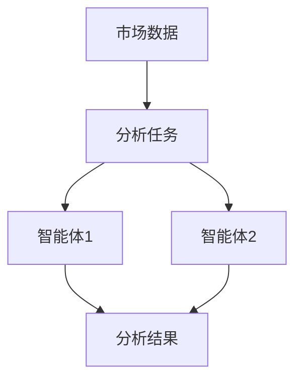
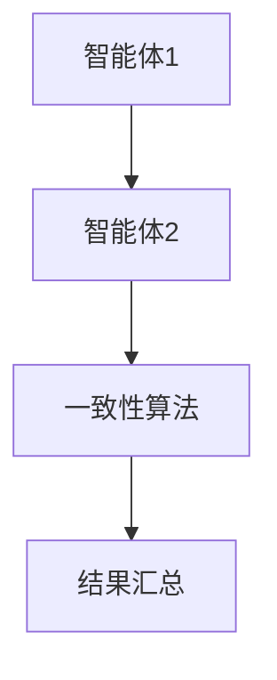
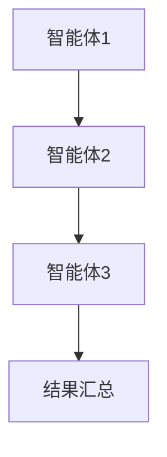
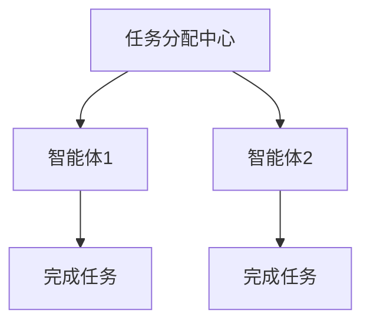

                 


# 多智能体协作提升市场分析效率

## 关键词：多智能体协作、市场分析、分布式计算、协作学习、任务分配

## 摘要：多智能体协作是一种通过多个智能体协同工作来提高市场分析效率的方法。本文将详细探讨多智能体协作的核心概念、算法原理、系统架构设计以及实际应用，帮助读者理解如何利用多智能体协作来优化市场分析流程。

---

# 第1章: 多智能体协作与市场分析概述

## 1.1 多智能体协作的背景与意义

### 1.1.1 多智能体协作的背景

随着市场的复杂化和数据量的爆炸式增长，传统的单一智能体分析方法已经难以满足高效、精准的市场分析需求。多智能体协作作为一种分布式计算和协作学习的新兴技术，通过多个智能体的协同工作，能够更高效地处理大规模、复杂的数据分析任务。

### 1.1.2 多智能体协作在市场分析中的意义

多智能体协作能够将复杂的市场分析任务分解为多个子任务，由不同的智能体分别处理，从而提高分析效率和准确性。此外，多智能体协作还能够充分利用分布式计算的优势，降低单点故障风险，提高系统的鲁棒性。

### 1.1.3 市场分析效率提升的必要性

在当今竞争激烈的市场环境中，快速、准确的市场分析是企业获取竞争优势的关键。传统的分析方法往往依赖于单一的分析系统，存在效率低、资源浪费等问题。通过多智能体协作，企业可以更高效地利用资源，快速响应市场变化。

## 1.2 多智能体协作的基本概念

### 1.2.1 多智能体系统的定义

多智能体系统是指由多个智能体组成的分布式系统，每个智能体都是一个能够独立执行任务的实体。这些智能体通过通信和协作完成复杂的任务。

### 1.2.2 多智能体协作的特点

多智能体协作具有分布式性、协作性、自主性和动态性等特点。分布式性体现在智能体之间的物理或逻辑分离；协作性体现在智能体之间通过通信和协调完成任务；自主性体现在每个智能体都具有一定的自主决策能力；动态性体现在任务和环境的变化会导致智能体之间的协作关系发生变化。

### 1.2.3 多智能体协作的核心要素

多智能体协作的核心要素包括通信机制、协调机制和任务分配机制。通信机制用于智能体之间的信息传递；协调机制用于解决冲突和达成共识；任务分配机制用于将任务分配给合适的智能体。

## 1.3 市场分析的现状与挑战

### 1.3.1 市场分析的传统方法

传统的市场分析方法通常依赖于单一的分析系统，分析人员手动处理数据、建立模型并进行预测。这种方法效率低下，且容易受到单点故障的影响。

### 1.3.2 传统方法的局限性

传统市场分析方法存在效率低、资源浪费、鲁棒性差等问题。例如，单一系统的故障可能导致整个分析过程中断，且难以高效处理大规模数据。

### 1.3.3 提升市场分析效率的必要性

为了应对市场的快速变化和复杂性，提升市场分析效率已成为企业的迫切需求。多智能体协作通过分布式计算和协作学习，能够有效提高分析效率和准确性。

## 1.4 本章小结

本章介绍了多智能体协作的背景和意义，探讨了其在市场分析中的应用。通过对比传统方法的局限性，强调了多智能体协作在提升市场分析效率方面的必要性和优势。

---

# 第2章: 多智能体协作的核心概念与联系

## 2.1 多智能体协作的核心原理

### 2.1.1 分布式计算原理

分布式计算是多智能体协作的基础，通过将任务分解为多个子任务，并分配给不同的智能体完成，从而提高计算效率。

### 2.1.2 协作学习机制

协作学习是多智能体协作的重要机制，通过智能体之间的信息共享和协作，提高整体的学习和分析能力。

### 2.1.3 任务分配算法

任务分配算法是多智能体协作的关键，通过合理的任务分配，确保每个智能体都能高效地完成分配的任务。

## 2.2 多智能体协作的属性特征对比

### 2.2.1 各种协作机制的对比表格

| 协作机制 | 优点 | 缺点 |
|----------|------|------|
| 分布式计算 | 高效、容错性高 | 通信开销大 |
| 协作学习 | 提高准确性和鲁棒性 | 学习效率低 |
| 任务分配 | 合理利用资源 | 任务分配复杂 |

### 2.2.2 多智能体协作与单智能体分析的对比

多智能体协作与单智能体分析相比，具有更高的效率和鲁棒性，但实现复杂度更高。

## 2.3 多智能体协作的ER实体关系图



## 2.4 本章小结

本章详细探讨了多智能体协作的核心原理和各种协作机制的对比，通过ER实体关系图展示了多智能体协作的系统架构。

---

# 第3章: 多智能体协作的算法原理

## 3.1 多智能体协作算法概述

### 3.1.1 分布式一致性算法

分布式一致性算法用于确保多个智能体之间的数据一致性，是多智能体协作的重要基础。

### 3.1.2 协作学习算法

协作学习算法通过智能体之间的信息共享，提高整体的学习和分析能力。

### 3.1.3 任务分配算法

任务分配算法用于将任务分配给合适的智能体，确保每个智能体都能高效地完成任务。

## 3.2 分布式一致性算法的数学模型

分布式一致性算法的数学模型如下：

$$ \text{一致性条件} = \max(\text{智能体1的状态}, \text{智能体2的状态}) $$

### 3.2.1 分布式一致性算法的实现

分布式一致性算法的实现可以通过以下步骤：

1. 智能体1和智能体2分别获取市场数据。
2. 智能体1和智能体2分别计算自己的状态。
3. 智能体1和智能体2通过通信协议同步状态。
4. 使用一致性算法确保所有智能体的状态一致。

### 3.2.2 分布式一致性算法的流程图



## 3.3 协作学习算法的实现

### 3.3.1 协作学习算法的数学模型

协作学习算法的数学模型如下：

$$ \text{预测结果} = \sum (\text{智能体权重} \times \text{智能体预测}) $$

### 3.3.2 协作学习算法的流程图



## 3.4 任务分配算法的实现

### 3.4.1 任务分配算法的数学模型

任务分配算法的数学模型如下：

$$ \text{任务分配} = \arg\max_{i} (\text{智能体i的资源利用率}) $$

### 3.4.2 任务分配算法的流程图



## 3.5 本章小结

本章详细探讨了多智能体协作的核心算法，包括分布式一致性算法、协作学习算法和任务分配算法，并通过数学模型和流程图展示了这些算法的实现过程。

---

# 第4章: 多智能体协作的系统分析与架构设计

## 4.1 系统分析

### 4.1.1 问题场景介绍

市场分析系统需要处理大量数据，传统的单一智能体分析方法效率低下，难以满足需求。通过多智能体协作，可以提高分析效率和准确性。

### 4.1.2 项目介绍

本项目旨在设计一个多智能体协作的市场分析系统，通过分布式计算和协作学习，提高市场分析的效率和准确性。

## 4.2 系统功能设计

### 4.2.1 领域模型的ER类图


### 4.2.2 系统架构设计的流程图


## 4.3 系统架构设计

### 4.3.1 系统架构设计的类图


### 4.3.2 系统架构设计的交互流程图


## 4.4 系统接口设计

### 4.4.1 系统接口设计的交互流程图


## 4.5 本章小结

本章详细探讨了多智能体协作的系统架构设计，包括领域模型、系统架构和接口设计，并通过流程图展示了系统的交互过程。

---

# 第5章: 多智能体协作的项目实战

## 5.1 环境安装

### 5.1.1 安装Python

安装Python 3.8及以上版本。

### 5.1.2 安装依赖库

安装必要的依赖库，如numpy、pandas、scikit-learn等。

## 5.2 核心代码实现

### 5.2.1 多智能体协作的核心代码

```python
import numpy as np
from sklearn import linear_model

class MarketAnalyzer:
    def __init__(self):
        self.models = []

    def add_model(self, model):
        self.models.append(model)

    def predict(self, X):
        predictions = []
        for model in self.models:
            predictions.append(model.predict(X))
        return np.mean(predictions, axis=0)
```

### 5.2.2 任务分配算法的代码实现

```python
def distribute_task(models, X_train, y_train):
    for model in models:
        model.fit(X_train, y_train)
    return models
```

## 5.3 代码应用解读与分析

### 5.3.1 核心代码解读

MarketAnalyzer类用于管理多个市场分析模型，通过add_model方法添加模型，并在predict方法中对多个模型进行预测，取平均值作为最终结果。

### 5.3.2 任务分配算法解读

distribute_task函数将任务分配给多个模型，并进行训练，最终返回训练好的模型。

## 5.4 实际案例分析

### 5.4.1 数据集准备

使用股票市场数据作为示例，进行市场分析。

### 5.4.2 实施方案解读

通过多智能体协作，分别对不同的市场指标进行分析，最终汇总结果。

## 5.5 项目小结

本章通过实际案例展示了多智能体协作的实现过程，包括环境安装、核心代码编写和案例分析。

---

# 第6章: 多智能体协作的最佳实践与展望

## 6.1 最佳实践

### 6.1.1 小结

多智能体协作是一种高效、鲁棒的市场分析方法，适用于大规模、复杂的数据分析任务。

### 6.1.2 注意事项

在实际应用中，需要注意通信开销、任务分配的合理性以及系统的可扩展性。

## 6.2 未来展望

随着人工智能技术的不断发展，多智能体协作将在市场分析中发挥越来越重要的作用，未来可能会出现更加智能和高效的协作机制。

## 6.3 拓展阅读

推荐读者阅读相关领域的书籍和论文，深入理解多智能体协作的核心原理和技术实现。

---

# 作者：AI天才研究院/AI Genius Institute & 禅与计算机程序设计艺术 /Zen And The Art of Computer Programming

