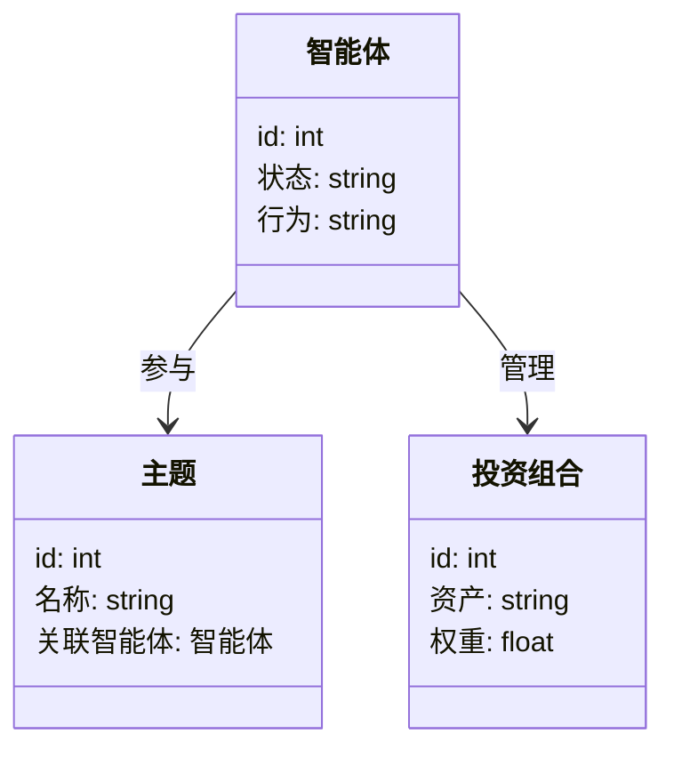
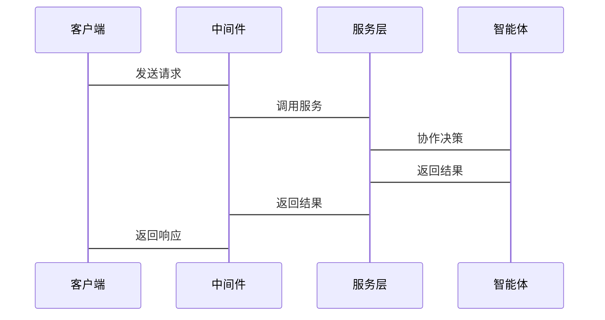

                 


# 多智能体协作进行宏观主题投资

## 关键词：
- 多智能体协作
- 宏观主题投资
- 分布式计算
- 博弈论
- 人工智能

## 摘要：
本文探讨多智能体协作在宏观主题投资中的应用，分析其背景、核心概念、算法原理、系统架构及项目实战。通过详细的技术分析和案例解读，揭示多智能体协作在复杂投资环境中的优势和实现方法，为投资者提供新的视角和策略。

---

# 第一部分：背景介绍

## 第1章：多智能体协作与宏观主题投资概述

### 1.1 多智能体协作的背景与问题背景

#### 1.1.1 从单智能体到多智能体的演进
传统的投资分析通常依赖于单一智能体（如投资顾问或算法）进行决策。然而，面对复杂的宏观经济环境，单一智能体的局限性逐渐显现。多智能体协作通过分布式计算和群体智慧，提供更高效、更灵活的决策支持。

#### 1.1.2 宏观主题投资的复杂性与挑战
宏观主题投资涉及多个变量，如经济指标、政策变化和市场趋势。单一智能体难以捕捉所有因素，而多智能体协作能够整合不同领域的信息，提供全面的分析。

#### 1.1.3 多智能体协作的必要性与优势
多智能体协作通过分布式决策和信息共享，能够快速响应市场变化，优化投资组合，降低风险。其优势在于能够处理复杂性，提供更高精度的决策支持。

### 1.2 多智能体协作的核心概念与问题描述

#### 1.2.1 多智能体协作的定义与特点
多智能体协作是指多个智能体通过通信和协调，共同完成复杂任务的过程。其特点包括分布式性、协作性和自主性。

#### 1.2.2 宏观主题投资中的多智能体协作问题
在宏观主题投资中，多智能体协作需要解决信息共享、决策协调和风险分担等问题。

#### 1.2.3 问题的边界与外延
本文的边界包括宏观经济主题投资，外延则扩展到智能体的通信机制和决策模型。

### 1.3 多智能体协作的解决思路与核心要素

#### 1.3.1 分布式决策与协作机制
通过分布式计算和信息共享，实现智能体间的协作。

#### 1.3.2 宏观主题投资中的协作目标与策略
协作目标是优化投资组合，策略包括信息共享和决策协调。

#### 1.3.3 多智能体协作的核心要素与组成
核心要素包括智能体、通信机制和决策模型。

---

# 第二部分：核心概念与联系

## 第2章：多智能体协作的原理与机制

### 2.1 多智能体协作的基本原理

#### 2.1.1 智能体的定义与分类
智能体是具有感知和行动能力的实体，分为简单反射型和基于模型的反应型。

#### 2.1.2 多智能体协作的机制与特点
协作机制包括通信、协调和决策，特点包括分布式性和自主性。

#### 2.1.3 宏观主题投资中的协作模式
协作模式包括信息共享和决策协调。

### 2.2 多智能体协作的核心概念与联系

#### 2.2.1 智能体之间的通信与协调
通信机制包括消息传递和状态共享，协调机制包括一致性协议。

#### 2.2.2 宏观主题投资中的信息共享与决策
信息共享通过数据交换实现，决策协调通过共识算法完成。

#### 2.2.3 多智能体协作的网络关系与依赖
网络关系包括信息流和决策依赖，构建主题投资的网络图。

### 2.3 多智能体协作的博弈论基础

#### 2.3.1 博弈论在多智能体协作中的应用
博弈论用于分析智能体间的策略选择和收益分配。

#### 2.3.2 宏观主题投资中的博弈模型
构建博弈模型，分析智能体间的竞争与合作。

#### 2.3.3 博弈论与多智能体协作的结合
通过博弈论优化协作策略，提高投资收益。

---

# 第三部分：算法原理讲解

## 第3章：多智能体协作的算法原理

### 3.1 分布式计算与多智能体协作

#### 3.1.1 分布式计算的基本概念与特点
分布式计算将任务分解，由多个节点协作完成。

#### 3.1.2 多智能体协作中的分布式算法
分布式算法用于协调智能体的行动和决策。

#### 3.1.3 分布式算法在宏观主题投资中的应用
应用于投资组合优化和风险控制。

### 3.2 多智能体协作的典型算法

#### 3.2.1 基于Dijkstra算法的路径规划
Dijkstra算法用于优化投资路径，降低风险。

#### 3.2.2 基于共识算法的分布式决策
共识算法（如RAFT）用于智能体间的决策协调。

#### 3.2.3 基于强化学习的多智能体协作
强化学习算法（如DQN）用于动态环境下的协作决策。

---

## 第4章：数学模型与公式

### 4.1 投资收益与风险评估模型

#### 4.1.1 投资组合的收益计算
收益公式：
$$\text{收益} = \sum_{i=1}^n w_i r_i$$
其中，\(w_i\) 是权重，\(r_i\) 是收益率。

#### 4.1.2 风险评估公式
风险公式：
$$\text{风险} = \sqrt{\sum_{i=1}^n (r_i - \mu)^2}$$
其中，\(\mu\) 是平均收益率。

### 4.2 协作智能体间的博弈模型

#### 4.2.1 博弈收益矩阵
收益矩阵表示各智能体在不同策略下的收益。

#### 4.2.2 Nash均衡分析
Nash均衡是博弈中的一种稳定状态，公式表示为：
$$\text{Nash均衡} = (x_1, x_2, ..., x_n)$$
其中，\(x_i\) 是智能体i的策略。

---

## 第五部分：系统分析与架构设计

## 第5章：系统分析与架构设计方案

### 5.1 问题场景介绍

#### 5.1.1 宏观主题投资的场景描述
投资者在复杂的宏观经济环境下，需要多智能体协作进行投资决策。

#### 5.1.2 项目介绍
构建一个多智能体协作系统，用于宏观主题投资。

### 5.2 系统功能设计

#### 5.2.1 领域模型设计
领域模型包括智能体、主题、投资组合等实体。

Mermaid类图：


#### 5.2.2 系统架构设计
分层架构，包括数据层、业务逻辑层和用户界面层。

Mermaid架构图：


#### 5.2.3 系统接口设计
接口包括数据获取、决策请求和结果返回。

#### 5.2.4 系统交互流程图
Mermaid序列图：


---

## 第六部分：项目实战

## 第6章：项目实战

### 6.1 环境安装与配置

#### 6.1.1 环境要求
安装Python、Docker和相关库。

#### 6.1.2 安装步骤
```bash
pip install flask
pip install numpy
pip install pandas
```

### 6.2 核心系统实现

#### 6.2.1 智能体通信模块
使用Flask搭建RESTful API，实现智能体间的通信。

#### 6.2.2 投资组合优化模块
基于强化学习的算法，实现投资组合优化。

#### 6.2.3 博弈论模型实现
实现Nash均衡的计算，用于决策优化。

### 6.3 实际案例分析与解读

#### 6.3.1 案例背景
假设经济指标变化，智能体协作调整投资组合。

#### 6.3.2 系统实现
通过代码实现智能体协作，优化投资组合。

#### 6.3.3 案例分析与解读
分析系统在不同情况下的表现，验证其有效性和稳定性。

### 6.4 项目小结

#### 6.4.1 项目总结
多智能体协作在宏观主题投资中的优势明显，系统实现验证了其可行性。

#### 6.4.2 经验与教训
协作机制的设计和通信效率的优化是关键。

---

## 第七部分：总结与展望

## 第7章：总结与展望

### 7.1 最佳实践 tips

#### 7.1.1 智能体协作的关键点
- 通信机制的设计
- 决策模型的优化
- 系统架构的扩展性

#### 7.1.2 技术选型建议
- 使用分布式计算框架
- 选择合适的共识算法
- 强化学习算法的应用

### 7.2 小结

#### 7.2.1 核心内容回顾
总结多智能体协作在宏观主题投资中的应用，包括背景、算法和系统设计。

### 7.3 注意事项

#### 7.3.1 系统风险提示
提示系统在实际应用中的风险，如通信延迟和决策偏差。

### 7.4 拓展阅读

#### 7.4.1 推荐资源
推荐相关书籍和论文，供读者深入学习。

---

# 作者：AI天才研究院/AI Genius Institute & 禅与计算机程序设计艺术/Zen And The Art of Computer Programming

---

感谢您的耐心阅读，希望本文能为您提供有价值的见解和启发。

