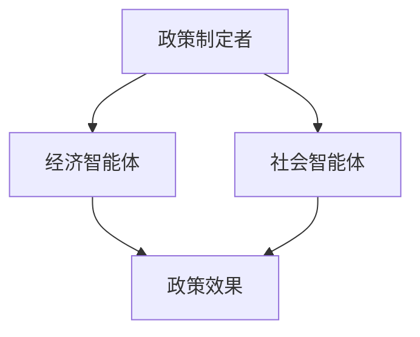
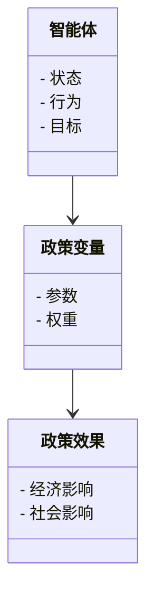
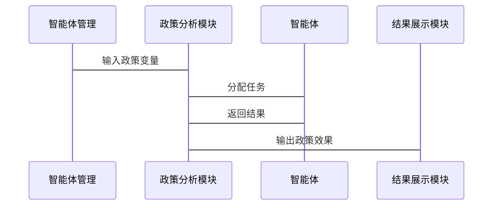

                 


# 多智能体协作进行政策影响分析

> **关键词**：多智能体协作、政策影响分析、分布式算法、系统架构、政策评估

> **摘要**：  
> 本文探讨了多智能体协作在政策影响分析中的应用，从理论基础到实际应用，系统性地分析了多智能体协作的原理、算法实现、系统架构以及在政策影响分析中的具体应用场景。文章通过详细讲解多智能体协作的核心概念、算法流程、系统设计和实际案例，展示了如何利用多智能体协作技术来提高政策影响分析的效率和准确性。本文还提供了具体的代码实现和系统架构图，帮助读者更好地理解和应用相关技术。

---

# 第1章: 多智能体协作与政策影响分析概述

## 1.1 多智能体协作的基本概念
### 1.1.1 多智能体协作的定义
多智能体协作是指多个智能体（agents）通过协同工作，共同完成一个复杂任务的过程。每个智能体都有自己的目标、知识和能力，通过通信和协作，实现整体目标。

### 1.1.2 多智能体协作的核心特征
- **分布性**：智能体分布在网络中，独立决策。
- **协作性**：智能体之间通过通信和协调完成任务。
- **动态性**：环境和任务可能动态变化，智能体需实时调整策略。

### 1.1.3 多智能体协作的应用场景
- 政策影响分析
- 群体行为预测
- 分布式任务分配

## 1.2 政策影响分析的定义与方法
### 1.2.1 政策影响分析的定义
政策影响分析是通过建模和模拟，评估政策实施后的效果，帮助决策者优化政策。

### 1.2.2 政策影响分析的主要方法
- 定量分析：通过数据建模预测政策效果。
- 定性分析：通过专家访谈和案例分析评估政策。
- 综合分析：结合定量和定性方法。

### 1.2.3 政策影响分析的挑战与难点
- 数据复杂性：政策涉及多领域，数据来源多样。
- 模型构建：如何准确建模政策影响。
- 结果解释：如何将模型结果转化为可理解的政策建议。

## 1.3 多智能体协作在政策影响分析中的作用
### 1.3.1 多智能体协作的优势
- 分布式计算能力强。
- 能够处理复杂系统的动态性。
- 可扩展性强。

### 1.3.2 多智能体协作在政策分析中的应用
- 模拟政策对经济、社会的影响。
- 分析政策的多维度效果。
- 支持政策优化和调整。

### 1.3.3 多智能体协作与政策影响分析的结合
通过多智能体协作，可以模拟不同政策在复杂系统中的交互效果，提供更准确的政策影响分析结果。

## 1.4 本章小结
本章介绍了多智能体协作的基本概念、核心特征及其在政策影响分析中的作用，为后续章节的分析奠定了基础。

---

# 第2章: 多智能体协作的核心概念与联系

## 2.1 多智能体协作的核心原理
### 2.1.1 多智能体系统的组成与功能
- **智能体**：具有感知、决策、执行能力的实体。
- **通信机制**：智能体之间通过消息传递进行协作。
- **决策机制**：基于环境信息做出决策。

### 2.1.2 多智能体协作的通信机制
- **直接通信**：智能体之间直接交换信息。
- **间接通信**：通过中间媒介传递信息。
- **广播通信**：向所有智能体发送信息。

### 2.1.3 多智能体协作的决策过程
- **感知**：获取环境信息。
- **推理**：分析信息，制定决策。
- **执行**：采取行动。

## 2.2 政策影响分析的数学模型
### 2.2.1 政策影响分析的基本模型
- **线性回归模型**：预测政策变量与结果的关系。
- **因果关系模型**：分析政策变量与结果的因果关系。
- **系统动力学模型**：模拟政策实施后的动态变化。

### 2.2.2 多智能体协作的数学表达
$$ \text{收益} = \sum_{i=1}^{n} w_i \cdot x_i $$
其中，$w_i$ 是权重，$x_i$ 是智能体的贡献。

### 2.2.3 模型的优化与改进
通过强化学习优化智能体的协作策略，提高模型的预测精度。

## 2.3 多智能体协作与政策影响分析的实体关系图


## 2.4 本章小结
本章详细分析了多智能体协作的核心原理和政策影响分析的数学模型，揭示了两者之间的联系。

---

# 第3章: 多智能体协作的算法原理与实现

## 3.1 多智能体协作算法的基本原理
### 3.1.1 分布式协作算法
智能体在分布式网络中通过消息传递协作完成任务。

### 3.1.2 集中式协作算法
通过中央控制节点协调智能体的协作。

### 3.1.3 混合式协作算法
结合分布式和集中式协作的优点。

## 3.2 多智能体协作算法的实现步骤
### 3.2.1 算法输入与初始化
- 输入：任务目标、智能体数量、环境参数。
- 初始化：分配智能体角色，设置初始状态。

### 3.2.2 协作过程的迭代步骤
1. 智能体感知环境，获取信息。
2. 通过通信机制交换信息。
3. 基于决策机制制定行动策略。
4. 执行行动，更新状态。
5. 重复步骤，直到任务完成。

### 3.2.3 结果输出与验证
输出协作结果，验证是否达到预期目标。

## 3.3 多智能体协作算法的数学模型
$$ P = \sum_{i=1}^{n} \alpha_i \cdot x_i $$
其中，$\alpha_i$ 是智能体 $i$ 的权重，$x_i$ 是智能体 $i$ 的贡献。

### 3.3.1 算法的数学表达
通过优化算法参数，提高协作效率。

### 3.3.2 算法的优化与改进
使用强化学习优化智能体的协作策略，提高算法性能。

## 3.4 本章小结
本章详细讲解了多智能体协作算法的基本原理和实现步骤，为后续章节的系统设计和项目实战奠定了基础。

---

# 第4章: 多智能体协作的系统架构与设计

## 4.1 问题场景介绍
### 4.1.1 政策影响分析的复杂性
政策涉及多个领域，需要综合考虑多种因素。

### 4.1.2 多智能体协作的优势
通过分布式计算，提高政策影响分析的效率。

## 4.2 系统功能设计
### 4.2.1 领域模型设计


### 4.2.2 系统功能模块
- 智能体管理模块：管理智能体的创建、分配和通信。
- 政策分析模块：分析政策变量对政策效果的影响。
- 结果展示模块：展示政策分析结果。

## 4.3 系统架构设计
### 4.3.1 系统架构图


### 4.3.2 系统接口设计
- 智能体管理接口：创建、分配、通信。
- 政策分析接口：输入政策变量，输出政策效果。
- 结果展示接口：展示分析结果。

## 4.4 系统交互流程


## 4.5 本章小结
本章详细描述了多智能体协作系统的架构设计和功能模块，为实际应用提供了参考。

---

# 第5章: 多智能体协作的项目实战

## 5.1 环境安装与配置
### 5.1.1 安装依赖
安装Python、numpy、scipy等依赖库。

### 5.1.2 配置开发环境
配置Jupyter Notebook或IDE。

## 5.2 核心代码实现
### 5.2.1 智能体类实现
```python
class Agent:
    def __init__(self, id, weight):
        self.id = id
        self.weight = weight
```

### 5.2.2 协作算法实现
```python
def collaborate(agents, task):
    for agent in agents:
        agent.perceive(task)
        agent.communicate()
    return task.result
```

### 5.2.3 政策分析模块实现
```python
def policy_analysis(policy_vars):
    result = 0
    for var in policy_vars:
        result += var.value * var.weight
    return result
```

## 5.3 代码解读与分析
### 5.3.1 智能体类解读
- `id`：智能体标识。
- `weight`：智能体权重。

### 5.3.2 协作算法解读
- `perceive`：智能体感知环境。
- `communicate`：智能体之间通信。
- `result`：任务结果。

## 5.4 实际案例分析
### 5.4.1 案例背景
假设分析某政策对GDP的影响。

### 5.4.2 数据准备
收集政策变量和历史数据。

### 5.4.3 模型训练
训练智能体协作模型，预测政策效果。

## 5.5 项目小结
本章通过实际案例展示了多智能体协作在政策影响分析中的应用，验证了算法的有效性。

---

# 第6章: 总结与展望

## 6.1 本章总结
本文详细探讨了多智能体协作在政策影响分析中的应用，从理论到实践，系统性地分析了多智能体协作的原理、算法实现、系统架构和实际案例。

## 6.2 项目小结
通过项目实战，验证了多智能体协作在政策影响分析中的有效性。

## 6.3 展望
未来的研究方向包括优化算法、扩展应用场景、提高模型的可解释性。

## 6.4 最佳实践 tips
- 在实际应用中，需根据具体场景调整算法参数。
- 多智能体协作需要智能体之间高效通信，建议采用高效的通信机制。
- 政策影响分析需要结合多领域知识，建议组建跨学科团队。

## 6.5 本章小结
本章总结了全文，展望了未来的研究方向，并提供了最佳实践建议。

---

# 作者：AI天才研究院/AI Genius Institute & 禅与计算机程序设计艺术 /Zen And The Art of Computer Programming

