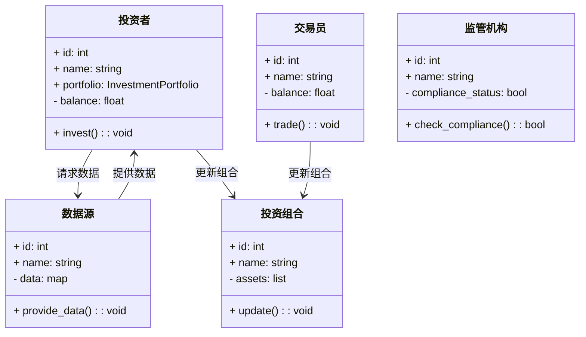
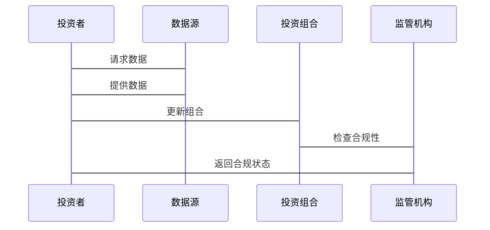

                 


# 多智能体协作进行跨境投资分析

> 关键词：多智能体协作、跨境投资分析、分布式计算、协商算法、系统架构设计

> 摘要：本文探讨了多智能体协作在跨境投资分析中的应用，从背景、核心概念到算法实现，再到系统设计和项目实战，系统性地分析了如何利用多智能体协作提高跨境投资分析的效率和准确性。通过详细的技术分析和实际案例，本文展示了多智能体协作在复杂投资问题中的优势和实现方法。

---

## 第一章: 多智能体协作与跨境投资分析概述

### 1.1 多智能体协作的定义与特点
- **定义**：多智能体协作是指多个智能体通过协同工作，共同完成复杂任务的过程。
- **特点**：分布性、交互性、智能性、适应性。
- **与传统单智能体分析的区别**：多智能体协作能够处理更大规模、更复杂的问题，通过分布式计算提高效率。

### 1.2 跨境投资分析的定义与挑战
- **定义**：跨境投资分析涉及跨国公司的投资行为分析，包括市场、风险、收益等多方面因素。
- **挑战**：数据来源多样化、风险因素复杂、监管环境差异大。
- **应用场景**：跨国并购、国际资本市场分析、跨境资产配置等。

### 1.3 多智能体协作在跨境投资分析中的作用
- 提高分析效率：通过分布式计算快速处理大规模数据。
- 提升决策准确性：多个智能体协同分析，减少单一视角的偏差。
- 处理复杂性：多智能体协作能够处理跨国投资中的复杂关系和多维度因素。

### 1.4 本章小结
本章介绍了多智能体协作和跨境投资分析的基本概念及其重要性，为后续章节奠定了基础。

---

## 第二章: 多智能体协作的核心概念与联系

### 2.1 多智能体协作的核心原理
- **通信机制**：智能体之间通过消息传递进行通信。
- **决策过程**：基于局部信息做出决策，并通过协商达成共识。
- **协作流程**：信息共享、任务分配、协同执行、结果反馈。

### 2.2 多智能体协作的实体关系图
```mermaid
erDiagram
    actor 投资者
    actor 交易员
    actor 数据源
    actor 监管机构
    entity 股票
    entity 债券
    entity 投资组合
    entity 风险评估
    entity 投资建议
    investor -> 股票: 交易
    investor -> 债券: 交易
   投资者 -> 投资组合: 管理
    交易员 -> 股票: 交易
    交易员 -> 债券: 交易
    数据源 -> 风险评估: 提供数据
    风险评估 -> 投资建议: 基于风险评估生成建议
```

### 2.3 多智能体协作的协作流程图
```mermaid
flowchart TD
    A[投资者] --> B[数据源]: 获取数据
    B --> C[风险评估]: 评估风险
    C --> D[投资建议]: 提供建议
    D --> E[交易员]: 执行交易
    E --> F[监管机构]: 确认合规性
    F --> G[投资组合]: 更新组合
```

### 2.4 本章小结
本章通过实体关系图和流程图详细解释了多智能体协作的核心概念及其在跨境投资分析中的应用。

---

## 第三章: 跨境投资分析的基本原理

### 3.1 跨境投资分析的数据来源
- 数据来源包括股票市场数据、经济指标、公司财务报表等。
- 数据预处理步骤：清洗、转换、整合。

### 3.2 跨境投资分析的主要算法
- 常用算法：CAPM模型、风险评估算法、机器学习算法（如随机森林）。

### 3.3 跨境投资分析的数学模型
- **CAPM模型**：$$ E(r_i) = r_f + β_i (E(r_m) - r_f) $$
- **风险评估公式**：$$ \text{风险} = \sqrt{\text{方差}} $$

### 3.4 本章小结
本章介绍了跨境投资分析的基本原理和数学模型，为后续章节的算法实现打下基础。

---

## 第四章: 多智能体协作算法的实现

### 4.1 分布式计算在多智能体协作中的应用
- 分布式计算的实现：数据分片、任务分配、结果汇总。

### 4.2 协商算法在多智能体协作中的实现
- 协商算法：基于价格的协商、基于资源的协商。
- 实现步骤：初始化、协商、达成共识。

### 4.3 多智能体协作算法的流程图
```mermaid
flowchart TD
    A[投资者] --> B[数据源]: 请求数据
    B --> C[风险评估]: 评估风险
    C --> D[投资建议]: 提供建议
    D --> E[交易员]: 执行交易
    E --> F[监管机构]: 确认合规性
    F --> G[投资组合]: 更新组合
```

### 4.4 本章小结
本章详细讲解了多智能体协作算法的实现，包括分布式计算和协商算法，并通过流程图展示了算法的执行过程。

---

## 第五章: 系统分析与架构设计方案

### 5.1 系统功能设计
- 功能模块：数据采集、风险评估、投资建议、交易执行、监管合规。

### 5.2 系统架构设计


### 5.3 系统接口设计
- API接口：数据获取接口、风险评估接口、交易执行接口。

### 5.4 系统交互序列图


### 5.5 本章小结
本章通过类图和序列图详细描述了系统的架构设计和接口设计。

---

## 第六章: 项目实战

### 6.1 环境配置
- 安装Python、Pandas、Scikit-learn、Flask框架。

### 6.2 核心代码实现
```python
import pandas as pd
from sklearn.ensemble import RandomForestClassifier

# 数据加载
data = pd.read_csv('investment_data.csv')

# 数据预处理
data.dropna()
data = pd.get_dummies(data)

# 模型训练
model = RandomForestClassifier()
model.fit(data.drop(columns=['label']), data['label'])

# 预测
new_data = pd.read_csv('new_investment_data.csv')
new_data = pd.get_dummies(new_data)
predictions = model.predict(new_data.drop(columns=['label']))
```

### 6.3 实际案例分析
- 案例：跨国并购风险评估。
- 分析过程：数据收集、模型训练、风险预测、交易执行。

### 6.4 本章小结
本章通过实际项目展示了多智能体协作在跨境投资分析中的具体应用。

---

## 第七章: 最佳实践与未来展望

### 7.1 最佳实践 tips
- 数据质量至关重要。
- 模型选择要根据实际需求。
- 系统设计要注重可扩展性和可维护性。

### 7.2 小结
总结全文，强调多智能体协作在跨境投资分析中的重要性。

### 7.3 注意事项
- 数据隐私和安全问题。
- 算法的可解释性。
- 系统的实时性和稳定性。

### 7.4 拓展阅读
推荐相关书籍和论文，鼓励读者深入学习。

---

## 附录

### A. 参考文献
- 列出参考的书籍和论文。

### B. 工具安装指南
- 如何安装Python、Pandas、Flask等工具。

### C. 术语表
- 解释文章中出现的专业术语。

---

作者：AI天才研究院 & 禅与计算机程序设计艺术

