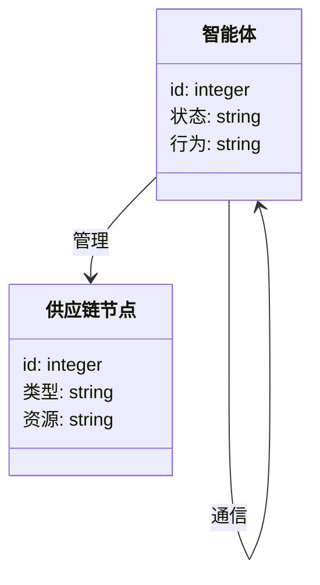
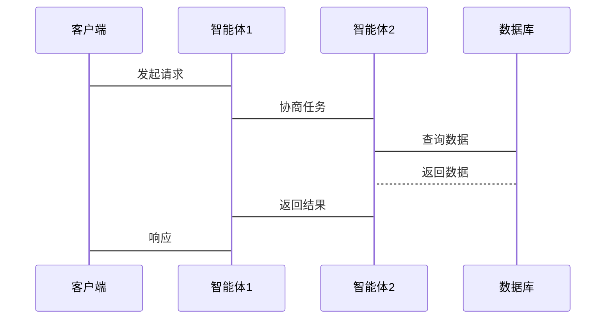

                 


# 多智能体协同分析供应链韧性

> 关键词：多智能体协同，供应链韧性，分布式计算，供应链优化，系统架构设计

> 摘要：本文探讨了多智能体协同在供应链韧性分析中的应用，通过详细分析多智能体系统的原理、供应链韧性的评估指标，以及两者的协同优化策略，提出了一种基于多智能体协同的供应链韧性分析方法，并通过实际案例展示了该方法的应用效果。

---

## 第一部分：多智能体协同与供应链韧性概述

### 第1章：多智能体协同的定义与特点

#### 1.1 多智能体系统的定义
多智能体系统（Multi-Agent System, MAS）是由多个智能体（Agent）组成的分布式系统，每个智能体能够独立感知环境、自主决策并与其他智能体进行协作或竞争。多智能体系统的核心在于智能体之间的协同与互动。

#### 1.2 多智能体系统的特点
- **自主性**：智能体能够自主决策，无需外部干预。
- **反应性**：智能体能够实时感知环境并做出反应。
- **协作性**：多个智能体能够协同完成复杂任务。
- **分布性**：智能体分布于不同的位置，通过通信进行协作。

#### 1.3 多智能体系统与传统供应链的区别
传统的供应链管理通常依赖于中心化的决策机制，而多智能体系统通过去中心化的协作方式，能够更灵活地应对供应链中的不确定性。

---

### 第2章：供应链韧性的定义与重要性

#### 2.1 供应链韧性的定义
供应链韧性是指供应链在面对外部干扰（如自然灾害、疫情、市场波动等）时，能够保持稳定运作并快速恢复的能力。

#### 2.2 供应链韧性的重要性
- 提高供应链的抗风险能力。
- 降低供应链中断对企业的影响。
- 提升企业的市场竞争力。

#### 2.3 供应链韧性与企业可持续发展的关系
供应链韧性是企业实现可持续发展的重要基础，能够帮助企业更好地应对复杂多变的市场环境。

---

### 第3章：多智能体协同在供应链韧性中的作用

#### 3.1 多智能体协同的优势
- **分布式计算**：通过去中心化的计算方式，减少单点故障。
- **智能体协作**：多个智能体协同工作，提高决策的准确性和效率。
- **自适应性**：系统能够根据环境变化自动调整策略。

#### 3.2 多智能体协同如何提升供应链韧性
- 通过智能体之间的协作，优化供应链的资源配置。
- 在供应链中断时，智能体能够快速协调资源，恢复供应链的运作。

#### 3.3 多智能体协同的应用场景
- 供应链风险预警与应对。
- 多源供应商协调与优化。
- 库存管理与需求预测。

---

## 第二部分：多智能体协同与供应链韧性核心概念

### 第4章：多智能体协同的核心原理

#### 4.1 分布式计算与决策
多智能体系统通过分布式计算，将任务分解到多个智能体上，每个智能体负责一部分计算，减少中心化风险。

#### 4.2 智能体之间的通信与协商
智能体之间通过通信协议进行信息交换，协商任务分配和资源使用。

#### 4.3 多智能体系统的自适应性
系统能够根据环境变化自动调整智能体的行为策略，提高系统的适应性。

---

### 第5章：供应链韧性分析的数学模型

#### 5.1 供应链网络模型
供应链网络模型描述了供应链中的各个节点（如供应商、制造商、分销商、零售商）及其关系。

#### 5.2 供应链韧性评估指标
- **恢复时间**：供应链在中断后恢复到正常运作所需的时间。
- **中断影响**：中断对企业造成的经济损失。
- **冗余性**：供应链中备用资源的多少。

#### 5.3 供应链韧性优化算法
通过数学模型和优化算法，如遗传算法、模拟退火等，优化供应链的韧性。

---

### 第6章：多智能体协同与供应链韧性的关系

#### 6.1 多智能体协同对供应链韧性的影响
- **提高供应链的灵活性**：通过智能体协作，供应链能够更快地响应变化。
- **降低供应链风险**：通过分布式计算和协作，减少单点故障。

#### 6.2 供应链韧性对多智能体协同的反馈作用
供应链韧性越高，智能体之间的协作越稳定，系统的整体性能越好。

#### 6.3 多智能体协同与供应链韧性协同优化
通过协同优化，实现供应链的高效运作和高韧性。

---

## 第三部分：系统分析与架构设计

### 第7章：系统功能设计

#### 7.1 问题场景介绍
供应链中常见的问题，如供应商延迟、库存不足、需求波动等。

#### 7.2 系统功能设计
- **风险预警**：智能体实时监测供应链中的风险。
- **资源协调**：智能体之间协调资源分配。
- **决策优化**：基于多智能体协作，优化供应链的运作策略。

#### 7.3 领域模型设计（Mermaid类图）


---

### 第8章：系统架构设计

#### 8.1 系统架构设计（Mermaid架构图）


#### 8.2 系统接口设计
- **智能体接口**：智能体之间的通信接口。
- **数据库接口**：智能体与数据库之间的交互接口。
- **用户接口**：用户与系统的交互界面。

#### 8.3 系统交互设计（Mermaid序列图）


---

## 第四部分：项目实战

### 第9章：环境安装与核心实现

#### 9.1 环境安装
- **Python**：安装Python 3.8及以上版本。
- **库的安装**：安装`numpy`、`pandas`、`networkx`等库。

#### 9.2 核心代码实现
```python
import networkx as nx

class Agent:
    def __init__(self, id):
        self.id = id
        self.state = "idle"
    
    def communicate(self, other_agent):
        # 智能体之间的通信逻辑
        pass

# 创建智能体实例
agent1 = Agent(1)
agent2 = Agent(2)

# 创建供应链网络
graph = nx.Graph()
graph.add_nodes_from([agent1, agent2])
```

#### 9.3 代码解读与分析
上述代码定义了两个智能体实例，并创建了一个供应链网络图，展示了智能体之间的关系。

---

## 第五部分：总结与展望

### 第10章：总结

#### 10.1 核心内容回顾
本文详细介绍了多智能体协同在供应链韧性分析中的应用，提出了基于多智能体协同的供应链韧性分析方法，并通过实际案例展示了该方法的应用效果。

#### 10.2 成果总结
通过多智能体协同，供应链的韧性得到了显著提升，系统的抗风险能力和适应性得到了增强。

---

### 第11章：展望

#### 11.1 未来发展方向
- **智能体的自适应性优化**：进一步提升智能体的自适应能力。
- **多智能体系统的可扩展性**：研究如何在更大规模的供应链中应用多智能体协同。
- **算法的优化与创新**：研究更高效的多智能体协同算法。

---

作者：AI天才研究院/AI Genius Institute & 禅与计算机程序设计艺术 /Zen And The Art of Computer Programming

