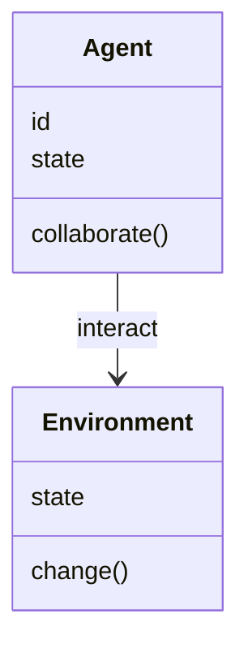
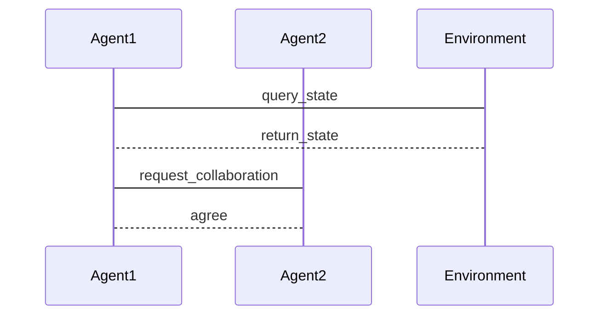

                 


# 多智能体协同评估监管环境变化

## 关键词：
多智能体协同、监管环境变化、算法原理、系统架构、项目实战

## 摘要：
本文系统地探讨了多智能体协同在评估监管环境变化中的应用，从理论基础到算法实现，再到系统设计与项目实战，全面分析了该领域的核心问题和解决方案。文章首先介绍了多智能体协同的基本概念与监管环境变化的定义，随后深入分析了两者的相互作用及其建模方法。接着，详细讲解了多智能体协同的算法原理，包括分布式计算和博弈论的应用，并通过数学公式和mermaid流程图展示了算法的实现过程。随后，文章从系统架构的角度，设计了完整的系统框架，并通过类图和序列图详细描述了系统的各个组件及其交互关系。最后，通过项目实战部分，提供了具体的代码实现和案例分析，展示了多智能体协同在监管环境变化评估中的实际应用效果。本文旨在为相关领域的研究者和实践者提供理论与实践相结合的深度分析。

---

# 多智能体协同评估监管环境变化

## 第一章: 多智能体协同评估监管环境变化概述

### 1.1 问题背景与描述
多智能体协同是指多个智能体通过协作完成共同目标的过程，而监管环境变化涉及监管环境中的各种动态因素，例如政策调整、市场波动等。随着社会和经济的复杂化，监管环境的变化越来越频繁且不可预测，这使得对监管环境变化的实时评估和应对变得至关重要。

#### 1.1.1 多智能体协同的定义
多智能体系统由多个智能体组成，每个智能体都有一定的自主性、反应性和协作能力。这些智能体通过通信和协调，共同完成复杂的任务。

#### 1.1.2 监管环境变化的定义
监管环境变化指的是监管政策、法规、市场条件等的变化，这些变化可能对企业和组织的运营产生重大影响。

#### 1.1.3 多智能体协同在监管环境变化中的作用
多智能体协同能够通过分布式计算和协作，快速响应监管环境的变化，优化资源配置，提高决策的准确性和效率。

### 1.2 问题解决与边界
在监管环境变化评估中，多智能体协同能够解决传统单一智能体系统在处理复杂性和动态性方面的不足。

#### 1.2.1 多智能体协同的核心问题
- 如何实现智能体之间的高效通信与协作
- 如何在动态环境中保持系统的稳定性
- 如何优化多智能体的决策过程

#### 1.2.2 监管环境变化的边界与外延
- 监管环境变化的范围和影响程度
- 监管环境变化与外部环境的相互作用
- 监管环境变化的预测与实时评估

#### 1.2.3 多智能体协同与监管环境变化的相互关系
多智能体协同能够通过分布式计算和协作，快速适应监管环境的变化，同时，监管环境的变化也为多智能体协同提供了丰富的应用场景。

### 1.3 概念结构与核心要素
多智能体协同与监管环境变化评估是一个复杂的系统工程，涉及多个核心要素。

#### 1.3.1 多智能体协同的构成要素
- 智能体：具有自主性、反应性和协作能力的实体
- 通信机制：智能体之间进行信息交换的渠道
- 协作机制：智能体之间协调行动的规则

#### 1.3.2 监管环境变化的核心要素
- 监管政策：法律法规的变化
- 市场条件：经济环境的变化
- 组织行为：企业应对监管变化的策略

#### 1.3.3 两者的相互作用与整合
多智能体协同与监管环境变化评估的整合是通过动态的协作机制和实时的信息共享实现的。

## 1.4 本章小结
本章从背景、问题和概念结构三个方面，介绍了多智能体协同评估监管环境变化的基本概念和核心要素，为后续章节的深入分析奠定了基础。

---

## 第二章: 多智能体协同的核心概念与联系

### 2.1 多智能体系统的原理
多智能体系统通过多个智能体的协作，实现复杂的任务。

#### 2.1.1 多智能体系统的基本原理
多智能体系统由多个智能体组成，通过通信和协作完成任务。

#### 2.1.2 智能体的定义与特征
- 智能体：具有自主性、反应性和协作能力的实体
- 特征：自主性、反应性、协作性、学习能力

#### 2.1.3 多智能体系统的分类与应用场景
- 分布式多智能体系统
- 集中式多智能体系统
- 应用场景：经济管理、社会网络、环境保护

### 2.2 监管环境变化的建模
监管环境变化的建模是实现多智能体协同评估的基础。

#### 2.2.1 监管环境变化的建模方法
- 系统动力学模型
- 静态与动态模型

#### 2.2.2 监管环境变化的动态特征
- 动态性
- 不可预测性
- 复杂性

#### 2.2.3 监管环境变化的预测模型
- 时间序列分析
- 机器学习模型

### 2.3 多智能体协同与监管环境变化的关系
多智能体协同与监管环境变化评估是相互影响的复杂系统。

#### 2.3.1 多智能体协同对监管环境变化的影响
- 提高评估的实时性
- 增强系统的适应性

#### 2.3.2 监管环境变化对多智能体协同的反作用
- 增加系统的复杂性
- 提高协作的难度

#### 2.3.3 两者关系的数学模型
$$ R = f(M, E) $$
其中，R表示监管环境，M表示多智能体协同，E表示外部环境。

### 2.4 核心概念的对比分析
多智能体协同与传统单智能体系统的对比。

#### 2.4.1 多智能体协同与传统单智能体系统的对比
| 特性            | 多智能体协同          | 传统单智能体系统       |
|-----------------|----------------------|-----------------------|
| 系统结构        | 分布式               | 集中式                |
| 可扩展性        | 高                   | 低                   |
| 复杂性          | 高                   | 低                   |

#### 2.4.2 监管环境变化与其他环境变化的对比
| 特性            | 监管环境变化          | 其他环境变化           |
|-----------------|----------------------|-----------------------|
| 变化频率        | 高                   | 中或低                |
| 影响范围        | 广泛                 | 有限                  |

## 2.5 本章小结
本章详细探讨了多智能体协同的核心概念与监管环境变化的关系，通过对比分析和数学建模，揭示了两者之间的相互作用。

---

## 第三章: 多智能体协同的算法原理

### 3.1 分布式计算与多智能体协同
分布式计算是实现多智能体协同的基础。

#### 3.1.1 分布式计算的基本原理
分布式计算通过多个计算节点协作完成任务。

#### 3.1.2 多智能体协同中的分布式计算
多智能体协同通过分布式计算实现智能体之间的协作。

#### 3.1.3 分布式计算在监管环境变化中的应用
- 实时数据处理
- 分布式决策

### 3.2 博弈论在多智能体协同中的应用
博弈论为多智能体协同提供了理论基础。

#### 3.2.1 博弈论的基本概念
- 理性决策
- Nash均衡

#### 3.2.2 博弈论在多智能体协同中的应用
- 协作博弈
- 竞争博弈

#### 3.2.3 博弈论在监管环境变化中的应用
- 监管策略优化
- 多方利益协调

### 3.3 多智能体协同算法的实现
通过具体的算法流程和代码实现，展示多智能体协同的实现过程。

#### 3.3.1 多智能体协同算法的流程
1. 初始化智能体
2. 信息共享
3. 协作决策
4. 执行任务
5. 评估结果

#### 3.3.2 多智能体协同算法的数学模型
$$ C = \sum_{i=1}^{n} c_i $$
其中，C表示协作成本，c_i表示第i个智能体的成本。

#### 3.3.3 多智能体协同算法的实现代码
```python
class Agent:
    def __init__(self, id):
        self.id = id
        self.state = 'idle'
    
    def collaborate(self, other_agents):
        # 协作逻辑
        pass
```

### 3.4 算法的优化与应用
通过对算法的优化，提高多智能体协同的效率。

#### 3.4.1 算法优化
- 并行计算
- 分层决策

#### 3.4.2 算法在监管环境变化中的应用
- 实时监控
- 预警系统

## 3.5 本章小结
本章详细讲解了多智能体协同的算法原理，包括分布式计算和博弈论的应用，并通过具体的代码实现展示了算法的实现过程。

---

## 第四章: 多智能体协同的系统架构设计

### 4.1 系统架构设计概述
系统架构设计是实现多智能体协同的关键。

#### 4.1.1 问题场景介绍
监管环境变化评估的复杂场景。

#### 4.1.2 项目介绍
多智能体协同评估监管环境变化的项目。

### 4.2 系统功能设计
通过领域模型和类图展示系统功能。

#### 4.2.1 领域模型


#### 4.2.2 系统功能模块
- 信息采集模块
- 协作决策模块
- 监测评估模块

### 4.3 系统架构设计
通过架构图展示系统组件及其关系。

#### 4.3.1 系统架构


#### 4.3.2 组件关系
- 信息采集模块负责收集监管环境数据
- 协作决策模块负责智能体的协作
- 监测评估模块负责评估监管环境变化

### 4.4 系统接口设计
系统接口设计是实现多智能体协同的重要部分。

#### 4.4.1 接口设计
- Agent接口
- Environment接口

#### 4.4.2 接口实现
```python
interface AgentInterface:
    def get_state(self):
        pass

    def collaborate(self, other_agents):
        pass
```

### 4.5 系统交互设计
通过序列图展示系统交互过程。

#### 4.5.1 系统交互


## 4.6 本章小结
本章详细设计了多智能体协同的系统架构，包括功能模块、架构图和交互图，为后续的项目实现奠定了基础。

---

## 第五章: 多智能体协同的项目实战

### 5.1 项目实战概述
通过具体的案例分析，展示多智能体协同的应用。

#### 5.1.1 环境安装
- 安装Python
- 安装必要的库（如numpy、pandas）

#### 5.1.2 核心代码实现
```python
class Agent:
    def __init__(self, id):
        self.id = id
        self.state = 'idle'

    def collaborate(self, other_agents):
        for agent in other_agents:
            agent.state = 'collaborating'
```

### 5.2 案例分析
通过具体案例分析，展示算法的实现过程。

#### 5.2.1 案例介绍
- 案例名称：监管环境变化评估系统
- 案例目标：实时评估监管环境变化

#### 5.2.2 案例实现
```python
agents = [Agent(1), Agent(2), Agent(3)]
agents[0].collaborate(agents[1:])
```

#### 5.2.3 案例分析
分析实现过程中的关键点，如协作效率、系统稳定性等。

### 5.3 项目小结
总结项目实现的关键点和经验教训。

## 5.4 本章小结
本章通过具体的项目实战，展示了多智能体协同的实现过程和应用效果。

---

## 第六章: 总结与展望

### 6.1 总结
总结全文的主要内容和研究成果。

#### 6.1.1 核心结论
- 多智能体协同在监管环境变化评估中的应用
- 算法实现和系统设计的关键点

#### 6.1.2 研究成果
- 提出了多智能体协同的算法和系统设计
- 实现了具体的项目案例

### 6.2 未来展望
展望多智能体协同在监管环境变化评估中的未来发展方向。

#### 6.2.1 技术发展
- 更高效的算法
- 更智能的系统架构

#### 6.2.2 应用场景
- 更广泛的应用领域
- 更复杂的监管环境

### 6.3 本章小结
本章总结了全文的主要成果，并展望了未来的发展方向。

---

## 作者：AI天才研究院/AI Genius Institute & 禅与计算机程序设计艺术 /Zen And The Art of Computer Programming

