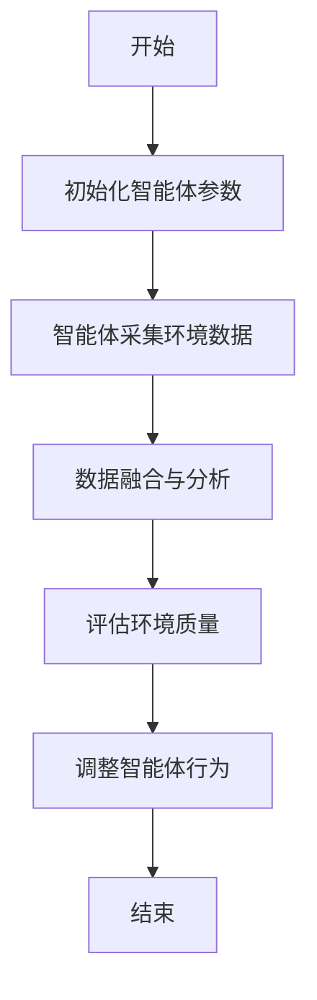
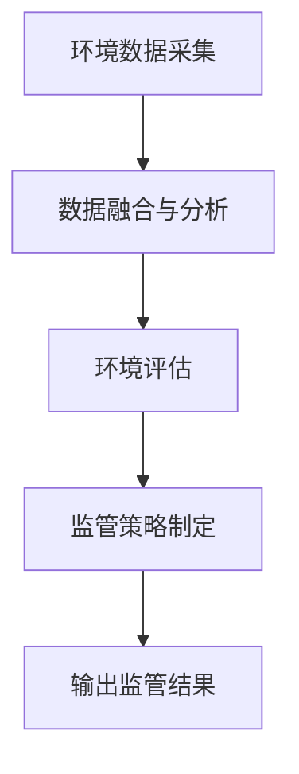
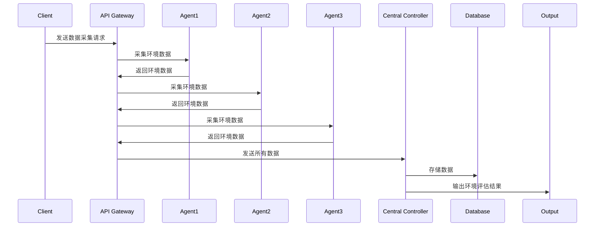

                 


# 多智能体协同评估监管环境影响

## 关键词：多智能体系统, 环境监管, 协同评估, 系统架构, 算法原理

## 摘要：  
随着环境问题的日益严峻，多智能体协同评估监管环境影响已成为环境科学和人工智能领域的研究热点。本文从多智能体协同的基本概念出发，详细探讨了其在环境监管中的应用，分析了多智能体协同评估监管环境影响的核心算法原理，并通过实际案例展示了系统架构设计与实现。本文旨在为环境监管提供一种高效的多智能体协同解决方案，为相关研究和实践提供参考。

---

# 引言

## 1.1 问题背景与问题描述

### 1.1.1 多智能体协同的基本概念
多智能体系统（Multi-Agent System, MAS）是由多个智能体（Agent）组成的系统，这些智能体能够自主决策、协作完成任务。智能体可以是软件程序、机器人或其他具有感知和决策能力的实体。

### 1.1.2 多智能体系统的特征
- **自主性**：智能体能够自主决策。
- **反应性**：智能体能够实时感知环境并做出反应。
- **协作性**：多个智能体能够协同完成任务。
- **分布性**：智能体之间分布在网络中，不存在集中控制。

### 1.1.3 环境监管的背景
环境监管是指通过技术手段对环境质量进行监测、评估和管理。传统的环境监管方式通常依赖于单一智能体（如传感器或中央控制系统），但在复杂环境下，单一智能体难以满足实时性和准确性要求。

### 1.1.4 问题描述
在复杂的环境中，单一智能体难以同时完成多种任务，例如空气质量监测、污染源追踪、环境数据整合等。因此，引入多智能体协同技术，可以提高环境监管的效率和准确性。

---

## 1.2 多智能体协同在环境监管中的优势

### 1.2.1 提高环境监管的实时性
多智能体协同可以实时感知环境数据，快速做出反应。

### 1.2.2 增强环境监管的准确性
通过多个智能体的协作，可以综合分析环境数据，提高评估结果的准确性。

### 1.2.3 提高系统的容错性
当一个智能体出现故障时，其他智能体可以继续完成任务，从而提高系统的容错性。

---

# 核心概念与联系

## 2.1 多智能体协同的核心原理

### 2.1.1 智能体的协作机制
智能体之间的协作机制包括任务分配、信息共享和协同决策。

### 2.1.2 智能体的通信协议
智能体之间需要通过通信协议进行信息交换，例如使用消息队列或 RPC（远程过程调用）。

### 2.1.3 智能体的决策模型
智能体的决策模型通常基于感知数据和预设规则，例如使用模糊逻辑或强化学习。

---

## 2.2 监管环境影响的核心方法

### 2.2.1 环境数据的采集与处理
智能体通过传感器采集环境数据，例如空气质量、温度、湿度等。

### 2.2.2 环境数据的分析与评估
通过数据融合技术，综合分析环境数据，评估环境质量。

### 2.2.3 环境监管的决策与反馈
根据评估结果，智能体协同制定决策，并将结果反馈给系统。

---

## 2.3 多智能体协同与环境监管的对比

### 2.3.1 单一智能体与多智能体的对比
| 特性          | 单一智能体      | 多智能体       |
|---------------|-----------------|----------------|
| 冗余性         | 低              | 高             |
| 可扩展性       | 低              | 高             |
| 容错性         | 低              | 高             |

### 2.3.2 环境监管的传统方法与多智能体方法的对比
| 特性          | 传统方法        | 多智能体方法    |
|---------------|-----------------|----------------|
| 实时性         | 低              | 高             |
| 准确性         | 中              | 高             |
| 可扩展性       | 低              | 高             |

---

## 2.4 多智能体协同的实体关系图

```mermaid
erd
  环境智能体(Agent) -[拥有]-> 环境数据(传感器数据)
  环境智能体(Agent) -[发送]-> 中央控制系统
  中央控制系统 -[接收]-> 多个环境智能体的数据
  中央控制系统 -[输出]-> 环境评估结果
```

---

# 算法原理

## 3.1 算法选择与原理

### 3.1.1 多目标优化算法
多目标优化算法是一种适用于多智能体协同的算法，可以同时优化多个目标函数。

### 3.1.2 算法步骤
1. 初始化智能体参数。
2. 智能体采集环境数据。
3. 数据融合与分析。
4. 评估环境质量。
5. 根据评估结果调整智能体行为。

---

## 3.2 算法流程图



---

## 3.3 算法实现代码

```python
import numpy as np

class Agent:
    def __init__(self, id):
        self.id = id
        self.data = None

def collect_data(agent):
    # 模拟传感器数据采集
    agent.data = np.random.rand(10, 5)

def fuse_data(agents):
    # 数据融合
    fused_data = []
    for agent in agents:
        fused_data.append(agent.data)
    return fused_data

def assess_environment(fused_data):
    # 环境评估
    return np.mean(fused_data)

# 初始化多个智能体
agents = [Agent(i) for i in range(5)]
# 采集数据
for agent in agents:
    collect_data(agent)
# 数据融合
fused_data = fuse_data(agents)
# 环境评估
result = assess_environment(fused_data)
print("环境评估结果:", result)
```

---

## 3.4 算法的数学模型

环境评估结果可以表示为多个智能体数据的加权平均：

$$ result = \sum_{i=1}^{n} w_i x_i $$

其中，\( w_i \) 是第 \( i \) 个智能体的权重，\( x_i \) 是第 \( i \) 个智能体的数据。

---

# 系统架构设计

## 4.1 问题场景介绍

环境监管系统需要实时监测空气质量、温度、湿度等环境指标，评估环境质量，并制定相应的监管策略。

---

## 4.2 系统功能设计

### 4.2.1 系统功能模块
- 环境数据采集模块
- 数据融合与分析模块
- 环境评估模块
- 监管策略制定模块

### 4.2.2 系统功能流程图



---

## 4.3 系统架构设计

### 4.3.1 系统架构图

```mermaid
graph LR
    Client --> API Gateway
    API Gateway --> Agent1
    API Gateway --> Agent2
    API Gateway --> Agent3
    Agent1 --> Database
    Agent2 --> Database
    Agent3 --> Database
    Database --> Central Controller
    Central Controller --> Output
```

### 4.3.2 接口设计
- `/api/v1/data-collect`：数据采集接口
- `/api/v1/data-fuse`：数据融合接口
- `/api/v1/environment-assess`：环境评估接口

---

## 4.4 系统交互设计



---

# 项目实战

## 5.1 环境安装

### 5.1.1 安装依赖
```bash
pip install numpy mermaid matplotlib
```

---

## 5.2 核心代码实现

### 5.2.1 环境数据采集模块

```python
import numpy as np

class Agent:
    def __init__(self, id):
        self.id = id
        self.data = None

def collect_data(agent):
    agent.data = np.random.rand(10, 5)

# 初始化多个智能体
agents = [Agent(i) for i in range(5)]
# 采集数据
for agent in agents:
    collect_data(agent)
```

### 5.2.2 数据融合与分析模块

```python
def fuse_data(agents):
    fused_data = []
    for agent in agents:
        fused_data.append(agent.data)
    return fused_data

fused_data = fuse_data(agents)
```

### 5.2.3 环境评估模块

```python
def assess_environment(fused_data):
    return np.mean(fused_data)

result = assess_environment(fused_data)
print("环境评估结果:", result)
```

---

## 5.3 代码解读与分析

- **数据采集模块**：每个智能体通过 `collect_data` 方法采集环境数据。
- **数据融合模块**：将所有智能体的数据进行融合，得到综合数据。
- **环境评估模块**：对融合后的数据进行评估，输出环境评估结果。

---

## 5.4 实际案例分析

### 5.4.1 案例背景
某城市空气质量监测系统，需要实时监测PM2.5、PM10、SO2等污染物浓度。

### 5.4.2 系统实现
- 初始化多个智能体，分别部署在不同监测点。
- 智能体采集环境数据并发送到中央控制系统。
- 中央控制系统融合数据并评估空气质量，输出监管结果。

### 5.4.3 系统输出
环境评估结果可以用于制定监管策略，例如超标排放企业处罚。

---

## 5.5 项目小结

通过多智能体协同，可以实现环境数据的实时采集、融合与评估，提高环境监管的效率和准确性。

---

# 总结与展望

## 6.1 总结

本文详细探讨了多智能体协同在环境监管中的应用，分析了其核心算法原理，并通过实际案例展示了系统架构设计与实现。多智能体协同能够提高环境监管的实时性、准确性和可扩展性。

---

## 6.2 展望

未来，随着人工智能技术的发展，多智能体协同将在环境监管中发挥更大的作用。例如，结合区块链技术，可以实现更加安全的数据共享与协作。

---

作者：AI天才研究院/AI Genius Institute & 禅与计算机程序设计艺术 /Zen And The Art of Computer Programming

