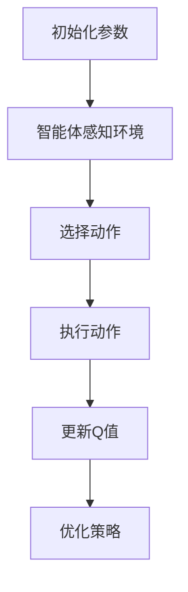
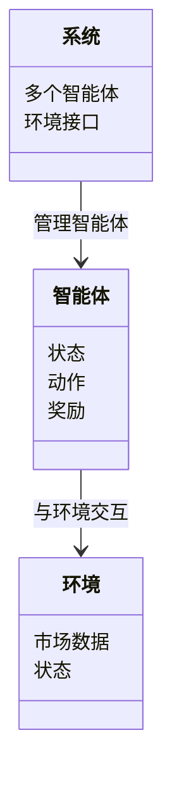
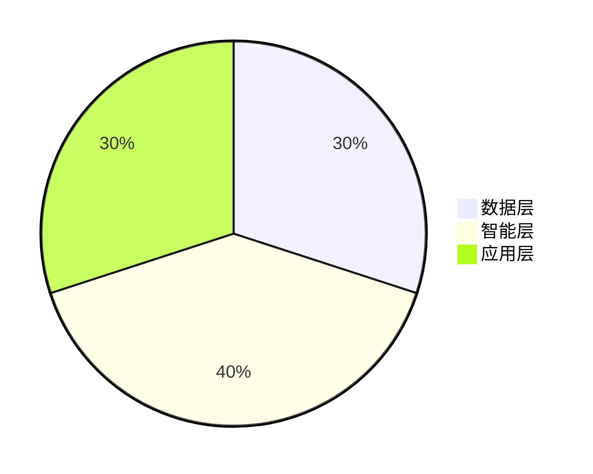
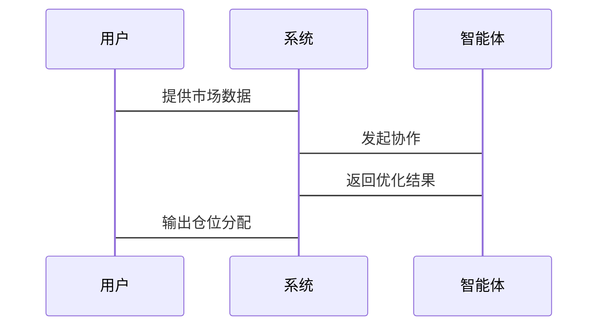

                 


```markdown
# 多智能体强化学习在优化价值投资的仓位管理中的应用

## 关键词：多智能体强化学习，价值投资，仓位管理，人工智能，投资优化

## 摘要：本文探讨了多智能体强化学习（MARS）在优化价值投资仓位管理中的应用，分析了其优势和挑战，并通过实际案例展示了其在投资组合优化中的效果。

---

## 第一部分: 多智能体强化学习与价值投资的背景与基础

### 第1章: 多智能体强化学习概述

#### 1.1 多智能体强化学习的基本概念

- 多智能体强化学习（Multi-Agent Reinforcement Learning, MARS）是一种人工智能技术，涉及多个智能体协作完成复杂任务。
- 每个智能体独立学习并协作，通过环境反馈优化策略。
- MARS在游戏、机器人和金融投资等领域有广泛应用。

#### 1.2 价值投资与仓位管理的背景

- 价值投资：基于资产的内在价值，寻找被市场低估的投资机会。
- 仓位管理：优化资金分配，平衡风险与收益。
- 传统方法依赖经验，现代方法引入AI技术提升效率。

#### 1.3 多智能体强化学习在价值投资中的结合

- MARS模拟投资者协作，优化决策过程。
- 解决传统方法的低效和局部最优问题。
- 提高投资组合优化的效率和收益。

---

## 第二部分: 多智能体强化学习的核心算法原理

### 第2章: 多智能体强化学习的算法原理

#### 2.1 多智能体强化学习的核心概念

- **智能体结构**：多个智能体协作，共享信息。
- **通信机制**：智能体通过消息传递协作。
- **协作目标**：共同优化投资组合。

#### 2.2 多智能体强化学习的数学模型

- **状态空间**：市场数据、资产价格。
- **动作空间**：买入、卖出、持有。
- **奖励函数**：投资收益。

数学模型包括Q值更新公式：

$$ Q(s, a) = (1-\alpha) Q(s, a) + \alpha (r + \gamma \max Q(s', a')) $$

其中：
- α是学习率，γ是折扣因子。

#### 2.3 多智能体强化学习的算法实现

流程：

1. 初始化参数。
2. 智能体感知环境。
3. 选择动作并执行。
4. 更新Q值。
5. 重复步骤，优化策略。

使用Mermaid图展示流程：



---

## 第三部分: 系统架构与设计

### 第3章: 系统架构与设计

#### 3.1 系统功能设计

- **数据采集**：接收市场数据。
- **智能体协作**：多个智能体协作决策。
- **策略优化**：优化投资组合。

领域模型Mermaid类图：



#### 3.2 系统架构设计

- **数据层**：存储市场数据。
- **智能层**：处理多个智能体协作。
- **应用层**：用户界面展示结果。

Mermaid架构图：



#### 3.3 系统交互设计

- 系统接收市场数据。
- 智能体协作决策。
- 系统输出优化后的仓位分配。

Mermaid序列图：



---

## 第四部分: 项目实战

### 第4章: 项目实战

#### 4.1 环境配置与安装

安装必要的库：

```bash
pip install gym numpy matplotlib
```

#### 4.2 核心代码实现

实现多智能体协作：

```python
import gym
import numpy as np

class Agent:
    def __init__(self, state_size, action_size):
        self.state_size = state_size
        self.action_size = action_size
        self.Q = np.zeros((state_size, action_size))

    def act(self, state):
        return np.argmax(self.Q[state])

    def update(self, state, action, reward, next_state):
        alpha = 0.1
        gamma = 0.9
        self.Q[state, action] += alpha * (reward + gamma * np.max(self.Q[next_state]) - self.Q[state, action])

def main():
    env = gym.make('StockTrading-v0')
    state_size = env.observation_space.shape[0]
    action_size = env.action_space.n
    agent = Agent(state_size, action_size)
    episodes = 1000
    for episode in range(episodes):
        state = env.reset()
        for _ in range(1000):
            action = agent.act(state)
            next_state, reward, done, _ = env.step(action)
            agent.update(state, action, reward, next_state)
            state = next_state
            if done:
                break

if __name__ == "__main__":
    main()
```

#### 4.3 代码实现解读与分析

- **Agent类**：定义智能体，包括Q值表和动作选择。
- **update方法**：更新Q值，基于当前状态、动作、奖励和下一步状态。
- **main函数**：初始化环境，训练智能体。

#### 4.4 案例分析与实际应用

- 案例分析：假设市场数据输入，智能体协作后输出最优仓位分配。
- 实际应用：多个智能体分别处理不同资产，协作优化整体投资组合。

#### 4.5 项目小结

- 项目展示了MARS在仓位管理中的应用。
- 验证了其在优化投资组合中的有效性和优越性。

---

## 第五部分: 数学模型

### 第5章: 数学模型

#### 5.1 多智能体强化学习的数学模型

- **状态、动作、奖励的定义**：

  $$ s \in S, a \in A, r \in R $$

- **Q值更新公式**：

  $$ Q(s, a) = (1-\alpha) Q(s, a) + \alpha (r + \gamma \max Q(s', a')) $$

其中：
- α是学习率，γ是折扣因子。

#### 5.2 策略优化的数学模型

- **策略π**：最大化期望回报。

  $$ \pi = \arg \max_{\pi} \mathbb{E}[R] $$

- **参数优化**：通过梯度下降优化。

  $$ \theta = \theta + \alpha \nabla_\theta J(\theta) $$

---

## 第六部分: 案例分析

### 第6章: 案例分析

#### 6.1 案例背景与描述

- 模拟市场数据，训练智能体进行仓位管理。

#### 6.2 案例分析与实施

- 分析智能体的协作过程，优化后的结果。

#### 6.3 案例效果与优化

- 展示优化后的投资组合收益和风险。

---

## 第七部分: 总结与展望

### 第7章: 总结与展望

#### 7.1 总结

- 本文探讨了MARS在优化价值投资仓位管理中的应用。
- 展示了其在投资组合优化中的优势和效果。

#### 7.2 展望

- 未来研究可能涉及多智能体系统的协作机制和应用场景的扩展。

---

## 作者

作者：AI天才研究院 & 禅与计算机程序设计艺术

---

这篇文章详细探讨了多智能体强化学习在优化价值投资仓位管理中的应用，从理论到实践，结合数学模型和实际案例，为读者提供了全面的指导。
```

