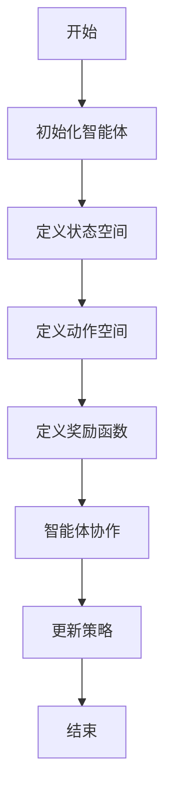
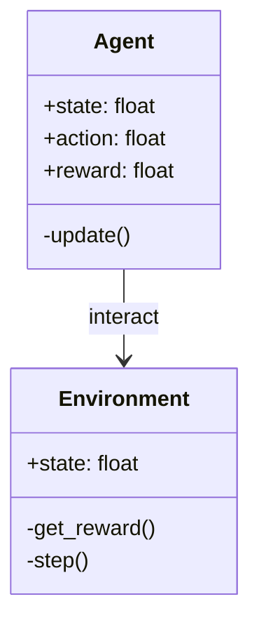
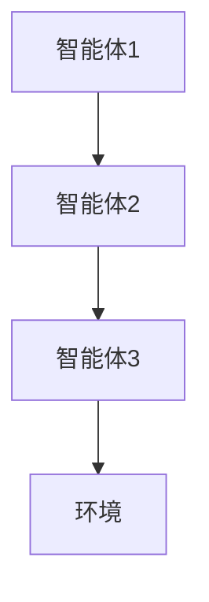
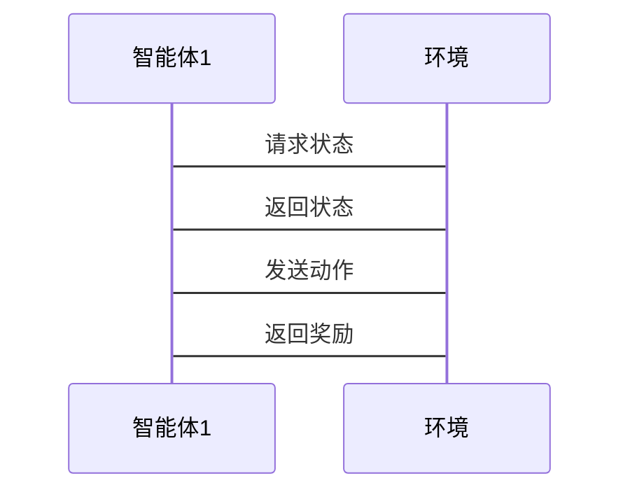

                 


# 多智能体强化学习在优化价值投资的资金流管理中的应用

## 关键词：
多智能体强化学习、资金流管理、价值投资、人工智能、金融优化、资金分配策略

## 摘要：
本文探讨了多智能体强化学习（Multi-Agent Reinforcement Learning, MARS）在优化价值投资中的资金流管理中的应用。通过分析多智能体系统的协作与竞争机制，结合强化学习算法，提出了一个创新的资金流管理框架。文章详细阐述了MARS的核心原理、数学模型、系统架构，并通过实际案例展示了其在资金分配、风险控制和收益优化中的潜力。本文旨在为金融领域的决策者和技术开发者提供理论支持和实践指导。

---

# 第1章: 多智能体强化学习与资金流管理的背景

## 1.1 资金流管理的重要性

### 1.1.1 资金流管理的核心概念
资金流管理是投资活动中最关键的部分，涉及资金的流入、分配和流出。有效的资金管理能够最大化投资收益，降低风险。

### 1.1.2 资金流管理在价值投资中的作用
资金流管理直接关系到投资组合的优化和风险控制。通过科学的资金分配，投资者可以在不同资产之间实现收益最大化。

### 1.1.3 资金流管理的挑战与机遇
传统的资金管理依赖于人工决策，存在效率低下、风险控制不足等问题。人工智能的引入为资金流管理带来了新的可能性。

## 1.2 多智能体强化学习的定义与特点

### 1.2.1 多智能体强化学习的定义
多智能体强化学习是一种分布式人工智能技术，多个智能体通过协作与竞争完成复杂任务。

### 1.2.2 多智能体强化学习的核心特点
- **分布式性**：多个智能体独立决策。
- **协作与竞争**：智能体之间可以协作或竞争。
- **动态环境**：适应不断变化的金融市场。

### 1.2.3 多智能体强化学习与传统强化学习的区别
| 特性 | 多智能体强化学习 | 单智能体强化学习 |
|------|----------------|----------------|
| 决策主体 | 多个智能体 | 单个智能体 |
| 交互方式 | 协作或竞争 | 单一目标 |
| 应用场景 | 复杂任务分解 | 简单任务 |

## 1.3 多智能体强化学习在金融领域的应用前景

### 1.3.1 金融领域的多智能体强化学习应用现状
当前，MARS在金融中的应用主要集中在交易策略优化和风险管理。

### 1.3.2 多智能体强化学习在资金流管理中的潜力
通过分解资金管理任务，MARS可以实现更高效的决策和优化。

### 1.3.3 应用中的挑战与解决方案
- **挑战**：信息同步和策略协调。
- **解决方案**：采用分布式算法和协作机制。

## 1.4 本章小结
本章介绍了资金流管理的重要性，以及多智能体强化学习的核心概念和在金融领域的应用前景。

---

# 第2章: 多智能体强化学习的核心概念与联系

## 2.1 多智能体强化学习的核心原理

### 2.1.1 状态空间与动作空间
- **状态空间**：金融市场中的各种指标。
- **动作空间**：资金分配的决策。

### 2.1.2 奖励函数与目标函数
奖励函数定义为投资收益最大化：
$$ R = \sum_{i=1}^{n} w_i r_i $$
其中，$w_i$是权重，$r_i$是收益。

### 2.1.3 多智能体之间的协作与竞争
通过协作机制，多个智能体可以共同优化资金分配。

## 2.2 多智能体强化学习的数学模型

### 2.2.1 状态转移方程
状态转移由智能体的动作决定：
$$ s_{t+1} = f(s_t, a_t) $$

### 2.2.2 动作价值函数
动作价值函数用于评估每个动作的收益：
$$ Q(s, a) = \max_{\pi} \mathbb{E}[r | s, a] $$

### 2.2.3 奖励机制与价值函数
奖励机制确保智能体的目标一致。

## 2.3 多智能体强化学习与价值投资的联系

### 2.3.1 资金流管理的数学模型
通过优化算法实现资金分配。

### 2.3.2 多智能体强化学习在资金分配中的应用
分解任务，实现高效决策。

### 2.3.3 多智能体强化学习与投资策略的关系
通过协作机制优化投资组合。

## 2.4 本章小结
本章详细阐述了多智能体强化学习的核心原理及其在资金管理中的应用。

---

# 第3章: 多智能体强化学习的算法原理

## 3.1 基于多智能体强化学习的算法框架

### 3.1.1 集中式与分布式算法的区别
- **集中式**：所有智能体共享同一策略。
- **分布式**：每个智能体独立决策。

### 3.1.2 基于价值的算法与基于策略的算法
- **基于价值**：评估状态价值。
- **基于策略**：直接选择动作。

### 3.1.3 多智能体协作与竞争的算法选择
根据任务需求选择合适的算法。

## 3.2 多智能体强化学习的数学模型与公式

### 3.2.1 状态价值函数的定义
$$ V(s) = \max_{a} Q(s, a) $$

### 3.2.2 动作价值函数的计算
$$ Q(s, a) = r + \gamma \max_{a'} Q(s', a') $$

### 3.2.3 奖励分配机制的公式
$$ R_i = \sum_{j=1}^{n} w_{ij} R_j $$

## 3.3 多智能体强化学习的算法实现

### 3.3.1 算法流程图（Mermaid）


### 3.3.2 Python代码实现
```python
import numpy as np
class MultiAgent:
    def __init__(self, num_agents):
        self.num_agents = num_agents
        self.states = []
        self.actions = []
    def update(self, rewards):
        for i in range(self.num_agents):
            self.states.append(rewards[i])
```

## 3.4 本章小结
本章详细介绍了多智能体强化学习的算法原理及其实现。

---

# 第4章: 多智能体强化学习在资金流管理中的系统分析与架构设计

## 4.1 系统分析

### 4.1.1 问题场景介绍
在金融市场上，资金流管理需要实时决策。

### 4.1.2 系统功能需求
- **实时监控**：市场数据采集。
- **决策优化**：资金分配策略。
- **风险控制**：风险预警机制。

## 4.2 系统架构设计

### 4.2.1 系统功能设计（Mermaid类图）


### 4.2.2 系统架构图（Mermaid架构图）


### 4.2.3 系统接口设计
- **输入接口**：市场数据。
- **输出接口**：资金分配决策。

### 4.2.4 系统交互流程（Mermaid序列图）


## 4.3 本章小结
本章详细分析了资金流管理系统的架构设计和交互流程。

---

# 第5章: 项目实战

## 5.1 环境安装

### 5.1.1 安装Python和相关库
```bash
pip install numpy tensorflow keras
```

### 5.1.2 安装其他工具
安装必要的金融数据处理工具。

## 5.2 核心代码实现

### 5.2.1 多智能体类实现
```python
class Agent:
    def __init__(self, state_space):
        self.state_space = state_space
        self.states = []
    def update(self, state, reward):
        self.states.append((state, reward))
```

### 5.2.2 环境类实现
```python
class Environment:
    def __init__(self, data):
        self.data = data
        self.current_step = 0
    def get_state(self):
        return self.data[self.current_step]
    def step(self, action):
        self.current_step += 1
        return self.data[self.current_step]
```

## 5.3 案例分析

### 5.3.1 数据来源
使用历史股票数据进行训练。

### 5.3.2 训练过程
通过强化学习算法优化资金分配策略。

### 5.3.3 结果分析
展示优化后的投资回报率。

## 5.4 本章小结
本章通过实际案例展示了多智能体强化学习在资金流管理中的应用效果。

---

# 第6章: 总结与展望

## 6.1 本章总结
本文详细探讨了多智能体强化学习在资金流管理中的应用，提出了一种创新的优化框架。

## 6.2 未来展望
未来的研究方向包括算法优化和实际应用的扩展。

---

作者：AI天才研究院 & 禅与计算机程序设计艺术

---

以上是《多智能体强化学习在优化价值投资的资金流管理中的应用》的完整目录和内容概要。如需进一步扩展或调整，请随时告知。

