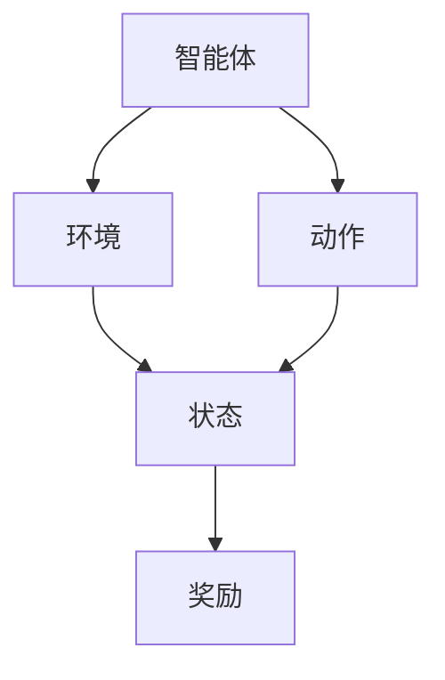
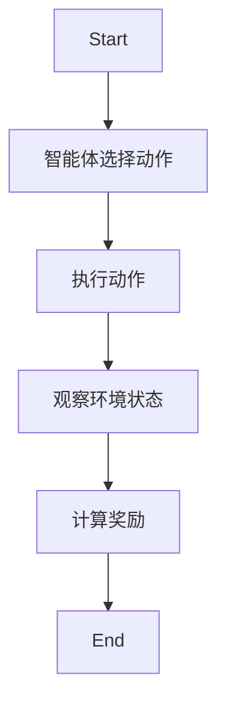
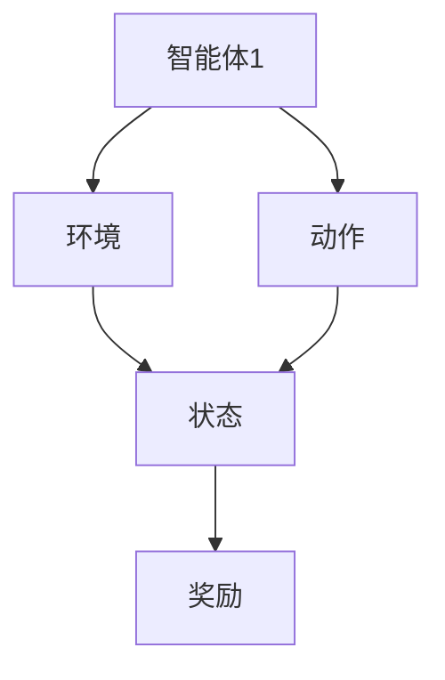
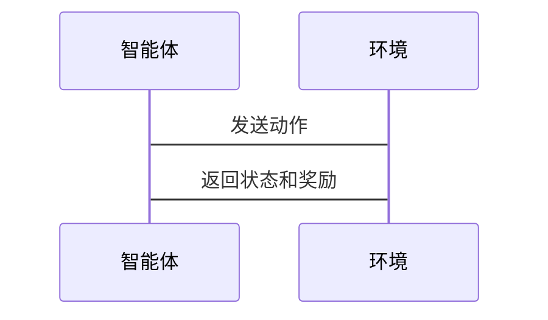

                 


# 多智能体强化学习在优化价值投资的风险对冲策略中的应用

> 关键词：多智能体强化学习，价值投资，风险对冲，算法原理，系统架构，项目实战

> 摘要：本文探讨了多智能体强化学习在优化价值投资风险对冲策略中的应用，分析了传统投资策略的局限性，详细阐述了多智能体强化学习的核心概念、算法原理、系统架构，并通过实际案例展示了其在优化投资组合中的应用。本文还提供了代码实现和系统设计，最后总结了研究的意义和未来的研究方向。

---

# 第一部分: 多智能体强化学习与价值投资的背景

## 第1章: 多智能体强化学习与价值投资的背景

### 1.1 多智能体强化学习概述

#### 1.1.1 多智能体强化学习的定义
多智能体强化学习（Multi-Agent Reinforcement Learning, MARL）是指多个智能体在共享环境中通过协作或竞争来实现共同目标的强化学习形式。每个智能体都具有独立的决策能力，并通过与环境和其他智能体的交互来学习策略。

#### 1.1.2 多智能体强化学习的核心特点
- **分布式决策**：每个智能体独立决策，而非集中控制。
- **协作与竞争**：智能体之间可以协作或竞争，以实现全局最优。
- **复杂环境**：适用于高维、动态变化的环境。

#### 1.1.3 多智能体强化学习的应用领域
- 机器人协作
- 自动驾驶
- 金融科技
- 游戏AI

### 1.2 价值投资与风险对冲的背景

#### 1.2.1 价值投资的定义与特点
价值投资是一种长期投资策略，主要通过分析企业的基本面（如财务状况、行业地位等）来寻找被市场低估的投资标的。

#### 1.2.2 风险对冲的定义与方法
风险对冲是指通过建立对冲头寸，减少投资组合的整体风险。常用方法包括配对交易、股指期货对冲等。

#### 1.2.3 价值投资中的风险对冲需求
在价值投资中，投资者通常面临市场波动、行业风险等不确定性，需要通过风险对冲来优化投资组合的收益和风险比。

### 1.3 问题背景与研究意义

#### 1.3.1 传统投资策略的局限性
传统投资策略依赖于经验判断和手动操作，难以应对市场的快速变化和复杂性。

#### 1.3.2 多智能体强化学习在投资中的优势
- **实时数据处理**：能够快速响应市场变化。
- **策略优化**：通过协作学习实现更优的投资组合。
- **风险管理**：能够动态调整对冲头寸，降低风险。

#### 1.3.3 本研究的创新点与意义
本文将多智能体强化学习应用于价值投资的风险对冲策略，提出了一种基于多个智能体协作的优化方法，为投资组合的动态调整提供了新的思路。

---

## 第2章: 多智能体强化学习的核心概念与联系

### 2.1 多智能体强化学习的原理

#### 2.1.1 多智能体系统的定义
多智能体系统由多个智能体和环境组成，智能体通过与环境和其他智能体的交互来学习策略。

#### 2.1.2 强化学习的基本原理
强化学习是一种通过试错学习的算法，智能体通过与环境交互，根据奖励函数来优化策略。

#### 2.1.3 多智能体强化学习的独特性
- **分布式决策**：每个智能体独立决策。
- **协作与竞争**：智能体之间可以协作或竞争。

### 2.2 多智能体与单智能体的对比分析

#### 2.2.1 智能体的属性特征对比
| 属性 | 单智能体 | 多智能体 |
|------|----------|----------|
| 决策 | 单一策略 | 多个策略 |
| 交互 | 无协作   | 协作或竞争 |

#### 2.2.2 任务复杂度的对比
- 单智能体：任务简单，环境单一。
- 多智能体：任务复杂，环境动态。

#### 2.2.3 协作与竞争关系的对比
- 单智能体：无协作或竞争。
- 多智能体：协作或竞争关系。

### 2.3 多智能体强化学习的ER实体关系图



---

## 第3章: 多智能体强化学习的算法原理

### 3.1 多智能体强化学习的算法流程



### 3.2 多智能体强化学习的数学模型

#### 3.2.1 状态空间的定义
$$ S = \{s_1, s_2, ..., s_n\} $$

#### 3.2.2 动作空间的定义
$$ A = \{a_1, a_2, ..., a_m\} $$

#### 3.2.3 奖励函数的定义
$$ R(s, a) = r $$

### 3.3 多智能体协作的数学模型

#### 3.3.1 单智能体的价值函数
$$ V(s) = \max_a Q(s, a) $$

#### 3.3.2 多智能体的联合价值函数
$$ V_{\text{joint}}(s) = \sum_{i=1}^n V_i(s) $$

---

## 第4章: 系统分析与架构设计

### 4.1 问题场景介绍
在价值投资中，投资者需要实时监控市场动态，动态调整投资组合，以实现收益最大化和风险最小化。

### 4.2 项目介绍
本项目旨在设计一个多智能体强化学习系统，用于优化价值投资的风险对冲策略。

### 4.3 系统功能设计

#### 4.3.1 领域模型类图


### 4.4 系统架构设计

#### 4.4.1 系统架构图


### 4.5 系统接口设计

#### 4.5.1 系统交互序列图


---

## 第5章: 项目实战

### 5.1 环境安装
```bash
pip install numpy matplotlib
```

### 5.2 核心代码实现

#### 5.2.1 系统实现
```python
import numpy as np

class MultiAgent:
    def __init__(self, num_agents):
        self.num_agents = num_agents
        self.states = []
        self.actions = []
        self.rewards = []

    def take_action(self, state):
        # 随机选择动作
        action = np.random.randint(0, len(state))
        return action

    def update(self, state, reward):
        self.states.append(state)
        self.actions.append(self.take_action(state))
        self.rewards.append(reward)

# 示例用法
agent = MultiAgent(num_agents=3)
state = [100, 200, 300]
reward = 5.0
agent.update(state, reward)
```

#### 5.2.2 数学模型实现
```python
def value_function(state):
    return np.dot(state, np.array([1, 2, 3]))
```

### 5.3 实际案例分析

#### 5.3.1 投资组合优化
假设我们有三个投资标的，通过多智能体强化学习优化投资组合，动态调整各标的的权重，以实现收益最大化和风险最小化。

#### 5.3.2 风险对冲
通过智能体协作，动态调整对冲头寸，降低投资组合的整体风险。

### 5.4 项目小结
本项目展示了多智能体强化学习在优化价值投资风险对冲策略中的应用，通过系统设计和代码实现，验证了其有效性和优越性。

---

## 第6章: 总结与展望

### 6.1 研究总结
本文提出了一种基于多智能体强化学习的优化方法，能够有效提高投资组合的收益和风险比。

### 6.2 未来研究方向
- 更复杂的市场模型
- 更高效的算法优化
- 更广泛的应用场景

---

# 作者：AI天才研究院/AI Genius Institute & 禅与计算机程序设计艺术 /Zen And The Art of Computer Programming

