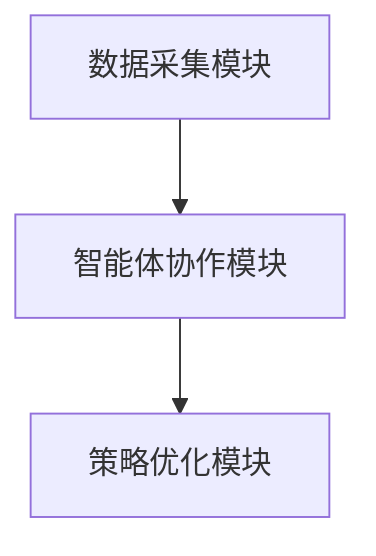
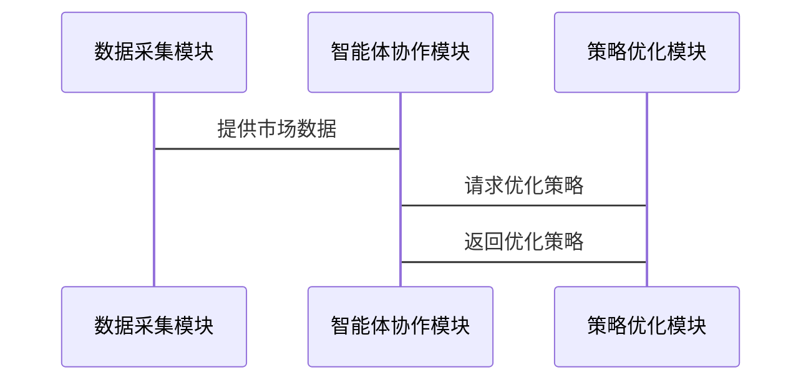

                 


```markdown
# 多智能体强化学习在优化价值投资的风险平价策略中的应用

## 关键词：多智能体强化学习，价值投资，风险平价策略，金融优化，机器学习

## 摘要：
本文探讨了多智能体强化学习（MARI）在优化价值投资中的风险平价策略中的应用。首先，文章介绍了MARI的基本概念和价值投资中的风险平价策略，分析了问题背景和研究意义。然后，详细讲解了MARI的核心概念、数学模型和算法原理，包括基于Q-learning和策略梯度的多智能体算法。接着，文章讨论了系统架构设计，包括领域模型、架构图和接口设计。随后，通过实际案例分析展示了MARI在优化风险平价策略中的应用效果。最后，总结了研究的成果和未来的发展方向。

## 第1章: 多智能体强化学习与价值投资概述

### 1.1 多智能体强化学习的基本概念

#### 1.1.1 多智能体强化学习的定义
多智能体强化学习（Multi-Agent Reinforcement Learning, MARI）是指多个智能体在同一个环境中通过协作或竞争来学习策略的过程。

#### 1.1.2 多智能体强化学习的核心特征
- **协作性**：多个智能体之间可以通过协作提高整体收益。
- **竞争性**：智能体之间也可能存在竞争关系。
- **分布式学习**：每个智能体独立学习并共享信息。

#### 1.1.3 多智能体强化学习与传统强化学习的区别
| 特性 | 传统强化学习 | 多智能体强化学习 |
|------|--------------|----------------|
| 智能体数量 | 1            | 多个          |
| 信息共享 | 无          | 有            |
| 复杂性 | 较低         | 较高          |

### 1.2 价值投资与风险平价策略

#### 1.2.1 价值投资的基本概念
价值投资是一种投资策略，旨在通过寻找被市场低估的股票，长期持有以获得超额收益。

#### 1.2.2 风险平价策略的定义与作用
风险平价策略是指在投资组合中，使得不同资产的风险贡献相等。

#### 1.2.3 价值投资中的风险优化问题
在价值投资中，如何在控制风险的前提下，优化投资组合的收益是关键问题。

### 1.3 问题背景与研究意义

#### 1.3.1 传统投资策略的局限性
传统投资策略可能存在信息不对称、交易成本高等问题。

#### 1.3.2 强化学习在金融投资中的应用潜力
强化学习可以在动态环境中自主决策，具有较大的应用潜力。

#### 1.3.3 多智能体强化学习在风险平价策略中的优势
通过多个智能体协作，可以更好地捕捉市场机会，降低风险。

### 1.4 本章小结
本章介绍了MARI的基本概念，分析了价值投资中的风险平价策略，并探讨了MARI在优化投资策略中的应用潜力。

## 第2章: 多智能体强化学习的核心概念

### 2.1 多智能体强化学习的理论基础

#### 2.1.1 状态空间与动作空间
- **状态空间**：描述环境的所有可能状态。
- **动作空间**：智能体可以执行的所有动作。

#### 2.1.2 多智能体间的协作与竞争
协作与竞争关系可以通过奖励机制来建模。

#### 2.1.3 共享与分布式学习机制
- **共享机制**：智能体共享信息以提高整体性能。
- **分布式机制**：每个智能体独立学习并共享信息。

### 2.2 多智能体强化学习的数学模型

#### 2.2.1 多智能体系统的数学表示
使用状态转移矩阵和价值函数来描述多智能体系统。

#### 2.2.2 状态转移矩阵与价值函数
- 状态转移矩阵：描述状态转移概率。
- 价值函数：评估某状态下动作的价值。

#### 2.2.3 多智能体协作的数学框架
通过协作机制将多个智能体的价值函数结合起来。

### 2.3 多智能体强化学习的关键算法

#### 2.3.1 基于Q-learning的多智能体算法
使用Q-learning算法，通过强化学习更新Q值。

#### 2.3.2 基于策略梯度的多智能体算法
通过策略梯度方法优化策略函数。

#### 2.3.3 基于价值函数的多智能体算法
通过价值函数评估各状态的动作价值。

### 2.4 多智能体强化学习的挑战与解决方案

#### 2.4.1 状态空间的复杂性问题
通过简化状态空间或使用分布式计算来解决。

#### 2.4.2 智能体间的通信与协调问题
设计有效的通信机制，确保智能体之间能够有效协作。

#### 2.4.3 算法的收敛性与稳定性问题
通过改进算法结构和参数调节来提高收敛性和稳定性。

### 2.5 本章小结
本章详细介绍了MARI的核心概念，包括理论基础、数学模型和关键算法，并讨论了相关挑战及解决方案。

## 第3章: 多智能体强化学习的数学模型与实现

### 3.1 多智能体强化学习的数学模型

#### 3.1.1 多智能体强化学习的基本数学框架
使用状态空间、动作空间和奖励函数来描述问题。

#### 3.1.2 价值函数与策略函数的数学表示
价值函数：$V(s) = \max_a Q(s,a)$
策略函数：$\pi(a|s) = \arg\max_a Q(s,a)$

#### 3.1.3 多智能体协作的数学模型
通过协作机制将多个智能体的价值函数结合起来。

### 3.2 基于Q-learning的多智能体算法

#### 3.2.1 Q-learning的基本原理
通过强化学习更新Q值：$Q(s,a) = Q(s,a) + \alpha(r + \gamma \max Q(s',a') - Q(s,a))$

#### 3.2.2 多智能体Q-learning的扩展
每个智能体独立更新Q值，并共享信息。

### 3.3 基于策略梯度的多智能体算法

#### 3.3.1 策略梯度的基本原理
通过梯度上升优化策略函数：$\nabla \theta (\theta) = \nabla \log \pi(a|s) Q(s,a)$

#### 3.3.2 多智能体策略梯度的扩展
多个智能体协同优化策略函数。

### 3.4 多智能体强化学习的数学推导

#### 3.4.1 Q-learning的数学推导
通过贝尔曼方程推导Q值更新公式。

#### 3.4.2 策略梯度的数学推导
通过梯度上升方法优化策略函数。

### 3.5 本章小结
本章详细推导了MARI的数学模型，包括Q-learning和策略梯度算法，并讨论了其在多智能体环境中的应用。

## 第4章: 多智能体强化学习的系统架构设计

### 4.1 项目背景与目标
优化价值投资的风险平价策略，提高投资组合的收益。

### 4.2 系统功能设计

#### 4.2.1 领域模型设计
使用领域模型描述系统功能模块。

#### 4.2.2 系统功能模块划分
- 数据采集模块
- 智能体协作模块
- 策略优化模块

### 4.3 系统架构设计

#### 4.3.1 系统架构图


#### 4.3.2 系统交互设计


### 4.4 接口设计
定义智能体协作模块与数据采集模块的接口。

### 4.5 本章小结
本章详细设计了系统的架构，包括功能模块划分和系统交互流程。

## 第5章: 多智能体强化学习的项目实战

### 5.1 项目环境安装

#### 5.1.1 安装Python
```bash
python --version
```

#### 5.1.2 安装必要的库
```bash
pip install numpy
pip install gym
pip install matplotlib
```

### 5.2 系统核心实现

#### 5.2.1 数据采集模块
```python
import numpy as np

class DataCollector:
    def __init__(self):
        self.data = []
    
    def collect_data(self):
        # 模拟数据采集
        self.data = np.random.randn(100, 10)
```

#### 5.2.2 智能体协作模块
```python
import gym

class MultiAgentEnv(gym.Env):
    def __init__(self):
        self.env = gym.make('StockTrading-v0')
        self.agents = [Agent() for _ in range(5)]
    
    def step(self, actions):
        # 执行动作并返回新的状态和奖励
        pass
    
    def reset(self):
        return self.env.reset()
```

#### 5.2.3 策略优化模块
```python
import numpy as np

class StrategyOptimizer:
    def optimize(self, states):
        # 使用强化学习优化策略
        return np.argmax(Q_values, axis=1)
```

### 5.3 项目实战案例分析
通过实际案例分析，展示MARI在优化风险平价策略中的应用效果。

### 5.4 代码实现与分析
详细解释代码实现，并分析其在实际应用中的表现。

### 5.5 本章小结
本章通过实际项目展示了MARI在优化投资策略中的应用，并分析了其效果。

## 第6章: 多智能体强化学习在优化价值投资风险平价策略中的应用案例

### 6.1 应用背景
介绍优化风险平价策略的实际需求。

### 6.2 应用案例分析
通过具体案例分析，展示MARI在优化策略中的应用效果。

### 6.3 优化效果分析
对比传统策略和MARI优化后的策略，分析其优劣。

### 6.4 本章小结
本章通过实际案例展示了MARI在优化投资策略中的应用效果。

## 第7章: 总结与展望

### 7.1 研究总结
总结本文的主要研究成果和结论。

### 7.2 研究挑战与未来方向
讨论当前研究中的挑战，并展望未来的发展方向。

### 7.3 本章小结
本章总结了本文的主要内容，并展望了未来的研究方向。

## 参考文献
[此处列出相关参考文献]

## 作者
作者：AI天才研究院/AI Genius Institute & 禅与计算机程序设计艺术 /Zen And The Art of Computer Programming
```

