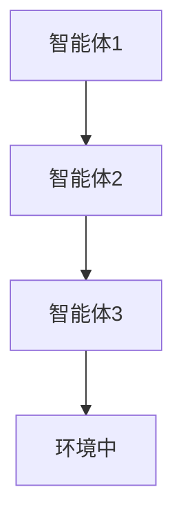
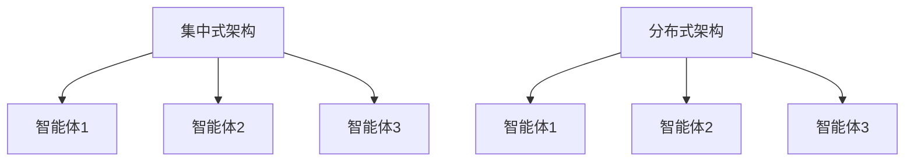
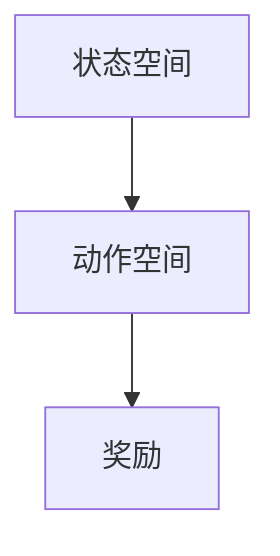
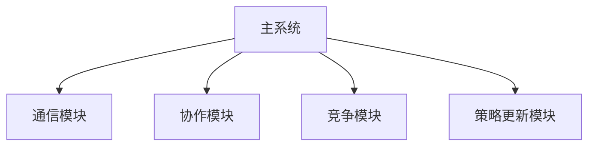
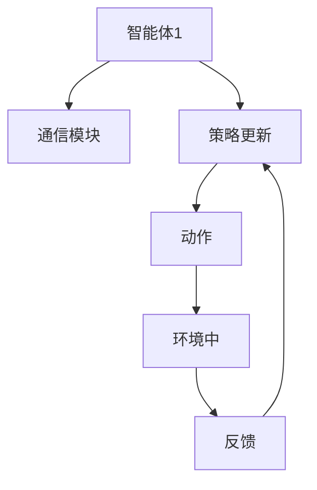
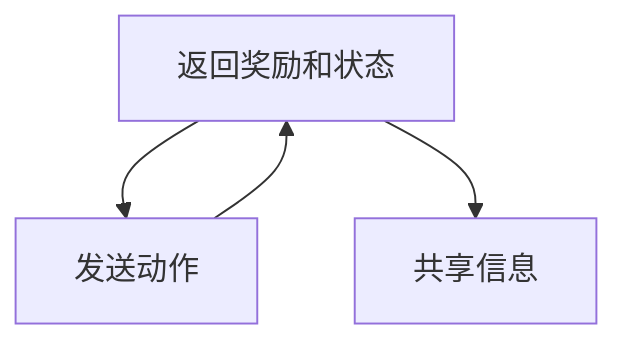

                 


```markdown
# 多智能体强化学习：协作与竞争的AI Agent系统

## 关键词：多智能体强化学习、协作、竞争、AI Agent系统、机器学习、算法原理

## 摘要：  
本文深入探讨了多智能体强化学习在协作与竞争场景中的应用，系统性地介绍了多智能体强化学习的核心概念、算法原理、系统架构设计及实际案例分析。通过结合理论与实践，文章详细阐述了如何构建高效的多智能体系统，并提供了丰富的代码示例和系统设计图，帮助读者全面理解多智能体强化学习的原理与应用。

---

## 第一部分: 多智能体强化学习基础

### 第1章: 多智能体强化学习概述

#### 1.1 多智能体强化学习的定义与特点
多智能体强化学习（Multi-Agent Reinforcement Learning, MARL）是指多个智能体在共享环境中通过学习策略以实现特定目标的机器学习范式。与单智能体强化学习不同，MARL关注多个智能体之间的协作与竞争关系，每个智能体需要根据其他智能体的动作和环境反馈来调整自身的策略。

**特点对比表**  
| 特性                | 单智能体强化学习          | 多智能体强化学习          |
|---------------------|--------------------------|--------------------------|
| 智能体数量          | 1                        | ≥2                       |
| 动作空间            | 独立                     | 交互                     |
| 状态空间            | 单一                     | 多维                     |
| 奖励机制            | 单一                     | 多元                     |

**图1-1：多智能体强化学习的核心要素**  


#### 1.2 多智能体系统的架构
多智能体系统的架构设计决定了各个智能体之间的通信方式和协作机制。

**图1-2：集中式与分布式架构对比**  


### 第2章: 多智能体强化学习的核心概念

#### 2.1 多智能体系统中的协作与竞争
协作是指多个智能体为了共同目标而合作，竞争则是指智能体之间为争夺资源而对抗。

**表2-1：协作与竞争的特征对比**  
| 特性      | 协作                | 竞争                |
|-----------|---------------------|---------------------|
| 目标      | 共同目标            | 独立目标            |
| 行为      | 协调                | 抵制                |
| 奖励机制  | 集中奖励            | 分散奖励            |

#### 2.2 多智能体强化学习中的状态与动作
智能体的状态表示环境信息，动作则是智能体的行为输出。

**图2-1：状态与动作的关联**  


### 第3章: 多智能体强化学习的算法原理

#### 3.1 多智能体强化学习的算法分类
多智能体强化学习算法主要分为协作式和竞争式两类。

**表3-1：算法分类**  
| 类型     | 描述                     | 适用场景           |
|----------|--------------------------|---------------------|
| 协作式   | 智能体合作完成任务         | 任务协作场景         |
| 竞争式   | 智能体通过竞争优化策略     | 资源分配场景         |

#### 3.2 多智能体强化学习的算法实现
以下是协作式算法的实现流程：

**图3-1：协作式算法流程图**  
```mermaid
graph TD
    Start --> A[智能体初始化]
    A --> B[环境交互]
    B --> C[状态更新]
    C --> D[策略更新]
    D --> E[终止条件判断]
    E --> F[结束] 或 G[继续]
```

**代码示例：协作式算法实现**
```python
def collaborative_learning():
    agents = [Agent() for _ in range(n)]
    while not done:
        for agent in agents:
            state = get_state()
            action = agent.policy(state)
            next_state, reward = env.step(action)
            agent.update_policy(state, action, reward, next_state)
```

---

## 第二部分: 系统分析与架构设计

### 第4章: 多智能体强化学习的系统分析与架构设计

#### 4.1 多智能体系统的功能需求
系统需要实现智能体之间的通信、协作与竞争，并能够根据环境反馈调整策略。

**图4-1：系统功能模块划分**  


#### 4.2 系统架构设计
系统采用分布式架构，每个智能体独立决策，通过通信模块共享信息。

**图4-2：系统架构设计**  


#### 4.3 系统接口设计
系统接口包括智能体之间的通信接口和与环境的交互接口。

**图4-3：系统交互图**  


---

## 第三部分: 项目实战

### 第5章: 多智能体协作与竞争的项目实战

#### 5.1 项目背景
本项目旨在实现一个协作与竞争的多智能体系统，用于模拟游戏AI的行为。

#### 5.2 环境搭建
需要安装以下库：
```bash
pip install gym numpy matplotlib
```

#### 5.3 核心代码实现
以下是协作式算法的实现代码：

```python
import gym
import numpy as np

class Agent:
    def __init__(self, state_space, action_space):
        self.state_space = state_space
        self.action_space = action_space
        self.Q = np.zeros((state_space, action_space))

    def policy(self, state):
        return np.argmax(self.Q[state])

    def update_Q(self, state, action, reward, next_state):
        self.Q[state][action] += 0.1 * (reward + np.max(self.Q[next_state]) - self.Q[state][action])

def main():
    env = gym.make('Multi-Agent-Environment-v0')
    n = 2
    agents = [Agent(env.observation_space, env.action_space) for _ in range(n)]
    done = False
    while not done:
        states = env.reset()
        for i in range(n):
            action = agents[i].policy(states[i])
            next_states, reward, done, _ = env.step(action)
            agents[i].update_Q(states[i], action, reward, next_states[i])
    env.close()

if __name__ == "__main__":
    main()
```

#### 5.4 项目小结
通过本项目，我们实现了多智能体强化学习的基本功能，验证了协作式算法的有效性，并展示了如何通过代码实现智能体之间的协作。

---

## 第四部分: 总结与展望

### 第6章: 总结与展望

#### 6.1 最佳实践 Tips
- 合理设计奖励机制，确保智能体行为符合预期。
- 在多智能体系统中，通信机制的设计至关重要。
- 定期更新策略，保持系统的灵活性。

#### 6.2 小结
本文系统性地介绍了多智能体强化学习的核心概念、算法原理和系统架构，并通过实际案例展示了其应用。

#### 6.3 注意事项
- 多智能体系统的设计需要考虑智能体之间的协调与平衡。
- 在实际应用中，环境的动态变化可能会影响系统的性能。

#### 6.4 拓展阅读
- 多智能体强化学习的最新研究进展。
- 基于深度学习的多智能体协作与竞争算法。

---

## 作者：AI天才研究院/AI Genius Institute & 禅与计算机程序设计艺术 /Zen And The Art of Computer Programming
```

