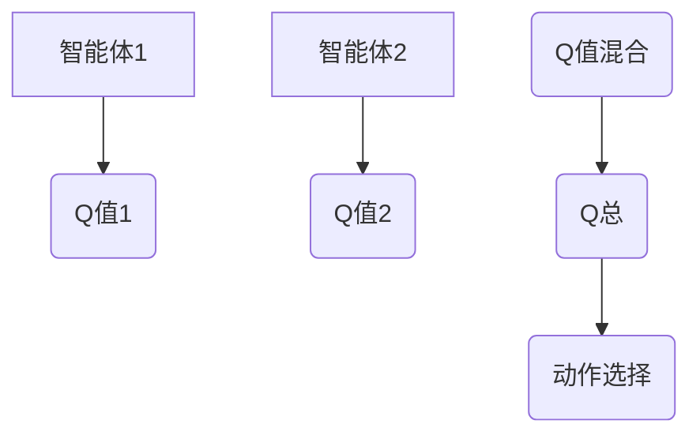
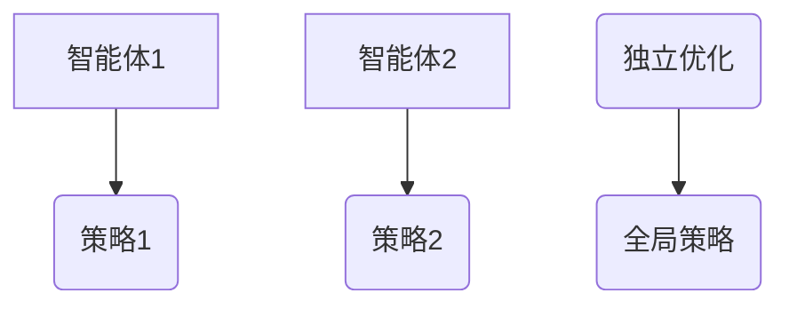
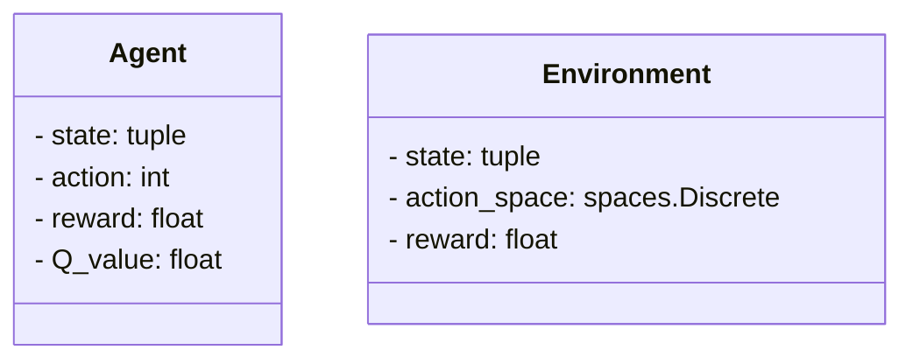
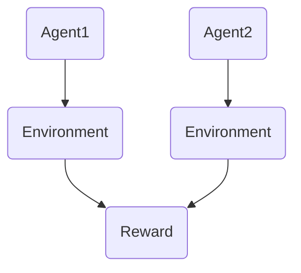

                 


# 多智能体强化学习：复杂环境下的AI Agent协作

> 关键词：多智能体强化学习，AI Agent，协作机制，算法原理，分布式系统

> 摘要：多智能体强化学习是一种通过多个智能体在复杂环境中协作来实现目标的新兴技术。本文从背景、核心概念、算法原理、系统架构到实战案例，全面解析多智能体强化学习的理论与实践。通过详细讲解相关算法和系统设计，结合实际案例，帮助读者掌握多智能体强化学习的核心思想和技术要点。

---

# 第1章：多智能体强化学习背景与基础

## 1.1 多智能体强化学习的基本概念

### 1.1.1 多智能体系统定义

多智能体系统（Multi-Agent System, MAS）是由多个智能体（Agent）组成的系统，这些智能体能够通过协作完成复杂任务。智能体是指具有感知环境、做出决策和执行动作能力的实体。

### 1.1.2 多智能体强化学习的定义

多智能体强化学习（Multi-Agent Reinforcement Learning, MARL）是强化学习（Reinforcement Learning, RL）的扩展，研究多个智能体在复杂环境中协作或竞争以实现目标的过程。每个智能体通过与环境和其他智能体的交互，学习最优策略。

### 1.1.3 多智能体与单智能体的区别

| 特性 | 单智能体 | 多智能体 |
|------|----------|----------|
| 环境 | 简单或固定 | 复杂且动态 |
| 协作 | 无需协作 | 需要协作或竞争 |
| 通信 | 无 | 有 |
| 应用 | 游戏AI、机器人 | 分布式系统、自动驾驶 |

## 1.2 多智能体强化学习的问题背景

### 1.2.1 复杂环境下的协作需求

在复杂环境中，单个智能体难以处理多任务和不确定性，需要多个智能体协作完成任务。

### 1.2.2 单智能体的局限性

单智能体无法处理多目标优化问题，难以在动态环境中快速响应。

### 1.2.3 多智能体的优势与挑战

- **优势**：提高任务完成效率，增强系统鲁棒性。
- **挑战**：智能体间通信复杂，协作机制设计困难。

---

# 第2章：多智能体强化学习的核心概念

## 2.1 多智能体强化学习的原理

### 2.1.1 多智能体系统的协作机制

协作机制包括任务分配、信息共享和决策同步。

### 2.1.2 多智能体强化学习的关键特性

- **去中心化**：智能体独立决策。
- **协作与竞争**：智能体之间可以协作或竞争。
- **知识共享**：智能体共享信息以提高整体性能。

## 2.2 多智能体强化学习的核心要素

### 2.2.1 智能体之间的通信

- **直接通信**：智能体之间直接交换信息。
- **间接通信**：通过共享环境状态进行通信。

### 2.2.2 环境与任务定义

- **任务目标**：每个智能体的目标可能不同。
- **全局目标**：系统整体的目标。

---

# 第3章：多智能体强化学习的模型与方法

## 3.1 多智能体强化学习的模型类型

### 3.1.1 基于值函数的方法

- **Q-learning**：通过Q值函数学习最优策略。

### 3.1.2 基于策略梯度的方法

- **Actor-Critic**：同时学习策略和价值函数。

### 3.1.3 基于Q-learning的方法

- **Multi-Agent Q-learning**：多个智能体同时学习Q值。

## 3.2 多智能体强化学习的关键算法

### 3.2.1 QMIX算法

QMIX通过混合多个智能体的Q值来计算全局Q值。

### 3.2.2 VDN算法

VDN通过分解任务，将多个智能体的策略独立优化。

### 3.2.3 MAPO算法

MAPO通过参数共享和策略优化，实现多智能体协作。

---

# 第4章：经典多智能体强化学习算法

## 4.1 QMIX算法

### 4.1.1 算法原理

QMIX通过混合多个智能体的Q值，计算全局Q值。

### 4.1.2 算法流程图



### 4.1.3 代码实现

```python
def qmix(q_values):
    return torch.mean(q_values, dim=0)
```

## 4.2 VDN算法

### 4.2.1 算法原理

VDN通过分解任务，将多个智能体的策略独立优化。

### 4.2.2 算法流程图



---

# 第5章：分布式多智能体强化学习

## 5.1 分布式算法概述

### 5.1.1 分布式训练的概念

分布式训练将任务分发给多个智能体，每个智能体独立学习。

### 5.1.2 分布式训练的优势

- **并行计算**：提高训练效率。
- **扩展性**：适用于大规模任务。

### 5.1.3 分布式训练的挑战

- **通信开销**：智能体之间需要频繁通信。
- **同步问题**：不同步可能导致策略不一致。

## 5.2 分布式算法实现

### 5.2.1 分布式Q-learning

每个智能体独立学习Q值，通过通信共享策略。

### 5.2.2 分布式DQN

多个智能体同时学习，通过经验回放和目标网络优化策略。

### 5.2.3 分布式PPO

使用参数共享和策略优化，实现多智能体协作。

---

# 第6章：多智能体协作机制设计

## 6.1 协作机制概述

### 6.1.1 协作的目标与约束

- **目标**：完成全局任务。
- **约束**：任务分配、资源限制。

### 6.1.2 协作的实现方式

- **任务分配**：将任务分解给多个智能体。
- **信息共享**：智能体之间共享状态和动作。

### 6.1.3 协作的评估指标

- **完成任务时间**：任务完成速度。
- **协作效率**：资源利用率。

## 6.2 通信协议设计

### 6.2.1 通信方式的选择

- **直接通信**：智能体之间直接交换信息。
- **间接通信**：通过中间媒介进行通信。

### 6.2.2 通信内容的结构化

- **状态共享**：共享当前状态。
- **动作同步**：同步动作选择。

### 6.2.3 通信的同步与异步

- **同步通信**：所有智能体同时通信。
- **异步通信**：智能体在不同时间点通信。

---

# 第7章：多智能体任务分配与调度

## 7.1 任务分配策略

### 7.1.1 基于角色的任务分配

- **角色分配**：根据智能体的能力分配任务角色。

### 7.1.2 基于能力的任务分配

- **能力评估**：评估智能体的能力，分配相应任务。

### 7.1.3 基于优先级的任务分配

- **优先级排序**：根据任务优先级分配智能体。

## 7.2 任务调度算法

### 7.2.1 基于贪心算法的调度

- **贪心策略**：优先处理高优先级任务。

### 7.2.2 基于预测模型的调度

- **预测任务完成时间**：根据预测结果调度任务。

### 7.2.3 基于反馈机制的调度

- **实时反馈**：根据执行情况调整调度。

---

# 第8章：多智能体强化学习的项目实战

## 8.1 环境搭建

### 8.1.1 环境选择与配置

- **选择环境**：选择适合多智能体协作的环境，如Gridworld。
- **配置参数**：设置环境参数，如智能体数量、任务目标。

### 8.1.2 代码实现

```python
import gym
from gym import spaces
import numpy as np

class MultiAgentEnv(gym.Env):
    def __init__(self, n_agents):
        self.n_agents = n_agents
        self.observation_space = spaces.Tuple([spaces.Box(-1, 1, shape=(2,))]*n_agents)
        self.action_space = spaces.Tuple([spaces.Discrete(3)]*n_agents)
```

## 8.2 系统功能设计

### 8.2.1 领域模型设计



## 8.3 系统架构设计

### 8.3.1 系统架构图



---

# 第9章：总结与展望

## 9.1 总结

多智能体强化学习通过多个智能体协作，能够在复杂环境中完成复杂任务。本文详细介绍了多智能体强化学习的背景、核心概念、算法原理、系统架构和实战案例。

## 9.2 展望

未来的研究方向包括更高效的协作机制设计、更智能的通信协议和更强大的算法优化。多智能体强化学习将在更多领域得到应用。

---

作者：AI天才研究院 & 禅与计算机程序设计艺术

