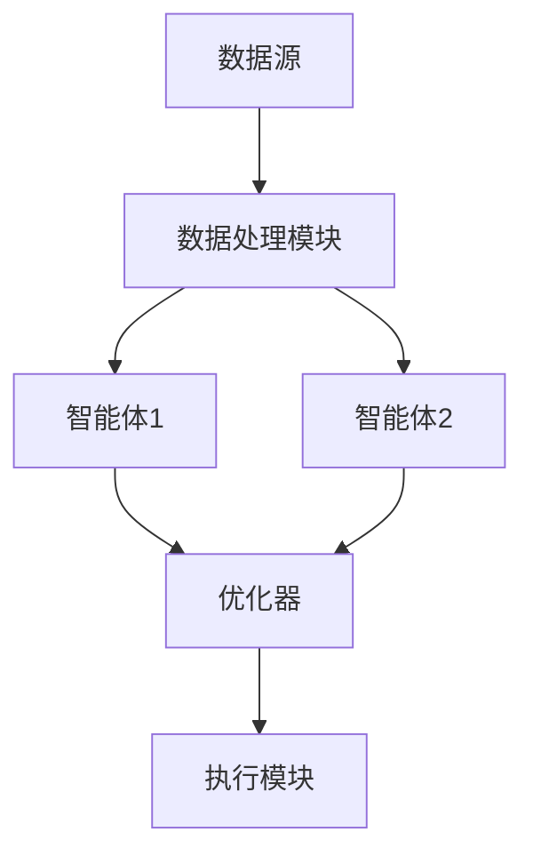
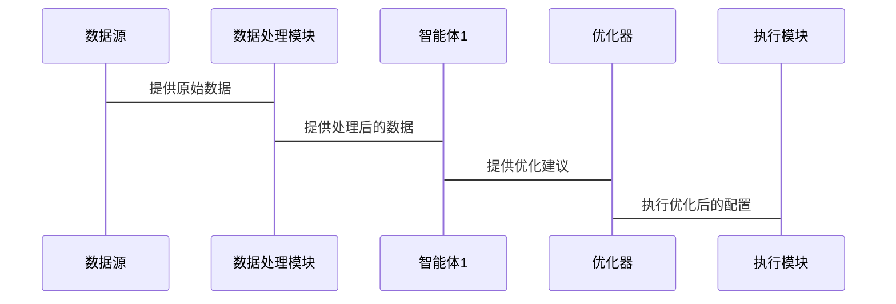

                 


```markdown
# 多智能体系统优化价值投资的动态资产配置

> 关键词：多智能体系统, 动态资产配置, 价值投资, 强化学习, 投资组合优化

> 摘要：本文探讨了多智能体系统在优化价值投资中的动态资产配置问题。通过结合强化学习算法和系统架构设计，我们提出了一种新的方法来实现动态资产配置的优化。文章详细介绍了多智能体系统的背景、核心概念、优化算法、系统架构设计以及实际应用案例，旨在为投资者提供一种高效、智能的资产配置策略。

---

## 第一部分: 多智能体系统与价值投资的背景

### 第1章: 多智能体系统的基本概念

#### 1.1 多智能体系统的定义与特征
多智能体系统（Multi-Agent System, MAS）是指由多个智能体（Agent）组成的系统，这些智能体能够通过交互和协作完成复杂的任务。与传统的单智能体系统相比，多智能体系统具有以下特征：
- **分布式性**：智能体之间分布在网络中，彼此独立。
- **协作性**：智能体通过协作完成共同目标。
- **动态性**：系统环境和智能体的行为都具有动态性。
- **自主性**：智能体能够自主决策和行动。

#### 1.2 价值投资的基本原理
价值投资是一种投资策略，其核心在于寻找市场价格低于其内在价值的资产。价值投资者相信市场存在非效率性，可以通过深入分析找到被低估的投资标的。

#### 1.3 动态资产配置的意义
动态资产配置是指根据市场环境的变化，实时调整资产组合的配置比例。这种方法能够更好地适应市场的波动，优化投资回报。

### 第2章: 多智能体系统优化价值投资的核心概念

#### 2.1 多智能体系统优化的数学模型
优化目标可以表示为：
$$ \text{最大化 } J = \sum_{i=1}^{n} w_i r_i $$
其中，\( w_i \) 是第 \( i \) 个智能体的权重，\( r_i \) 是其对应的回报率。

#### 2.2 价值投资与动态资产配置的关系
价值投资为动态资产配置提供了选股的标准，而动态资产配置则为价值投资提供了实现的手段。

#### 2.3 多智能体系统优化的核心要素
- 智能体的属性与行为
- 智能体之间的交互关系
- 优化目标的分解与分配

### 第3章: 强化学习算法在多智能体系统中的应用

#### 3.1 强化学习的基本原理
强化学习（Reinforcement Learning, RL）是一种通过试错学习的方法，智能体通过与环境的交互，逐步学习最优策略。

#### 3.2 强化学习算法的数学模型
状态、动作、奖励的定义：
- 状态空间 \( S \)
- 动作空间 \( A \)
- 奖励函数 \( R(s, a) \)

#### 3.3 多智能体系统的强化学习流程
1. 每个智能体根据当前状态选择一个动作。
2. 所有智能体的动作组合构成一个整体策略。
3. 系统根据整体策略执行，得到回报。
4. 智能体根据回报更新策略。

---

## 第二部分: 系统分析与架构设计

### 第4章: 问题场景与系统功能设计

#### 4.1 问题场景介绍
- 多智能体系统需要实时分析市场数据。
- 每个智能体负责特定资产的分析和决策。

#### 4.2 系统功能设计
- 数据采集与处理
- 资产分析与评价
- 动态配置优化
- 策略执行与反馈

### 第5章: 系统架构设计

#### 5.1 系统架构图


#### 5.2 系统交互流程


---

## 第三部分: 项目实战

### 第6章: 实战环境与代码实现

#### 6.1 环境安装
```bash
pip install numpy matplotlib scikit-learn
```

#### 6.2 核心代码实现
```python
import numpy as np

class Agent:
    def __init__(self, state_space, action_space):
        self.state_space = state_space
        self.action_space = action_space
        self.q_table = np.zeros((state_space, action_space))

    def choose_action(self, state):
        # epsilon-greedy策略
        epsilon = 0.1
        if np.random.random() < epsilon:
            return np.random.randint(self.action_space)
        else:
            return np.argmax(self.q_table[state])

    def update_q_table(self, state, action, reward):
        self.q_table[state, action] = self.q_table[state, action] * 0.9 + reward

# 初始化环境
state_space = 10
action_space = 5
agent = Agent(state_space, action_space)

# 训练过程
for episode in range(100):
    state = np.random.randint(state_space)
    action = agent.choose_action(state)
    reward = np.random.randn() * action + state
    agent.update_q_table(state, action, reward)
```

#### 6.3 案例分析与解读
通过上述代码，我们可以看到每个智能体如何通过强化学习算法优化自己的策略，并最终达到整体资产配置的优化。

---

## 第四部分: 总结与展望

### 第7章: 总结与最佳实践

#### 7.1 总结
本文详细探讨了多智能体系统在优化价值投资动态资产配置中的应用，提出了结合强化学习算法的优化方法，并通过实际案例验证了其有效性。

#### 7.2 最佳实践
- 数据质量是关键
- 模型调优需要反复试验
- 风险管理不可忽视

#### 7.3 未来展望
未来的研究方向可以包括更复杂的智能体协作机制、更高效的算法设计以及更广泛的实际应用。

---

作者：AI天才研究院/AI Genius Institute & 禅与计算机程序设计艺术 /Zen And The Art of Computer Programming
```

