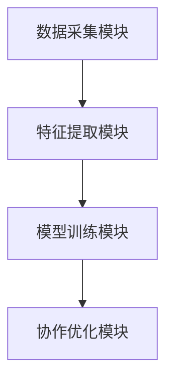

                 


# 多智能体系统优化价值投资的卖出决策

> **关键词**：多智能体系统，价值投资，卖出决策，优化算法，系统架构，项目实战

> **摘要**：本文探讨了如何利用多智能体系统优化价值投资的卖出决策。通过分析多智能体系统的核心概念、算法原理、系统架构及实际案例，本文为投资者提供了一种新的决策优化方法。文章内容涵盖背景介绍、核心概念、算法实现、系统设计、项目实战及最佳实践，旨在帮助读者理解并应用多智能体系统在金融投资中的潜力。

---

## 第一部分：多智能体系统与价值投资概述

### 第1章：多智能体系统与价值投资的背景介绍

#### 1.1 多智能体系统的概念与特点
- **多智能体系统的定义**：多智能体系统（Multi-Agent System, MAS）是由多个智能体组成的系统，这些智能体能够自主决策、协作完成任务。
- **核心特征**：
  1. 分布式智能：每个智能体独立决策，但通过通信协作完成整体目标。
  2. 协作性：智能体之间通过信息共享和协作，优化整体性能。
  3. 反应性：智能体能够实时感知环境变化并做出反应。
  4. 自适应性：系统能够根据环境变化调整策略。
- **多智能体系统与传统AI的区别**：
  - 传统AI依赖中心化控制，多智能体系统去中心化。
  - 多智能体系统强调协作，传统AI注重单一任务完成。

#### 1.2 价值投资的基本原理
- **价值投资的定义**：价值投资是一种投资策略，旨在通过分析股票的内在价值，寻找被市场低估的投资机会。
- **价值投资的核心原则**：
  1. 长期投资：关注企业的长期价值，而非短期市场波动。
  2. 安全边际：买入价格低于内在价值，降低风险。
  3. 质量企业：选择财务健康、管理优秀的企业。
- **价值投资的关键步骤**：
  1. 企业基本面分析。
  2. 市场情绪分析。
  3. 定价模型计算内在价值。

#### 1.3 多智能体系统在金融投资中的应用
- **多智能体系统的优势**：
  - 并行处理能力强，能够同时分析多个投资标的。
  - 智能体之间协作，能够从多个角度评估投资机会。
  - 反应速度快，能够及时捕捉市场变化。
- **多智能体系统在价值投资中的应用场景**：
  - 分散化投资：通过多个智能体分析不同行业和企业。
  - 风险管理：通过协作机制降低投资组合的整体风险。
  - 动态调整：根据市场变化实时优化投资组合。

#### 1.4 本章小结
本章介绍了多智能体系统的核心概念和价值投资的基本原理，分析了多智能体系统在金融投资中的优势及应用场景。通过理解这些内容，读者可以初步认识到多智能体系统如何优化价值投资的卖出决策。

---

## 第二部分：多智能体系统优化卖出决策的核心概念与联系

### 第2章：多智能体系统与价值投资的关系

#### 2.1 多智能体系统的协作机制
- **协作机制的分类**：
  1. 基于任务的协作：智能体根据任务分工协作。
  2. 基于信息共享的协作：智能体通过信息共享优化决策。
  3. 基于市场机制的协作：智能体通过模拟市场机制进行资源分配。
- **协作机制的实现方式**：
  - 通信协议：定义智能体之间的通信方式。
  - 协作算法：如分布式优化算法、协商算法等。
  - 协调机制：通过协调中心或自组织方式实现协作。

#### 2.2 价值投资的决策过程
- **买入决策**：基于企业基本面分析和市场估值。
- **卖出决策**：基于企业变化、市场波动和投资目标的实现。
- **卖出决策的关键因素**：
  - 企业基本面恶化。
  - 市场估值过高。
  - 投资目标达成。

#### 2.3 多智能体系统优化卖出决策的实现路径
- **数据采集**：智能体负责采集企业财务数据、市场数据等。
- **特征提取**：对数据进行特征提取，如市盈率、市净率等。
- **模型训练**：基于历史数据训练卖出决策模型。
- **决策优化**：通过协作优化卖出决策，降低风险，提高收益。

#### 2.4 本章小结
本章详细分析了多智能体系统的协作机制和价值投资的决策过程，揭示了多智能体系统如何优化价值投资的卖出决策。

---

## 第三部分：多智能体系统优化卖出决策的算法原理

### 第3章：多智能体协作算法

#### 3.1 多智能体协作算法的分类
- **基于分布式优化的算法**：如分布式梯度下降。
- **基于协商的算法**：智能体通过协商达成共识。
- **基于市场机制的算法**：模拟市场机制进行资源分配。

#### 3.2 基于Q-learning的多智能体协作算法
- **Q-learning算法的定义**：Q-learning是一种强化学习算法，通过智能体与环境的交互学习最优策略。
- **多智能体协作的Q-learning实现**：
  - 每个智能体维护一个Q值表。
  - 智能体通过协作更新Q值表。
  - 通过Q值表优化协作策略。

#### 3.3 多智能体协作算法的实现步骤
1. 初始化智能体和环境。
2. 智能体感知环境，获取状态。
3. 智能体选择动作，执行动作。
4. 环境反馈奖励，智能体更新Q值表。
5. 重复步骤，直到达到终止条件。

#### 3.4 本章小结
本章介绍了多智能体协作算法的分类和实现步骤，重点讲解了基于Q-learning的协作算法及其在卖出决策中的应用。

---

## 第四部分：多智能体系统优化卖出决策的系统架构设计

### 第4章：系统架构设计

#### 4.1 系统功能模块设计
- **数据采集模块**：负责采集企业财务数据、市场数据等。
- **特征提取模块**：对数据进行特征提取，如市盈率、市净率等。
- **模型训练模块**：基于历史数据训练卖出决策模型。
- **协作优化模块**：通过协作算法优化卖出决策。

#### 4.2 系统架构图
使用Mermaid绘制系统架构图：



#### 4.3 接口设计
- **数据接口**：定义数据采集模块与特征提取模块的接口。
- **协作接口**：定义协作优化模块与其他模块的接口。

#### 4.4 本章小结
本章详细设计了多智能体系统的架构，包括功能模块、架构图和接口设计，为系统的实现提供了指导。

---

## 第五部分：多智能体系统优化卖出决策的项目实战

### 第5章：项目实战

#### 5.1 环境安装
- **安装Python环境**：安装Anaconda或Python 3.8以上版本。
- **安装依赖库**：安装numpy、pandas、scikit-learn、mermaid等库。

#### 5.2 核心代码实现
- **数据采集模块**：
  ```python
  import numpy as np
  import pandas as pd

  def collect_data(tickers):
      # 数据采集逻辑
      pass
  ```

- **特征提取模块**：
  ```python
  def extract_features(data):
      # 特征提取逻辑
      pass
  ```

- **模型训练模块**：
  ```python
  from sklearn.model_selection import train_test_split
  from sklearn.linear_model import LinearRegression

  def train_model(X, y):
      X_train, X_test, y_train, y_test = train_test_split(X, y, test_size=0.2)
      model = LinearRegression()
      model.fit(X_train, y_train)
      return model
  ```

- **协作优化模块**：
  ```python
  def collaborate_agents(agents):
      # 协作优化逻辑
      pass
  ```

#### 5.3 案例分析
- **案例背景**：选择特定股票进行分析。
- **数据处理**：对数据进行清洗和预处理。
- **模型训练**：训练卖出决策模型。
- **协作优化**：通过协作优化卖出决策，提高收益。

#### 5.4 本章小结
本章通过实际案例展示了多智能体系统优化卖出决策的实现过程，包括环境安装、核心代码实现和案例分析。

---

## 第六部分：最佳实践与总结

### 第6章：最佳实践与总结

#### 6.1 小结
- 本文详细探讨了多智能体系统优化价值投资的卖出决策。
- 介绍了多智能体系统的核心概念、算法原理和系统架构设计。
- 通过实际案例展示了多智能体系统的应用。

#### 6.2 注意事项
- 数据质量：确保数据准确可靠。
- 算法选择：根据具体场景选择合适的协作算法。
- 系统优化：持续优化系统架构和协作机制。

#### 6.3 拓展阅读
- 推荐阅读相关领域的书籍和论文，如《多智能体系统》、《价值投资入门》等。

---

## 作者信息

作者：AI天才研究院/AI Genius Institute & 禅与计算机程序设计艺术 /Zen And The Art of Computer Programming

