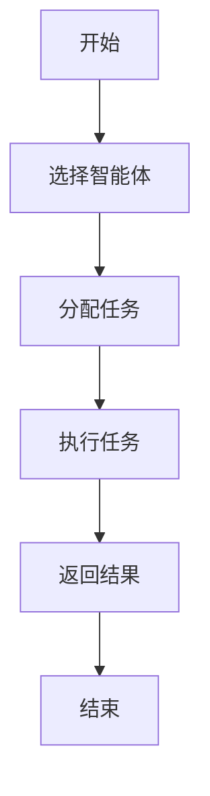
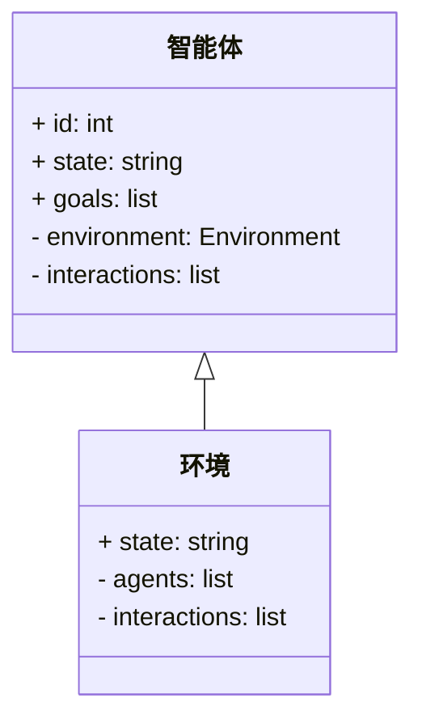
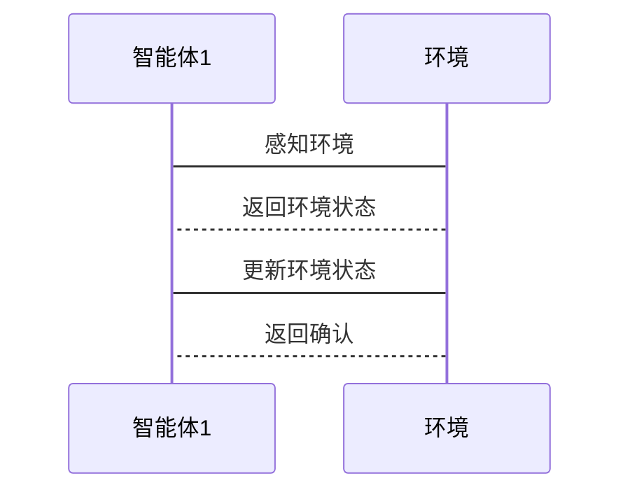

                 


# 多智能体系统分析产业生态系统

## 关键词：多智能体系统, 产业生态系统, 智能体, 算法原理, 系统架构

## 摘要：  
多智能体系统是一种由多个智能体组成的分布式系统，通过协同工作实现复杂任务。本文分析多智能体系统的核心概念、算法原理、系统架构，并通过实际案例展示其在产业生态系统中的应用。文章内容涵盖系统背景、核心概念、算法实现、系统设计和项目实战，旨在帮助读者全面理解多智能体系统的原理和应用。

---

# 第一部分: 多智能体系统与产业生态系统概述

## 第1章: 多智能体系统概述

### 1.1 多智能体系统的基本概念  
多智能体系统（Multi-Agent System, MAS）是由多个智能体（Agent）组成的分布式系统，智能体能够感知环境、自主决策并与其他智能体或环境交互。与单智能体系统相比，多智能体系统具有分布式性、协作性、动态性和智能性等特点。

#### 1.1.1 多智能体系统的定义  
- **智能体（Agent）**：能够感知环境并采取行动以实现目标的实体。
- **多智能体系统（MAS）**：由多个智能体组成的系统，智能体之间通过交互实现协同任务。

#### 1.1.2 多智能体系统的特征  
| 特征 | 描述 |
|------|------|
| 分布式 | 智能体独立运行，无中心控制 |
| 协作性 | 智能体通过协作完成复杂任务 |
| 动态性 | 环境和智能体状态动态变化 |
| 智能性 | 智能体具备自主决策能力 |

#### 1.1.3 多智能体系统与单智能体系统的区别  
- **单智能体系统**：单个智能体独立完成任务，决策集中化。
- **多智能体系统**：多个智能体协作完成任务，决策去中心化。

### 1.2 产业生态系统的基本概念  
产业生态系统是指由企业、消费者、供应商、合作伙伴等组成的复杂经济系统，各参与方通过交互和协作实现价值创造。

#### 1.2.1 产业生态系统的定义  
- 产业生态系统：由多个参与者组成的经济系统，参与者通过交互和协作实现价值创造。

#### 1.2.2 产业生态系统的结构  
| 要素 | 描述 |
|------|------|
| 企业 | 产业生态的核心参与者 |
| 消费者 | 产品或服务的最终用户 |
| 供应商 | 提供原材料或服务的企业 |
| 合作伙伴 | 与企业合作的第三方 |

#### 1.2.3 产业生态系统的核心要素  
- **企业**：提供产品或服务的核心主体。
- **消费者**：需求的来源。
- **供应商**：提供资源或服务的外部实体。
- **合作伙伴**：与企业协同完成任务的外部实体。

### 1.3 多智能体系统与产业生态系统的联系  
多智能体系统可以模拟产业生态系统中各参与方的交互和协作过程，帮助优化产业生态系统的运行效率。

#### 1.3.1 多智能体系统在产业生态系统中的作用  
- **模拟参与者行为**：通过智能体模拟企业、消费者等参与者的决策过程。
- **优化协作效率**：通过智能体协作实现资源优化配置。
- **支持动态决策**：智能体能够根据环境变化实时调整决策。

#### 1.3.2 多智能体系统与产业生态系统的关系  
- 多智能体系统是产业生态系统的一种数字化模型。
- 产业生态系统为多智能体系统提供应用场景。

#### 1.3.3 多智能体系统对产业生态系统的影响  
- 提高产业生态系统的运行效率。
- 优化产业生态系统的资源配置。
- 支持产业生态系统的动态调整。

### 1.4 本章小结  
本章介绍了多智能体系统和产业生态系统的定义、特征和核心要素，并分析了多智能体系统在产业生态系统中的作用和影响。

---

# 第二部分: 多智能体系统的核心概念与联系

## 第2章: 多智能体系统的核心概念与联系

### 2.1 多智能体系统的核心概念  
多智能体系统的核心概念包括智能体、环境、目标和交互。

#### 2.1.1 智能体  
智能体是多智能体系统的基本单元，具备以下特征：  
1. **自主性**：智能体能够自主决策。  
2. **反应性**：智能体能够感知环境并实时调整行为。  
3. **协作性**：智能体能够与其他智能体协作完成任务。  

#### 2.1.2 环境  
环境是智能体所处的外部世界，包括物理环境和虚拟环境。  

#### 2.1.3 目标  
目标是智能体行为的驱动力，智能体通过实现目标来完成任务。  

#### 2.1.4 交互  
交互是智能体之间或智能体与环境之间的信息交换过程。

### 2.2 多智能体系统核心概念的属性对比  
以下是智能体、环境、目标和交互的属性对比表：

| 概念 | 属性 |
|------|------|
| 智能体 | 自主性、反应性、协作性 |
| 环境 | 物理性、动态性、复杂性 |
| 目标 | 明确性、层次性、动态性 |
| 交互 | 信息性、实时性、复杂性 |

### 2.3 多智能体系统的ER实体关系图  
以下是多智能体系统的ER实体关系图：

```mermaid
erDiagram
    actor 智能体 {
        role 智能体角色
    }
    actor 环境 {
        role 环境角色
    }
    actor 目标 {
        role 目标角色
    }
    actor 交互 {
        role 交互角色
    }
    智能体 --> 环境 : 交互
    智能体 --> 目标 : 实现
    环境 --> 交互 : 提供
    目标 --> 交互 : 定义
```

### 2.4 本章小结  
本章详细分析了多智能体系统的核心概念，包括智能体、环境、目标和交互，并通过属性对比和ER实体关系图展示了这些概念之间的联系。

---

## 第3章: 多智能体系统的算法原理

### 3.1 多智能体系统的典型算法  
多智能体系统常用的算法包括分布式计算算法、协商算法和学习算法。

#### 3.1.1 分布式计算算法  
分布式计算算法用于在多智能体系统中实现任务的分布式计算。

#### 3.1.2 协商算法  
协商算法用于智能体之间的协作决策。

#### 3.1.3 学习算法  
学习算法用于智能体通过经验改进决策能力。

### 3.2 算法原理的数学模型与公式  
以下是分布式计算算法的数学模型：

$$ \text{任务分配} = \argmin_{i} \{ \text{负载}_i \} $$

### 3.3 算法原理的Mermaid流程图  
以下是分布式计算算法的Mermaid流程图：



### 3.4 算法原理的Python实现  
以下是分布式计算算法的Python代码实现：

```python
def distributed_computation(agents):
    # 分配任务
    task = min(agents, key=lambda x: x.load)
    # 执行任务
    result = task.execute()
    return result
```

### 3.5 本章小结  
本章介绍了多智能体系统的典型算法，包括分布式计算算法、协商算法和学习算法，并通过数学模型和Python代码展示了算法的实现过程。

---

## 第4章: 多智能体系统的系统分析与架构设计

### 4.1 系统分析  
本节通过一个实际案例分析多智能体系统的系统分析过程。

#### 4.1.1 问题场景介绍  
假设我们需要设计一个多智能体系统来优化供应链管理。

#### 4.1.2 项目介绍  
本项目旨在通过多智能体系统优化供应链中的库存管理和物流调度。

#### 4.1.3 系统功能设计  
以下是系统的功能模块：

- **信息采集模块**：采集供应链中的实时数据。
- **决策支持模块**：提供决策支持。
- **协同控制模块**：实现智能体之间的协同控制。

### 4.2 系统架构设计  
以下是系统的架构设计：

#### 4.2.1 系统架构的Mermaid类图  


#### 4.2.2 系统架构的Mermaid架构图  


#### 4.2.3 系统接口设计  
以下是系统的接口设计：

- **智能体接口**：提供智能体的初始化、感知和决策接口。
- **环境接口**：提供环境的状态获取和更新接口。

#### 4.2.4 系统交互的Mermaid序列图  


### 4.3 本章小结  
本章通过实际案例分析了多智能体系统的系统分析与架构设计过程，并展示了系统的类图、架构图和序列图。

---

## 第5章: 多智能体系统的项目实战

### 5.1 环境安装  
以下是环境安装步骤：

1. 安装Python：```bash
    python --version
    ```
2. 安装依赖库：```bash
    pip install -r requirements.txt
    ```

### 5.2 系统核心实现源代码  
以下是系统的核心代码实现：

```python
class Agent:
    def __init__(self, id):
        self.id = id
        self.state = "idle"
        self.goals = []
        self.environment = None

    def感知环境(self):
        return self.environment.get_state()

    def 决策(self):
        # 简单决策逻辑
        pass

    def 执行(self):
        pass

class Environment:
    def __init__(self):
        self.agents = []
        self.state = "normal"

    def get_state(self):
        return self.state

    def update_state(self, state):
        self.state = state
```

### 5.3 代码应用解读与分析  
以下是代码的解读与分析：

- **智能体类**：定义了智能体的基本属性和方法。
- **环境类**：定义了环境的基本属性和方法。

### 5.4 实际案例分析  
通过实际案例分析多智能体系统的应用，例如供应链管理中的库存优化。

### 5.5 项目小结  
本章通过实际案例展示了多智能体系统的实现过程，并分析了系统的优缺点。

---

## 第6章: 最佳实践与小结

### 6.1 最佳实践  
- **模块化设计**：智能体和环境模块化设计，便于扩展和维护。
- **动态调整**：系统具备动态调整能力，适应环境变化。
- **协同合作**：智能体之间通过协作实现任务优化。

### 6.2 小结  
本文全面分析了多智能体系统的核心概念、算法原理、系统架构，并通过实际案例展示了多智能体系统的应用。多智能体系统在产业生态系统中的应用前景广阔，可以帮助企业优化资源配置、提高协作效率。

### 6.3 注意事项  
- 系统设计时需考虑智能体之间的通信开销。
- 系统实现时需注意智能体的自主性和协作性之间的平衡。

### 6.4 拓展阅读  
- 推荐阅读《Multi-Agent Systems》和《Agent-Based Modeling》。

---

# 作者：AI天才研究院 & 禅与计算机程序设计艺术

