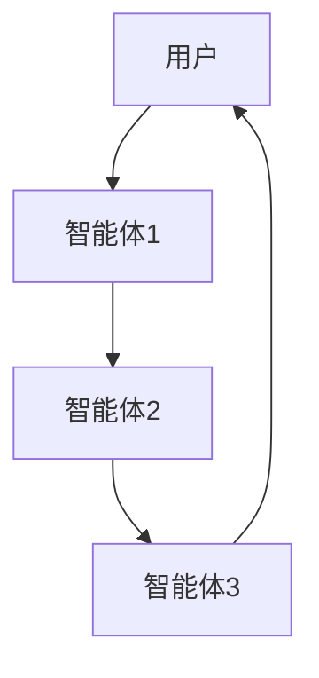
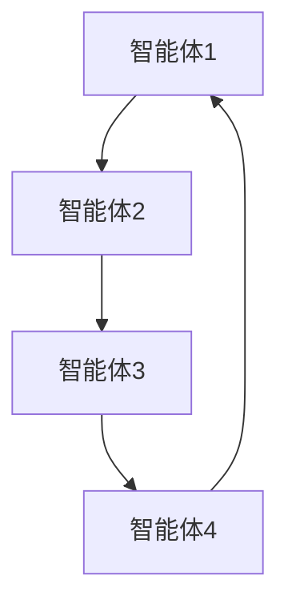
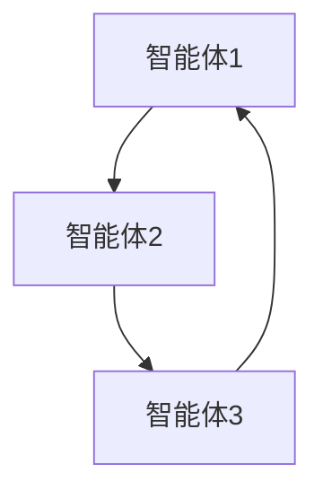
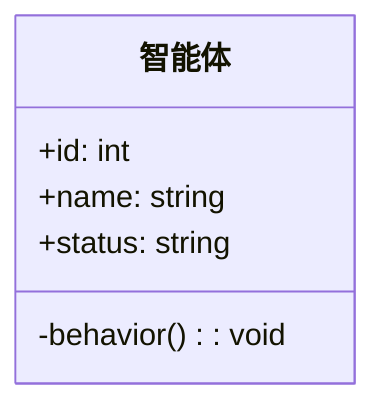
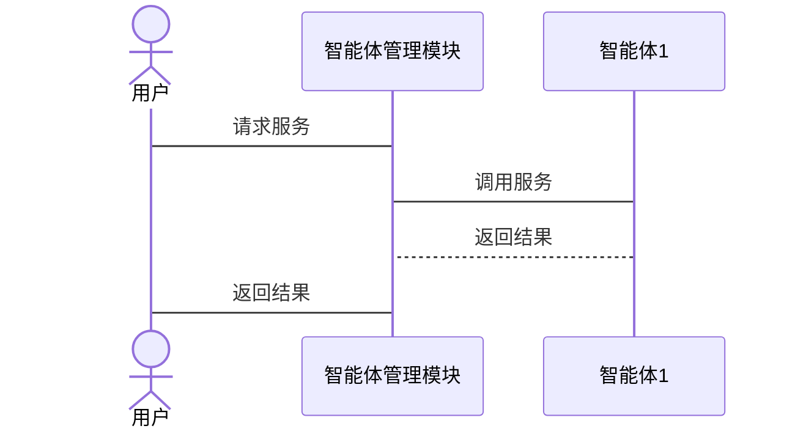

                 


# 多智能体系统在产品生命周期分析中的应用

> **关键词**：多智能体系统、产品生命周期、智能制造、协同设计、分布式计算

> **摘要**：多智能体系统（Multi-Agent System, MAS）是一种由多个智能体组成的分布式系统，能够协同完成复杂任务。在产品生命周期管理中，多智能体系统能够显著提高设计、生产、维护等各阶段的效率。本文将详细探讨多智能体系统在产品生命周期分析中的应用，包括其核心概念、算法原理、系统架构设计及实际案例。

---

## 第一部分：多智能体系统与产品生命周期概述

### 第1章：多智能体系统概述

#### 1.1 多智能体系统的定义与特点

**1.1.1 多智能体系统的定义**  
多智能体系统是由多个智能体组成的分布式系统，这些智能体能够通过通信和协作完成复杂的任务。每个智能体都有一定的自主性，能够感知环境、做出决策并采取行动。

**1.1.2 多智能体系统的特征**  
- **分布式性**：智能体分布在不同的节点上，通过通信进行协作。
- **自主性**：每个智能体都有一定的决策能力，能够自主行动。
- **协作性**：智能体之间通过协作完成共同目标。
- **动态性**：系统环境和任务需求可能动态变化。

**1.1.3 多智能体系统与传统单智能体系统的区别**  
传统单智能体系统依赖中心化控制，而多智能体系统通过分布式协作完成任务，具有更高的灵活性和容错性。

#### 1.2 产品生命周期管理的背景与挑战

**1.2.1 产品生命周期的定义**  
产品生命周期是指产品从设计、生产、销售到维护、报废的整个过程。

**1.2.2 产品生命周期管理的重要性**  
有效管理产品生命周期能够降低生产成本、提高产品质量和客户满意度。

**1.2.3 传统产品生命周期管理的局限性**  
传统方法依赖人工操作，效率低、信息孤岛、难以应对复杂需求。

#### 1.3 多智能体系统在产品生命周期中的应用价值

**1.3.1 提高产品开发效率**  
多智能体系统能够快速响应需求变化，缩短开发周期。

**1.3.2 优化资源配置**  
通过智能协作，多智能体系统能够合理分配资源，降低成本。

**1.3.3 提升决策精准度**  
智能体能够基于实时数据做出最优决策，提高整体效率。

---

### 第2章：多智能体系统与产品生命周期的结合

#### 2.1 多智能体系统在产品设计阶段的应用

**2.1.1 智能体协同设计的概念**  
多个智能体协同完成产品设计，每个智能体负责不同的模块。

**2.1.2 智能体在需求分析中的作用**  
智能体能够自动解析需求文档，生成设计约束。

**2.1.3 智能体在设计优化中的应用**  
智能体能够通过协作优化设计方案，减少设计缺陷。

#### 2.2 多智能体系统在生产制造阶段的应用

**2.2.1 智能工厂的概念**  
智能工厂是利用多智能体系统实现生产过程的智能化管理。

**2.2.2 智能体在生产调度中的作用**  
智能体能够实时监控生产状态，优化生产计划。

**2.2.3 智能体在质量控制中的应用**  
智能体能够自动检测产品质量，减少人为错误。

#### 2.3 多智能体系统在产品维护与报废阶段的应用

**2.3.1 智能维护的概念**  
通过智能体实现产品的远程监控和维护。

**2.3.2 智能体在故障诊断中的作用**  
智能体能够快速定位故障，减少停机时间。

**2.3.3 智能体在资源回收中的应用**  
智能体能够协调资源回收过程，提高回收效率。

---

## 第二部分：多智能体系统的核心概念与联系

### 第3章：多智能体系统的核心概念与联系

#### 3.1 多智能体系统的核心原理

**3.1.1 智能体的定义与属性**  
智能体是一个能够感知环境、做出决策并采取行动的实体。

**3.1.2 智能体的通信机制**  
智能体之间通过消息传递实现通信。

**3.1.3 智能体的协作机制**  
通过协商和协作完成共同任务。

#### 3.2 多智能体系统与产品生命周期的实体关系图

```mermaid
er
actor: 用户
smart_agent: 智能体
productLifecycle: 产品生命周期阶段
```

#### 3.3 多智能体系统的协作流程图



---

## 第三部分：多智能体系统的算法原理

### 第4章：多智能体系统的算法原理

#### 4.1 分布式计算与多智能体协作

**4.1.1 分布式计算的概念**  
分布式计算是指多个计算节点协作完成任务。

**4.1.2 多智能体协作的算法流程**



**4.1.3 分布式计算在多智能体系统中的应用**  
通过分布式计算实现智能体之间的高效协作。

#### 4.2 协商与决策算法

**4.2.1 协商算法的概念**  
协商算法是指智能体之间通过协商达成一致。

**4.2.2 协商算法的实现**



**4.2.3 协商算法的数学模型**

$$
\text{协商结果} = \arg\min_{x} \sum_{i=1}^{n} (x_i - x)^2
$$

---

## 第四部分：系统分析与架构设计

### 第5章：系统分析与架构设计

#### 5.1 项目介绍与应用场景

**5.1.1 项目介绍**  
本项目旨在利用多智能体系统优化产品生命周期管理。

**5.1.2 应用场景**  
包括产品设计、生产制造、维护报废等阶段。

#### 5.2 系统功能设计

**5.2.1 领域模型设计**



**5.2.2 系统架构设计**


#### 5.3 系统接口设计与交互流程图

**5.3.1 系统接口设计**  
智能体管理模块负责智能体的注册、管理和服务调用。

**5.3.2 系统交互流程图**



---

## 第五部分：项目实战

### 第6章：项目实战

#### 6.1 环境安装与配置

**6.1.1 环境要求**  
需要安装Python、Mermaid、LaTeX等工具。

#### 6.2 核心代码实现

**6.2.1 智能体协作代码**

```python
class Agent:
    def __init__(self, id):
        self.id = id
        self.status = "idle"
    
    def behave(self):
        # 协商算法实现
        pass

# 示例协作流程
agents = [Agent(1), Agent(2), Agent(3)]
for agent in agents:
    agent.behave()
```

**6.2.2 代码解读与分析**  
上述代码定义了智能体类，并实现了协作行为。

#### 6.3 案例分析与总结

**6.3.1 实际案例分析**  
通过具体案例展示多智能体系统在产品生命周期中的应用。

**6.3.2 项目总结**  
总结项目成果，提出改进建议。

---

## 第六部分：最佳实践与拓展阅读

### 第7章：最佳实践

#### 7.1 小结与注意事项

**7.1.1 小结**  
多智能体系统能够显著优化产品生命周期管理。

**7.1.2 注意事项**  
在实际应用中，需注意智能体之间的通信效率和安全性。

#### 7.2 拓展阅读与未来方向

**7.2.1 拓展阅读**  
推荐相关书籍和论文，供读者深入学习。

**7.2.2 未来方向**  
探讨多智能体系统在产品生命周期中的未来发展方向。

---

## 作者：AI天才研究院 & 禅与计算机程序设计艺术

---

这篇文章详细探讨了多智能体系统在产品生命周期管理中的应用，涵盖了核心概念、算法原理、系统设计和实际案例。通过本文的分析，读者能够全面理解多智能体系统的优势和应用场景，为实际应用提供参考。

