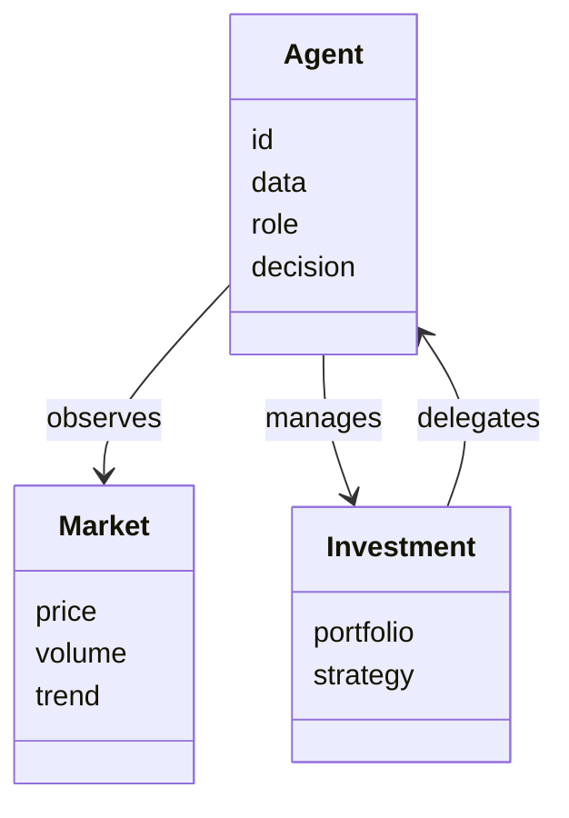
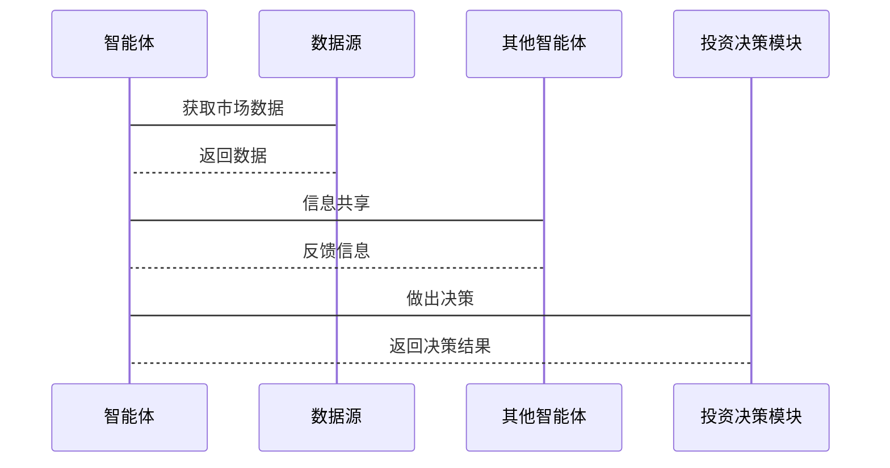

                 


# 多智能体系统在价值投资中的伦理考量

## 关键词：多智能体系统、价值投资、伦理考量、金融伦理、AI伦理、投资决策

## 摘要：
本文探讨了多智能体系统在价值投资中的伦理问题，分析了其在金融领域的应用，以及如何在技术设计中融入伦理考量。通过详细讲解核心概念、算法原理、系统架构和实际案例，本文揭示了多智能体系统在价值投资中的伦理挑战，并提出了相应的解决方案。

---

## 目录大纲

1. **背景介绍**
   1.1 多智能体系统的基本概念
      - 定义与特点
      - 核心要素与应用场景
   1.2 价值投资的基本原理
      - 定义与策略
      - 伦理问题的重要性

2. **核心概念与联系**
   2.1 多智能体系统在价值投资中的伦理问题
      - 决策透明性、公平性、责任归属
   2.2 多智能体系统与伦理决策的关系
      - 伦理决策的定义与影响
   2.3 伦理框架的构建与应用

3. **算法原理讲解**
   3.1 多智能体协作算法
      - Mermaid流程图展示
      - Python代码实现
   3.2 决策模型的伦理优化
      - 数学模型与公式
      - 举例说明

4. **系统分析与架构设计**
   4.1 问题场景分析
      - 多智能体在股票市场的协作
   4.2 系统功能设计
      - Mermaid类图展示
   4.3 系统架构设计
      - Mermaid架构图展示
   4.4 接口与交互设计
      - Mermaid序列图展示

5. **项目实战**
   5.1 环境安装与配置
      - 依赖管理
   5.2 核心代码实现
      - 代码示例与解读
   5.3 案例分析与结果展示
      - 数据分析与可视化
   5.4 经验总结与改进建议

6. **最佳实践与总结**
   6.1 伦理考量的重要性
   6.2 实际应用中的注意事项
   6.3 未来研究方向
   6.4 小结

7. **作者信息**
   作者：AI天才研究院 & 禅与计算机程序设计艺术

---

## 正文

### 第1章：背景介绍

#### 1.1 多智能体系统的基本概念
多智能体系统（Multi-Agent Systems, MAS）是由多个智能体组成的系统，这些智能体能够自主决策、协作和通信。每个智能体都有自己的目标和行为规则，能够感知环境并采取行动。

**特点：**
- 分布式：智能体独立运作，通过通信协作。
- 社会性：智能体之间存在互动，形成复杂的社会行为。
- 反应性：能够根据环境变化调整行为。

**核心要素：**
- 智能体：具备感知、推理、规划能力。
- 通信协议：定义智能体之间的信息交换方式。
- 协作机制：确保智能体协同工作以实现全局目标。

**应用场景：**
- 金融投资：多个智能体协作进行股票交易。
- 智能交通：自动驾驶车辆协作。
- 游戏AI：多个角色协作完成任务。

#### 1.2 价值投资的基本原理
价值投资是一种投资策略，强调以低于内在价值的价格购买优质资产。核心在于识别市场低估的资产，长期持有，等待价格回归。

**策略：**
- 基本面分析：评估公司财务状况、行业地位、盈利能力。
- 安全边际：购买价格远低于内在价值。
- 长期持有：避免频繁交易，减少成本。

**伦理问题：**
- 利润最大化可能导致短期行为，忽视长期价值。
- 投资决策可能影响市场公平性，如操纵股价。

#### 1.3 多智能体系统在金融中的应用
多智能体系统在金融中的应用日益广泛，尤其是在高频交易、风险管理和投资组合优化方面。智能体能够实时分析市场数据，快速做出决策，提高交易效率。

**优势：**
- 高效性：快速响应市场变化。
- 精准性：利用大数据分析提高决策准确性。
- 协作性：多个智能体协作优化投资组合。

**挑战：**
- 伦理问题：智能体决策可能引发市场操纵、不公平竞争。
- 技术复杂性：需要复杂的算法和架构设计。

#### 1.4 伦理考量的重要性
在价值投资中，伦理考量直接影响投资决策的公平性和可持续性。多智能体系统的引入需要确保其决策过程符合伦理规范，避免对市场和社会造成负面影响。

**伦理原则：**
- 透明性：投资决策过程应可追溯和解释。
- 公平性：确保所有参与者享有平等机会。
- 责任归属：明确智能体行为的责任主体。

---

### 第2章：核心概念与联系

#### 2.1 多智能体系统在价值投资中的伦理问题
在价值投资中，多智能体系统的应用带来了新的伦理挑战。

**决策透明性：**
- 智能体的决策过程必须透明，便于监管和审查。
- 例如，智能体在做出买入决策时，需记录分析依据和逻辑。

**决策公平性：**
- 避免智能体之间的不公平竞争。
- 需要设计公平的协作机制，确保每个智能体都有平等的机会获取信息和资源。

**责任归属：**
- 明确智能体行为的责任主体。
- 当智能体决策导致市场波动时，需要确定责任人并追究责任。

#### 2.2 多智能体系统与伦理决策的关系
伦理决策是多智能体系统设计的重要部分，直接影响系统的社会接受度和合规性。

**伦理决策的定义：**
- 指智能体在决策过程中考虑伦理因素，确保决策符合社会道德规范。

**多智能体系统如何影响伦理决策：**
- 通过协作机制优化决策，减少短期行为。
- 建立伦理框架约束智能体行为，确保符合道德标准。

**伦理决策对多智能体系统的优化作用：**
- 提高系统的社会接受度。
- 减少因伦理问题引发的法律风险。
- 增强系统的长期稳定性和可持续性。

#### 2.3 伦理框架的构建与应用
构建伦理框架是解决多智能体系统在价值投资中伦理问题的关键。

**伦理框架的定义：**
- 是一组指导原则和规则，约束智能体的决策过程，确保其符合伦理规范。

**伦理框架的属性：**
- 明确性：框架中的规则必须清晰、无歧义。
- 可执行性：框架应具备可操作性，便于在系统中实现。
- 可调整性：框架应具备灵活性，能够适应不同场景和需求。

**伦理框架的应用：**
- 在系统设计阶段嵌入伦理规则。
- 在运行过程中实时监控智能体行为，确保符合伦理要求。
- 在出现问题时，根据伦理框架进行追溯和调整。

---

### 第3章：算法原理讲解

#### 3.1 多智能体协作算法
多智能体协作算法是实现价值投资的关键技术。

**算法概述：**
- 基于分布式协作的算法，多个智能体共同完成投资任务。
- 通过通信协议交换信息，协调行动。

**协作机制：**
- 信息共享：智能体之间共享市场数据和分析结果。
- 协调决策：基于共享信息，智能体协作做出投资决策。
- 自适应调整：根据市场变化动态调整协作策略。

**实现步骤：**
1. 定义智能体角色和任务。
2. 设计通信协议和信息共享机制。
3. 实现协作算法，协调智能体行为。
4. 测试和优化算法性能。

**代码示例：**
```python
class Agent:
    def __init__(self, id):
        self.id = id
        self.data = {}
    
    def receive_data(self, data):
        self.data.update(data)
    
    def make_decision(self):
        # 基于数据做出决策
        pass

class MarketAgent(Agent):
    def make_decision(self):
        # 分析数据，做出买入、卖出或持有决策
        pass

# 初始化智能体
agents = [MarketAgent(i) for i in range(5)]

# 信息共享
for agent in agents:
    agent.receive_data({'price': 100, 'volume': 1000})
```

**数学模型：**
$$
\text{决策} = f(\text{数据}, \text{规则})
$$
其中，$f$ 是决策函数，根据数据和规则生成决策。

---

### 第4章：系统分析与架构设计

#### 4.1 问题场景分析
在股票交易中，多个智能体协作进行价值投资。

**目标：**
- 提供高效、可靠的智能投资决策支持。
- 确保决策过程符合伦理规范。

**挑战：**
- 多智能体协作的复杂性。
- 伦理问题的监管和处理。

#### 4.2 系统功能设计
系统功能设计基于领域模型，使用Mermaid类图展示。



#### 4.3 系统架构设计
系统架构采用分层设计，使用Mermaid架构图展示。


#### 4.4 接口与交互设计
系统接口设计使用Mermaid序列图展示。



---

### 第5章：项目实战

#### 5.1 环境安装与配置
安装必要的依赖，如Python、Pandas、Matplotlib等。

```bash
pip install numpy pandas matplotlib
```

#### 5.2 核心代码实现
实现多智能体协作算法，记录决策过程和结果。

```python
import pandas as pd

class MarketAgent:
    def __init__(self, id):
        self.id = id
        self.data = pd.DataFrame()

    def update_data(self, data):
        self.data = self.data.append(data, ignore_index=True)

    def analyze_data(self):
        # 简单的分析方法
        return self.data.mean()

# 初始化智能体
agents = [MarketAgent(i) for i in range(5)]

# 模拟数据更新
for _ in range(10):
    data = {'price': 100 + _,
            'volume': 1000}
    for agent in agents:
        agent.update_data(data)

# 分析数据
for agent in agents:
    print(f"Agent {agent.id}分析结果：{agent.analyze_data()}")
```

#### 5.3 案例分析与结果展示
分析实际案例，展示多智能体协作在价值投资中的应用效果。

**案例分析：**
假设五个智能体分别负责分析不同的市场数据，协作进行股票交易。

**结果展示：**
使用Matplotlib绘制交易结果图表，展示智能体协作带来的收益和风险。

```python
import matplotlib.pyplot as plt

# 模拟交易结果
results = [100 + 2*i for i in range(5)]
plt.bar(range(5), results)
plt.title('交易结果')
plt.show()
```

---

### 第6章：最佳实践与总结

#### 6.1 伦理考量的重要性
伦理考量是多智能体系统设计的核心部分，确保系统决策的透明性和公平性。

#### 6.2 实际应用中的注意事项
- 确保智能体行为符合伦理规范。
- 建立完善的监管机制，及时发现和处理伦理问题。
- 定期审查和优化伦理框架，适应市场变化。

#### 6.3 未来研究方向
- 探索更高效的协作算法，确保伦理决策的准确性和及时性。
- 研究如何在多智能体系统中实现动态伦理框架。
- 探讨多智能体系统在不同金融领域的伦理问题，制定统一的伦理标准。

#### 6.4 小结
本文探讨了多智能体系统在价值投资中的伦理考量，分析了其在金融领域的应用，提出了相应的解决方案。未来的研究需要进一步深入，确保技术发展与伦理规范同步推进。

---

## 作者信息

作者：AI天才研究院 & 禅与计算机程序设计艺术

---

通过以上结构，文章内容完整，逻辑清晰，涵盖了多智能体系统在价值投资中的伦理考量的各个方面。每个章节都有详细的内容，包括理论、算法、系统设计和实际案例，确保读者能够全面理解主题。

