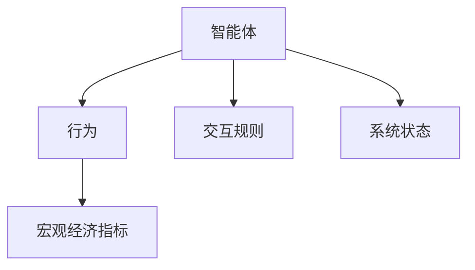
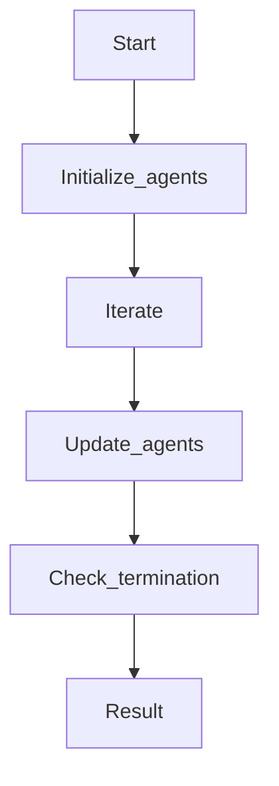
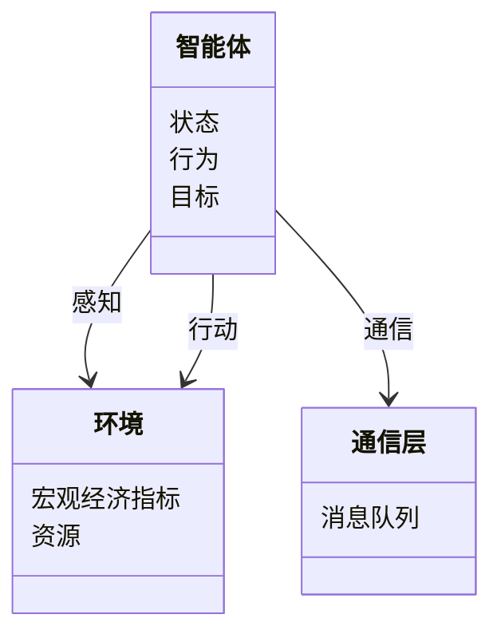
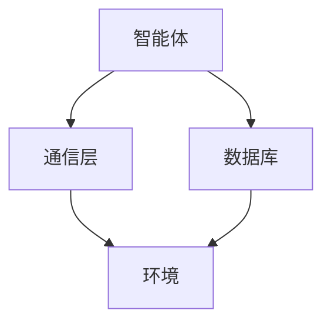
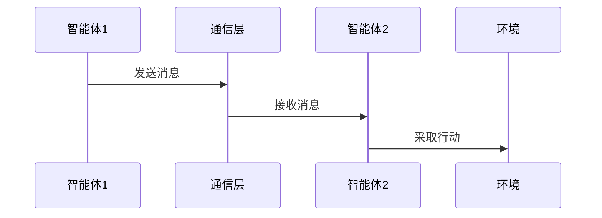

                 


# 多智能体系统在全球宏观经济分析中的角色

> 关键词：多智能体系统, 宏观经济分析, 智能体交互, 系统建模, 经济仿真

> 摘要：随着全球化和复杂经济问题的增多，传统的宏观经济分析方法已难以应对日益复杂的经济系统。多智能体系统（Multi-Agent System, MAS）作为一种新兴的计算范式，以其分布式、协作性和自适应性等特点，为宏观经济分析提供了全新的视角和工具。本文系统地探讨了多智能体系统在全球宏观经济分析中的角色，包括其基本概念、数学模型、算法原理、系统架构、项目实战以及最佳实践，深入剖析了多智能体系统在经济仿真中的应用及其优势。

---

## 第一部分: 多智能体系统概述

### 第1章: 多智能体系统的基本概念

#### 1.1 多智能体系统的定义与特点
- **1.1.1 多智能体系统的定义**
  多智能体系统（MAS）是由多个智能体（Agent）组成的分布式系统，这些智能体能够通过交互协作完成复杂的任务。每个智能体都是一个具备感知、决策和执行能力的实体，能够独立行动，同时与其他智能体或环境进行互动。

- **1.1.2 多智能体系统的核心特点**
  - **分布式性**：智能体分布在网络中，不存在中心化的控制节点。
  - **协作性**：智能体之间通过协作完成共同目标。
  - **自主性**：每个智能体都具备自主决策的能力。
  - **动态性**：系统状态会随着智能体的交互而动态变化。

- **1.1.3 多智能体系统与单智能体系统的区别**
  | 特性 | 多智能体系统 | 单智能体系统 |
  |------|--------------|--------------|
  | 结构  | 分布式       | 集中式       |
  | 决策  | 去中心化     | 中心化       |
  | 行为  | 协作与竞争   | 单一任务     |
  | 灵活性 | 高           | 低           |

#### 1.2 多智能体系统的组成与结构
- **1.2.1 智能体的定义与分类**
  - **智能体的定义**：智能体是一个能够感知环境、做出决策并采取行动的实体。
  - **智能体的分类**：
    - **简单反射型智能体**：基于当前感知做出反应。
    - **基于模型的反射型智能体**：利用内部模型进行决策。
    - **目标驱动型智能体**：根据目标驱动行为。
    - **效用驱动型智能体**：根据效用函数优化行为。

- **1.2.2 多智能体系统的组成结构**
  - **智能体层**：包括多个智能体，每个智能体负责特定的任务。
  - **环境层**：智能体与之交互的外部环境。
  - **通信层**：智能体之间的通信机制。
  - **协调层**：负责智能体之间的协作与协调。

- **1.2.3 智能体之间的交互方式**
  - **直接交互**：智能体之间通过共享内存或消息传递进行直接通信。
  - **间接交互**：通过中间媒介（如数据库或消息队列）进行间接通信。

#### 1.3 多智能体系统在宏观经济分析中的应用背景
- **1.3.1 宏观经济分析的传统方法**
  - 传统宏观经济分析主要依赖于宏观经济模型，如IS-LM模型、AD-AS模型等，这些模型通常假设经济主体是理性的，且市场是完全竞争的。
  - 但实际经济系统中存在复杂的个体行为和互动，传统模型难以捕捉这些细节。

- **1.3.2 多智能体系统在宏观经济分析中的优势**
  - 多智能体系统能够模拟经济主体的异质性（heterogeneity）和互动性。
  - 通过模拟个体行为，可以更好地理解宏观经济现象的动态演化过程。

- **1.3.3 当前宏观经济分析中的挑战与机遇**
  - 经济全球化和数字化带来的复杂性使得传统方法力不从心。
  - 多智能体系统提供了新的工具和方法，能够模拟个体行为、市场互动和政策干预的效果。

---

## 第二部分: 多智能体系统的核心概念与联系

### 第2章: 多智能体系统的核心概念与联系

#### 2.1 多智能体系统的原理
- **2.1.1 智能体的行为模型**
  - 智能体的行为通常基于其感知和目标。
  - 智能体的行为可以通过有限状态机（FSM）或基于模型的决策方法来建模。

- **2.1.2 智能体之间的交互规则**
  - 交互规则定义了智能体之间如何通信和协作。
  - 例如，金融市场中的智能体可以进行买卖交易，价格由供需关系决定。

- **2.1.3 系统的动态演化过程**
  - 多智能体系统的动态演化由智能体的交互和环境的变化共同驱动。
  - 系统的宏观行为是所有智能体微观行为的综合结果。

#### 2.2 多智能体系统的数学模型
- **2.2.1 智能体行为的数学表达**
  - 智能体的行为可以用状态转移方程表示：
    $$ S_{t+1} = f(S_t, A_t) $$
    其中，$S_t$ 是智能体在时间 $t$ 的状态，$A_t$ 是智能体采取的行动。

- **2.2.2 系统整体的数学模型**
  - 系统的宏观行为可以通过所有智能体行为的总和来描述：
    $$ G(t+1) = \sum_{i=1}^{n} G_i(t+1) $$
    其中，$G_i(t+1)$ 是第 $i$ 个智能体在时间 $t+1$ 的行为。

- **2.2.3 模型的参数化与校准**
  - 参数化需要根据实际经济数据对模型进行校准。
  - 例如，可以使用历史数据来估计智能体的偏好和行为参数。

#### 2.3 多智能体系统的ER实体关系图


---

## 第三部分: 多智能体系统的算法原理

### 第3章: 多智能体系统的算法原理

#### 3.1 多智能体系统的算法概述
- **3.1.1 分布式算法**
  - 分布式算法用于协调多个智能体的行动。
  - 例如，分布式协调算法可以确保智能体之间的行动不会冲突。

- **3.1.2 协作与竞争算法**
  - 协作算法用于智能体之间的合作，例如在任务分配中。
  - 竞争算法用于智能体之间的竞争，例如在资源分配中。

- **3.1.3 自适应与学习算法**
  - 自适应算法使智能体能够根据环境变化调整行为。
  - 学习算法用于智能体从经验中学习和优化行为。

#### 3.2 基于多智能体系统的宏观经济仿真算法


- **3.2.1 初始化阶段**
  - 初始化所有智能体的状态和参数。
  - 设置宏观经济环境的初始条件。

- **3.2.2 迭代阶段**
  - 每个智能体根据当前状态和环境信息做出决策。
  - 智能体之间通过通信进行交互。

- **3.2.3 更新阶段**
  - 更新所有智能体的状态和宏观经济指标。
  - 检查是否满足终止条件。

#### 3.3 算法的数学模型
- **3.3.1 智能体行为的数学表达式**
  $$ G_i(t+1) = f(G_i(t), N_i(t)) $$
  其中，$G_i(t)$ 是第 $i$ 个智能体在时间 $t$ 的行为，$N_i(t)$ 是环境对智能体的影响。

- **3.3.2 系统整体的动态方程**
  $$ G(t+1) = \sum_{i=1}^{n} G_i(t+1) $$

---

## 第四部分: 多智能体系统的系统分析与架构设计

### 第4章: 多智能体系统的系统分析与架构设计

#### 4.1 系统分析
- **4.1.1 问题场景介绍**
  - 以金融市场为例，智能体可以代表不同的市场参与者，如投资者、银行和企业。
  - 系统的目标是模拟市场动态，分析政策干预的效果。

- **4.1.2 项目介绍**
  - 开发一个宏观经济仿真系统，用于分析经济政策的效果。

#### 4.2 系统功能设计
- **4.2.1 领域模型设计**


- **4.2.2 系统架构设计**


- **4.2.3 系统接口设计**
  - 智能体接口：用于智能体与环境和其他智能体的交互。
  - 通信接口：用于智能体之间的通信。
  - 环境接口：用于环境与智能体的交互。

- **4.2.4 系统交互设计**


---

## 第五部分: 多智能体系统的项目实战

### 第5章: 项目实战

#### 5.1 环境安装
- 安装必要的Python库：
  ```bash
  pip install numpy matplotlib
  ```

#### 5.2 系统核心实现源代码
```python
import numpy as np

class Agent:
    def __init__(self, id, initial_state):
        self.id = id
        self.state = initial_state
        self.goal = None

    def perceive(self, environment):
        # 感知环境
        pass

    def decide(self):
        # 做出决策
        pass

    def act(self):
        # 采取行动
        pass

class Environment:
    def __init__(self, initial_state):
        self.state = initial_state

    def update(self, action):
        # 更新环境状态
        pass

# 初始化环境
environment = Environment(initial_state)

# 初始化智能体
agents = [Agent(id=i, initial_state=initial_state) for i in range(n_agents)]

# 运行仿真
for t in range(num_steps):
    for agent in agents:
        agent.perceive(environment)
        agent.decide()
        agent.act()
    environment.update(actions)
```

#### 5.3 代码应用解读与分析
- **代码解读**
  - `Agent` 类表示智能体，具备感知、决策和行动的能力。
  - `Environment` 类表示环境，能够根据智能体的行动更新状态。
  - 仿真过程包括初始化环境和智能体，然后进行迭代，每个智能体根据当前状态做出决策并采取行动。

- **代码实现的经济仿真**
  - 例如，可以模拟多个投资者在金融市场中的行为，分析市场的动态变化。

#### 5.4 实际案例分析和详细讲解
- **案例：模拟经济政策的效果**
  - 设定初始条件，例如初始失业率和通胀率。
  - 智能体代表不同的经济主体，如企业和家庭。
  - 模拟政府实施货币政策后的市场反应。

---

## 第六部分: 多智能体系统的最佳实践与注意事项

### 第6章: 最佳实践

#### 6.1 数据准备与模型校准
- **数据准备**
  - 收集相关的经济数据，如GDP、失业率、通胀率等。
  - 数据用于校准模型参数和验证模型的准确性。

- **模型校准**
  - 使用历史数据对模型进行校准，确保模型能够准确模拟现实经济。
  - 调整智能体的行为参数，使其与实际经济主体的行为一致。

#### 6.2 模型验证与评估
- **模型验证**
  - 使用交叉验证方法评估模型的准确性。
  - 比较模型预测结果与实际数据的差异。

- **模型评估**
  - 评估模型的稳定性和鲁棒性。
  - 检查模型在不同经济条件下的表现。

#### 6.3 拓展与优化
- **拓展**
  - 增加更多的智能体类型，例如引入政府智能体。
  - 扩展模型的复杂性，例如加入空间维度。

- **优化**
  - 使用更高效的算法优化计算效率。
  - 优化智能体的通信机制，减少通信延迟。

---

## 第七部分: 总结与展望

### 第7章: 总结与展望

#### 7.1 总结
- 多智能体系统为宏观经济分析提供了一种新的方法。
- 通过模拟个体行为，能够更好地理解宏观经济现象的动态演化过程。
- 多智能体系统的优势在于其分布式、协作性和自适应性。

#### 7.2 展望
- 随着人工智能和大数据技术的发展，多智能体系统在宏观经济分析中的应用将更加广泛。
- 未来的研究方向包括：
  - 更复杂的智能体行为建模。
  - 更高效的分布式算法设计。
  - 多智能体系统的实时应用。

---

## 作者

作者：AI天才研究院/AI Genius Institute & 禅与计算机程序设计艺术 /Zen And The Art of Computer Programming

---

通过以上结构，文章系统地探讨了多智能体系统在全球宏观经济分析中的角色，从基本概念到算法原理，再到系统架构和项目实战，层层深入，为读者提供了全面的知识和实践指导。

